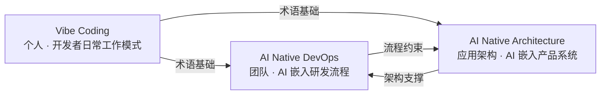

# AI Native DevOps & AI Native Architecture

本仓库从三个层次递进阐述人机协同的工程变革框架：



| 层次                       | 关注范围 | 核心命题                                                                                                          | 入口文档                                                                                                 |
| :------------------------- | :------- | :---------------------------------------------------------------------------------------------------------------- | :------------------------------------------------------------------------------------------------------- |
| **Vibe Coding**            | 个人     | 开发者如何以"意图、约束、契约"为输入，让 AI 出草稿、人工审核、门禁把关                                            | [`vibe-coding-intro-for-traditional-dev.md`](./vibe-coding-intro-for-traditional-dev.md)                 |
| **AI Native DevOps**       | 团队     | AI 如何增强软件交付全流程（需求 → 设计 → 建模 → 规范 → 实现 → 验证 → 交付 → 演进），各阶段谁来负责                | [`ai-native-devops/ai-native-devops.md`](./ai-native-devops/ai-native-devops.md)                         |
| **AI Native Architecture** | 应用架构 | AI 如何安全、可控、可度量地嵌入产品系统——不是处处用 LLM，而是该用 Tool 的地方用 Tool，该用 Agent 的地方才用 Agent | [`ai-native-architecture/ai-native-architecture.md`](./ai-native-architecture/ai-native-architecture.md) |

> 共同立场：最终决策、风险承担、上线责任与跨团队仲裁仍由明确的人工 Owner 承担。

---

## 1. Vibe Coding（个人层）

> Vibe Coding 是把 AI 作为研发**第一类协作者**的工程范式：开发者以**意图、约束、契约**为输入，AI 以**草稿、候选方案、自动验证**为输出，最终代码、测试与规范**全部经过人工审核与可验证门禁**才进入主线。

四个基石概念：

- **Agent**：自主推理与行动
- **MCP**：Agent 调用 Tool 的标准化协议
- **A2A**：Agent 间通信协议
- **Skill**：固定 SOP 编排

贯穿三层的基础判断——**成本金字塔**：

```text
Tool（最便宜） ← 确定性能力，无幻觉，低成本        → 能用 Tool 就不要用 Agent
Skill（中等）  ← 固定流程编排，少量 LLM 参与        → 流程确定就走 Skill
Agent（最贵）  ← LLM 推理循环，token 成本，有幻觉风险 → 只有"新颖决策"才用 Agent
```

Skill 的深入解读（What / When / How + Claude Code 与 QoderWork 内置 Skill 清单）见 [skill-deep-dive-for-traditional-dev.md](./skill-deep-dive-for-traditional-dev.md)。

---

## 2. AI Native DevOps（团队层）

8 阶段框架：**P1 愿景→PRD** → **P2 原型/UI** → **P3 领域建模** → **P4 OpenSpec 规范** → **P5 实现与测试** → **P6 质量验收** → **P7 部署交付** → **P8 变更演进**。

每阶段明确：AI 输入、AI 输出、建议工件、人工确认点。关键工件（PRD、领域模型、OpenSpec、部署决策）必须经过人工签字才能进入下一阶段。

核心治理机制：分级发布策略、RACI 责任矩阵（**A**=最终负责、**R**=执行、**C**=咨询、**I**=知会）、AI 贡献度指标。

| 文件                                                                                                                                 | 说明                                                    |
| :----------------------------------------------------------------------------------------------------------------------------------- | :------------------------------------------------------ |
| [`ai-native-devops/ai-native-devops.md`](./ai-native-devops/ai-native-devops.md)                                                     | 主文章：8 阶段框架、AI 参与度、治理机制、指标与实施路线 |
| [`ai-native-devops/ai-native-devops-sample-change-walkthrough.md`](./ai-native-devops/ai-native-devops-sample-change-walkthrough.md) | 演练模板："订单取消"场景的全链路 AI 辅助变更            |
| [`ai-native-devops/ai-native-devops-panorama.html`](./ai-native-devops/ai-native-devops-panorama.html)                               | 全景图（可交互 HTML）                                   |

---

## 3. AI Native Architecture（应用架构层）

核心立场：**AI-Native ≠ 处处用 LLM**。通过 Agent / Skill / Tool 三层金字塔模型，让架构决策带上成本意识。

三层定位：

| 层        | 本质                      | 何时使用                           |
| :-------- | :------------------------ | :--------------------------------- |
| **Agent** | 不确定下多步推理          | 目标明确但路径不可枚举，需经验沉淀 |
| **Skill** | 确定性流程编排            | SOP 已明确，安全压倒一切           |
| **Tool**  | 原子能力（通过 MCP 暴露） | 输入输出确定，可回测，不需要 LLM   |

三问决策启发法（每项 AI 能力接入前必问）：必须用 Agent 吗？→ 能接受不确定性吗？→ 治理平面覆盖了吗？

五个常见反模式：Agent 化一切、LLM 直接控物理设备、治理平面缺失、MCP Server 裸转发、Agent 缺终止条件。

| 文件                                                                                                                                     | 说明                                                  |
| :--------------------------------------------------------------------------------------------------------------------------------------- | :---------------------------------------------------- |
| [`ai-native-architecture/ai-native-architecture.md`](./ai-native-architecture/ai-native-architecture.md)                                 | 电网交易案例驱动，推导三层金字塔模型                  |
| [`ai-native-architecture/ai-native-architecture-diagram.html`](./ai-native-architecture/ai-native-architecture-diagram.html)             | 交互式金字塔架构图（点击卡片查看本质、KPI、安全约束） |
| [`ai-native-architecture/ai-native-architecture-diagram-article.md`](./ai-native-architecture/ai-native-architecture-diagram-article.md) | 架构图设计理念说明                                    |

---

## 4. CloudPilot 端到端案例

[](https://asciinema.org/a/Y2Ka7SqS2MO4UZ77)

CloudPilot 云管平台 MVP 是三层框架交汇的具象验证：以 Vibe Coding 为日常工作模式，走通 DevOps 前 4 阶段（从三方访谈到 OpenSpec 规范）。若推进到 P5 实现阶段，可按 Architecture 三层模型落地：报价走 Tool（确定性计算）、审批走 Skill（固定 SOP）、智能推荐走 Agent（需经验沉淀）。

全链路仅需 6 个工件层（访谈记录 → PRD → Mock UI → DDD 模型 → OpenSpec → 代码桥接），所有 Prompt 已记录，可由 `ddd-modeler` 和 `openspec-author` 两个 subagent 端到端重放。

| 文件                                                       | 说明                                                                                                     |
| :--------------------------------------------------------- | :------------------------------------------------------------------------------------------------------- |
| [`cloudpilot-case/README.md`](./cloudpilot-case/README.md) | 案例总览、工件追溯表、全部可重放 Prompt                                                                  |
| `cloudpilot-case/` 下各工件                                | `01-interview-notes.md` → `02-prd.md` → `cloudpilot-mockup.html` → `03-ddd-modeling.md` → `04-openspec/` → `05-p5-code-bridge.md` |
| [`cloudpilot-demo-nav.html`](./cloudpilot-case/cloudpilot-demo-nav.html) | Demo 导航台：交互式阶段时间线 + 人机协同流程图 + 工件预览弹窗 |

---

## 5. 阅读路径

| 角色                 | 建议入口                                                                                                                                 |
| :------------------- | :--------------------------------------------------------------------------------------------------------------------------------------- |
| **所有读者**         | [`vibe-coding-intro-for-traditional-dev.md`](./vibe-coding-intro-for-traditional-dev.md) — 先建立 Agent / MCP / A2A / Skill 统一术语基础 |
| **产品经理**         | `ai-native-devops/ai-native-devops.md` §1, §4.1, §7.6, §9.2, §10.4, §11.1 — 需求结构化与 AI 参与边界                                     |
| **架构师**           | `ai-native-devops/ai-native-devops.md` §4.3, §4.4, §7.2, §7.3, §7.8, §7.9 + `ai-native-architecture/ai-native-architecture.md` 全文      |
| **开发与 Tech Lead** | `ai-native-devops/ai-native-devops.md` §4.5, §4.6, §6.1, §7.4, §7.7, §12 + `cloudpilot-case/`                                            |
| **平台 / SRE 与 QA** | `ai-native-devops/ai-native-devops.md` §4.6, §4.7, §7.5, §7.8, §9, §11.3                                                                 |
| **想深入理解 Skill 的开发者** | [`skill-deep-dive-for-traditional-dev.md`](./skill-deep-dive-for-traditional-dev.md) — Skill 的 What / When / How + 常见内置 Skill 清单   |
| **Demo 演示者** | `.claude/skills/cloudpilot-demo/` — `/cloudpilot-demo` 一键重放 + 演示者手册（讲解要点、常见 Q&A） |

---

## 6. 参考

| 资源                                                                                         | 说明                                                                 |
| :------------------------------------------------------------------------------------------- | :------------------------------------------------------------------- |
| [domain-driven-design-skills](https://github.com/ForceInjection/domain-driven-design-skills) | DDD Skill 开源项目（战略建模 → 战术建模 → OpenSpec 桥接）            |
| [OpenSpec-practise](https://github.com/ForceInjection/OpenSpec-practise)                     | CloudPilot 的 P5-P7 补充案例：同一套 spec 结构驱动 Node.js + Python 双实现 |

---

## 7. 许可证

详见 [LICENSE](./LICENSE)。
