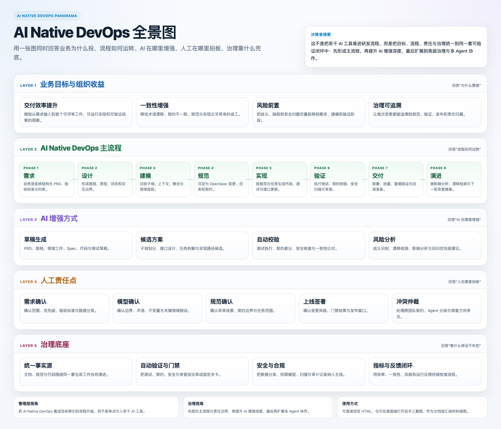
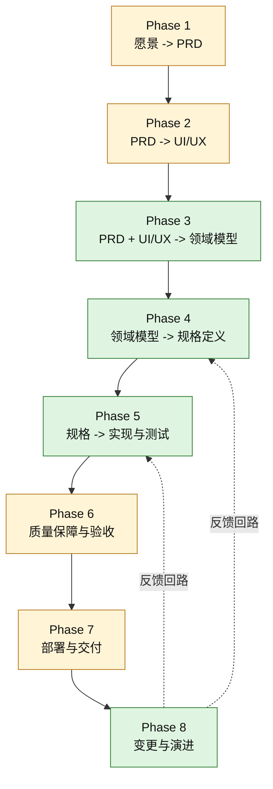
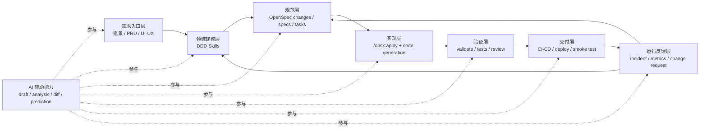

# AI Native DevOps

本文提出一套以 AI 为增强器的 DevOps 协同框架，说明 AI 在需求、设计、建模、规范、实现、验证、交付与演进各阶段如何参与、如何与人工协同，以及如何衡量价值与控制风险。文中对“当前已有能力”的判断参考 `domain-driven-design-skills` 与 `OpenSpec-practise` 两个公开项目，但不把目标状态写成既有事实 [1, 2]。

核心立场不是“让 AI 全自动替代团队”，而是“让 AI 成为需求梳理、建模分析、规范生成、代码实现、自动验证与运行治理的增强器”。最终决策、风险承担、上线责任与跨团队仲裁仍由明确的人工 Owner 承担。

以下 AI 辅助设计原则构成全文的统一判断标准。

- **增强而非替代**：AI 主要用于生成草稿、提供候选方案、执行自动分析与触发自动化验证，不直接替代关键业务与工程决策。
- **阶段化参与**：每个阶段都应标注 AI 的参与程度，例如“生成草稿”“提供候选”“自动校验”“人工审核后采纳”。
- **人工交接明确**：PRD、用户旅程、领域模型、OpenSpec、上线结论等关键资产，只有经过人工确认后才能进入下一阶段。
- **唯一事实源**：AI 与人都应围绕同一份 `docs/`、`openspec/` 与工程代码工作，避免出现对话上下文与仓库状态不一致。
- **可验证优先**：任何 AI 生成内容都应尽量转化为可验证工件，例如测试、契约、规范差分、审计记录与漂移报告。

为了帮助不同角色快速定位重点，建议按下面的阅读路径选择章节。

- **产品经理**：优先阅读 `1`、`4.1`、`7.6`、`9.2`、`10.4`、`11.1`。
- **架构师**：优先阅读 `1`、`4.3`、`4.4`、`7.2`、`7.3`、`7.8`、`7.9`。
- **开发与 Tech Lead**：优先阅读 `1`、`4.5`、`4.6`、`6.1`、`7.4`、`7.7`、`12`。
- **平台 / SRE 与 QA**：优先阅读 `1`、`4.6`、`4.7`、`7.5`、`7.8`、`9`、`11.3`。

## TOC

- [1. AI 核心应用与设计原则](#1-ai-核心应用与设计原则)
- [2. 分阶段能力分析与缺口](#2-分阶段能力分析与缺口)
- [3. 优先级与实施路线](#3-优先级与实施路线)
- [4. 目标架构与治理机制](#4-目标架构与治理机制)
- [5. AI 增值与治理指标](#5-ai-增值与治理指标)
- [6. 仓库布局与配套示例](#6-仓库布局与配套示例)
- [7. 常见问题与术语表](#7-常见问题与术语表)
- [8. 参考资料](#8-参考资料)

决策者最需要先看清三件事：这套体系服务什么目标、AI 和人工分别承担什么角色、治理底座如何保证流程不失控。



如需查看可交互版本，请访问 [AI Native DevOps 全景图](./ai-native-devops-panorama.html)。

- **管理层视角**：将 AI Native DevOps 视为目标牵引的流程升级，而非工具驱动的局部改造。
- **治理视角**：将 AI Native DevOps 视为责任清晰的治理闭环，而非边界模糊的自动化堆叠。
- **投资视角**：将 AI Native DevOps 视为分阶段演进的能力建设，而非一次性到位的平台工程。

---

## 1. AI 核心应用与设计原则

AI Native DevOps 的核心不是把单点工具堆进流水线，而是明确 AI 在每个阶段承担何种增强角色、达到何种成熟度、需要保留多强的人工作为约束。下表给出全流程高层视图，便于先建立统一心智模型，再进入细节。

| 阶段     | AI 主要作用                                | 典型输入 -> 输出                                             | 当前成熟度  | 人工参与度 |
| -------- | ------------------------------------------ | ------------------------------------------------------------ | ----------- | ---------- |
| 需求阶段 | 自然语言整理、需求澄清、验收标准补全       | 访谈纪要 -> 结构化 PRD、验收标准、非功能需求                 | 建议        | 高         |
| 设计阶段 | 用户旅程生成、页面原型草拟、组件骨架生成   | PRD -> 用户旅程、关键页面原型、组件骨架                      | 建议        | 高         |
| 建模阶段 | 事件提取、子域划分、上下文映射建议         | PRD + 流程图 -> 子域、限界上下文、聚合候选                   | 已有        | 高         |
| 规范阶段 | OpenSpec 草稿生成、任务拆解、契约补全      | 领域模型 -> `proposal.md`、`design.md`、`tasks.md`、`specs/` | 已有        | 高         |
| 实现阶段 | 基于 Spec 与测试任务生成代码与测试草稿     | Spec + `tasks.md` -> 代码、测试、OpenAPI 更新                | 部分已有    | 中         |
| 验证阶段 | 自动执行测试、契约校验、安全扫描与 AI 审查 | 代码 + 契约 -> 测试结果、差分报告、风险提示                  | 部分已有    | 中         |
| 交付阶段 | 部署脚本、环境模板、冒烟脚本生成           | 构建产物 -> 部署脚本、环境配置、冒烟测试                     | 建议        | 高         |
| 演进阶段 | 影响分析、规范漂移检测、变更提案草拟       | 运行反馈 + 变更记录 -> 漂移报告、回归优先级、变更提案        | 已有 / 建议 | 中         |

AI 的价值并不只体现在“写代码”。在需求、设计、建模、规范、验证与演进阶段，AI 都可以承担结构化整理、方案生成、差异发现与自动校验，但每一阶段都保留明确的人机交接点。

注：“部分已有”指当前参考项目已经提供规范驱动实现的样例与测试框架，但接口契约标准化与 TDD 强制闭环仍需要补齐。

---

### 1.1 基线能力与判断原则

事实基线决定了文档的可信边界：哪些能力已经被参考项目验证，哪些只是可扩展方向，哪些仅是外部工具候选。只有先讲清判断口径，后续的缺口分析、优先级排序和治理建议才不会混淆“现状”与“目标”。

- **DDD 基线**：`domain-driven-design-skills` 当前主干包含 `ddd-scope`、`ddd-discover`、`ddd-subdomains`、`ddd-contexts`、`ddd-context-map`、`ddd-aggregates`、`ddd-domain-interactions`、`ddd-model-review` 与 `ddd-openspec-bridge` 共 9 个 Skill，覆盖范围收敛、战略建模、战术建模、模型验证与 OpenSpec 规范衔接 [1]。
- **OpenSpec 基线**：`OpenSpec-practise` 当前已给出 `config.yaml`、`proposal.md`、`design.md`、`tasks.md`、`specs/`、`changes/`、`/opsx:propose`、`/opsx:apply`、`/opsx:archive`、`openspec validate` 等工作流与示例工程，可支撑规范驱动开发、变更管理、多语言样例实现与测试演示 [2]。
- **事实边界**：`/opsx:apply` 在 OpenSpec 用户手册中的原始定义是“按照 `tasks.md` 实现任务”，因此本文只将其表述为“规范驱动的实现入口”，不直接扩大为“平台原生保证生成完整分层代码” [2]。
- **推荐边界**：需求入口、UI/UX、部署交付与部分 AI 治理机制属于补全建议；文中提到的外部工具只作为候选能力入口，不等同于当前方案默认集成 [3-6]。

---

### 1.2 端到端流程总览

从业务意图到变更归档，完整链路可拆为 8 个阶段。AI 贯穿全流程承担结构化、生成、分析和校验工作，但责任闭环始终由人工 Owner 维持。绿色阶段表示参考项目已有较强基础，黄色阶段表示仍需补齐或整合的能力 [1, 2]。



从参考项目现状看，当前方案最强的部分是“领域模型到工程规范”的中段链路，以及“变更提案到归档”的闭环链路 [1, 2]。对 AI Native DevOps 而言，真正要补齐的是建模前的需求与设计输入、建模后的交付与运行治理，以及贯穿全链路的人机协同、自动验证与漂移检测机制。

---

## 2. 分阶段能力分析与缺口

8 个阶段的差异不在于“是否使用 AI”，而在于 AI 参与深度、产物形态、验证方式与人工确认点。逐段拆开后，更容易判断哪些能力已经可用、哪些值得优先补齐。

### 2.1 愿景到 PRD

模糊业务意图如果不能尽早结构化，后续建模、规范和实现都会持续放大歧义。AI 最适合承担整理、补全和歧义提示，而不是替代产品判断。

- **AI 参与方式**：整理访谈纪要、生成 PRD 草稿、补全验收标准、识别非功能性需求与待确认问题。
- **建议产物**：问题陈述、目标与非目标、用户故事、验收标准、非功能性需求、安全基线清单、数据分类标签。
- **人工确认点**：PRD 范围、验收标准、敏感数据分类与优先级必须由 Product 主导确认。
- **候选工具**：ChatPRD 一类工具可用于生成 PRD 草稿，但基于公开文档形态，更适合按“有限生产试点”对待，而不是作为主流程关键依赖 [3]。
- **落地建议**：优先采用内部 Prompt、知识库与本地化 LLM 形成自有 PRD Agent，把外部 SaaS 定位为辅助加速器。

> [!NOTE]
> **典型 AI 输入输出结构示例**：
> 输入可以是会议纪要、用户访谈与业务约束；输出建议固定为 `问题陈述`、`用户故事`、`Given-When-Then 验收标准`、`非功能性需求`、`安全 / 合规约束`、`待确认歧义点` 六段结构。示例 Prompt：`以下为会议纪要，请提取用户故事、验收标准（Given-When-Then）、非功能性需求（性能 / 安全 / 合规）和待确认歧义点，输出为 Markdown 表格。`

### 2.2 PRD 到 UI/UX 设计

需求只有转成可观察的旅程、状态和交互约束，后续领域建模与实现才有稳定输入。AI 的价值主要体现在压缩原型草拟和设计语义整理时间。

- **AI 参与方式**：生成用户旅程草稿、低保真原型、页面状态说明、组件代码骨架。
- **建议产物**：用户旅程、关键页面原型、组件清单、状态转换说明、交互约束。
- **人工确认点**：关键用户旅程、异常流程与核心页面原型必须经过 Product 与 Design 联合评审。
- **候选工具**：Figma MCP Server 更适合作为设计上下文接入层，Anima 更适合作为原型代码生成层；两者都不应视为无需审查即可直接产出生产代码的成熟流水线 [4, 5]。
- **风险提示**：设计系统不成熟、设计 token 未统一或组件库缺少约束时，生成代码的可用性和可维护性会明显下降。

### 2.3 需求上下文到领域模型

领域建模是参考体系最成熟的能力段之一。AI 的作用不是发明领域知识，而是提升事件提取、边界拆分、术语收敛和模型候选生成效率 [1]。

- **AI 参与方式**：从结构化需求中提取事件、候选子域、限界上下文与术语表。
- **当前已有能力**：`ddd-scope`、`ddd-discover`、`ddd-subdomains`、`ddd-contexts` 与 `ddd-context-map` 可覆盖战略建模主线 [1]。
- **人工确认点**：核心域判断、上下文边界、上下文关系与关键术语必须由架构师和业务专家复核。
- **增值重点**：减少遗漏场景、缩短建模准备时间、降低术语漂移概率。

### 2.4 领域模型到规格定义

业务语义只有沉淀为可实施、可验证、可归档的规范，才可能稳定驱动实现与验收。这里是 AI 进入工程闭环的关键桥接点之一。

- **AI 参与方式**：根据 DDD 工件生成 `proposal.md`、`design.md`、`tasks.md` 与 `specs/` 草稿，补全场景与任务拆解。
- **当前已有能力**：`ddd-aggregates`、`ddd-domain-interactions`、`ddd-model-review` 与 `ddd-openspec-bridge` 可完成战术建模、模型复核与 OpenSpec 桥接 [1]。
- **人工确认点**：关键契约、异常场景、任务边界与实现范围必须经 Architect 与 Tech Lead 共同确认。
- **落地建议**：AI 生成规范时应优先输出可审查结构，而不是大段自由文本；关键业务约束必须进入规范文件，而不能只存在对话上下文。

### 2.5 规格到实现与测试

实现阶段已经具备基础能力，但 AI 的合理定位仍然是“基于规范和测试任务生成实现候选”，而不是替代开发过程的黑盒编码器。

- **AI 参与方式**：根据 `tasks.md`、测试任务与 OpenAPI 契约生成代码、测试草稿与实现建议。
- **当前已有能力**：通过 `/opsx:apply` 按照 `tasks.md` 实现任务；示例工程展示了 Node.js 与 Python 的样例实现与测试 [2]。
- **建议补强**：先确定最小必需契约，再把任务拆分为“先测试、后实现、再重构”的步骤，并把验证命令写入 `tasks.md` [6]。
- **人工确认点**：关键实现策略、公共接口、性能敏感路径与代码合入结论必须经过开发者与 Tech Lead 审核。
- **边界说明**：AI 生成的代码只有在通过测试、契约校验与人工评审后，才应进入主线分支。
- **共存模式**：AI 生成的代码宜放在明确标记的目录，或带有 `@generated` 注释的区域；后续手工修改时，应同步更新对应 Spec 或任务说明，避免实现与规范再次分叉。

### 2.6 质量保障与验收

验证阶段最容易量化 AI 的工程价值，因为测试执行、契约比对、安全审查和结果聚合都天然适合自动化。

- **AI 参与方式**：聚合测试结果、做契约差分分析、执行安全审查规则、生成代码审查摘要与风险提示。
- **当前已有能力**：`openspec validate`、变更目录管理、示例级测试覆盖与归档命令 [2]。
- **建议新增能力**：静态检查、依赖与漏洞扫描、架构一致性审查、性能基准比对、测试覆盖率门禁与 AI 审查摘要。
- **人工确认点**：最终上线门禁建议由 `Tech Lead + QA Lead` 双签确认，Platform / SRE 提供流水线事实与发布条件校验。
- **关键价值**：把“Spec 合法”“契约一致”“代码可运行”“安全可解释”“风险已审阅”拆成独立关卡，提高问题定位效率。

### 2.7 部署与交付

部署与交付仍是当前链路最明显的空白区，因为参考项目尚未覆盖部署编排、环境配置、制品封装、发布回滚与运行态验证 [1, 2]。

- **AI 参与方式**：生成部署脚本、环境变量模板、冒烟测试脚本与回滚手册草稿。
- **建议产物**：`Dockerfile`、CI/CD 流水线定义、环境变量模板、部署手册、回滚手册、冒烟测试脚本。
- **人工确认点**：生产发布窗口、环境变更、放量策略与事故处置规则必须由 Platform / SRE 审核。
- **边界说明**：AI 可提升脚本编写速度，但生产可用性仍需演练验证，而不是依赖一次生成结果。

### 2.8 变更与演进

变更与演进既有较完整的参考依据，也是 AI 在长期治理中最值得投入的方向。除了生成变更提案，AI 还可以承担漂移检测、影响分析与风险预测 [1, 2]。

- **AI 参与方式**：生成变更提案草稿、比较规范与代码差异、分析受影响模块、排序回归测试优先级。
- **当前已有能力**：增量变更建模、规范验证、变更归档与 DDD 回溯触发 [1, 2]。
- **AI 辅助漂移检测**：可用 LLM 比较 Spec 描述与代码实现，例如对比 OpenAPI 与 handler 代码语义、识别未声明的领域事件、建议补全缺失字段。
- **AI 风险预测**：可结合历史变更与故障数据，利用规则模型或 LLM 推理预测当前变更可能影响的模块、错误类型与测试重点。
- **人工确认点**：是否更新 Spec、是否修改实现、是否接受高风险变更，必须由明确的 Owner 决策并记录在变更工件中。

> [!NOTE]
> **典型 AI 输入输出结构示例**：
> 漂移检测可采用“两段式”流程：先用 `openapi-diff` 等工具检测契约变化，再将差分结果、相关 handler 代码片段和 Spec 文本交给 LLM 解释业务影响；领域事件漂移则可先通过静态分析扫描事件发布语句，再与 `specs/` 中声明的事件列表做集合比对。输出建议固定为 `漂移类型`、`受影响模块`、`建议动作（更新 Spec / 修改代码）`、`回归测试建议` 四部分。

---

### 2.9 缺口与插接方案总览

8 个阶段放在同一张表中，更容易看清成熟度分布、AI 主攻点以及补强顺序。这样做不是罗列能力清单，而是为后续实施拆分提供依据。

| 阶段                   | 当前状态    | AI 辅助重点                        | 主要缺口                         | 建议补强方向                           | 来源         |
| ---------------------- | ----------- | ---------------------------------- | -------------------------------- | -------------------------------------- | ------------ |
| Phase 1 愿景 -> PRD    | 缺失        | 需求结构化、验收标准补全、歧义检测 | 需求模板、安全需求识别、人工门禁 | 内部 PRD Agent、本地化 LLM、人工审批流 | [1, 2, 3]    |
| Phase 2 PRD -> UI/UX   | 缺失        | 旅程草拟、原型草稿、组件骨架       | 设计上下文沉淀、设计系统基线     | 设计上下文接入与原型生成工具           | [1, 2, 4, 5] |
| Phase 3 领域模型       | 已有        | 事件提取、边界拆分、模型候选       | 依赖前置输入质量                 | 复用现有 DDD 主线并强化人工复核        | [1]          |
| Phase 4 规格定义       | 已有        | Spec 草稿、任务拆解、场景补全      | 契约统一、关键边界显式化         | 强化 DDD 到 OpenSpec 的桥接规范        | [1, 2]       |
| Phase 5 实现与测试     | 部分已有    | 代码与测试草稿、契约更新建议       | OpenAPI 基线、测试先行约束       | 最小必需契约 + 测试先行任务模板        | [2, 6]       |
| Phase 6 质量保障与验收 | 部分已有    | 自动验证、AI 审查、风险聚合        | 安全、性能、架构门禁未整合       | 分层门禁与双签上线机制                 | [2]          |
| Phase 7 部署与交付     | 缺失        | 脚本生成、部署模板、冒烟脚本       | 可重复部署、回滚、运行验证       | 补齐交付模板与发布规则                 | [1, 2]       |
| Phase 8 变更与演进     | 已有 / 建议 | 漂移检测、影响分析、风险预测       | 标准化回归优先级与多团队通知     | 高级治理与 AI 风险预测                 | [1, 2]       |

---

## 3. 优先级与实施路线

优先级决定先解决哪类断点，实施路线决定这些能力按什么节奏落地。两者合并讨论后，团队更容易把资源投入与治理目标对应起来。排序原则始终是先打通“规范到实现到验收”的可验证闭环，再补齐输入面和交付面，最后引入复杂治理与多 Agent 编排。

### 3.1 优先级与落地路径

优先级排序的目标不是追求功能完整，而是优先消除最影响闭环稳定性的断点。投入顺序一旦颠倒，团队很容易在入口或炫技能力上投入过多，却迟迟无法形成可验证的交付主线。

#### 3.1.1 P0：优先补强实现与验收

这一优先级最高，因为它直接决定 Spec 能否持续转化为稳定实现，并在进入交付前完成可重复验证 [2, 6]。

- **先确定最小必需契约**：优先把核心 API 收敛到 OpenAPI 文档，避免需求、实现与测试各写一套描述。
- **再强化任务模板**：在 `tasks.md` 中显式写出测试、实现、重构与验证命令，降低 AI 漏测风险。
- **最后建立验收门禁**：把 `openspec validate`、自动化测试、安全检查、AI 审查与人工双签串成固定流水线。

#### 3.1.2 P1：补齐需求与设计入口

这一优先级次高，因为当前方案在进入 DDD 之前仍缺少稳定输入面。愿景和设计语义如果长期停留在自然语言层，后续建模质量会持续波动 [1-5]。

- **先补 PRD 模板**：统一问题陈述、目标、范围、验收标准与非功能需求字段。
- **再补设计上下文**：把用户旅程、界面状态与交互边界纳入领域建模输入。
- **控制自动化预期**：设计到代码工具更适合作为语义桥接层，不应直接替代工程代码审查。

#### 3.1.3 P2：建设交付能力并增强演进治理

部署与交付是当前链路最明显的末端缺口，而变更演进则是长期治理能力。二者适合在前两级稳定后同步推进 [1, 2]。

- **Phase 7**：先做最小可行部署链路，包括制品封装、环境模板、回滚脚本与冒烟测试。
- **Phase 8**：增加 AI 辅助漂移检测、影响分析、风险预测与跨上下文通知，减少变更扩散失控。
- **组织建议**：将“需求工程、领域建模、规范管理、实现验证、部署交付”分别沉淀为独立职责域。

### 3.2 实施路线图

增量路线图强调“先形成最小可用能力，再逐步叠加治理深度”，避免一开始就把平台、流程和 Agent 体系同时铺开。每个阶段都应交付模板、门禁和可复用动作，而不是只交付概念。

#### 3.2.1 第一阶段：建立最小闭环

第一阶段优先打通规范到实现的闭环，因为这部分对当前参考体系复用度最高，投入产出比也最清晰 [1, 2]。

- **范围**：优先建设 Phase 4、Phase 5、Phase 6 的最小可用链路。
- **交付物**：统一的 OpenSpec 项目模板、`tasks.md` 任务模板、基础测试模板、`openspec validate` 门禁脚本。
- **验收标准**：新需求可以在不脱离规范主线的前提下完成一次变更、实现、验证与归档。
- **组织动作**：指定规范 Owner，建立最小人工审批流。

#### 3.2.2 第二阶段：补齐需求与设计入口

第二阶段把需求工程与设计上下文纳入统一入口，降低前置输入质量波动对 DDD 建模的影响。

- **范围**：建设 Phase 1 与 Phase 2 的输入模板和协作机制。
- **交付物**：PRD 模板、验收标准模板、用户旅程模板、界面状态说明模板。
- **验收标准**：新需求进入建模阶段前，能够提供结构化 PRD 与最小设计上下文。
- **组织动作**：让 Product、Design、Architect 三方共同定义“进入 DDD 前的最小输入集”。

#### 3.2.3 第三阶段：标准化交付与运行反馈

第三阶段补齐部署、回滚、运行监控与问题回写，使整条链路不再停留在“生成代码”，而具备真实交付能力。

- **范围**：建设 Phase 7，并把 Phase 8 的反馈信号制度化。
- **交付物**：部署模板、环境变量规范、冒烟测试脚本、回滚脚本、问题回写模板、基础漂移检测脚本。
- **验收标准**：每次变更上线后都能关联到规范、代码、测试与部署记录。
- **组织动作**：引入 Platform / SRE 参与设计评审与发布审批。

#### 3.2.4 第四阶段：沉淀多 Agent 协作与 AI 治理指标

第四阶段才适合考虑拆分为多个 Agent 协同系统，前提是规范基线稳定、人工流程清晰、验证环路可复用。

- **范围**：在模板、门禁和职责分工稳定后，再拆分需求 Agent、DDD Agent、Spec Agent、实现 Agent、测试 Agent 与审查 Agent。
- **交付物**：统一消息协议、上下文传递规则、失败回退策略、质量指标仪表板。
- **验收标准**：不同 Agent 之间的上下文切换不会导致规范漂移、术语漂移、契约歧义或责任不清。
- **组织动作**：将 AI 贡献度指标纳入治理体系，而不是只统计 Agent 数量。

#### 3.2.5 建议里程碑

4 个里程碑把抽象目标转换为更易执行的工程节奏，适合用于试点计划、阶段复盘和资源协调。

| 里程碑 | 目标           | 关键产物                                | 成功判据                                     |
| ------ | -------------- | --------------------------------------- | -------------------------------------------- |
| M1     | 打通规范主链路 | OpenSpec 模板、任务模板、验证脚本       | 单个变更可完成“规范 -> 实现 -> 验证 -> 归档” |
| M2     | 稳定需求输入   | PRD 模板、验收模板、设计输入模板        | 新需求进入建模前不再缺少最小输入集           |
| M3     | 建立交付能力   | 部署模板、冒烟测试、回滚脚本            | 变更可重复部署并具备回滚路径                 |
| M4     | 强化治理闭环   | AI 贡献度指标、漂移检测、Agent 协作规则 | 规范返工率和变更遗漏率可度量、可下降         |

---

## 4. 目标架构与治理机制

目标架构需要同时回答三件事：能力如何串联、治理如何约束、责任如何留痕。目标不是构造“全自动 AI 工厂”，而是建立以规范为中心、以自动验证为约束、以人工决策为兜底的人机协同 DevOps 系统。



从工程治理角度看，这个目标架构更适合收束为 5 个治理模块：核心能力链路、人机协同与发布治理、AI 输出质量与运行控制、高级治理扩展、角色与责任治理。这样既保留执行细节，也更符合高层设计文档的阅读习惯。

### 4.1 核心能力链路

核心能力链路定义端到端流程的基本承载面，回答“业务意图如何被转成规范、实现、验证、交付与反馈”。没有这条主链，后续治理规则就只能停留在原则层。

#### 4.1.1 需求入口层

需求入口层决定后续建模和规范是否拥有稳定输入，其职责是把业务意图收敛为可评审、可追踪、可交接的结构化需求。

- **输入**：业务愿景、访谈纪要、市场反馈、历史需求、运行反馈。
- **输出**：PRD、用户故事、验收标准、非功能性需求、安全基线清单、数据分类标签。
- **AI 作用**：萃取结构、补全缺失字段、发现歧义与风险提示。
- **人工职责**：确认业务范围、优先级、验收标准与数据分类结论。

#### 4.1.2 领域建模层

领域建模层负责收敛业务边界、统一术语和识别核心约束，是全文最接近参考项目现有优势的部分 [1]。

- **输入**：PRD、流程图、术语表、关键业务场景。
- **输出**：子域划分、限界上下文、上下文映射、聚合设计、领域交互定义。
- **AI 作用**：生成候选模型、比对术语、辅助识别遗漏事件。
- **人工职责**：确认核心域、上下文边界、聚合约束与术语定义。

#### 4.1.3 规范层

规范层把领域模型映射为可验证、可实现、可归档的工程规范，也是团队与 AI 协同的单一事实来源。

- **输入**：领域模型工件、架构约束、技术栈规则。
- **输出**：`proposal.md`、`design.md`、`tasks.md`、`specs/`、`config.yaml` [2]。
- **AI 作用**：生成规范草稿、补全场景、生成任务拆解与契约建议。
- **人工职责**：确认关键边界、异常场景、任务范围与变更责任。

#### 4.1.4 实现与验证层

实现与验证层把规范转成代码和可重复验证结果，适合作为联合治理单元管理，而不是分散到多个孤立脚本中。

- **输入**：任务清单、接口契约、测试策略、代码规范。
- **输出**：应用代码、测试结果、评审结论、问题回写记录、安全测试结果、契约校验结果。
- **AI 作用**：生成实现候选、聚合测试结果、做代码审查摘要与风险提示。
- **人工职责**：审核关键实现、批准合入、签署上线结论。

#### 4.1.5 交付与运行反馈层

交付与运行反馈层负责把通过验证的变更送入运行环境，再把生产事实回写到需求与规范层，形成持续演进闭环。

- **输入**：构建产物、环境配置、发布策略、运行指标。
- **输出**：部署结果、冒烟测试报告、告警事件、性能回归信号、下一轮变更输入。
- **AI 作用**：生成脚本草稿、归纳告警模式、辅助形成变更提案。
- **人工职责**：审批发布窗口、执行事故处置、判定是否接受运行风险。

### 4.2 人机协同与发布治理

人机协同与发布治理定义 AI 的授权边界、人工接管点以及发布时的风险分级方式。把协作边界和门禁放在同一模块中，更容易控制自动化失控风险。

#### 4.2.1 人机协同视图

AI Native DevOps 的关键不是让 AI 覆盖所有步骤，而是让 AI 与人类在明确的责任边界上协作。下表给出各阶段的人机分工与异常处理方式。

| 阶段 | AI 负责什么                            | 人负责什么                       | 异常时如何处理                                |
| ---- | -------------------------------------- | -------------------------------- | --------------------------------------------- |
| 需求 | 生成 PRD 草稿、补全验收标准、标记歧义  | 确认范围、优先级、验收标准       | 回到需求澄清，修订 PRD                        |
| 设计 | 生成旅程草稿、原型草稿、组件骨架       | 确认关键旅程、交互与设计约束     | 回退到 Product / Design 联合修订              |
| 建模 | 提供子域、上下文与聚合候选             | 确认边界、不变量与术语           | 回退到建模评审，重做边界划分                  |
| 规范 | 生成 OpenSpec 草稿与任务拆解           | 确认能力范围、异常场景与任务边界 | 修订 `proposal.md`、`design.md` 或 `tasks.md` |
| 实现 | 生成代码与测试候选                     | 审核关键实现与合并结论           | 测试失败或设计偏离时回退到任务或规范          |
| 验证 | 运行测试、契约校验、安全检查与 AI 审查 | 确认是否满足上线门禁             | 不通过则阻断上线并回写问题                    |
| 交付 | 生成脚本、冒烟步骤与回滚草稿           | 批准发布与执行事故处理           | 回滚或暂停放量，并更新规范                    |
| 演进 | 检测漂移、分析影响、生成提案草稿       | 决定修规范还是修实现             | 形成新变更提案并进入下一轮闭环                |

为了避免所有变更都进入同样的双签流程，建议将人工签署与自动化门禁结合为分级发布策略，由自动化先过滤低风险变更，再把人工精力集中到真正需要判断的事项上。

- **低风险变更**：如文档、注释、非行为性测试完善。自动化门禁通过后，可由 `Tech Lead` 或 `QA Lead` 单签放行。
- **中风险变更**：如新增非核心 API、内部重构、一般配置变更。要求双签，并通过标准自动回归。
- **高风险变更**：如核心领域逻辑、数据库 schema 变更、安全相关逻辑。要求双签、架构师评审与预发布验证。
- **执行原则**：自动化门禁负责过滤可机械判定的风险，人工签署负责判断业务合理性、跨域影响与非功能性权衡。

### 4.3 AI 输出质量与运行控制

AI 输出质量与运行控制聚焦“AI 出错时如何被及时发现、阻断与回退”。把置信度、验证环路和人工兜底规则收束到同一治理面后，团队更容易统一执行。

#### 4.3.1 AI 输出质量保障与失败处理

AI 参与越深，质量保障与失败回退就越不能依赖临场判断，否则自动化只会更快放大错误。

- **置信度标记**：要求 AI 输出附带高 / 中 / 低置信度标记，并给出简短依据；低置信度输出必须强制人工复核。实现方式可采用模型自评结合 `Self-Consistency` 多次采样校准，例如输出“低置信度，依据：会议纪要中关于实时性的描述相互矛盾”。
- **轻量替代方案**：对于多数团队的起步阶段，也可以先要求 AI 输出“信心声明”，例如“我有 80% 把握，原因是需求边界基本清晰但异常流程描述不足”，再由人工逐步校准阈值和判断标准。
- **多候选对比**：对 PRD 结构、子域划分、关键接口设计等决策，建议 AI 提供 2 到 3 个候选方案及优劣说明，由人工选择。
- **自动验证环路**：代码生成后立即执行测试、契约校验、安全检查；若失败，则回退到修改 `tasks.md`、修订 Spec 或人工重写实现。
- **Owner 兜底规则**：任何 AI 生成资产都必须有对应 Owner 签名后，才能进入下一阶段。
- **最小人工审核要求**：PRD 由 Product 审核，设计资产由 Product + Design 审核，领域模型由 Architect 审核，规范由 Architect + Tech Lead 审核，上线结论由 `Tech Lead + QA Lead` 双签。

### 4.4 高级治理扩展

高级治理扩展面向规模化场景，回答“团队变多、系统变复杂后，如何在不丢失一致性的前提下继续扩展治理能力”，覆盖复杂组织、多 Agent 协作以及安全与合规等长期能力。

#### 4.4.1 高级治理能力

复杂组织场景、规范漂移检测与影响分析决定这套体系能否在长期演进中保持有效，也是 AI 在 DevOps 治理中最具战略价值的投入方向。

- **多团队与多仓库治理**：可将 `openspec/` 独立为共享规范仓库，或在多仓库间通过自动同步脚本、子模块或制品发布方式分发规范基线；关键是确保规范版本与代码版本可追溯绑定。
- **遗留系统引入**：不建议要求全量系统先补齐 DDD 与 OpenSpec；更可行的做法是从变更频繁、事故高发或跨团队依赖最重的区域开始做规范反写。
- **AI 辅助漂移检测**：使用 LLM 比较 Spec 描述与代码实现，例如对比 OpenAPI 与 handler 语义、识别未声明的领域事件，并自动生成漂移报告草稿。
- **AI 风险预测**：结合历史变更和故障数据，利用规则模型或 LLM 推理预测当前变更的影响范围、缺陷类型与回归重点。
- **回归优先级算法**：可按“影响范围分数 × 历史缺陷率 × 业务关键度”排序，并由人工校准最终回归范围。
- **跨团队仲裁**：对契约冲突、责任归属与修复方向争议，建议由 Platform / SRE 或集成负责人担任最终仲裁者。

#### 4.4.2 多 Agent 协作模式

多 Agent 协作不是起点，而是治理能力成熟后的放大器。缺少稳定规范基线和人工流程时，过早拆分 Agent 只会放大上下文漂移和责任冲突。

- **唯一事实源**：所有 Agent 都读写同一份 `openspec/`、`docs/` 与代码仓库，不自行维护私有状态。
- **顺序编排**：需求 Agent -> DDD Agent -> Spec Agent -> 实现 Agent -> 测试 Agent -> 审查 Agent；后置 Agent 可读取前置输出，但不修改已归档资产。
- **通信约束**：Agent 之间传递的不是自由文本，而应尽量传递结构化工件、文件路径、差分结果与验证结论。
- **冲突仲裁**：当两个 Agent 对同一资产提出不同修改时，由人工决策并记录到 `adr/` 或 `proposal.md` 中。
- **启用前提**：只有在规范模板稳定、人工流程清晰、验证环路可复用之后，才建议进入多 Agent 协作阶段。

#### 4.4.3 安全与合规治理视图

安全与合规不能作为零散附加项处理，而需要作为独立治理视图贯穿需求、设计、实现、验证与交付全过程。

- **需求阶段**：强制识别数据分类，例如 `PII`、`PCI`、`PHI`，并声明安全目标与适用法规清单。
- **设计阶段**：补充威胁建模输出，例如 `STRIDE` 分析结果，以及权限模型设计，例如 `RBAC` 或 `ABAC`。
- **实现阶段**：必须包含安全测试用例，例如 `OWASP Top 10` 映射场景；代码生成时禁止硬编码密钥，并要求日志脱敏策略进入实现说明。
- **验证阶段**：`SAST`、`DAST`、依赖漏洞检查与容器镜像扫描应作为标准门禁项，而不是可选检查。
- **交付阶段**：要求保留合规检查记录、审批留痕与可追溯发布证据，满足审计与事后回溯需要。
- **检查清单建议**：至少维护 `数据分类标签`、`敏感字段脱敏清单`、`权限模型审查记录`、`安全测试用例模板` 与 `法规义务矩阵` 五类资产。

---

### 4.5 角色与责任治理

角色与责任治理负责把能力链路和治理规则映射到具体岗位，回答“谁负责、谁拍板、谁协调、谁留痕”，避免治理设计完整但责任悬空。

#### 4.5.1 角色分工矩阵

责任矩阵把前文的能力链路映射到团队角色，避免出现“人人参与，但无人负责”的治理真空。这里采用简化的 `RACI` 视角，其中 `R` 表示直接负责执行，`A` 表示最终负责结果，`C` 表示需要协作咨询，`I` 表示需要知会。

##### 4.5.1.1 角色定义

角色边界如果定义不清，同一岗位在不同项目中的职责就会持续漂移，矩阵本身也会失去约束力。

- **Product**：负责需求目标、范围与业务优先级。
- **Architect**：负责领域边界、规范结构与技术约束。
- **Design**：负责 UI/UX、交互约束与设计资产。
- **Tech Lead**：负责实现拆解、工程可行性与上线技术结论。
- **Dev**：负责实现、测试补全与缺陷修复。
- **QA**：负责验收标准、测试策略与质量门禁。
- **Platform / SRE**：负责流水线、部署、运行观测与回滚能力。
- **Integration Owner / API 治理组**：若组织已设立该角色，可负责跨团队契约的最终语义仲裁；若未设立，则由 `Architect` 承担相应责任。

##### 4.5.1.2 RACI 矩阵

下表给出推荐的默认职责划分。AI 可以辅助多个环节，但不会承担 `A` 对应的责任归属。

| 活动                  | Product | Architect | Design | Tech Lead | Dev | QA  | Platform / SRE |
| --------------------- | ------- | --------- | ------ | --------- | --- | --- | -------------- |
| 愿景澄清与 PRD 结构化 | A       | C         | I      | I         | I   | C   | I              |
| 用户旅程与 UI/UX 设计 | C       | I         | A      | I         | I   | C   | I              |
| DDD 战略建模          | C       | A         | I      | C         | I   | I   | I              |
| DDD 战术建模          | I       | A         | I      | C         | C   | C   | I              |
| OpenSpec 规范编写     | C       | A         | I      | R         | C   | C   | I              |
| 任务拆解与实现        | I       | C         | I      | A         | R   | C   | I              |
| 测试设计与验收门禁    | I       | C         | I      | C         | R   | A   | C              |
| 跨团队契约验证        | I       | A         | I      | C         | R   | C   | C              |
| CI/CD 与部署编排      | I       | C         | I      | C         | C   | C   | A              |
| 运行反馈回写          | C       | C         | I      | C         | I   | C   | A              |
| 变更归档与知识沉淀    | I       | A         | I      | C         | R   | C   | I              |

##### 4.5.1.3 组织建议

责任矩阵只有进入日常协作，才会从文档变成治理机制，因此还需要一组轻量规则配套落地。

- **规则 1**：每个变更必须同时有规范 Owner 和实现 Owner。
- **规则 2**：任何上线变更都必须能够追溯到一个明确的 `proposal.md` 或等价需求来源。
- **规则 3**：任何 AI 生成资产进入下一阶段前，都必须由对应人工 Owner 审核并留痕。
- **规则 4**：跨团队契约冲突必须有明确仲裁人，默认由 Platform / SRE 或集成负责人承担最终协调责任。

---

## 5. AI 增值与治理指标

价值与指标需要放在一起讨论：前者回答“为什么值得做”，后者回答“做完以后如何证明有效”。没有清晰的度量框架，流程改造就难以评估 ROI，也难以判断哪些投入真正有效。

### 5.1 价值度量

价值度量聚焦 AI 是否真正创造了可感知的业务与工程收益，衡量重点包括效率提升、一致性改善、风险前置以及 AI 自身贡献度。

#### 5.1.1 生成效率

最直接的价值体现在草稿生成和结构化整理上，这类能力能显著降低从“空白页”到“可审阅初稿”的时间成本。

- **典型场景**：PRD 初稿、用户旅程、DDD 工件、OpenSpec 变更集、代码骨架、测试用例草稿。
- **价值表现**：减少重复劳动，缩短从需求输入到首个可评审工件的时间。
- **建议度量**：PRD 初稿生成时间、首版 Spec 产出时间、测试草稿生成时间、首个可运行实现的产出时间。

#### 5.1.2 一致性保障

第二类价值体现在跨阶段语义一致性提升，让术语、契约、规范与实现保持更高一致程度。

- **典型场景**：术语比对、OpenAPI 补全、Spec 与代码语义比对、测试与任务清单一致性检查。
- **价值表现**：减少术语漂移、契约不一致、规范与代码分叉。
- **建议度量**：术语漂移率、契约差分次数、规范返工率、漂移修复时延。

#### 5.1.3 风险前置

第三类价值体现在风险前置，把原本滞后的问题发现时点前移到需求、设计、建模与变更分析阶段。

- **典型场景**：需求歧义检测、安全漏洞预判、影响分析、回归优先级排序、运行事件归因。
- **价值表现**：更早暴露不完整需求、不一致规范与高风险变更，降低问题进入生产的概率。
- **建议度量**：需求阶段发现的关键歧义数、上线前发现的高风险问题数、AI 风险预测命中率。

#### 5.1.4 AI 贡献度指标

仅靠通用治理指标不足以判断 AI 是否真正创造价值，因此需要补充一组 AI 贡献度指标。

- **AI 草稿直接采纳率**：AI 生成 PRD、Spec、代码或测试草稿后，未经大幅重写即被采纳的比例。
- **AI 草稿有效采纳率**：采纳后仅需少于 `10%` 内容修改的比例，用于降低排版习惯对指标的干扰。
- **需求澄清缩短幅度**：引入 AI 前后，需求从输入到形成可评审 PRD 的平均时长变化。
- **AI 发现问题占比**：在需求、规范、实现与验证阶段，由 AI 首次发现的问题比例。
- **漂移自动修复占比**：AI 检测到的规范漂移中，被自动修复的比例与人工介入修复的比例。
- **人工回退率**：AI 生成结果被人工否决、回退或重做的比例，用于衡量当前 Prompt、数据与验证机制是否成熟。

试点阶段还需要同步定义采集方法，否则指标只会停留在概念层。

- **试点对照建议**：优先选择 `2` 到 `3` 个可比项目，分别采用传统流程和 AI 增强流程，连续运行 `4` 周后对比数据。
- **趋势对照建议**：若无法设置对照组，可采集引入 AI 前后各 `8` 周的趋势数据，并尽量剔除节假日、人员变动等干扰因素。
- **解读方法建议**：不要只看单一数值，应结合开发者满意度、规范质量评分与回顾结论做综合判断。

---

### 5.2 治理度量

治理度量聚焦整套 AI Native DevOps 机制是否稳定、可控、可持续演进，关注的是需求到运行全链路的治理反馈，而不是单独评价某个模型或工具。

#### 5.2.1 需求与建模指标

需求与建模阶段的核心问题是输入质量和边界稳定性，因此指标应围绕澄清效率、返工情况和模型稳定性设计。

- **需求澄清周期**：从原始需求登记时间到形成首版可评审 PRD 的时间，单位为小时或工作日。
- **建模返工率**：`进入 OpenSpec 前被打回重做的 DDD 工件数 / 同期提交评审的 DDD 工件总数`。
- **术语漂移率**：同一核心概念在 PRD、DDD 和 OpenSpec 中出现不一致命名的次数，可由术语扫描脚本或 LLM 比对辅助统计。
- **缺失验收项比例**：`进入开发前缺少明确验收标准的需求数 / 同期进入开发的需求总数`。

#### 5.2.2 规范与实现指标

规范与实现阶段的核心问题是“Spec 是否真正驱动实现”，因此应优先关注一致性、返工情况和验证闭环。

- **规范到实现时延**：从 `proposal.md` 建立时间到首个可运行实现通过基础验证的时间，单位为小时或工作日。
- **规范返工率**：`因为实现发现缺失场景而回写规范的次数 / 规范总变更次数`。
- **测试遗漏率**：分子为上线后 30 天内发现且未被 `tests/` 目录中任何用例覆盖的缺陷数，分母为同期上线后发现的全部缺陷数；该指标属于滞后指标，应与前置审查指标一起看。
- **规范漂移修复时延**：从漂移检测工具生成报告的时间，到对应修复变更被 `openspec archive` 的时间，单位为小时。
- **归档时延**：变更满足上线完成条件后，到进入 `archive` 的平均耗时。

#### 5.2.3 交付与运行指标

交付与运行阶段的重点是稳定性与反馈闭环，因此更适合选用少量强相关指标，而不是堆积平台指标。

- **部署成功率**：变更在标准流水线中一次通过部署的比例。
- **回滚率**：上线后需要回滚的变更比例。
- **冒烟测试通过率**：部署后标准冒烟用例的一次通过比例。
- **运行反馈闭环时长**：从生产问题发现到形成规范层变更输入的平均耗时。
- **安全门禁阻断率**：因 `SAST`、`DAST`、依赖漏洞、镜像扫描或权限检查失败而被流水线阻断的变更比例。
- **高危漏洞修复时长**：从高危漏洞首次被扫描或报告发现，到修复版本完成上线或风险豁免审批的平均耗时。

#### 5.2.4 指标使用原则

指标不应演变为形式化负担，更适合被当作治理反馈工具，而不是绩效考核的唯一依据。

- **先少后多**：初期只保留 6 到 8 个核心指标和少量 AI 贡献度指标。
- **按阶段归属**：每个指标都要绑定明确的 Owner，避免“有数据、无行动”。
- **以趋势为主**：优先看 4 周或 8 周趋势，不用单次异常直接下结论。
- **与复盘结合**：把指标变化纳入迭代复盘，而不是孤立地做周报展示。
- **滞后与前置结合**：测试遗漏率、回滚率等滞后指标，需要结合代码审查命中率、AI 审查发现率和自动化门禁命中率一起解读。
- **可视化建议**：建议使用 `ELK`、`Grafana` 或公司内部 `BI` 工具搭建指标仪表板，按团队或项目维度展示近 4 周趋势，并与迭代复盘记录关联。

---

## 6. 仓库布局与配套示例

仓库布局和示例文件决定这套方法能否被稳定复用。关注重点不是目录美观，而是关键资产是否可追溯、可验证、可被 AI 与人工共同消费。

### 6.1 推荐仓库布局

仓库布局首先服务于唯一事实源、可追溯协作与自动验证，而不是单纯追求目录美观。

#### 6.1.1 关键目录原则

- **原则 1**：需求、模型、规范和代码要能互相定位。
- **原则 2**：运行与交付资产不能只存在外部平台，仓库内应保留模板与基线定义。
- **原则 3**：安全与合规资产应显式入库，避免只保存在流程平台或口头约定中。
- **原则 4**：AI Agent 与人工都应围绕同一套工件工作，避免出现多份私有状态。

#### 6.1.2 核心结构示例

下面的结构示例覆盖当前流程所需的最小关键资产，可按单仓或多仓模式裁剪，但不宜省略规范、测试、安全与交付这几类主干目录。

```text
repo/
├── docs/
│   ├── prd/
│   ├── ux/
│   ├── ddd/
│   ├── security/
│   │   ├── threat-models/
│   │   ├── compliance-matrix.md
│   │   └── data-classification.yaml
│   └── adr/
├── openspec/
│   ├── config.yaml
│   ├── changes/
│   └── specs/
├── services/
│   ├── app/
│   ├── domain/
│   ├── adapters/
│   └── api/openapi/
├── tests/
│   ├── unit/
│   ├── integration/
│   ├── contract/
│   ├── security/
│   └── performance/
├── deploy/
├── observability/
└── tools/
```

---

### 6.2 配套示例文件

主文档定义方法和治理边界，示例文件展示这些原则如何落成可执行工件。

- **示例文件**：[`./ai-native-devops-sample-change-walkthrough.md`](./ai-native-devops-sample-change-walkthrough.md)
- **说明**：该文件以“订单取消能力”为例，演示从 PRD 到归档的全链路落地方式。

关键摘要预览用于快速验证示例是否真正遵循主文档主线，而不是另起一套实现思路。

- **PRD 摘要**：目标是在支付前支持取消订单，包含用户故事、Given-When-Then 验收标准，以及幂等性、库存释放与审计追踪等非功能要求。
- **DDD 工件片段**：涉及 `order-management` 与 `inventory-management` 两个上下文，核心聚合为 `Order`，关键不变量包括“仅 `PENDING_PAYMENT` 可取消”“取消后必须触发库存释放”。
- **OpenSpec 片段**：`proposal.md` 说明为什么要引入订单取消能力，`spec.md` 定义取消成功与取消被拒绝场景，`tasks.md` 列出测试、实现、契约与归档动作。
- **验证与归档**：示例包含取消 API 契约、测试任务与归档前检查，体现“先规范、后实现、再验证”的主线。

---

## 7. 常见问题与术语表

常见问题和术语表承担“降低首次落地门槛”的作用：前者解决高频实施疑问，后者减少跨角色沟通时的术语歧义。

### 7.1 常见问题

这些问题覆盖试点阶段最容易反复出现的实施卡点，优先回答“卡在哪里”和“先怎么解”。

- **AI 生成的 Spec 不完整怎么办？**
  先不要直接进入实现。应回到 `proposal.md`、`design.md` 或 `tasks.md` 补齐缺失场景，并重新执行规范评审与验证。
- **漂移检测的阈值如何设置？**
  初期建议采用保守策略，只要契约差分、事件集合差分或关键任务未执行就触发人工复核；稳定后再逐步放宽阈值。
- **遗留系统没有 DDD 模型如何开始？**
  不必先做全量建模。优先选择变更频繁、风险较高或跨团队依赖明显的模块，先建立最小 DDD 工件与 OpenSpec 基线。
- **AI 输出质量波动较大怎么办？**
  优先收敛输入模板、输出结构与验证环路，再通过人工复盘调整 Prompt、知识库和规则，而不是盲目切换模型。

### 7.2 术语表

这些术语在需求、建模、规范、安全与验证环节频繁出现，统一解释有助于减少角色之间的理解偏差。

- **`SAST`**：静态应用安全测试，在不运行程序的情况下分析源代码或构建产物中的安全问题。
- **`DAST`**：动态应用安全测试，在运行态对系统进行黑盒或灰盒安全测试。
- **`STRIDE`**：常用威胁建模方法，覆盖伪装、篡改、抵赖、信息泄露、拒绝服务、权限提升等风险类型。
- **`RBAC` / `ABAC`**：基于角色 / 基于属性的访问控制模型，用于约束资源访问权限。
- **`PII` / `PCI` / `PHI`**：个人身份信息 / 支付卡信息 / 受保护健康信息，对应不同的数据敏感级别与合规要求。
- **`OpenSpec`**：本文采用的规范驱动开发与变更管理工作流，包含 `proposal.md`、`design.md`、`tasks.md`、`specs/` 等工件。
- **`DDD`**：领域驱动设计，用于围绕业务领域构建统一语言、边界上下文和聚合模型。

## 8. 参考资料

[1] `domain-driven-design-skills` - GitHub：[github.com/ForceInjection/domain-driven-design-skills](https://github.com/ForceInjection/domain-driven-design-skills)

[2] `OpenSpec-practise` - GitHub：[github.com/ForceInjection/OpenSpec-practise](https://github.com/ForceInjection/OpenSpec-practise)

[3] `ChatPRD` - 官方文档：[chatprd.ai/docs/what-is-chatprd](https://www.chatprd.ai/docs/what-is-chatprd)

[4] `Figma MCP Server` - 官方文档：[developers.figma.com/docs/figma-mcp-server/remote-server-installation](https://developers.figma.com/docs/figma-mcp-server/remote-server-installation/)

[5] `Anima` - 官方文档：[docs.animaapp.com/docs/starting-from-figma](https://docs.animaapp.com/docs/starting-from-figma)

[6] `OpenAPI Specification v3.2.0` - 官方文档：[spec.openapis.org/oas/latest.html](https://spec.openapis.org/oas/latest.html)
