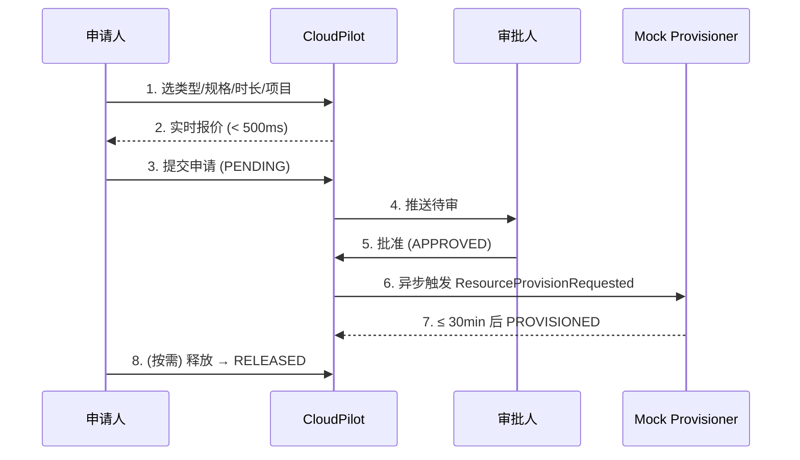

# 02 · CloudPilot MVP · PRD

> **阶段**：AI-Native DevOps P1 愿景 → PRD
> **上游输入**：[`01-interview-notes.md`](./01-interview-notes.md) 痛点清单 P1~P6 与功能种子 F1~F6
> **下游消费**：[`cloudpilot-mockup.html`](./cloudpilot-mockup.html) (UI/UX), [`03-ddd-modeling.md`](./03-ddd-modeling.md) (领域建模)
> **责任人**：R-Lead（业务方） · AI 出草稿，三方评审定稿
> **AI 草稿置信度**：高（基于完整访谈记录提取，结构化字段已对齐）

---

## 1. 背景与愿景

私有云资源申请目前依赖 OA 工单 + 运维手工配置，平均交付 2~3 天，规格手填易错，财务无法做项目级成本归因。

**愿景**：用一个轻量的自助平台 **CloudPilot**，让研发团队 **30 分钟内完成"提交 → 批准 → 配置可用"** 的闭环，同时给财务提供项目级成本视图。

---

## 2. 目标 / 非目标

| 类型          | 内容                                              |
| :------------ | :------------------------------------------------ |
| **目标 G1**   | 资源申请到可用的中位数时长 ≤ 30 分钟              |
| **目标 G2**   | 申请规格 100% 来自结构化选项，零自由文本          |
| **目标 G3**   | 财务可在仪表盘看到项目维度的当月已发生 + 预计费用 |
| **目标 G4**   | 申请人可自助释放资源                              |
| **非目标 N1** | 跨云调度、跨云迁移                                |
| **非目标 N2** | 财务结算清算、发票冲账                            |
| **非目标 N3** | 跨 BU 复杂审批流（先用兜底人工，后续迭代）        |
| **非目标 N4** | 真实云 SDK 集成（MVP 仅 Mock，P5 决定切换时机）   |

---

## 3. 用户画像

| 角色                     | 主要诉求                 | 关键操作                           |
| :----------------------- | :----------------------- | :--------------------------------- |
| **申请人**（研发）       | 自助、快、看价格         | 提交申请、查看自己的申请、释放资源 |
| **审批人**（团队负责人） | 看到全队申请、判断合理性 | 批准 / 驳回                        |
| **财务**（FinOps）       | 项目级成本可见           | 查看成本中心                       |

---

## 4. 核心流程



---

## 5. 功能需求（FR）

| ID    | 名称                | 描述                                            | 痛点映射 | 优先级         |
| :---- | :------------------ | :---------------------------------------------- | :------- | :------------- |
| FR-01 | 自助下单            | 结构化表单：类型 / 规格 / 时长 / 项目 / 用途    | P1, P2   | P0             |
| FR-02 | 实时报价            | 提交前根据报价表实时计算总价，< 500ms           | P3       | P0             |
| FR-03 | 幂等提交            | 同 `requestId` 重复提交仅创建一条               | NFR      | P0             |
| FR-04 | 审批工作流          | 审批人对 PENDING 单批准 / 驳回（含原因）        | P6       | P0             |
| FR-05 | 自动配置            | 批准后 ≤ 30 min 自动 PROVISIONED（MVP 用 Mock） | P1       | P0             |
| FR-06 | 申请视图            | 申请人查看自己提交的申请及状态                  | —        | P0             |
| FR-07 | 资源释放            | 申请人对 PROVISIONED 资源主动释放               | P4       | P0             |
| FR-08 | 项目成本中心        | 项目维度展示资源数 / 已发生费用 / 预计本月      | P5       | P0             |
| FR-09 | 仪表盘 KPI          | 运行中资源、本月费用、待审批、平均交付时间      | —        | P1             |
| FR-10 | 7 日成本趋势        | 仪表盘柱状图                                    | P5       | P1             |
| FR-11 | 到期告警 / 自动回收 | 接近到期推送告警，可配置自动回收                | P4       | P2（后续迭代） |

---

## 6. 非功能需求（NFR）

| ID     | 维度   | 指标                                                         |
| :----- | :----- | :----------------------------------------------------------- |
| NFR-01 | 性能   | 报价响应 < 500ms (P95)                                       |
| NFR-02 | 性能   | 审批后 PROVISIONED 时延 ≤ 30 分钟 (P95)                      |
| NFR-03 | 可靠   | 同一 `requestId` 幂等，重复提交不重复创建                    |
| NFR-04 | 安全   | 申请人只能看到自己的申请；审批人只能审本团队；财务可看全量   |
| NFR-05 | 审计   | 每次状态变更入审计日志（who / when / why）                   |
| NFR-06 | 可演进 | Mock 实现与真实云 SDK 共享同一接口契约（`Provisioner` 接口） |

---

## 7. 数据模型骨架

| 对象                | 关键字段                                                                                                                                           |
| :------------------ | :------------------------------------------------------------------------------------------------------------------------------------------------- |
| **ResourceRequest** | `id`, `type`, `spec`, `days`, `project`, `applicant`, `status`, `cost`, `createdAt`, `approvedAt`, `provisionedAt`, `releasedAt`, `rejectedReason` |
| **PricingTable**    | `(type, spec) → 单价/天`                                                                                                                           |
| **AuditEvent**      | `requestId`, `action`, `actor`, `timestamp`, `payload`                                                                                             |

**状态机**（详细约束见 [`03-ddd-modeling.md`](./03-ddd-modeling.md) §III 战术 / `@ddd-aggregates`）：

```text
PENDING ──批准──▶ APPROVED ──30min──▶ PROVISIONED ──释放──▶ RELEASED
   │
   └──驳回──▶ REJECTED
```

---

## 8. 验收标准（AC，给 P6 质量门禁）

| AC    | 描述                                             | 验证方式          |
| :---- | :----------------------------------------------- | :---------------- |
| AC-01 | FR-01 表单仅允许枚举值，自由文本字段无法影响计费 | 契约测试 + UI E2E |
| AC-02 | FR-02 报价 P95 < 500ms                           | 性能测试          |
| AC-03 | FR-03 同 `requestId` 二次提交，记录数仍为 1      | 单测 + 集成测试   |
| AC-04 | FR-05 Mock 30s ≈ 真实 30min；状态自动推进        | 集成测试          |
| AC-05 | NFR-04 越权访问返回 403                          | 安全扫描          |
| AC-06 | NFR-05 审计日志覆盖所有状态变更                  | 日志审计          |

---

## 9. 上线策略

- **灰度**：先开放 1 个团队（订单服务团队，R-Lead 所属），运行 2 周
- **指标**：申请到 PROVISIONED 中位数 ≤ 30min，零误配置事故
- **回滚**：保留 OA 工单兜底入口，新平台异常时降级

---

## 10. 待澄清

| #   | 问题                                      | 待与谁确认 |
| :-- | :---------------------------------------- | :--------- |
| Q1  | 跨项目共享资源的成本如何分摊？（FR-08）   | FIN        |
| Q2  | 审批人不在线超过 4 小时是否升级？         | R-Lead     |
| Q3  | RELEASED 之后的历史费用是否纳入预计本月？ | FIN        |

> Q1~Q3 在 P3 领域建模阶段二次确认，输出到 [`03-ddd-modeling.md`](./03-ddd-modeling.md) `@ddd-discover` 的"热点 / 歧义清单"。
