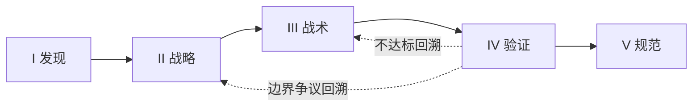
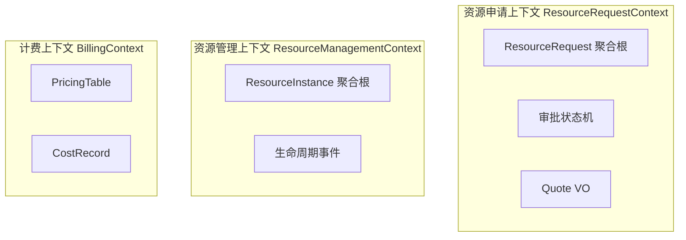

# 03 · DDD 建模流水线

> **阶段**：AI-Native DevOps P3 领域建模
> **上游输入**：[`02-prd.md`](./02-prd.md) §3 用户画像、§5 FR、§7 数据模型骨架、§10 待澄清
> **下游消费**：[`04-openspec/`](./04-openspec/)（由 `@ddd-openspec-bridge` 直接生成）
> **工具链**：`domain-driven-design-skills` 5 阶段 / 9 个 `@ddd-*` Skill
> **责任人**：架构师 + R-Lead 联合复核 · AI 出每阶段草稿

---

## 流水线总览



---

## I 发现 · `@ddd-scope`

**输入**：访谈记录 + PRD §1 §2

**产出**：

```yaml
problem_statement: |
  研发团队申请云资源走 OA 工单 + 运维手工配置，平均 2~3 天交付；
  财务无项目级成本视图。
goals:
  - 资源申请到可用 ≤ 30 min（中位）
  - 规格 100% 来自结构化选项
  - 项目级成本可见
non_goals:
  - 多云调度
  - 财务结算清算
  - 跨 BU 复杂审批流
constraints:
  - 仅 Mock 实现，接口契约对齐真实云 SDK
  - 数据隔离：申请人本人 / 审批人本团队 / 财务全量
glossary_seed:
  ResourceRequest: 用户提交的资源申请单
  Quote: 提交前的实时报价
  Provisioner: 执行真实/Mock 配置的下游能力
  Project: 成本归集的最小单元
risks:
  - Mock 与真实 SDK 行为分叉（缓解：契约测试）
  - 审批人离线导致申请阻塞（缓解：超时升级，后续迭代）
```

---

## I 发现 · `@ddd-discover`

**事件流**（按时间顺序，AI 提取后人工校对）：

| #   | 事件                         | 触发命令                         | 主要数据                                        |
| :-- | :--------------------------- | :------------------------------- | :---------------------------------------------- |
| E1  | `ResourceRequested`          | `SubmitRequest`                  | type, spec, days, project, applicant, requestId |
| E2  | `RequestApproved`            | `ApproveRequest`                 | requestId, approver, approvedAt                 |
| E3  | `RequestRejected`            | `RejectRequest`                  | requestId, approver, reason                     |
| E4  | `ResourceProvisionRequested` | (E2 触发)                        | requestId, type, spec                           |
| E5  | `ResourceProvisioned`        | `MarkProvisioned`（Mock 自触发） | requestId, provisionedAt                        |
| E6  | `ResourceReleased`           | `ReleaseResource`                | requestId, releasedAt                           |
| E7  | `QuoteCalculated`            | `CalculateQuote`                 | type, spec, days, totalPrice                    |

**热点 / 歧义清单**（来自 PRD §10 + 事件风暴讨论）：

- **H1** 跨项目共享资源的成本如何分摊？→ 决议：MVP 不支持，资源唯一归属一个项目
- **H2** 审批人离线超时是否升级？→ 决议：MVP 不升级，后续迭代加超时规则
- **H3** RELEASED 后历史费用是否纳入"预计本月"？→ 决议：纳入已发生，不纳入预计
- **H4** Quote 是否需要持久化？→ 决议：不持久化，仅作为提交时的快照写入 `ResourceRequest.cost`

---

## II 战略 · `@ddd-subdomains`

| 子域                         | 类型       | 说明                                         | 所有权                            |
| :--------------------------- | :--------- | :------------------------------------------- | :-------------------------------- |
| **资源申请审批**             | Core       | 业务差异化所在：自助 + 团队内审批 + 状态机   | 平台研发团队                      |
| **资源配置（Provisioning）** | Core       | 与申请审批紧耦合的状态推进，MVP 用 Mock 占位 | 平台研发团队                      |
| **计费**                     | Supporting | 标准化报价计算，无差异化                     | 平台研发团队（共用 PricingTable） |
| **配额**                     | Supporting | 项目级配额（后续迭代）                       | —                                 |
| **通知**                     | Generic    | 邮件 / IM 推送                               | 复用现有 IM 平台                  |
| **登录鉴权**                 | Generic    | SSO                                          | 复用公司 SSO                      |

> **核心域声明**：MVP 阶段聚焦"资源申请审批"+"资源配置"两个 Core 子域；其它子域用最简实现或外部依赖。

---

## II 战略 · `@ddd-contexts`

**3 个限界上下文**：



**通用语言词汇表**（节选）：

| 术语             | 定义                            | 上下文                    |
| :--------------- | :------------------------------ | :------------------------ |
| ResourceRequest  | 申请单聚合根，承载 5 状态机     | ResourceRequestContext    |
| Quote            | 提交时刻的报价快照（值对象）    | ResourceRequestContext    |
| ResourceInstance | 已配置的资源实例                | ResourceManagementContext |
| PricingTable     | (type, spec) → 单价/天 的查找表 | BillingContext            |
| CostRecord       | 已发生 / 预计费用记录           | BillingContext            |

---

## II 战略 · `@ddd-context-map`

| 上游            | 下游               | 集成模式                                                | 契约所有权                                                           | 失败模式                                          |
| :-------------- | :----------------- | :------------------------------------------------------ | :------------------------------------------------------------------- | :------------------------------------------------ |
| ResourceRequest | ResourceManagement | **发布/订阅** (Pub/Sub on `ResourceProvisionRequested`) | 上游 OHS（Open Host Service）                                        | 配置失败 → 状态保持 APPROVED + 告警               |
| ResourceRequest | Billing            | **ACL（防腐层）**                                       | 下游 Billing 自有 PricingTable，ACL 防止 PricingTable 字段污染聚合根 | PricingTable 不可达 → 拒绝提交，UI 显示报价不可用 |
| ResourceRequest | 通知               | **OHS** + 异步消息                                      | 上游                                                                 | 通知失败不阻断主流程                              |

---

## III 战术 · `@ddd-aggregates`

### 聚合 1：ResourceRequest（核心）

**聚合根**：`ResourceRequest`

**实体 / 值对象**：

- `RequestStatus` (枚举)：`PENDING | APPROVED | REJECTED | PROVISIONED | RELEASED`
- `Quote` (VO)：`{ unitPrice, days, totalPrice, calculatedAt }`
- `RejectionReason` (VO)

**不变量**（IV-N，编号给 `@ddd-model-review` 校验用）：

| ID   | 不变量                                                                                           | 实施                             |
| :--- | :----------------------------------------------------------------------------------------------- | :------------------------------- |
| IV-1 | 状态只能在 5 个枚举值之一                                                                        | 枚举类型                         |
| IV-2 | 状态转换必须遵循：PENDING → {APPROVED, REJECTED}；APPROVED → PROVISIONED；PROVISIONED → RELEASED | 状态机方法私有，外部只能通过命令 |
| IV-3 | `APPROVED` 后必须在 30 分钟内变为 `PROVISIONED`，否则触发告警                                    | 域服务 + 定时器                  |
| IV-4 | 同 `requestId` 重复提交仅一条记录                                                                | 仓库 `findById` + UPSERT         |
| IV-5 | `cost` 在创建时确定，后续不变                                                                    | 构造时校验，无 setter            |
| IV-6 | 释放只能由原申请人触发                                                                           | 命令前置校验                     |

**事务边界**：单聚合事务；跨上下文（→ ResourceManagement / Billing）通过事件最终一致性。

---

### 聚合 2：ResourceInstance（轻量）

**聚合根**：`ResourceInstance`（`requestId` 引用 `ResourceRequest`，但不在同一聚合）

**不变量**：

| ID   | 不变量                                           |
| :--- | :----------------------------------------------- |
| IV-7 | 一个 `requestId` 至多对应一个 `ResourceInstance` |
| IV-8 | `ResourceInstance` 释放后不可重新激活            |

---

## III 战术 · `@ddd-domain-interactions`

**领域事件目录**：

| 事件                         | 来源聚合           | 订阅方                               | 载荷                                      |
| :--------------------------- | :----------------- | :----------------------------------- | :---------------------------------------- |
| `ResourceRequested`          | ResourceRequest    | Audit / 通知                         | requestId, applicant, type, spec, project |
| `RequestApproved`            | ResourceRequest    | ResourceManagement, Audit            | requestId, approver                       |
| `RequestRejected`            | ResourceRequest    | Audit, 通知                          | requestId, reason                         |
| `ResourceProvisionRequested` | ResourceRequest    | ResourceManagement                   | requestId, type, spec                     |
| `ResourceProvisioned`        | ResourceManagement | ResourceRequest（推进状态）, Billing | requestId, provisionedAt                  |
| `ResourceReleased`           | ResourceRequest    | ResourceManagement, Billing          | requestId, releasedAt                     |

**领域服务**：

| 服务                     | 职责                                                   |
| :----------------------- | :----------------------------------------------------- |
| `QuoteCalculator`        | 输入 (type, spec, days)，查 `PricingTable`，输出 Quote |
| `ApprovalTimeoutMonitor` | 检测 APPROVED 超过 30 min 未变 PROVISIONED 的申请      |

**仓库接口**：

```typescript
interface ResourceRequestRepository {
  findById(id: RequestId): Promise<ResourceRequest | null>;
  save(request: ResourceRequest): Promise<void>;
  findByApplicant(applicant: UserId): Promise<ResourceRequest[]>;
  findPending(): Promise<ResourceRequest[]>;
}

interface Provisioner {
  // Mock 与真实云 SDK 共享同一接口（NFR-06）
  provision(req: ProvisioningCommand): Promise<void>;
  release(requestId: RequestId): Promise<void>;
}
```

---

## IV 验证 · `@ddd-model-review`

| 维度             | 评分       | 说明                                      |
| :--------------- | :--------- | :---------------------------------------- |
| **不变量表达率** | 8/8 = 100% | IV-1 ~ IV-8 全部映射到代码可校验位置 ✅   |
| **完整性**       | 95%        | 6 个 FR 全覆盖；FR-11（到期告警）后续迭代 |
| **一致性**       | 通过       | 事件命名、状态机、术语在 3 个上下文内一致 |
| **耦合度**       | 低         | 跨上下文仅通过事件 + ACL；无双向依赖      |
| **回溯触发**     | 无         | 不需回退到 `@ddd-aggregates`              |

> **结论**：模型可进入下一阶段（V 规范衔接）。如后续 FR-11（到期告警）加入，需回到 `@ddd-aggregates` 加 `RequestExpiry` VO 与 IV-9 不变量。

---

## V 规范 · `@ddd-openspec-bridge`

**桥接规则**：

| DDD 工件                    | OpenSpec 位置                                          |
| :-------------------------- | :----------------------------------------------------- |
| 子域 + 上下文（II 战略）    | `proposal.md` §"为什么 / 做什么"                       |
| 上下文映射（II 战略）       | `design.md` §"集成与契约"                              |
| 聚合不变量（III 战术）      | `specs/<context>/spec.md` §"Requirements" + `Scenario` |
| 领域事件（III 战术）        | `specs/<context>/spec.md` §"Events"                    |
| 仓库 / 服务接口（III 战术） | `tasks.md`（实现拆解的输入）                           |

**直接产出**：[`04-openspec/`](./04-openspec/)（包含 `proposal.md`、`design.md`、`tasks.md` 与 3 个 `specs/<context>/spec.md`）。
