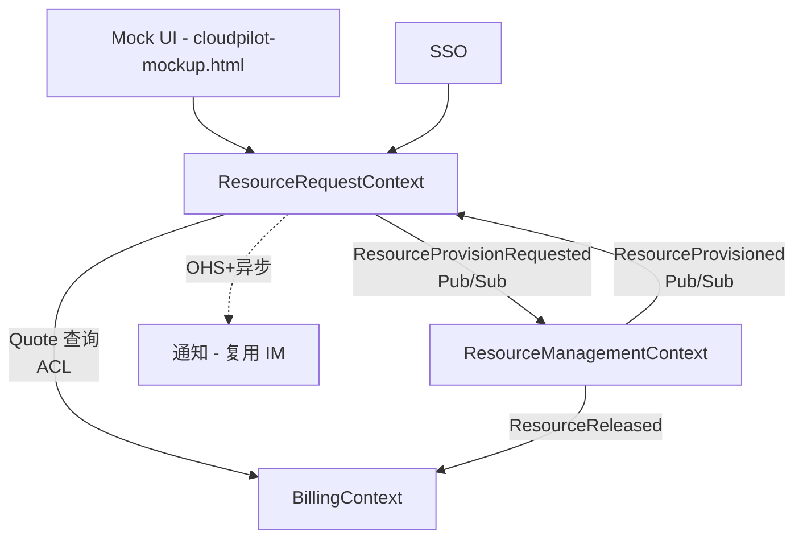
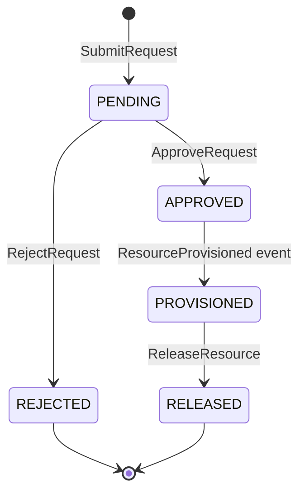

# Design · CloudPilot MVP

> **阶段**：AI-Native DevOps P4 OpenSpec 规范定义
> **上游输入**：[`../03-ddd-modeling.md`](../03-ddd-modeling.md) §II 战略 `@ddd-context-map` + §III 战术
> **下游消费**：P5 代码生成（架构骨架 + 接口）
> **责任人**：架构师主笔；AI 由 `@ddd-openspec-bridge` 提取上下文映射 + 集成模式

---

## 架构概览

## 集成与契约

| 上游            | 下游               | 集成模式                                | 契约所有权   | 失败模式                                      |
| :-------------- | :----------------- | :-------------------------------------- | :----------- | :-------------------------------------------- |
| ResourceRequest | ResourceManagement | Pub/Sub on `ResourceProvisionRequested` | 上游 OHS     | 配置失败 → 状态保持 APPROVED + 告警           |
| ResourceRequest | Billing            | ACL（防腐层）                           | 下游 Billing | PricingTable 不可达 → 拒绝提交，UI 报价不可用 |
| ResourceRequest | 通知               | OHS + 异步消息                          | 上游         | 通知失败不阻断主流程                          |

## 关键决策

### D1：Provisioner 接口对齐真实云 SDK

**问题**：MVP 用 Mock，但要避免后续切换成本。
**决策**：定义 `Provisioner` 接口（`provision` / `release`），Mock 与真实 SDK 实现同一接口；契约测试覆盖 5 状态转换。
**取舍**：早期付出抽象成本，换得后续平滑切换；契约文件 `contracts/provisioner.contract.ts` 独立维护。

### D2：Quote 不持久化，作为 ResourceRequest 创建快照

**问题**：报价是否需要独立聚合？
**决策**：`Quote` 是值对象，提交时复制为 `ResourceRequest.cost`，原 Quote 不存。
**取舍**：避免 Quote 失效语义复杂度；后续若需历史报价审计再升级。

### D3：跨上下文一致性用领域事件 + 最终一致

**问题**：`ResourceRequest` 状态推进依赖 `ResourceManagement` 配置完成。
**决策**：`ResourceProvisioned` 事件回流，`ResourceRequest` 监听并推进 `APPROVED → PROVISIONED`。
**取舍**：状态短暂不一致（< 30s）可接受；不引入分布式事务。

### D4：MVP 用 localStorage + setInterval 模拟，不接真实 DB / MQ

**问题**：Mock 演示方案。
**决策**：UI 层 localStorage 存 `requests` 数组；setInterval 5s 触发 `MarkProvisioned`，模拟异步配置。
**取舍**：演示门槛低；正式版替换为 PostgreSQL + Kafka，接口不变。

## 状态机（ResourceRequest）

不变量 IV-1 ~ IV-6 的代码落点见 [`specs/resource-request/spec.md`](./specs/resource-request/spec.md)。

## 安全与权限

| 角色   | 可见数据        | 可执行命令                               |
| :----- | :-------------- | :--------------------------------------- |
| 申请人 | 本人申请        | SubmitRequest, ReleaseResource（自己的） |
| 审批人 | 本团队所有申请  | ApproveRequest, RejectRequest            |
| 财务   | 全量申请 + 成本 | （只读）                                 |

权限检查在应用服务层，仓库不感知（保持聚合纯粹）。

## 可观测性

- **指标**：`request_lead_time_seconds`（提交→PROVISIONED）、`approval_latency_seconds`、`provision_failure_rate`
- **日志**：每次状态转换写审计日志（`requestId, fromState, toState, actor, ts`）
- **告警**：IV-3 触发（APPROVED 超 30 min）→ 推送审批人 IM
