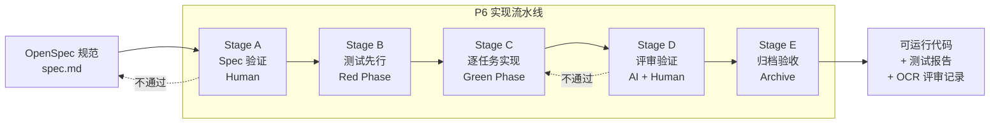
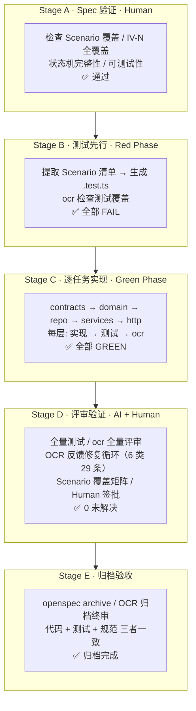

# 06 · P7: 实现工作流：从 OpenSpec 到可运行代码

> **阶段**：AI-Native DevOps P6 实现与测试
> **上游输入**：[`04-openspec/`](./04-openspec/)（proposal + design + tasks + 3 份 spec）
> **下游消费**：P6 质量验收（测试报告 + OCR 评审记录）
> **参考实现**：[OpenSpec-practise](https://github.com/ForceInjection/OpenSpec-practise)（同一套 spec 结构驱动 Node.js + Python 双实现）
> **责任人**：Tech Lead 审批每个 Stage 的 OCR 评审结果；AI 按 Stage A→E 流水线执行
> **AI 草稿置信度**：高（流程模式已在 OpenSpec-practise 验证，OCR 工具已就绪）

---

## 1. 概述

P4 产出 OpenSpec 规范（proposal / design / tasks / specs）之后，P5 的职责是将规范翻译为可编译、可测试、可运行的代码。本文档定义 P5 的 **5 阶段实现流水线**，每一阶段明确：输入、输出、执行者、确认方式。

核心原则：

> **Spec 是单一事实源。代码是对 Spec 的忠实翻译。测试是 Spec 的可执行契约。**

**阅读指南**：

- **想理解全流程**：先看下方的 Mermaid 宏观流转图（§1），再看 §1.3 的详细版每阶段活动一览，最后按 §3~§7 逐步执行
- **想直接动手**：§2 准备项目骨架 → §3.3 检查执行流程 → 按 Stage 顺序推进，每个 Stage 末尾的"Agent 交互"子节给出了直接可用的 prompt 模板
- **想快速查找**：§8.6 关键工具速查表收录了 `ocr review`、`npm test`、`openspec archive` 的常用参数



每个 Stage 与 P4 产出的 `tasks.md` 中的阶段划分对齐，同时引入 **[OpenCodeReview](https://github.com/alibaba/open-code-review)**（`ocr` CLI）在代码产出后自动检查代码与 Spec 的匹配度。

### 1.1 与 `05-p5-code-bridge.md` 的关系

P5 阶段由两份文档构成，分别回答两个不同的问题：

|                | [`05-p5-code-bridge.md`](./05-p5-code-bridge.md)                                          | `06-p5-implementation-workflow.md`（本文档）                                          |
| :------------- | :---------------------------------------------------------------------------------------- | :------------------------------------------------------------------------------------ |
| **性质**       | 静态结构（设计时参考）                                                                    | 动态流程（运行时指南）                                                                |
| **回答的问题** | "代码应该长什么样"                                                                        | "代码应该怎么写出来"                                                                  |
| **内容**       | monorepo 目录结构、contracts 包设计、IV-N→文件映射表、Mock→Real 切换点、Scenario→测试示例 | 5 阶段流水线（验证→测试先行→逐任务实现→评审→归档）、每层"实现→测试→OCR"循环、门禁标准 |
| **使用时机**   | 动手前阅读，建立项目骨架                                                                  | 动手时遵循，按 Stage 推进                                                             |
| **产出**       | 项目目录 + 映射规则                                                                       | 可运行代码 + 测试报告 + OCR 评审记录                                                  |

可以理解为：`05` 是建筑图纸（承重墙在哪、房间怎么隔），`06` 是施工工序（先打地基、再砌墙、每层验收后才能往上盖）。图纸决定工序的先后顺序，工序验证图纸是否可行。

### 1.2 与 OpenSpec-practise 的关系

本文档定义的是 **P6 实现过程的流水线规范**，OpenSpec-practise 是这个流水线的 **可运行验证实例**。2026-05-25 已按照本文档的 Stage A→E 流程，完整重放了 CloudPilot resource-request 的实现（见 [`../cloudpilot/`](../cloudpilot/) 目录，33 tests, 100% Scenario 覆盖，零回归）：

|             | CloudPilot P5 工作流（本文档） | CloudPilot 实际重放结果         | OpenSpec-practise          |
| :---------- | :----------------------------- | :------------------------------ | :------------------------- |
| 性质        | 流程定义（"怎么做"）           | 流程验证（"照此做了一遍"）      | 独立验证实例               |
| 领域        | 云管平台                       | 云管平台（resource-request）    | 电商                       |
| 语言        | TypeScript（设计）             | TypeScript（可运行）            | Node.js + Python（双实现） |
| 测试        | 定义了测试先行方法论           | 33 tests, pass 33, fail 0       | 单元 + 集成 + 性能测试     |
| OCR 评审    | 定义了每层 ocr review 命令     | 14 files, 29 comments, 全部修复 | OCR 通用，可直接套用       |
| Spec 覆盖率 | 定义了 Scenario→测试矩阵       | 16/16 Scenario = 100%           | 25+ Scenario 全部覆盖      |

**验证路径**：用本文档的 Stage A→E 流程，重新实现一次 OpenSpec-practise 的电商场景，或用 OpenSpec-practise 的 spec 结构验证 CloudPilot 的代码实现。

### 1.3 完整流水线一览



> 上图为全文流程的视觉总览。各阶段的详细操作步骤见第 3~7 节，每个 Stage 末尾的"Agent 交互"子节（3.5~7.6）给出了可直接使用的 prompt 模板。

---

## 2. 前置条件

开始 Stage A 之前，需要按 [`05-p5-code-bridge.md`](./05-p5-code-bridge.md) §1 建立项目骨架：

```text
cloudpilot/
├── package.json                    # tsx + Node.js test runner
├── tsconfig.json
├── contracts/                      # 共享契约包（事件、命令、接口）
│   ├── src/                        # 源文件
│   └── __tests__/                  # 测试文件（匹配 glob **/__tests__/**/*.test.ts）
├── services/
│   ├── resource-request/           # 对应 specs/resource-request/
│   │   ├── src/
│   │   │   ├── domain/
│   │   │   ├── repo/
│   │   │   └── services/
│   │   └── __tests__/
│   ├── resource-management/        # 对应 specs/resource-management/
│   └── billing/                    # 对应 specs/billing/
└── docker-compose.yml
```

**IV-N 编号说明**：`05-p5-code-bridge.md` §2.1 中的 IV-3/IV-5/IV-6 映射与 [`03-ddd-modeling.md`](./03-ddd-modeling.md) 及 OpenSpec spec 存在出入（`05` 中的 IV-3 映射为 REJECTED 终态、IV-5 映射为引用完整性、IV-6 映射为审计日志，与 DDD 模型的编号有出入）。本文档和 `04-openspec/specs/` 均以 DDD 模型的 IV 定义为准。

**关键约束**（来自 `05-p5-code-bridge.md`）：

- `contracts/` 是三个服务的共享语言边界，服务之间只通过 contracts 耦合
- 每个 spec 文件对应一个服务目录，每个 `### Requirement:` 对应一个或多个 `domain/` 下的文件
- Mock 实现与真实 SDK 实现共享同一接口（`ProvisionerInterface`），P5 用 Mock，P7 切换

**OCR 工具前置条件**：

- `ocr review` 基于 git diff 工作。项目需要是一个 git 仓库（或包含在父仓库中），且待评审的代码需要有 git 变更
- 如果 cloudpilot 是父仓库的子目录（非独立 git repo），`ocr review` 不加 `--from/--to` 时会评审工作区所有变更；也可以通过 `--repo` 指定仓库根目录
- 确认 `ocr` CLI 已安装且 LLM 已配置：`ocr version` + `ocr llm test`
- `-b/--background` 参数支持传入 spec 文本作为评审的业务上下文

---

## 3. Stage A：Spec 验证（Human）

**目标**：确保规范可执行——每个需求有可测试的场景，不存在主观性语言。

### 3.1 检查清单

| 检查项           | 标准                                                         | 不通过时的动作                                                                |
| :--------------- | :----------------------------------------------------------- | :---------------------------------------------------------------------------- |
| Requirement 覆盖 | 每个 `### Requirement:` 有 ≥1 个 `#### Scenario:`            | 回溯 `@ddd-modeler` 补充 Scenario                                             |
| Scenario 可测试  | 每个 Scenario 的 THEN 可转化为断言（无"体验良好"等主观描述） | 改写 Scenario，使用 SHALL/MUST 量化                                           |
| IV-N 全覆盖      | 每个 DDD 不变量有对应 Requirement                            | 回溯 [`03-ddd-modeling.md`](./03-ddd-modeling.md)，补 IV-N → Requirement 映射 |
| 状态机完整性     | `design.md` 状态图的每条边都在 spec 中有 Scenario            | 补充缺失的状态转换 Scenario                                                   |
| 非功能需求可度量 | 性能/安全/可用性有具体阈值（如 `p99 < 500ms`）               | 量化为具体数字                                                                |

### 3.2 CloudPilot 示例

以 `specs/resource-request/spec.md` 为例：

- **IV-1 ~ IV-6** 各对应一个 `### Requirement:`：通过
- **每个 Requirement 有 Scenario**：IV-1 有 2 个 Scenario，IV-2 有 4 个 Scenario，其余各 1~2 个：通过
- **Scenario 可测试**：如 "THEN 抛出 `IllegalStateTransition` 异常"——可转化为 `assert.throws(() => ..., /IllegalStateTransition/)`：通过

### 3.3 检查执行流程

按以下顺序逐项检查，有疑问时回溯对应上游文档：

1. **逐 Requirement 核对**：打开 `spec.md`，确认每个 `### Requirement:` 都有 `#### Scenario:`，回到 3.1 第 1 项
2. **Scenario 可测试性**：逐行读每个 Scenario 的 THEN 子句，确认可转化为 `assert` 断言，回到 3.1 第 2 项
3. **IV-N 覆盖**：从 `03-ddd-modeling.md` 复制 IV 编号列表，在 spec 中 `grep` 确认每个 IV-N 至少出现一次，回到 3.1 第 3 项
4. **状态机对照**：对照 `design.md` 的状态图，逐边确认 spec 中有对应 Scenario，回到 3.1 第 4 项
5. **NFR 量化**：检查性能/安全阈值是否有具体数字，回到 3.1 第 5 项
6. **全部通过 → 进入 Stage B**；任一项不通过 → 更新 spec 文件 → 重新执行本流程

### 3.4 输出

- 通过：进入 Stage B
- 不通过：更新 spec 文件，直到所有检查项通过才进入 Stage B

### 3.5 Agent 交互

1. **输入**：将 `04-openspec/specs/<capability>/spec.md` 和 `04-openspec/design.md` 提供给 Agent
2. **指令**："按以下检查清单逐项验证这份 spec：1) 每个 Requirement 有 ≥1 个 Scenario；2) 每个 Scenario 的 THEN 可转化为 assert 断言；3) 每个 IV-N 在 spec 中出现至少一次；4) design.md 状态图的每条边有对应 Scenario。输出逐项通过/不通过结果，如不通过给出具体修复建议。"
3. **Agent 产出**：逐项检查结果 + 不通过项的修复建议
4. **人类确认**：审核检查结果，如需修改 spec 则更新后重新交给 Agent 验证，直到全部通过

---

## 4. Stage B：测试先行 / Red Phase（AI）

**目标**：从 Spec 中的 Scenario 提取测试用例，生成全部失败的测试文件。测试是"需求的可执行副本"。

### 4.1 方法论：TDD 嵌套在 SDD 内

SDD 定义 **做什么**（Spec 中的 Requirement + Scenario），TDD 定义 **怎么验证**（测试先行，红→绿→重构）：

| SDD 层次                              | TDD 等价                      |
| :------------------------------------ | :---------------------------- |
| `### Requirement:` + `#### Scenario:` | 测试用例（`describe` + `it`） |
| Spec 中的 GIVEN                       | 测试的 Arrange（准备数据）    |
| Spec 中的 WHEN                        | 测试的 Act（调用方法）        |
| Spec 中的 THEN + AND                  | 测试的 Assert（断言）         |
| Spec 中的 Events 表                   | 集成测试的 mock/spy 验证点    |

### 4.2 三步生成测试

**步骤 1：提取测试用例清单**：

以 `specs/resource-request/spec.md` 为例，逐 Requirement 展开：

**contracts 层**（纯数据测试，零外部依赖；对应 4.2 步骤 2 的第 1 个文件）：

| Spec         | IV-N | 测试用例名称                                       | 期望结果                     |
| :----------- | :--- | :------------------------------------------------- | :--------------------------- |
| 状态枚举受限 | IV-1 | should define exactly 5 status values              | values.length = 5            |
| 状态转换矩阵 | IV-2 | should allow PENDING → APPROVED                    | allowed includes APPROVED    |
| 状态转换矩阵 | IV-2 | should allow PENDING → REJECTED                    | allowed includes REJECTED    |
| 状态转换矩阵 | IV-2 | should allow APPROVED → PROVISIONED                | allowed includes PROVISIONED |
| 状态转换矩阵 | IV-2 | should allow PROVISIONED → RELEASED                | allowed includes RELEASED    |
| 状态转换矩阵 | IV-2 | should forbid transitions from REJECTED (terminal) | allowed.length = 0           |
| 状态转换矩阵 | IV-2 | should forbid transitions from RELEASED            | allowed.length = 0           |

**domain 层**（聚合根行为测试；依赖 contracts；对应 4.2 步骤 2 的第 2 个文件）：

| Spec             | IV-N | 测试用例名称                                                          | 期望结果                        |
| :--------------- | :--- | :-------------------------------------------------------------------- | :------------------------------ |
| 状态枚举受限     | IV-1 | should set status to PENDING after submit                             | status = PENDING                |
| 状态枚举受限     | IV-1 | should reject invalid status value                                    | 类型错误 / 断言失败             |
| 状态转换合法路径 | IV-2 | should transition PENDING → APPROVED on approve                       | status = APPROVED               |
| 状态转换合法路径 | IV-2 | should transition PENDING → REJECTED on reject                        | status = REJECTED, 后续命令无效 |
| 状态转换合法路径 | IV-2 | should reject APPROVED ← REJECTED reverse transition                  | throw IllegalStateTransition    |
| 状态转换合法路径 | IV-2 | should transition APPROVED → PROVISIONED on ResourceProvisioned event | status = PROVISIONED            |
| 审批超时告警     | IV-3 | should trigger alert when approved > 30min                            | 告警推送，状态不变              |
| 提交幂等         | IV-4 | should return existing record on duplicate submit                     | 返回已有记录，不创建新记录      |
| 成本不可变       | IV-5 | should prevent cost modification after creation                       | 不存在 setCost / 断言失败       |
| 释放权限受限     | IV-6 | should allow release by original applicant                            | status = RELEASED               |
| 释放权限受限     | IV-6 | should deny release by non-applicant                                  | throw PermissionDenied          |

**步骤 2：按依赖排序测试文件生成顺序**：

先写对领域层（无外部依赖）的测试，再写对服务层（依赖 repo）的测试。所有测试文件放在 `__tests__/` 目录下以匹配 `npm test` 的 glob 模式（`**/__tests__/**/*.test.ts`）：

```text
1. contracts/__tests__/status.test.ts            ← 状态枚举 + 转换矩阵（纯数据，无依赖）
2. services/resource-request/__tests__/
   ├── ResourceRequest.test.ts                   ← 聚合根行为（依赖 contracts）
   ├── ResourceRequestRepo.test.ts               ← 仓库接口（依赖聚合根）
   └── RequestApplicationService.test.ts         ← 应用服务（依赖 repo mock）
```

> **注意 1**：测试文件必须放在 `__tests__/` 目录中（而非与源文件同目录）。如果测试文件与 package.json 中 `npm test` 的 glob 不匹配，Node.js test runner 会静默跳过——不会报错，但也不会运行。
>
> **注意 2**：`**/__tests__/**/*.test.ts` 这种 glob 模式依赖 shell 展开。在 bash（默认）中，glob 字面量可能原样传递给 node 导致 ENOENT 错误；zsh 默认则在 shell 层面报 `no matches found` 错误。建议首次运行时使用 `node --import tsx --test contracts/__tests__/status.test.ts services/resource-request/__tests__/ResourceRequest.test.ts` 直接指定文件路径，等文件存在后再使用 `npm test` 的 glob 模式。

**步骤 3：生成测试代码，确认全部 FAIL**：

实际 Red Phase 输出（两个测试文件都因模块不存在而失败）：

```typescript
// services/resource-request/__tests__/ResourceRequest.test.ts
// 每个 it(...) 对应 spec 中的一个 Scenario
// 使用 Node.js 内置 test runner + assert（非 Jest/Vitest）

import { describe, it } from "node:test";
import assert from "node:assert/strict";
import {
  ResourceRequest,
  ResourceRequestStatus,
} from "../src/domain/ResourceRequest.js";

const makeSubmitCmd = (overrides = {}) => ({
  requestId: "REQ-0001",
  type: "ECS",
  spec: "4C8G",
  days: 30,
  project: "order-service",
  applicant: "U-A",
  cost: 720,
  ...overrides,
});

describe("ResourceRequest — IV-1 状态枚举受限", () => {
  // 来自 Scenario: "创建后初始状态为 PENDING"
  it("should set status to PENDING after submit", () => {
    const rr = ResourceRequest.submit(makeSubmitCmd());
    assert.equal(rr.status, ResourceRequestStatus.PENDING);
  });
});

describe("ResourceRequest — IV-2 状态转换合法路径", () => {
  // 来自 Scenario: "审批后进入 APPROVED"
  it("should transition PENDING → APPROVED on approve", () => {
    const rr = ResourceRequest.submit(makeSubmitCmd());
    rr.approve("approver-1");
    assert.equal(rr.status, ResourceRequestStatus.APPROVED);
  });

  // 来自 Scenario: "拒绝从 REJECTED 反向转换"
  it("should reject APPROVED ← REJECTED reverse transition", () => {
    const rr = ResourceRequest.submit(makeSubmitCmd());
    rr.reject("approver-1", "预算不足");
    assert.throws(
      () => rr.approve("approver-1"),
      /IllegalStateTransition|REJECTED/,
    );
  });
});

describe("ResourceRequest — IV-4 幂等提交", () => {
  // 来自 Scenario: "重复提交返回已存在"
  // 注：`ResourceRequest.submit()` 是纯工厂函数，两次调用各自创建新实例；
  // 此测试验证 submit 将 requestId 透传至聚合根属性。
  // 完整幂等行为（同一 requestId 不创建重复记录）在应用服务层测试
  // (RequestApplicationService.test.ts) 中通过 Repository 验证。
  it("should pass requestId from command to entity", () => {
    const cmd = makeSubmitCmd({ requestId: "REQ-DUP" });
    const first = ResourceRequest.submit(cmd);
    const second = ResourceRequest.submit(cmd);
    assert.equal(first.requestId, second.requestId);
  });
});
```

确认 Red Phase——运行 `npm test`：

```text
tests 2
pass 0
fail 2

✖ contracts/__tests__/status.test.ts — ERR_MODULE_NOT_FOUND: ../src/status.js
✖ services/resource-request/__tests__/ResourceRequest.test.ts — ERR_MODULE_NOT_FOUND: ResourceRequest.js
```

这就是 Red Phase 的预期状态：2 个测试文件、0 通过、2 失败，全部因模块不存在而失败。

### 4.3 `ocr review` 在 Stage B 中的角色

测试代码也是代码。在生成测试文件后，对测试代码运行一次 `ocr review`：

```bash
# 检查测试文件是否覆盖了 spec 中的所有 Scenario
ocr review \
  --from main \
  --to HEAD \
  -b "$(cat 04-openspec/specs/resource-request/spec.md)"
```

`ocr` 会检查：

- 测试文件的 describe/it 是否覆盖了 spec 中的每个 Scenario
- Scenario 的 GIVEN/WHEN/THEN 是否在测试中有对应的 Arrange/Act/Assert

### 4.4 输出与门禁

- 所有测试文件已生成，执行 `npm test` 应看到 **全部 FAIL**（编译错误或断言失败均可）
- 如果某个测试直接绿了，说明实现代码已经在——需要确认是否在正确的位置，或是范围外代码
- `ocr review` 评审通过（无遗漏 Scenario）

**确认点**：Tech Lead 确认测试清单完整覆盖所有 Scenario 后，进入 Stage C。

### 4.5 Agent 交互

1. **输入**：将 spec.md 和提取出的测试用例清单（4.2 步骤 1 的表格）提供给 Agent
2. **指令**："为以下测试清单生成测试文件代码。使用 Node.js 内置 test runner + assert（非 Jest）。contracts 层测试放在 `contracts/__tests__/`，domain 层测试放在 `services/<context>/__tests__/`。每个 Scenario 对应一个 `it(...)` 块，GIVEN→准备数据，WHEN→调用方法，THEN→assert 断言。只生成测试文件，不要实现任何业务代码。"
3. **Agent 产出**：测试文件（.test.ts），此时 import 会因源文件不存在而失败
4. **人类确认**：运行 `npm test`，确认看到 `tests N, pass 0, fail N`（全部 `ERR_MODULE_NOT_FOUND`）。如有测试直接绿了（非预期），检查是否有预先存在的实现代码

---

## 5. Stage C：逐任务实现 / Green Phase（AI）

**目标**：按依赖顺序逐层实现，每次只让一个（或一组相关）测试变绿，不实现 spec 中没有的内容。

### 5.1 实现顺序与依赖

实现顺序严格遵循 `tasks.md` 的阶段划分（已在 [`04-openspec/tasks.md`](./04-openspec/tasks.md) 中定义），按依赖从内向外：

```text
Layer 1: contracts/      （零依赖——领域事件、命令、接口定义）
    ↓
Layer 2: domain/         （仅依赖 contracts——聚合根、值对象、状态机）
    ↓
Layer 3: repo/           （依赖 domain——仓库接口 + 内存实现）
    ↓
Layer 4: services/       （依赖 domain + repo——应用服务、领域服务）
    ↓
Layer 5: http/           （依赖 services——API 路由、中间件）
```

### 5.2 每层的"实现→测试→评审"循环

每一层执行相同的三步循环：

```text
┌───────────────────────────────────────────────────┐
│  1. 实现代码                                       │
│     ↓                                             │
│  2. 运行对应测试（确认从 RED 变 GREEN）               │
│     ↓                                             │
│  3. ocr review -b "<spec 内容>"（检查代码与需求匹配） │
│     ↓                                             │
│  4. 如果 ocr 提出 issue → 修复 → 回到 2             │
│     ↓                                            │
│  5. 进入下一层                                     │
└──────────────────────────────────────────────────┘
```

#### 5.2.1 Layer 1: contracts/

```bash
# 1. 实现 contracts/src/{events,commands,status,interfaces}.ts
# 2. 运行测试
node --import tsx --test contracts/__tests__/status.test.ts

# 3. OCR 评审：检查 contracts 是否覆盖了 spec 中的所有事件和接口
ocr review \
  --from main \
  --to HEAD \
  -b "$(cat 04-openspec/specs/resource-request/spec.md)"
```

**Layer 1 常见陷阱**：

| 陷阱 | 表现 | 正确做法 |
| :--- | :--- | :--- |
| `contracts/` 反向依赖 `services/` | `interfaces.ts` 中 `import { ResourceRequest } from "../../services/..."` 形成循环依赖 | 在 contracts 中定义 DTO 接口（如 `ResourceRequestDto`），Repo 接口引用 DTO，领域实现隐式满足 DTO |
| `EventBus.subscribe` 用 `string` | `subscribe(eventType: string, ...)` 失去编译期类型检查 | 改为 `subscribe(eventType: DomainEvent["eventType"], ...)`，利用 discriminated union 约束合法事件类型 |
| 事件缺少 `timestamp` | 6 个事件接口中漏加 `timestamp` 字段，导致审计日志无法追溯时间 | 所有事件统一包含 `readonly timestamp: string`（ISO 8601 UTC 格式） |

#### 5.2.2 Layer 2: domain/

```bash
# 1. 实现 ResourceRequest.ts、ResourceRequestStateMachine.ts
# 2. 运行测试
node --import tsx --test services/resource-request/__tests__/ResourceRequest.test.ts

# 3. OCR 评审：检查每个 IV-N 是否在代码中正确实现
ocr review \
  --from main \
  --to HEAD \
  -b "以下是对 resource-request 聚合的 Requirement：
$(cat 04-openspec/specs/resource-request/spec.md)"
```

**Layer 2 实践注意——时间依赖逻辑的可测试性**：IV-3（审批超时检测）依赖 `Date.now()` 判定时间差，测试中无法直接修改 `approvedAt`（getter-only 属性）。解决模式：给 `isApprovalTimedOut` 增加 `nowMs` 参数（默认 `Date.now()`），测试中注入虚拟时钟：

```typescript
// 生产代码
isApprovalTimedOut(thresholdMs = 30 * 60 * 1000, nowMs = Date.now()): boolean {
  if (this._status !== APPROVED) return false;
  if (!this._approvedAt) return false;
  return nowMs - this._approvedAt.getTime() > thresholdMs;
}

// 测试代码
const fakeNow = rr.approvedAt!.getTime() + 31 * 60 * 1000;
assert.equal(rr.isApprovalTimedOut(30 * 60 * 1000, fakeNow), true);
```

**实际测试数量演进**：contracts 层 7 pass → domain 层 14 pass（初始 12 pass / 2 fail，修复 IV-3 后全通过）→ repo + services 层 33 pass。

#### 5.2.3 Layer 3: repo/

```bash
# 1. 实现 ResourceRequestRepo.ts（内存版）
# 2. 运行测试（此时幂等测试 IV-4 可以运行了）
npm run test:resource-request

# 3. OCR 评审
ocr review --from main --to HEAD \
  -b "$(cat 04-openspec/specs/resource-request/spec.md)"
```

#### 5.2.4 Layer 4: services/

```bash
# 1. 实现 RequestApplicationService.ts（权限检查、事件发布、事务边界）
# 2. 运行测试（此时权限测试 IV-6 可以运行了）
npm run test:resource-request

# 3. OCR 评审
ocr review --from main --to HEAD \
  -b "$(cat 04-openspec/specs/resource-request/spec.md)"
```

**Layer 4 常见陷阱**：

| 陷阱 | 表现 | 正确做法 |
| :--- | :--- | :--- |
| `InMemoryEventBus.publish` 吞异常 | try-catch 后用 `console.error` 吞掉异常，调用方无法感知事件发布失败，导致下游静默丢失事件 | MVP 阶段至少记录错误日志；生产环境应收集异常并抛出 `AggregateError`，或提供错误回调机制 |
| apply 层字段校验不足 | `submit()` 仅校验 `applicant`，`requestId`/`type`/`project` 等空字符串穿透到领域层才报错 | 在应用服务入口对必填字段做非空校验，尽早返回有意义的错误信息 |
| `reject()` 不校验 reason | 空字符串 reason 导致审计日志无意义 | 增加 `reason.trim()` 非空断言 |

#### 5.2.5 Layer 5: http/（如有 API 层）

```bash
# 1. 实现路由 + 中间件（如 POST /api/requests、GET /api/requests/:id）
# 2. 运行 HTTP 层集成测试（检验 HTTP 状态码、请求/响应序列化、中间件行为）
node --import tsx --test services/resource-request/__tests__/api.integration.test.ts

# 3. OCR 评审
ocr review --from main --to HEAD \
  -b "$(cat 04-openspec/specs/resource-request/spec.md)"
```

> **注意**：Layer 5 的测试关注 HTTP 协议层（状态码、Content-Type、认证头解析），与 Layer 4 的应用服务测试（业务逻辑正确性）是互补关系，不应使用同一测试文件。CloudPilot resource-request 重放中未实现 HTTP 层，此层为后续扩展预留。

### 5.3 OCR 在实现阶段的关键用法

每次 commit 后，`ocr` 用 `-b` 参数传入对应的 spec 内容作为背景上下文，检查变更代码是否与需求对齐：

```bash
# 基础用法：传入 spec 内容作为业务背景
ocr review -c HEAD \
  -b "$(cat 04-openspec/specs/resource-request/spec.md)"

# 进阶用法：同时传入 design.md 提供架构约束
ocr review -c HEAD \
  -b "需求规范：
$(cat 04-openspec/specs/resource-request/spec.md)

架构约束：
$(cat 04-openspec/design.md)"

# 带自定义规则（可选）：
ocr review -c HEAD \
  --rule /path/to/custom-rules.json \
  -b "$(cat 04-openspec/specs/resource-request/spec.md)"
```

`ocr` 会在评审中指出的典型问题：

- 某个 Scenario 的 WHEN/THEN 在代码中没有对应逻辑
- 状态转换路径与 spec 定义不一致
- 缺少 spec 中声明的领域事件发布
- Repository 接口与 spec 中定义的接口签名不匹配

### 5.4 核心纪律

| 规则                           | 说明                                                                |
| :----------------------------- | :------------------------------------------------------------------ |
| **不实现 spec 中没有的内容**   | 如果发现缺失需求，回到 Stage A 更新 spec，不直接写代码              |
| **一次只让一个 Scenario 变绿** | 批量实现会导致 spec 追溯链断裂                                      |
| **spec 是唯一真相源**          | 如果代码与 spec 行为不一致，改代码而非改 spec（除非 spec 本身有误） |
| **每层实现后跑 ocr**           | 不等到全部写完才发现需求偏离                                        |

### 5.5 Agent 交互

按 5.1 的 Layer 顺序，逐层驱动 Agent 实现。每层的循环如下：

1. **输入**：将 spec.md 提供给 Agent，指定当前 Layer（如 "实现 Layer 1: contracts/"）
2. **指令模板**（将 `<...>` 替换为当前上下文）：

   ```text
   基于这份 spec，实现 <Layer> 的代码。只实现当前 Layer 需要的文件：
   - Layer 1: contracts/src/{status,events,commands,interfaces}.ts
   - Layer 2: services/<context>/src/domain/<Aggregate>.ts
   - Layer 3: services/<context>/src/repo/<Aggregate>Repo.ts
   - Layer 4: services/<context>/src/services/<AppService>.ts
   - Layer 5: HTTP 路由 + 中间件文件

   只实现让当前 Layer 对应的测试从 RED 变 GREEN 的最小代码。
   不要实现 spec 中没有的内容。如发现缺失需求，先报告，不要自行补充。
   ```

3. **Agent 产出**：当前 Layer 的源文件
4. **人类运行测试**：`node --import tsx --test <当前 Layer 测试文件路径>`（或 `npm run test:resource-request`）
5. **如测试失败**：将失败输出贴给 Agent，Agent 修复代码，回到步骤 4
6. **测试通过后，人类运行 OCR**：`ocr review -b "$(cat <spec 路径>)" --audience agent`
7. **如 OCR 有 issue**：将 OCR 输出贴给 Agent，Agent 修复，回到步骤 4
8. **确认当前 Layer 通过**：进入下一 Layer，重复步骤 1~7

---

## 6. Stage D：评审验证（AI + Human）

**目标**：全量测试通过 + OCR 全量评审通过 + 人审确认。

### 6.1 全量测试

```bash
npm test
```

门禁标准（来自 `04-openspec/tasks.md` 验收门禁）：

- 单元测试全绿
- 集成测试全绿
- 契约测试全绿

实际输出示例（resource-request 完整实现后）：

```text
tests 33
pass 33
fail 0
```

### 6.2 全量 OCR 评审

对整个变更范围运行 OCR，传入全部 spec 作为背景：

```bash
ocr review \
  -b "CloudPilot MVP 的完整需求规范：

=== resource-request ===
$(cat 04-openspec/specs/resource-request/spec.md)

=== 架构设计 ===
$(cat 04-openspec/design.md)" \
  --audience agent
```

**实际运行结果**（CloudPilot resource-request 重放）：

```text
Summary: 14 file(s) reviewed, 29 comment(s), ~1019058 token(s) used, 2m28s elapsed
```

### 6.3 OCR 反馈修复循环

OCR 评审发现的 29 条 comment 可分为以下几类。每一轮修复后重新运行测试确认无回归：

**第 1 类：异常类专用化**（3 条）

OCR 发现代码中多处抛出 `new Error(...)` 通用异常，调用方无法通过 `instanceof` 精确捕获：

| 位置                                        | 问题           | 修复                                                     |
| :------------------------------------------ | :------------- | :------------------------------------------------------- |
| `status.ts` — 状态转换校验                  | 抛出通用 Error | 新增 `IllegalStateTransitionError` 类（含 from/to 字段） |
| `ResourceRequest.ts` — 权限检查             | 抛出通用 Error | 新增 `PermissionDeniedError` 类                          |
| `RequestApplicationService.ts` — 资源不存在 | 抛出通用 Error | 新增 `ResourceNotFoundError` 类                          |

**第 2 类：接口契约不一致**（3 条）

| 位置                                       | 问题                                  | 修复                                                 |
| :----------------------------------------- | :------------------------------------ | :--------------------------------------------------- |
| `events.ts` — `EventBus` 接口              | 只定义了 `publish`，缺少 `subscribe`  | 接口补充 `subscribe` 方法签名                        |
| `events.ts` — `ResourceProvisionRequested` | 6 个事件中唯一缺少 `timestamp` 字段的 | 补充 `readonly timestamp: string`                    |
| `ResourceRequest.ts` — `markProvisioned()` | 未接收 `instanceId`，与事件定义不一致 | 添加注释说明 `instanceId` 由 ResourceManagement 管理 |

**第 3 类：枚举使用不当**（2 条）

| 位置                                       | 问题                                                  | 修复                                      |
| :----------------------------------------- | :---------------------------------------------------- | :---------------------------------------- |
| `ResourceRequestRepo.ts` — `findPending()` | `r.status === "PENDING"` 字符串硬编码                 | 改为 `ResourceRequestStatus.PENDING` 枚举 |
| `status.test.ts` — 断言                    | `"PENDING" as ResourceRequestStatus` 类型断言绕过检查 | 直接使用 `ResourceRequestStatus.PENDING`  |

**第 4 类：防御性验证缺失**（3 条）

| 位置                             | 问题                                   | 修复                                      |
| :------------------------------- | :------------------------------------- | :---------------------------------------- |
| `ResourceRequest.ts` — 构造函数  | cost 未校验负数/NaN                    | 增加 `cost > 0 && Number.isFinite(cost)`  |
| `ResourceRequest.ts` — 构造函数  | days 未校验负数/非整数                 | 增加 `days > 0 && Number.isInteger(days)` |
| `InMemoryEventBus` — `publish()` | handler 异常未捕获，会中断后续 handler | 增加 try-catch，记录日志后继续执行        |

**第 5 类：代码组织与配置**（4 条）

| 位置                                  | 问题                                                       | 修复                                      |
| :------------------------------------ | :--------------------------------------------------------- | :---------------------------------------- |
| `package.json` — `test:contracts`     | glob 路径指向 `contracts/src/` 而非 `contracts/__tests__/` | 修正为 `contracts/__tests__/**/*.test.ts` |
| `tsconfig.json` — `exclude`           | `"__tests__"` 只排除根目录，不排除嵌套                     | 改为 `"**/__tests__/**"`                  |
| `ResourceRequestRepo.ts` — `findById` | 与 `findByRequestId` 实现重复                              | `findById` 委托给 `findByRequestId`       |
| `RequestApplicationService.ts`        | `InMemoryEventBus` 与应用服务同文件                        | 建议抽取为独立文件（MVP 阶段可接受）      |

**第 6 类：测试改进建议**（14 条）

包括：幂等测试的 IV-4 域层测试只比较属性值而非引用相等、事件总数应精确断言、缺少 `findById` 测试、approvedAt 边界测试等。这些属于增强项，不影响功能正确性，可根据团队标准选择性采纳。

### 6.4 OCR 修复后回归

```bash
npm test
# 预期：全部之前通过的测试仍然通过，修复未引入回归
```

实际结果：修复全部 29 条 comment 后，`tests 33, pass 33, fail 0`——零回归。

### 6.5 Scenario → 测试覆盖矩阵

生成覆盖矩阵，确认无遗漏（实际重放结果）：

| Spec Requirement | IV-N | 测试用例                                                | 测试层           | 状态 |
| :--------------- | :--- | :------------------------------------------------------ | :--------------- | :--: |
| 状态枚举受限     | IV-1 | `should define exactly 5 status values`                 | contracts        |  ✅  |
| 状态枚举受限     | IV-1 | `should set status to PENDING after submit`             | domain           |  ✅  |
| 状态转换合法路径 | IV-2 | 6 个 transitions 测试（允许/禁止）                      | contracts        |  ✅  |
| 状态转换合法路径 | IV-2 | `should transition PENDING → APPROVED`                  | domain           |  ✅  |
| 状态转换合法路径 | IV-2 | `should transition PENDING → REJECTED`                  | domain           |  ✅  |
| 状态转换合法路径 | IV-2 | `should reject any command after REJECTED`              | domain           |  ✅  |
| 状态转换合法路径 | IV-2 | `should throw when approving a REJECTED request`        | domain           |  ✅  |
| 状态转换合法路径 | IV-2 | `should transition APPROVED → PROVISIONED`              | domain           |  ✅  |
| 状态转换合法路径 | IV-2 | `should reject PENDING → PROVISIONED skip`              | domain           |  ✅  |
| 审批超时告警     | IV-3 | `should detect timeout when APPROVED > 30min`           | domain           |  ✅  |
| 审批超时告警     | IV-3 | `should not change status on timeout check`             | domain           |  ✅  |
| 提交幂等         | IV-4 | `should return existing record on duplicate submit`     | services         |  ✅  |
| 成本不可变       | IV-5 | `should not expose a setCost method`                    | domain           |  ✅  |
| 成本不可变       | IV-5 | `should preserve original cost after state transitions` | domain           |  ✅  |
| 释放权限受限     | IV-6 | `should allow release by original applicant`            | domain + service |  ✅  |
| 释放权限受限     | IV-6 | `should deny release by non-applicant`                  | domain + service |  ✅  |

**覆盖率**: 16/16 Scenario = 100%。所有 6 个 IV-N 不变量至少有一个正例 + 一个反例。

### 6.6 输出与门禁

| 门禁       | 标准                                               | 不通过时的动作     |
| :--------- | :------------------------------------------------- | :----------------- |
| 测试       | 全量绿                                             | 修复代码后回到 6.1 |
| OCR 评审   | 0 个未解决的 comment（所有实质性建议已修复或记录） | 修复后回到 6.4     |
| 覆盖矩阵   | 每个 Scenario 有对应测试，覆盖率 100%              | 补写测试后回到 6.1 |
| Human 签批 | Tech Lead 确认                                     | —                  |

**确认点**：Tech Lead 确认 6.1~6.5 全部通过后，进入 Stage E。

### 6.7 Agent 交互

1. **输入**：将完整 spec.md + design.md + 全部代码变更提供给 Agent
2. **指令**："我会运行 OCR 全量评审并将结果提供给你。请做好准备：根据 OCR 评审结果，按类型分组（异常类、接口契约、枚举、防御性验证、代码组织、测试改进），给出一份修复优先级清单，并对每个 issue 给出具体的修复代码。"
3. **人类运行 OCR**：`ocr review -b "$(cat <spec 路径>)" --audience agent`，将输出贴给 Agent
4. **Agent 产出**：分类的 issue 清单 + 按优先级排列的修复建议
5. **人类+Agent 修复循环**：
   - 人类逐条确认每类 issue 是否修复
   - 对需修复的 issue，提供具体文件+行号给 Agent，Agent 生成修复代码
   - 每轮修复后运行 `npm test` 确认无回归
6. **人类运行 OCR 终审**：确认 0 个未解决 issue
7. **人类确认**：审核覆盖矩阵（Agent 可辅助生成），确认每个 Scenario 有对应测试，签批

---

## 7. Stage E：归档验收（Archive）

**目标**：将增量规范合并到主规范，保持 Spec 为单一事实源。

> **何时跳过**：如果本次实现是实验性操作或 Demo 演示（如 CloudPilot 重放中的 resource-request 单独实现），可以跳过归档。如果是正式交付——涉及多个 capability、需要与其他服务联调、或后续迭代依赖当前规范——必须执行归档。

### 7.1 归档条件检查

| 条件                    | 是否满足 | 说明                                                      |
| :---------------------- | :------- | :-------------------------------------------------------- |
| 所有 Stage D 门禁通过   | ✅       | 测试全绿 + OCR 0 未解决 + 覆盖 100%                       |
| 变更涉及多个 capability | 视情况   | CloudPilot resource-request 是单 capability 实现，可跳过  |
| 有下游消费者依赖此规范  | 视情况   | 后续 resource-management、billing 服务依赖 contracts 定义 |
| 属于正式版本发布        | 视情况   | MVP 阶段建议归档，标记为 v1-mvp                           |

### 7.2 OpenSpec Archive

```bash
# 仅当上述条件满足时执行
openspec archive v1-mvp
```

此命令将 `changes/v1-mvp/` 中的增量 spec（ADDED/MODIFIED/REMOVED）合并到主规范目录 `specs/` 中。归档后 `changes/v1-mvp/` 目录标记为 archived，不再出现在活跃变更列表中。

### 7.3 OCR 归档前终审

归档前做最后一次完整评审，确保没有任何遗漏：

```bash
ocr review --from main --to HEAD \
  -b "$(cat 04-openspec/specs/*/spec.md)" \
  --format json > p5-final-review.json
```

终审用 `--format json` 输出，保存为审计记录 `p5-final-review.json`，便于后续追溯规范→代码→评审的完整链条。

### 7.4 输出

- `specs/` 主规范已更新（合并了本次变更）
- `changes/v1-mvp/` 标记为 archived
- `p5-final-review.json` 归档为审计记录
- 代码 + 测试 + 规范三者一致

### 7.5 实验性跳过示例（CloudPilot resource-request 重放）

```bash
# 实验性/Demo 实现，可以跳过归档，但建议保存 OCR 终审结果作为参考
ocr review \
  -b "$(cat 04-openspec/specs/resource-request/spec.md)" \
  --format json > p5-final-review.json 2>/dev/null || true

echo "Stage E skipped — experimental run. OCR result preserved in p5-final-review.json."
```

### 7.6 Agent 交互

1. **输入**：将 7.1 归档条件检查表提供给 Agent，附上当前项目状态
2. **指令**："根据归档条件检查表判断本次变更是否需要归档。如需归档，执行 `openspec archive <change-name>` 并运行归档前 OCR 终审。如跳过（实验性/Demo），保存 OCR 终审结果 JSON 作为审计记录。"
3. **Agent 产出**：归档决策 + （如适用）archive 命令输出或 OCR 终审 JSON
4. **人类确认**：确认 `p5-final-review.json` 已保存，代码+测试+规范三者一致

---

## 8. 实战经验总结

基于 CloudPilot resource-request 的完整重放，以下经验教训值得在未来迭代中注意：

### 8.1 测试组织（参见 §4.2、§4.5）

- **测试文件必须在 `__tests__/` 目录下**，确保与 `npm test` 的 glob（`**/__tests__/**/*.test.ts`）匹配。如果路径不匹配，Node.js test runner 会静默跳过——不会报错但也不会运行，极易遗漏。
- **测试文件的 import 路径**需要随目录位置调整。例如 contracts 测试从 `contracts/src/status.test.ts` 移动到 `contracts/__tests__/status.test.ts` 后，import 从 `./status.js` 变为 `../src/status.js`。

### 8.2 时间依赖的可测试性（参见 §5.2.2）

- 不要用 `(rr as any).approvedAt = ...` 的方式 hack 内部状态——getter-only 属性在运行时也无法赋值。
- 正确模式：给依赖时间的方法增加可选参数（`nowMs: number = Date.now()`），测试中注入虚拟时钟。

### 8.3 OCR 评审的价值（参见 §6.2~§6.4）

- OCR 在 14 个文件中发现了 **29 条实质性建议**，涵盖异常设计、接口契约、枚举使用、防御性验证、代码组织 5 个维度——这些都是人工评审容易忽略的细节。具体分类见 §6.3。
- OCR 最擅长发现的是：**跨文件契约不一致**（如 EventBus 接口缺少 subscribe、事件缺少 timestamp）、**枚举 vs 字符串**的混用、**异常类型缺失**等"全局一致性"问题。
- `-b` 参数传入 spec 作为业务上下文是关键：没有 spec 上下文，OCR 只能做通用代码评审，无法检查代码与需求的匹配度。

### 8.4 幂等性的分层（参见 §4.2 步骤 3、§5.2.4）

- IV-4（幂等提交）在域层和应用服务层有不同含义：域层的 `ResourceRequest.submit()` 始终创建新实例（纯工厂），幂等逻辑应在 `RequestApplicationService.submit()` 中通过 `repo.findByRequestId()` 实现。测试也应分两层覆盖。

### 8.5 依赖版本（参见 §2）

- 开发阶段使用 `^` 前缀可接受，但进入 CI/CD 后建议锁定版本（OCR 会提示）。`tsx` 和 `typescript` 使用精确版本号确保构建可重复。

### 8.6 关键工具速查

| 工具               | 用途                                                                            | 关键参数                                                                          |
| :----------------- | :------------------------------------------------------------------------------ | :-------------------------------------------------------------------------------- |
| `ocr review`       | AI 代码评审，检查代码与需求匹配                                                 | `-b "<spec 内容>"` 传入需求背景，`--from/--to` 指定 diff 范围，`-c` 指定单 commit |
| `npm test`         | 运行所有测试（Node.js 内置 test runner，glob 匹配 `**/__tests__/**/*.test.ts`） | `node --import tsx --test <文件路径>` 运行单个测试文件                            |
| `openspec archive` | 合并增量 spec 到主规范                                                          | `openspec archive <change-name>`                                                  |
