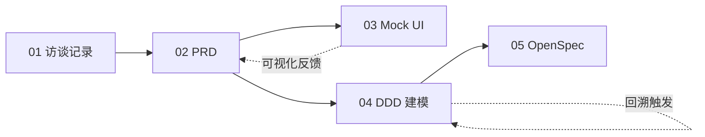

# CloudPilot 案例：从需求到部署的完整链路

> 这是 [`vibe-coding-intro-for-traditional-dev.md`](../vibe-coding-intro-for-traditional-dev.md) §2.4 章节的配套素材，演示 AI-Native DevOps 8 阶段流程在一个云管平台 MVP 上的端到端落地。

## 阅读顺序

| 阶段 | 文档                                                 | 对应 AI-Native DevOps 阶段 | 主要产出                                   |
| :--- | :--------------------------------------------------- | :------------------------- | :----------------------------------------- |
| 1    | [`01-interview-notes.md`](./01-interview-notes.md)   | P1 前置 · 业务调研         | 用户访谈记录、痛点清单、关键功能种子       |
| 2    | [`02-prd.md`](./02-prd.md)                           | P1 愿景 → PRD              | 结构化 PRD（目标、用户、功能、验收）       |
| 3    | [`cloudpilot-mockup.html`](./cloudpilot-mockup.html) | P2 PRD → UI/UX             | 可交互 Mock UI（5 视图、状态机、计费模拟） |
| 4    | [`03-ddd-modeling.md`](./03-ddd-modeling.md)         | P3 领域建模                | 9 个 `@ddd-*` Skill 流水线产出             |
| 5    | [`04-openspec/`](./04-openspec/)                     | P4 OpenSpec 规范定义       | proposal / design / tasks / 3 个 spec      |

## 链路一览



## 工件追溯

每一步产出都明确标注**来源 Skill / 责任人 / AI 草稿置信度**，下游可以直接引用上游结论而不必重新推导。OpenSpec 阶段的 spec 文件可直接驱动 P5 代码生成。

---

## 生产 Prompts（可重放）

本案例中每个工件都由「主 Agent」或「专用 Subagent + 对应 Skill」产出。下表给出生产者，下方给出可直接重放的 prompt 文本。

| 文件                     | 生产者                                                               | Skill / Subagent                                           | 输入                    |
| :----------------------- | :------------------------------------------------------------------- | :--------------------------------------------------------- | :---------------------- |
| `01-interview-notes.md`  | 主 Agent                                                             | （无 — 人工综合，AI 整理）                                 | 三方访谈原始记录        |
| `02-prd.md`              | 主 Agent                                                             | （无 — 模板填充）                                          | `01-interview-notes.md` |
| `cloudpilot-mockup.html` | 主 Agent                                                             | （无 — UI 草图 + 静态 JS 状态机）                          | `02-prd.md` §5 FR       |
| `03-ddd-modeling.md`     | [`ddd-modeler`](../.qoder/agents/ddd-modeler.md) subagent \*         | 9 个 `@ddd-*` skills（`domain-driven-design-skills`）      | `02-prd.md`             |
| `04-openspec/**`         | [`openspec-author`](../.qoder/agents/openspec-author.md) subagent \* | `openspec-assistant`（架构师角色）+ `@ddd-openspec-bridge` | `03-ddd-modeling.md`    |

> \* `.qoder/agents/` 目录不在 git 版本控制中（见 `.gitignore`）。新克隆仓库时，这两个链接不可达；Agent 定义文本可从下方 Prompt P4 / P5 的 prompt 模板重建。

### Prompt P1 · `01-interview-notes.md`

```text
角色：业务分析师。
输入：${meeting_transcripts}（三场访谈：研发负责人 R-Lead、运维 OPS、财务 FIN）。
任务：综合访谈记录，输出 markdown，包含：
  1. frontmatter（阶段 / 上游输入 / 下游消费 / 责任人 / AI 草稿置信度）
  2. 三方访谈正文（角色 / 时长 / 关键 Q&A 摘录，保留原话特征）
  3. 痛点清单 P1~PN（频次 / 影响 / 来源）
  4. 功能种子 F1~FN（映射到痛点，标注 must-have / nice-to-have / 后续迭代）
  5. 范围声明（in-scope / non-goals）
约束：仅人工已表达的诉求入表；不要臆造功能。
输出：写入 ${output_file}（默认 ./01-interview-notes.md）。
```

### Prompt P2 · `02-prd.md`

```text
角色：产品经理。
输入：${input_file}（默认 ./01-interview-notes.md）。
任务：基于访谈输出结构化 PRD，10 节：
  1. 背景  2. 目标 / 非目标  3. 用户画像（personas）  4. 核心流程（含 Mermaid sequenceDiagram）
  5. 功能需求 FR-NN  6. 非功能需求 NFR-NN  7. 数据模型骨架  8. 验收标准 AC
  9. 上线计划（MVP / 后续迭代切片）  10. 待澄清问题
约束：FR/NFR 全部可测；状态机必须显式列出（PENDING → APPROVED → PROVISIONED → RELEASED + REJECTED）。
输出：写入 ${output_file}（默认 ./02-prd.md）。
```

### Prompt P3 · `cloudpilot-mockup.html`

```text
角色：前端原型设计师。
输入：${input_file}（默认 ./02-prd.md）§5 FR + §4 状态机。
任务：单文件 HTML（含内联 CSS + JS），覆盖 5 视图：
  - 资源申请单提交 / 我的申请 / 团队审批 / 项目成本 / Mock 设置
  - localStorage 持久化；setInterval 模拟 Provisioner（5s 后从 APPROVED → PROVISIONED）
  - 实时报价（PricingTable 内嵌 JS 常量）
约束：纯静态，浏览器双击即可运行；不引入任何外部框架。
输出：写入 ${output_file}（默认 ./cloudpilot-mockup.html）。
```

### Prompt P4 · `03-ddd-modeling.md`（由 `ddd-modeler` subagent 执行）

```text
@ddd-modeler
输入 PRD：${input_file}（默认 ./02-prd.md）
输出文件：${output_file}（默认 ./03-ddd-modeling.md，覆盖写）

按以下顺序串行调用 9 个 @ddd-* skill，每个 skill 一个章节，引用其 SKILL.md：
  I 发现：  @ddd-scope, @ddd-discover
  II 战略： @ddd-subdomains, @ddd-contexts, @ddd-context-map
  III 战术：@ddd-aggregates, @ddd-domain-interactions
  IV 验证：@ddd-model-review
  V 规范： @ddd-openspec-bridge

硬约束：
  - 聚合不变量必须编号 IV-N，覆盖率在 @ddd-model-review 中显式给分
  - 若 @ddd-model-review 不变量表达率 < 80%，停止并报告需要回溯的上游 skill
  - V 阶段必须给出「DDD 工件 → OpenSpec 位置」的桥接表，作为 openspec-author 的输入
```

### Prompt P5 · `04-openspec/**`（由 `openspec-author` subagent 执行）

```text
@openspec-author
输入 DDD 模型：${input_file}（默认 ./03-ddd-modeling.md）
输出目录：${output_dir}（默认 ./04-openspec/，覆盖写）

调用 openspec-assistant skill（架构师角色），按 @ddd-openspec-bridge 的桥接规则产出：
  - proposal.md   ← 子域 + 上下文（II 战略）
  - design.md     ← 上下文映射 + 关键决策（II 战略 + III 战术）
  - tasks.md      ← 仓库 / 服务接口（III 战术）展开为实现拆解
  - specs/<context>/spec.md × 3（resource-request / resource-management / billing）
      ← 聚合不变量 IV-N + 领域事件

硬约束：
  - 每个 IV-N 不变量必须在某个 specs/*/spec.md 中至少出现一个 `#### Scenario:` 块
  - spec 必须使用 `### Requirement:` + `#### Scenario:` 结构（OpenSpec 规范）
  - 不要新增 DDD 模型未提及的概念；如有缺口，先回溯 ddd-modeler
```

### 重放方式

```bash
# 1) 重新生成 DDD 模型（覆盖 03-ddd-modeling.md）
#    在 Qoder 中：调用 ddd-modeler subagent，传入 ./02-prd.md
# 2) 重新生成 OpenSpec（覆盖 04-openspec/）
#    在 Qoder 中：调用 openspec-author subagent，传入 ./03-ddd-modeling.md
# 3) 验收：grep 每个 IV-N 是否在 specs/*/spec.md 出现至少一次
 grep -rE 'IV-[1-8]' 04-openspec/specs/
```
