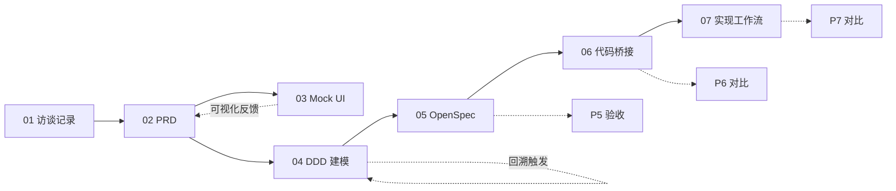

# CloudPilot 案例：从需求到部署的完整链路

> 这是 [`vibe-coding-intro-for-traditional-dev.md`](../vibe-coding-intro-for-traditional-dev.md) §2.4 章节的配套素材，演示 AI-Native DevOps 8 阶段流程在一个云管平台 MVP 上的端到端落地。

## 阅读顺序

| 阶段 | 文档                                                                     | 对应 AI-Native DevOps 阶段 | 主要产出                                                                       |
| :--- | :----------------------------------------------------------------------- | :------------------------- | :----------------------------------------------------------------------------- |
| 1    | [`01-interview-notes.md`](./01-interview-notes.md)                       | P1 前置 · 业务调研         | 用户访谈记录、痛点清单、关键功能种子                                           |
| 2    | [`02-prd.md`](./02-prd.md)                                               | P1 愿景 → PRD              | 结构化 PRD（目标、用户、功能、验收）                                           |
| 3    | [`cloudpilot-mockup.html`](./cloudpilot-mockup.html)                     | P2 PRD → UI/UX             | 可交互 Mock UI（5 视图、状态机、计费模拟）                                     |
| 4    | [`03-ddd-modeling.md`](./03-ddd-modeling.md)                             | P3 领域建模                | 9 个 `@ddd-*` Skill 流水线产出                                                 |
| 5    | [`04-openspec/`](./04-openspec/)                                         | P4 OpenSpec 规范定义       | proposal / design / tasks / 3 个 spec                                          |
| 6    | [`05-p5-code-bridge.md`](./05-p5-code-bridge.md)                         | P6: 代码桥接               | 项目结构、Spec→代码映射表、契约包设计、Mock→Real 切换                          |
| 7    | [`06-p5-implementation-workflow.md`](./06-p5-implementation-workflow.md) | P7: 实现工作流             | 5 阶段流水线（Spec 验证→测试先行→逐任务实现→评审验证→归档验收），含 `ocr` 集成 |
| 🎤   | [`cloudpilot-demo-nav.html`](./cloudpilot-demo-nav.html)                 | Demo 演示导航台            | 交互式阶段时间线 + 人机协同流程图 + 工件预览弹窗（演示者投影使用）             |
| ⚙    | [`config.yaml`](./config.yaml)                                           | AI 上下文注入配置          | schema、context、rules（proposal/specs/design/tasks/frontmatter/naming）       |

## 链路一览



## 工件追溯

每一步产出都明确标注**来源 Skill / 责任人 / AI 草稿置信度**，下游可以直接引用上游结论而不必重新推导。OpenSpec 阶段的 spec 文件可直接驱动后续代码生成（P6: 代码桥接 → P7: 实现工作流）。

---

## 生产 Prompts（可重放）

本案例中每个工件都由「主 Agent」或「专用 Subagent + 对应 Skill」产出。下表给出生产者，下方给出可直接重放的 prompt 文本。

| 文件                     | 生产者                                                               | Skill / Subagent                                                                    | 输入                    |
| :----------------------- | :------------------------------------------------------------------- | :---------------------------------------------------------------------------------- | :---------------------- |
| `01-interview-notes.md`  | 主 Agent                                                             | interview-synthesizer（待实现）                                                     | 三方访谈原始记录        |
| `02-prd.md`              | 主 Agent                                                             | prd-generator（待实现）                                                             | `01-interview-notes.md` |
| `cloudpilot-mockup.html` | 主 Agent                                                             | mockup-builder（待实现）                                                            | `02-prd.md` §5 FR       |
| `03-ddd-modeling.md`     | [`ddd-modeler`](../.qoder/agents/ddd-modeler.md) subagent \*         | 9 个 `@ddd-*` skills（已实现）                                                      | `02-prd.md`             |
| `04-openspec/**`         | [`openspec-author`](../.qoder/agents/openspec-author.md) subagent \* | `openspec-assistant` + `@ddd-openspec-bridge`（已实现）                             | `03-ddd-modeling.md`    |
| `05-p5-code-bridge.md`   | 架构师（预定义参考）                                                 | structure-deriver（待实现，参考基线）                                               | `04-openspec/`          |
| `cloudpilot/` (P7 代码)  | 主 Agent                                                             | code-generator + open-code-review（open-code-review 已实现，code-generator 待实现） | `04-openspec/specs/`    |

> \* `.qoder/agents/` 目录不在 git 版本控制中（见 `.gitignore`）。新克隆仓库时，这两个链接不可达；Agent 定义文本可从下方 Prompt P4 / P5 的 prompt 模板重建。

### Prompt P1 · `01-interview-notes.md`

```text
角色：业务分析师。
输入：${meeting_transcripts}（三场访谈：研发负责人 R-Lead、运维 OPS、财务 FIN）。
任务：综合访谈记录，输出 markdown，包含：
  1. frontmatter（阶段 / 上游输入 / 下游消费 / 责任人 / AI 草稿置信度）
  2. 三方访谈正文（角色 / 时长 / 关键 Q&A 摘录，保留原话特征）
  3. 痛点清单 P1~PN（频次 / 影响 / 来源）
  4. 功能种子 F1~FN（映射到痛点，标注 must-have / nice-to-have / 后续迭代）
  5. 范围声明（in-scope / non-goals）
约束：仅人工已表达的诉求入表；不要臆造功能。
输出：写入 ${output_file}（默认 ./01-interview-notes.md）。
```

### Prompt P2 · `02-prd.md`

```text
角色：产品经理。
输入：${input_file}（默认 ./01-interview-notes.md）。
任务：基于访谈输出结构化 PRD，10 节：
  1. 背景  2. 目标 / 非目标  3. 用户画像（personas）  4. 核心流程（含 Mermaid sequenceDiagram）
  5. 功能需求 FR-NN  6. 非功能需求 NFR-NN  7. 数据模型骨架  8. 验收标准 AC
  9. 上线计划（MVP / 后续迭代切片）  10. 待澄清问题
约束：FR/NFR 全部可测；状态机必须显式列出（PENDING → APPROVED → PROVISIONED → RELEASED + REJECTED）。
输出：写入 ${output_file}（默认 ./02-prd.md）。
```

### Prompt P3 · `cloudpilot-mockup.html`

```text
角色：前端原型设计师。
输入：${input_file}（默认 ./02-prd.md）§5 FR + §4 状态机。
任务：单文件 HTML（含内联 CSS + JS），覆盖 5 视图：
  - 资源申请单提交 / 我的申请 / 团队审批 / 项目成本 / Mock 设置
  - localStorage 持久化；setInterval 模拟 Provisioner（5s 后从 APPROVED → PROVISIONED）
  - 实时报价（PricingTable 内嵌 JS 常量）
约束：纯静态，浏览器双击即可运行；不引入任何外部框架。
输出：写入 ${output_file}（默认 ./cloudpilot-mockup.html）。
```

### Prompt P4 · `03-ddd-modeling.md`（由 `ddd-modeler` subagent 执行）

```text
@ddd-modeler
输入 PRD：${input_file}（默认 ./02-prd.md）
输出文件：${output_file}（默认 ./03-ddd-modeling.md，覆盖写）

按以下顺序串行调用 9 个 @ddd-* skill，每个 skill 一个章节，引用其 SKILL.md：
  I 发现：  @ddd-scope, @ddd-discover
  II 战略： @ddd-subdomains, @ddd-contexts, @ddd-context-map
  III 战术：@ddd-aggregates, @ddd-domain-interactions
  IV 验证：@ddd-model-review
  V 规范： @ddd-openspec-bridge

硬约束：
  - 聚合不变量必须编号 IV-N，覆盖率在 @ddd-model-review 中显式给分
  - 若 @ddd-model-review 不变量表达率 < 80%，停止并报告需要回溯的上游 skill
  - V 阶段必须给出「DDD 工件 → OpenSpec 位置」的桥接表，作为 openspec-author 的输入
```

### Prompt P5 · `04-openspec/**`（由 `openspec-author` subagent 执行）

```text
@openspec-author
输入 DDD 模型：${input_file}（默认 ./03-ddd-modeling.md）
输出目录：${output_dir}（默认 ./04-openspec/，覆盖写）

调用 openspec-assistant skill（架构师角色），按 @ddd-openspec-bridge 的桥接规则产出：
  - proposal.md   ← 子域 + 上下文（II 战略）
  - design.md     ← 上下文映射 + 关键决策（II 战略 + III 战术）
  - tasks.md      ← 仓库 / 服务接口（III 战术）展开为实现拆解
  - specs/<context>/spec.md × 3（resource-request / resource-management / billing）
      ← 聚合不变量 IV-N + 领域事件

硬约束：
  - 每个 IV-N 不变量必须在某个 specs/*/spec.md 中至少出现一个 `#### Scenario:` 块
  - spec 必须使用 `### Requirement:` + `#### Scenario:` 结构（OpenSpec 规范）
  - 不要新增 DDD 模型未提及的概念；如有缺口，先回溯 ddd-modeler
```

### 重放方式

**一键 Demo**：在 claude-code 中输入 `/cloudpilot-demo`，按提示逐步执行即可（需要先配置 DDD Skill 软链接，见 CLAUDE.md）。

**手动重放**：

```bash
# 1) 重新生成 DDD 模型（覆盖 03-ddd-modeling.md）
#    在 Qoder 中：调用 ddd-modeler subagent，传入 ./02-prd.md
# 2) 重新生成 OpenSpec（覆盖 04-openspec/）
#    在 Qoder 中：调用 openspec-author subagent，传入 ./03-ddd-modeling.md
# 3) 验收：grep 每个 IV-N 是否在 specs/*/spec.md 出现至少一次
 grep -rE 'IV-[1-8]' 04-openspec/specs/
```

---

## Skill 清单

以下为 `/cloudpilot-demo` 全链路涉及的 Skill，标注实现状态和功能说明。

### 已实现

| Skill                      | 类型              | 功能                                                                    |
| :------------------------- | :---------------- | :---------------------------------------------------------------------- |
| `@ddd-scope`               | Claude Code Skill | 从 PRD 提炼问题陈述、目标/非目标、约束、术语种子、风险清单              |
| `@ddd-discover`            | Claude Code Skill | 梳理领域事件流，标注跨角色热点和歧义                                    |
| `@ddd-subdomains`          | Claude Code Skill | 将业务拆分为 Core / Supporting / Generic 子域                           |
| `@ddd-contexts`            | Claude Code Skill | 定义限界上下文、核心职责和主要聚合                                      |
| `@ddd-context-map`         | Claude Code Skill | 绘制上下文映射图，标注集成模式（ACL / OHS / U-D）                       |
| `@ddd-aggregates`          | Claude Code Skill | 设计聚合根、IV-N 不变量、状态机、事务边界                               |
| `@ddd-domain-interactions` | Claude Code Skill | 定义领域事件目录、仓库接口、领域服务接口                                |
| `@ddd-model-review`        | Claude Code Skill | 4 维度质量评分（一致性/完整性/耦合），<80% 自动回溯                     |
| `@ddd-openspec-bridge`     | Claude Code Skill | 生成 DDD 工件 → OpenSpec 文件槽的桥接映射表                             |
| `openspec-assistant`       | Claude Code Skill | `/opsx:*` 命令体系，支持 propose / apply / verify / archive             |
| `open-code-review`         | Claude Code Skill | AI 代码评审（`ocr` CLI），读取 git diff + spec 文本，检查代码与需求匹配 |
| `ddd-modeler`              | Subagent          | 串行驱动 9 个 `@ddd-*` Skill，质量门禁 <80% 回溯                        |
| `openspec-author`          | Subagent          | 将 DDD 模型转为完整的 OpenSpec 变更集（proposal/design/tasks/specs）    |

### 待实现

| Skill        | 拟用名                  | 功能                                                                         |
| :----------- | :---------------------- | :--------------------------------------------------------------------------- |
| 访谈综合     | `interview-synthesizer` | 综合多方访谈记录，提取主题和痛点，按结构化模板输出                           |
| PRD 生成     | `prd-generator`         | 基于访谈记录，按 10 节模板输出结构化 PRD（FR/NFR/AC/状态机）                 |
| Mock UI 构建 | `mockup-builder`        | 读取 PRD 的 FR 和状态机，生成单文件可交互 HTML 原型                          |
| 覆盖率校验   | `coverage-checker`      | 形式校验（grep IV-N）+ 语义对比（FR/NFR/Scenario 数量对齐）                  |
| 代码结构推导 | `structure-deriver`     | 读取 DDD+Spec，推导 monorepo 结构、Spec→代码映射、契约包设计                 |
| 代码生成     | `code-generator`        | 按 Stage A→E 流水线逐层实现（contracts→domain→repo→services），每层跑测试    |
| Spec 验证    | `spec-validator`        | 形式验证（openspec validate）+ 语义验证（LLM 逐项检查 Scenario/IV-N/状态机） |
| 测试生成     | `test-generator`        | 从 Spec 的 Scenario 提取测试用例，生成 Node.js assert 测试文件               |
| 归档管理     | `archiver`              | 条件检查 + openspec archive + OCR 终审 JSON 保存                             |

---

## 后续阶段

CloudPilot 案例已覆盖从需求访谈到可运行代码的完整链路（P1-pre → P7: 实现）。

**AI 上下文注入**：[`config.yaml`](./config.yaml) 定义了 AI 在 CloudPilot 项目中的行为规范——schema、context、proposal/specs/design/tasks 规则、frontmatter 格式、命名约定。将本文件注入 AI 的 system prompt 即可让 AI 按 CloudPilot 方法论工作。

**P6: 代码桥接**：[`05-p5-code-bridge.md`](./05-p5-code-bridge.md) 是参考架构文档，定义 Spec → 代码的映射规则、monorepo 项目结构、契约包设计、Mock→Real 切换点。在 `/cloudpilot-demo` 中，AI 基于 DDD 模型实时推导代码结构，`对比P6` 命令将推导结果与该参考架构对比。

**P7: 实现工作流**：[`06-p5-implementation-workflow.md`](./06-p5-implementation-workflow.md) 定义从 OpenSpec 到可运行代码的 5 阶段流水线（Spec 验证→测试先行→逐任务实现→评审验证→归档验收），含 OCR 代码评审集成。`/cloudpilot-demo` 按此流水线生成可运行 TypeScript 代码，`对比P7` 命令将生成代码与该目录下的参考文档进行结构一致性校验。

**外部参考**：

> **[ForceInjection/OpenSpec-practise](https://github.com/ForceInjection/OpenSpec-practise)** — 电商领域，同一套 `proposal/design/tasks/specs` 结构驱动 Node.js 和 Python 两种实现。包含完整测试覆盖、archive 工作流、`config.yaml` AI 上下文注入。

## 双重角色：评估基准

`cloudpilot-case/` 下的文档同时扮演两个角色：

| 角色                      | 说明                                                                                              | 对应文件                                                                                                                                |
| :------------------------ | :------------------------------------------------------------------------------------------------ | :-------------------------------------------------------------------------------------------------------------------------------------- |
| **输入源** ($SRC)         | 为 `/cloudpilot-demo` 提供 P1-pre 的起始材料                                                      | `01-interview-notes.md`                                                                                                                 |
| **评估基准** (Golden Set) | 其余文档是"方法论正确执行后的参考产出物"，用于与 skill 生成的同阶段产物进行结构对比，评估生成质量 | `02-prd.md`、`cloudpilot-mockup.html`、`03-ddd-modeling.md`、`04-openspec/`、`05-p5-code-bridge.md`、`06-p5-implementation-workflow.md` |

`/cloudpilot-demo` 中的对比命令利用这个双重角色：

| 命令     | 对比内容                                                              | 评估维度                                 |
| :------- | :-------------------------------------------------------------------- | :--------------------------------------- |
| `对比`   | `$OUT` 与 `cloudpilot-case/` 的 P1-P4 产出                            | FR 数量、IV-N 覆盖率、Scenario 数量      |
| `对比P6` | `$OUT/05-code-structure.md` 与 `cloudpilot-case/05-p5-code-bridge.md` | 服务划分、IV-N 映射数、契约包结构        |
| `对比P7` | `$OUT/cloudpilot/` 与参考结构                                         | services/ 目录数、测试文件数、测试通过率 |

> **对比原则**：AI Native DevOps 不要求逐字相同，要求的是**方法论一致性**——同一套 Prompt 和流程应产出结构对齐、IV-N 覆盖完整、测试通过的结果。差异本身不是失败，但差异需要可解释。
