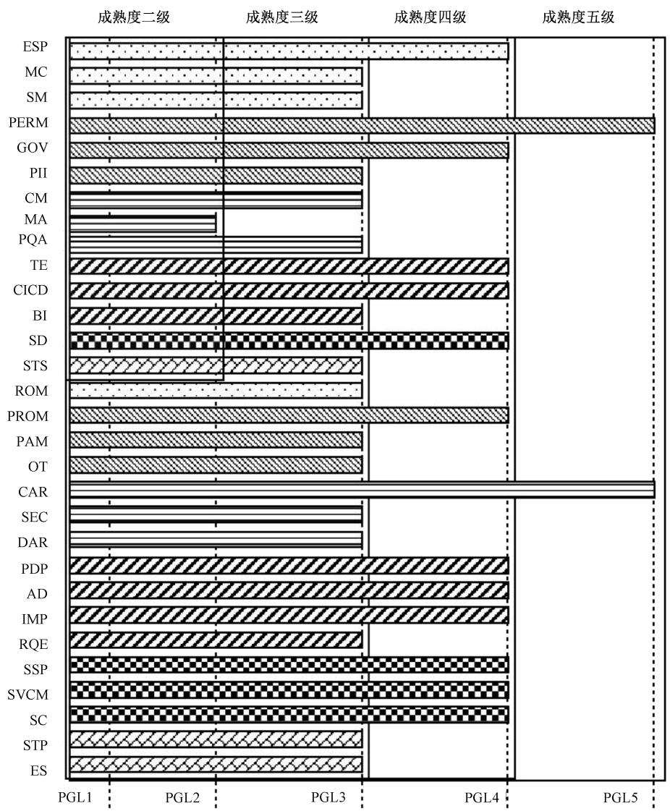
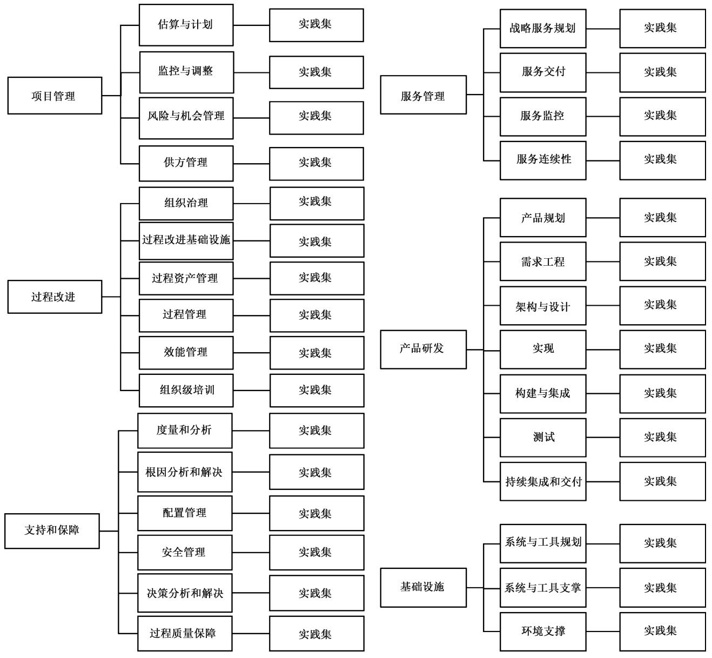

# 系统与软件工程 开发运维一体化 能力成熟度模型

# System and software engineering—Development and operations—Capability maturity model

2023-05-23 发布

2023-12-01 实施

# 目次

# 前言 …… Ⅲ

# 引言 IV

1 范围 1  
2 规范性引用文件 …… 1  
3 术语、定义和缩略语…… 1

3.1 术语和定义 …… 1   
3.2 缩略语 3

4 概述 4

4.1 开发运维一体化 4  
4.2 能力成熟度模型 5

5 项目管理…… 11

5.1 估算与计划(ESP)…… 11  
5.2 监控与调整(MC) 19  
5.3 风险与机会管理(ROM) 22  
5.4 供方管理(SM) 25

6 过程改进…… 27

6.1 组织治理（GOV） 27  
6.2 过程改进基础设施(PII) 32  
6.3 过程资产管理(PAM) 34  
6.4 过程管理(PROM) 37  
6.5 效能管理(PERM) 42  
6.6 组织级培训(OT) 46

7 支持和保障…… 48

7.1 度量和分析(MA) 48  
7.2 根因分析和解决(CAR) 51  
7.3 配置管理(CM) 55  
7.4 安全管理(SEC) 58  
7.5 决策分析和解决(DAR)……62  
7.6 过程质量保障(PQA) 65

8 产品研发……67

8.1 产品规划(PDP) 67   
8.2 需求工程(RQE) 71  
8.3 架构与设计(AD) 74

# GB/T 42560—2023

8.4 实现(IMP) 77  
8.5 构建与集成(BI) 79  
8.6 测试(TE) 81   
8.7 持续集成和持续交付(CICD) 84

# 9 服务管理……87

9.1 战略服务规划(SSP) 87  
9.2 服务交付(SD) 91  
9.3 服务监控(SVCM) 95  
9.4 服务连续性保障(SC) 99

# 10 基础设施…… 106

10.1 系统与工具规划(STP) 106  
10.2 系统与工具支撑(STS) 109  
10.3 环境支撑(ES) 112

# 附录 A(资料性) 能力域中英名称对照表 115

# 参考文献…… 117

# 前言

本文件按照 GB/T 1.1—2020《标准化工作导则 第1部分:标准化文件的结构和起草规则》的规定起草。

请注意本文件的某些内容可能涉及专利。本文件的发布机构不承担识别专利的责任。

本文件由全国信息技术标准化技术委员会(SAC/TC 28)提出并归口。

本文件起草单位:北斗天地股份有限公司、中国电子技术标准化研究院、南京大学、华为技术有限公司、网易(杭州)网络有限公司、中兴通讯股份有限公司、工银科技有限公司、中国航天系统科学与工程研究院、中国商用飞机有限责任公司北京民用飞机技术研究中心、腾讯科技(深圳)有限公司、杭州朗和科技有限公司、南京中兴软件有限责任公司、广东益安人防工程科技有限公司、航天中认软件测评科技(北京)有限责任公司、爱捷软件开发(深圳)有限公司、震兑工业智能科技有限公司、北京高质系统科技有限公司、北京软件和信息服务交易所有限公司、山东正中信息技术股份有限公司、上海计算机软件技术开发中心、云南电网有限责任公司信息中心、神州数码系统集成服务有限公司、普元信息技术股份有限公司、中国电子科技集团公司第五十四研究所、成都信息工程大学、中国人民解放军军事科学院国防科技创新研究院、北方民族大学、北京邮电大学、云南南天电子信息产业股份有限公司、联通数字科技有限公司、内蒙古东润能源科技有限公司、成都新希望金融信息有限公司、深圳市海德森科技股份有限公司、江苏汤谷智能科技有限公司。

本文件主要起草人: 张旸旸、荣国平、冯建、张文渊、徐毅、陈谔、胡继东、钱湘隆、郭栋、袁玉宇、朱少凡、王芹、殷柱伟、翁扬慧、王公韬、赵国亮、吴穹、姚炳雄、严亮、庄园、张建成、沈颖、李玲璠、赵一博、王晓朋、钱淑丽、舒红平、史殿习、韩强、刘亚、张贺、李强、冯常健、周天才、温建波、董冠涛、汪澔、陈晓敏、张晔、周长怀、周启平、雷晓宝、代东洋、张玉良、许志国、蔡立志、马文、沈伟、王茹、薛超、丁静、李杉杉、匡宏宇、陈杰、张小燕、苏春山、于长钺、熊辉、宋雨伦、刘全东、赵永亮、张华山、刘丹。

# 引言

开发运维一体化对软件的价值赋以全新的概念,即以软件系统功能在生产环境中的部署并为用户持续提供服务作为价值判断依据。在这一基本价值观的牵引下,需要组织打通不同部门之间的壁垒;建立项目或者团队的共同愿景;快速、持续地完成软件系统功能的策划、开发、交付以及运维,实现价值的持续流动。

开发运维一体化作为软件开发和运维的一种新范式，已经越来越多地被当前主流组织采用，对软件产业的发展有着极其重要的作用。为指导开发运维一体化在各行业更好地应用和落地，促进组织高效转型，推动产业持续发展，本文件提出了开发运维一体化的能力成熟度模型，汇集最佳实践，刻画组织开发运维一体化从不成熟走向成熟的路线图。模型由能力域、能力以及实践集三层结构构成，包含项目管理、过程改进、支持和保障、产品研发、服务管理以及基础设施等六个能力域，共计30个能力，对软件开发运维一体化所涉及的相关角色、活动和具体实践进行了系统梳理和规定，能够有效指导各方围绕软件开发运维一体化展开活动。

# 系统与软件工程 开发运维一体化

# 能力成熟度模型

# 1 范围

本文件规定了开发运维一体化能力成熟度的模型和内容,建立了能力成熟度框架,主要包括能力域分类和成熟度等级定义;围绕项目管理、过程改进、支持和保障、产品研发、服务管理和基础设施6大能力域,详细定义了归属于各个能力域的能力以及支撑不同能力的各个实践活动的具体要求。

本文件适用于：

——组织寻求供应商，以获取软件系统和服务的开发和运维，并要求确保软件开发质量、效率及后期运维的质量；  
——希望展现其软件开发、交付以及后期运维管理能力和成熟度的组织；  
——通过本文件的有效实施与运行来持续改进软件开发、交付以及后期运维管理绩效的组织；  
——依据本文件的要求实施评估的第二方和第三方。

# 2 规范性引用文件

本文件没有规范性引用文件。

# 3 术语、定义和缩略语

# 3.1 术语和定义

下列术语和定义适用于本文件。

# 3.1.1

制品 artifact

由某一种软件开发和运维过程所使用的或产生的一种信息的物理件。

注：制品的实例有模型、源文件、文字和二进制可执行文件等。制品构成可部署构件的实现。

[来源:GB/T 11457—2006,2.76,有修改]

# 3.1.2

胜任力 competency

能将某一工作中有卓越成就者与普通者区分开来的个体的深层次特征。

注：可以是动机、特质、自我形象、态度或价值观、某领域知识、认知或行为技能等任何能被可靠测量或计数的并且能显著区分优秀与一般绩效的个体特征。

# 3.1.3

配置基线 configuration baseline

在解决方案或解决方案组件的生存周期的特定时间正式制定的配置信息。

注：配置基线加上来自这些基线的已批准变更构成当前的配置信息。

# 3.1.4

# 配置项 configuration item

专为配置管理而设计的工作产品，在配置管理过程中被视为一个单独的实体，是配置管理活动管控的最小元素。

# 3.1.5

# 开发运维一体化 development and operations

软件系统开发和运维的一种新的范式和方法学。

注：开发运维一体化旨在打破软件系统开发和运维之间的壁垒，建立项目和团队的共同愿景，从而快速地、持续地完成软件系统功能的开发、交付以及运维。

# 3.1.6

# 熔断 fusing

当服务出现请求响应过慢或者其他错误时,通过切断导致服务异常的请求链路从而快速恢复服务的活动。

# 3.1.7

# 迭代 iteration

依照实施、反馈和改进再实施进行循环往复的过程和实践。

注：其目的通常是为了持续稳定地逼近所需的目标或结果，降低误判风险。不仅用于开发活动，还可用于项目的策划、执行、验证和确认及回顾等活动中。

# 3.1.8

# 成熟度等级 maturity level

用以刻画组织过程在满足组织级业务目标的能力。

注：能力成熟度共分为五个级别，分别为初始级、已管理级、已定义级、定量管理级和持续优化级。具体参见4.2.4。

# 3.1.9

# 机会 opportunity

不确定性对目标达成的正面影响。

# 3.1.10

# 组织过程资产 organizational process asset

用以支持组织过程的部署、应用、管理以及改进的制品和数据等。

注：典型地，组织过程资产包括过程架构、模板、标准、数据、风险和机会库等。

# 3.1.11

# 组织过程资产架构 organizational process asset architecture

过程类型和过程资产类型之间的结构性关系或框架。

注：通过对过程的类型进行定义，同时对过程资产类型进行定义，按照合理的模式或框架建立二者的关联关系，即形成了过程资产架构。

# 3.1.12

# 效能 performance

开发运维一体化过程和实践中持续地、高质量地交付用户价值的能力。

# 3.1.13

# 流水线 pipeline

将软件开发和运维过程按照合理的内在逻辑和关系拆分为若干专注于特定任务和目标的子活动。

注：软件开发运维一体化中的流水线通过选择并组合子活动以实现特定的业务目标，其自动化和持续流动是实现开发运维一体化的关键。

# 3.1.14

# 实践组等级 practice group level

用以刻画某个特定能力在满足该能力意图(参见每一个能力的能力说明)的程度和等级。

注：一般实践组等级由一组实践来支撑，不同能力的实践组等级数量不等，最少两个级别，最多五个级别。

# 3.1.15

# 质量门禁 quality gate

在定义的工作流中用于进行自动化看护的质量指标卡点。

注 1: 通过设置门禁关卡检查的方式保障质量,通常用于自动化的流水线中,通过工具或者人工方式检查所选定的质量指标实际值是否满足所设定的门禁条件。

注 2：如代码检查的问题数量、测试执行的通过率等，如果检查结果为不达标，则该门禁产生作用，可阻止流水线的继续执行。

# 3.1.16

# 服务 service

基于软件系统的活动、工作和职责的履行。

注 1：服务是自包含的、固有的、离散的，可包含其他服务，一般是无形的产品。

注 2：某些情况下，服务也可以是软件对外提供功能的一种形式，例如微服务架构。

# 3.1.17

# 服务协定 service agreement

服务相关各方在履行服务的过程中需遵循的契约。

# 3.1.18

# 服务治理 service governance

为确保服务能够可靠、安全、稳定地运行的相关管控活动、绩效和风险管理的集合。

# 3.1.19

# 服务等级协定 service level agreement

在一定开销下为保障服务的性能和可用性,服务提供商与用户间定义的一种双方认可的协定。

# 3.1.20

# 利益相关方 stakeholder

在系统或所属其特性中有权利、份额、声明或利益，以满足其需要及期望的个体或组织。

示例：最终用户、最终用户组织、支持方、开发方、培训方、维护方、部署方、需方、供方组织和监管机构。

注：某些利益相关方可具有相互对立或系统对立的利益。

# 3.1.21

# 供方 supplier

与需方达成关于产品或服务供应协定的组织或个体。

注：一般用于供方的其他术语有承包人、生产者、卖家、供应商。需方和供方有时可以是同一个组织的不同部分。

# 3.1.22

# 任务 task

要求的、推荐的或可允许的活动。

注：其目的是为了支持一个或多个过程输出的达成。

# 3.2 缩略语

下列缩略语适用于本文件。

AD: 架构与设计 (Architecting and Designing)

BI: 构建与集成 (Building and Integration)

CAR: 根因分析和解决(Causal Analysis and Resolution)

CICD: 持续集成和交付(Continuous Integration & Continuous Delivery)

CM: 配置管理 (Configuration Management)

DAR: 决策分析和解决 (Decision Analysis and Resolution)

DevOps: 开发运维一体化 (Development and Operations)

ES: 环境支撑 (Environment Supporting)

ESP:估算与计划(EStimating and Planning)

GOV: 组织治理(GOVERNance)

IMP: 实现(IMPLEMENTation)

MA:度量和分析(Measurement and Analysis)

MC: 监控与调整 (Monitoring and Control)

OT: 组织级培训 (Organizational Training)

PAM: 过程资产管理 (Process Asset Management)

PDP: 产品规划(ProDuct Planning)

PERM: 效能管理(PERformance Management)

PGL:实践组等级(Practice Group Level)

PII: 过程改进基础设施 (Process Improvement Infrastructure)

PQA: 过程质量保障 (Process Quality Assurance)

PROM: 过程管理(PROcess Management)

ROM: 风险与机会管理(Risk and Opportunity Management)

RQE:需求工程(ReRequirement Engineering)

SC: 服务连续性(Service Continuity)

SD: 服务交付(Service Delivery)

SEC: 安全管理 (SECurity management)

SLA: 服务等级协议 (Service Level Agreement)

SM:供方管理(Supplier Management)

SSP: 战略服务规划(Strategic Service Planning)

STP: 系统与工具规划 (Systems and Tools Planning)

STS: 系统与工具支撑 (Systems and Tools Supporting)

SVCM: 服务监控(SerViCe Monitoring)

TE: 测试 (TEsting)

# 4 概述

# 4.1 开发运维一体化

开发运维一体化(DevOps)以软件系统功能在生产环境中的部署并为用户持续提供服务作为价值实现的判断依据。在这一基本价值观的牵引下，需要组织打通不同部门之间的协作壁垒；建立项目或者团队的共同愿景；快速、持续地完成软件系统功能的开发、交付以及运维，从而实现价值的持续流动。一些基本约定如下。

——开发运维一体化概念涵盖的组织范围不局限于开发(或类似)和运维(或类似)两个部门,在共

同愿景的引领下，其对应的组织范围可能(但不限于)扩展到安全、合规、人力资源等相关部门。

——开发运维一体化鼓励价值流的可视化，允许对“价值流”的概念按实际需要和上下文泛化，以鼓励多种形式、层次以及对象的可视化。

——开发运维一体化鼓励通过搭建工具链来支持高等级自动化。

——为促进价值顺畅流动，在开发运维一体化的模式之下，应重视软件开发质量。

# 4.2 能力成熟度模型

# 4.2.1 模型概述

本文件通过六项能力域、30项能力以及五级能力成熟度来描述开发运维一体化成熟度模型，见图1：

——六项能力域，包括项目管理、过程改进、支持和保障、产品研发、服务管理以及基础设施；

——30 项能力见表 1 列表及附录 A;

——五级能力成熟度,详情见表2。

图 1 也展示了 DevOps 中各能力与成熟度等级的关系, 各成熟度等级包含的能力及对应实践不同, 如成熟度二级要求 ESP、MC、SM、PERM 等 13 项能力应达到实践组等级二级, 具体能力的分级及实践示例在第 5 章～第 10 章有相应的描述。

bar_stacked

|        | PGL1 | PGL2 | PGL3 | PGL4 | PGL5 |
| ------ | ---- | ---- | ---- | ---- | ---- |
| ESP    |      |      |      |      |      |
| MC     |      |      |      |      |      |
| SM     |      |      |      |      |      |
| PERM   |      |      |      |      |      |
| GOV    |      |      |      |      |      |
| PII    |      |      |      |      |      |
| CM     |      |      |      |      |      |
| MA     |      |      |      |      |      |
| PQA    |      |      |      |      |      |
| TE     |      |      |      |      |      |
| CICD   |      |      |      |      |      |
| BI     |      |      |      |      |      |
| SD     |      |      |      |      |      |
| STS    |      |      |      |      |      |
| ROM    |      |      |      |      |      |
| PROM   |      |      |      |      |      |
| PAM    |      |      |      |      |      |
| OT     |      |      |      |      |      |
| CAR    |      |      |      |      |      |
| SEC    |      |      |      |      |      |
| DAR    |      |      |      |      |      |
| PDP    |      |      |      |      |      |
| AD     |      |      |      |      |      |
| IMP    |      |      |      |      |      |
| RQE    |      |      |      |      |      |
| SSP    |      |      |      |      |      |
| SVCM   |      |      |      |      |      |
| SC     |      |      |      |      |      |
| STP    |      |      |      |      |      |
| ES     |      |      |      |      |      |
The chart displays the '成熟度' (Success) for each level of the '成熟度' (Success Level). The values for each level are estimated based on the '成熟度' (Success Level) and the 'PGL' (Success Level) labels. There is no additional data series in this code. The values for each level of the '成熟度' (Success Level) are estimated based on the 'PGL' label. There is only one data point for '成熟度' (Success Level) in the middle range. The values for all levels in the middle range are estimated based on the 'PGL' label. There is no additional data points for '成熟度' (Success Level) in the middle range. The values for all levels in the middle range are estimated based on the 'PGL' label. There is no additional data points for '成熟度' (Success Level) in the middle range. There is no additional data points for 'PGL' label. There is no additional data points for '成熟度' (Success Level) in the middle range. There is no additional data points for 'PGL' label. There is no additional data points for '成熟度' (Success Level) in the middle range. There is no additional data points for 'PGL' label. There is no additional data points for '成熟度' (Success Level) in the middle range. There is no additional data points for other categories. There is no additional data points for other categories in the middle range.

图例：  
项目管理  
过程改进   
支持和保障  
产品研发   
服务管理  
基础设施

图 1 开发运维一体化能力成熟度模型  

表 1 能力域与能力列表

<table><tr><td>能力域</td><td>能力</td></tr><tr><td rowspan="4">项目管理</td><td>估算与计划</td></tr><tr><td>监控与调整</td></tr><tr><td>风险与机会管理</td></tr><tr><td>供方管理</td></tr><tr><td rowspan="6">过程改进</td><td>组织治理</td></tr><tr><td>过程改进基础设施</td></tr><tr><td>过程资产管理</td></tr><tr><td>过程管理</td></tr><tr><td>效能管理</td></tr><tr><td>组织级培训</td></tr><tr><td rowspan="6">支持和保障</td><td>度量和分析</td></tr><tr><td>根因分析和解决</td></tr><tr><td>配置管理</td></tr><tr><td>安全管理</td></tr><tr><td>决策分析和解决</td></tr><tr><td>过程质量保障</td></tr><tr><td rowspan="7">产品研发</td><td>产品规划</td></tr><tr><td>需求工程</td></tr><tr><td>架构与设计</td></tr><tr><td>实现</td></tr><tr><td>构建与集成</td></tr><tr><td>测试</td></tr><tr><td>持续集成和交付</td></tr><tr><td rowspan="4">服务管理</td><td>战略服务规划</td></tr><tr><td>服务交付</td></tr><tr><td>服务监控</td></tr><tr><td>服务连续性</td></tr><tr><td rowspan="3">基础设施</td><td>系统与工具规划</td></tr><tr><td>系统与工具支撑</td></tr><tr><td>环境支撑</td></tr></table>

表 2 能力实践组等级演进表

<table><tr><td>PGL</td><td>特征</td><td>基本要求</td></tr><tr><td>五级</td><td>持续优化级(Optimizing)</td><td>● 在四级基础之上(即包含所有四级实践)● 应用统计方法或其他量化技术来识别影响过程输出结果的一般原因,优化、提升过程性能以更好地支持组织业务目标的达成</td></tr><tr><td>四级</td><td>定量管理级(Quantitively Managed)</td><td>● 在三级基础之上(即包含所有三级实践)● 应用统计方法或其他量化技术识别并消除引发过程性能波动的特殊原因,提升过程稳定性和对过程输出结果的预测能力</td></tr><tr><td>三级</td><td>已定义级(Defined)</td><td>● 在二级基础之上(即包含所有二级实践)● 有横跨多个项目或部门的标准流程定义和相应的裁剪规范● 项目或团队持续使用和贡献组织过程资产</td></tr><tr><td>二级</td><td>已管理级(Managed)</td><td>● 有满足能力全部意图和价值的实践集,支持能力相关过程定义所需● 定义的过程具有明显的可重复特征● 识别项目或团队的各类目标,管控针对目标的进度以及偏差</td></tr><tr><td>一级</td><td>初始级(Initial)</td><td>● 有满足能力意图和价值的初步方法● 尚没有完整的、系统的实践集以充分支持能力所包含的意图和价值</td></tr></table>

# 4.2.2 能力域、能力和实践

DevOps 能力成熟度模型可拆分为能力域、能力以及实践集三层结构见图 2。整个模型包含六个能力域，分别为项目管理、过程改进、支持和保障、服务管理、产品研发以及基础设施。能力域由若干有一定关联的能力所组成，作为一个抽象整体，体现了组织进行过程改进的基本单元。

```mermaid
graph TD
    A["项目管理"] --> B["估算与计划"]
    A --> C["监控与调整"]
    A --> D["风险与机会管理"]
    A --> E["供方管理"]
    B --> F["实践集"]
    C --> G["实践集"]
    D --> H["实践集"]
    E --> I["实践集"]
    
    J["过程改进"] --> K["组织治理"]
    J --> L["过程改进基础设施"]
    J --> M["过程资产管理"]
    J --> N["过程管理"]
    J --> O["效能管理"]
    J --> P["组织级培训"]
    K --> Q["实践集"]
    L --> R["实践集"]
    M --> S["实践集"]
    
    T["支持和保障"] --> U["度量和分析"]
    T --> V["根因分析和解决"]
    T --> W["配置管理"]
    T --> X["安全管理"]
    T --> Y["决策分析和解决"]
    T --> Z["过程质量保障"]
    
    AA["服务管理"] --> AB["战略服务规划"]
    AA --> AC["服务交付"]
    AA --> AD["服务监控"]
    AA --> AE["服务连续性"]
    AB --> AF["实践集"]
    AC --> AG["实践集"]
    AD --> AH["实践集"]
    AE --> AI["实践集"]
    
    AJ["产品研发"] --> AK["产品规划"]
    AJ --> AL["需求工程"]
    AJ --> AM["架构与设计"]
    AJ --> AN["实现"]
    AJ --> AO["构建与集成"]
    AJ --> AP["测试"]
    AJ --> AQ["持续集成和交付"]
    AJ --> AR["实践集"]
    AJ --> AS["实践集"]
    
    AT["基础设施"] --> AU["系统与工具规划"]
    AT --> AV["系统与工具支撑"]
    AT --> AW["环境支撑"]
    
    B & C & D & E & F & G & H & I & J & K & L & M & N & O & P & Q & R & S & T & U & V & W & X & Y & Z & AA & AB & AC & AD & AE & AF & AG & AH & AI & AJ & AK & AL & AM & AN & AO & AP & AR & AS & AT & AU & AV & AW & AX & AY & AZ & BA & BB & BC & CA & D & AE & AF & AG & AH & AI & AJ & AK & BA & BB & BC & CA & AT & AU & AV & AW & AX & AY & AZ
```

flowchart

图 2 能力域、能力、实践集结构图

能力是由一组有关联关系的若干实践组成,作为一个抽象整体(即实践集),实现一个或者多个事先定义的意图或目标。表 1 列出所有的能力域以及相应的能力。

实践也称最佳实践,是模型的最基本组成单位,描述了开发运维一体化特定环节中具备广泛认同的实践,包括方法、工序以及工具等。这些最佳实践对其他应用开发运维一体化模式的团队和个体具有明显的借鉴和参考意义。若干有关联关系的最佳实践组成的集合是支撑能力意图和价值达成的基本单位。

# 4.2.3 模型视图

模型视图由能力域组合而成。通过构建不同的视图，模型可以支持不同的应用场景和应用领域。本文件定义的模型提供两类视图，即推荐方式和定制方式。本文件目前仅支持一种视图，即表1中除了供方管理能力之外，其他能力均应包含在内。

a）推荐方式：本方式由按照内在逻辑关系事先定义的若干能力域组合而成。推荐方式的视图由标准成员单位制定，并通过技术委员会审核通过。推荐方式的视图支持组织基于本模型，进行成熟度的评估和认证。

b) 定制方式: 本方式支持组织根据各自需求来自定义能力域组合。定制方式不支持认证。

# 4.2.4 等级演进

等级演进仅仅针对某一个特定的能力,表 2 描述了该能力从初级阶段向高级阶段演进的路径。系统性和完整性是开发运维一体化的内在要求。因此,本模型不对单个能力进行成熟度等级或者能力等级的定义,而将一组实践集合视作某个能力的演进等级各个阶段的特征。由此,本模型中定义的实践组等级(PGL)共分为五级,见表 2。

# 4.2.5 能力成熟度评估

# 4.2.5.1 评估规则

应采取如 4.2.3 描述的推荐方式视图作为参考模型,对被评估对象(企业或组织)的 DevOps 成熟度等级进行评估。该视图所有的能力按照上述实践组等级以及相应的规则进行评估,其结果可作为能力成熟度等级的评估依据。具体规则见表 3。需要注意,能力的实践组等级上限不随评估等级而变化,例如,在进行五级成熟度评估的时候,度量和分析(MA)能力实践组等级仍然仅需满足实践组等级二级即可。

表 3 模型成熟度等级演化表暨能力成熟度评估要求

<table><tr><td>成熟度等级</td><td>特征</td><td>基本要求</td></tr><tr><td>五级</td><td>持续优化级(Optimizing)</td><td>● 所有能力(供方管理除外)均满足实践组等级(PGL)五级或已经达到最高的实践组(PGL)等级</td></tr><tr><td>四级</td><td>定量管理级(Quantitively Managed)</td><td>● 所有能力(供方管理除外)均满足实践组等级(PGL)四级或已经达到最高的实践组(PGL)等级</td></tr><tr><td>三级</td><td>已定义级(Defined)</td><td>● 所有能力(供方管理除外)均满足实践组等级(PGL)三级或已经达到最高的实践组(PGL)等级</td></tr><tr><td>二级</td><td>已管理级(Managed)</td><td>● ESP、MC、SM、PERM、GOV、PII、CM、MA、TE、CICD、BI、SD、PQA和STS应满足实践组等级(PGL)二级</td></tr><tr><td>一级</td><td>初始级(Initial)</td><td>● 无</td></tr></table>

# 4.2.5.2 评估基本要求

为了获取足够、可信的证据，以评估组织的 DevOps 能力和成熟度，应采取系统方法来规划评估过程、收集并汇总证据。基本要求如下：

a）评估过程和结果可复现，且复现结果一致；  
b) 证据来源应覆盖模型视图和评估等级目标范围所有能力和实践(除了供方管理);  
c) 评估结果仅在特定时间范围(拟三年)内有效,从评估完成日期开始计算。

# 5 项目管理

# 5.1 估算与计划(ESP)

# 5.1.1 能力说明

对项目开展必要的估算,以支持项目各项计划的制定,进而定义项目相关活动。

估算是承诺和计划的基础。计划可以平衡和优化成本、功能及质量等因素，增加实现目标的可能性，并为项目跟踪与监控提供依据。

# 5.1.2 能力解释

估算与计划能力是一切 DevOps 实践的基础,指导和调整各 DevOps 实践的开展。实践可包括目标、范围、价值、产出等的识别和规划;各类资源的协调和匹配等。DevOps 支持迭代,因此估算和计划各个实践应遵循简洁、快速反馈等原则,适时适量,不宜过重。

# 5.1.3 等级 1——ESP 1.1

基于团队共识,对项目进行估算,依据估算结果来制定项目计划并获得利益相关方的认同。

估算可以帮助团队充分理解工作范围、规模、成本等属性及其相互关系，通过计划定义项目活动，协调相关资源，指导相关实践。

DevOps 场景下鼓励短周期迭代,估算与计划需要与之匹配。

简单估算通常是：

——一个粗略的、自上而下的估算；  
——基于已识别或记录的假设和不确定性；  
——编制快速；  
——基于以往的知识和经验。

ESP1.1 的实践典型活动如下:

——与团队成员共同审查需求和假设并确定估算结果；  
——建立和维护项目任务列表，并分配人员，项目任务列表应包含优先级、任务粒度、任务难度、复杂程度等因素；  
——与受影响的利益相关方一起评审项目任务列表，并达成共识，例如通过会议、邮件或其他在线协同软件来完成评审；  
——记录任务分配情况,将达成共识的任务分配结果通过合适形式显式地记录下来。

ESP1.1 的实践工作产品实例如下：

——简单估算，包括对解决方案的规模、复杂性、成本、工作量或周期的估算假设和度量单位；  
——项目任务列表,包括要完成的项目任务、时间线、活动描述、任务优先级、任务粒度、任务大小和任务复杂度等;  
——项目任务分配情况，包括任务、每个任务的描述、分配到该任务的个体或人员的姓名等。

# 5.1.4 等级 2

# 5.1.4.1 ESP 2.1

识别项目范围和目标，并保持更新。

建立对即将开展的工作及利益相关方的期望的充分理解，以支持估算和计划活动。

建立与维护项目范围和目标的活动的频率应匹配 DevOps 场景下短周期迭代的需要。在目标工作建立或发生变更的情况下，项目范围和目标的识别是决策的依据。进而，在识别的范围和目标的基础上，确定满足期望、完成工作的策略和目标优先级。策略通常可覆盖以下方面：业务考量、需求、目标及与上述有关的风险和机遇。

ESP 2.1 的实践典型活动如下:

——识别项目的目标,描述为什么和如何做任务以及如何执行将完成的工作,将使用的方法或技术;将如何提供资源来支持和完成这项工作;  
——确定需求,记录需求将如何被处理;  
——记录业务考量,业务考量可包括潜在的成本和收益、知识产权、竞争环境、长期需要和利润率、有待提高的核心胜任力、来自其他方面的所需核心胜任力、未来的趋势；  
——识别风险和机遇,参考 ROM 能力。

# 5.1.4.2 ESP 2.2

识别关键产物及任务属性并开展规模估算。

以关键产物与任务属性为依据定义良好的估算,支持计划制定。识别关键产物及相应任务属性,针对各个关键产物的解决方案,并考量相应任务属性,编制其规模的估算并保持更新。

针对关键产物,参考任务属性,使用多种方法开展规模估算。通常由团队成员执行估算,以达成一致的共识。

规模是很多预测模型的主要输入。规模估算不是只在项目开始前或开始时执行的一次性活动，而是一种反复进行的活动。在软件系统和服务的开发和运维的整个生存周期内，如果有新的可用信息，团队需对估算进行调整。

规模可以是故事点数量、需求数量、用例点或源代码行数等。

ESP 2.2 的实践典型活动如下:

——确定估算使用的单位,例如故事点、T 恤尺码(相对大小标准)等;  
——通过合适的方法来估算解决方案和任务的规模和属性,典型地,规模的估算方法包括卡片队列估算法、计划扑克估算方法、对象点估算方法、类比估算等。随着对解决方案特征与规模之间关系的理解的深入,项目估算方法及其运用可能会发生改变。典型属性包括复杂性、难度等,通常用于从规模到工作量、周期和成本的转换。属性可包括解决方案的定性方面,如新开发和老系统升级对比;也可以包括定量的分析和比较。

ESP 2.2 的实践工作产品实例如下：

——规模估算结果,通常包括规模、度量单位、估算的依据或基础,假设和限制;  
——任务属性,如复杂性,可以是规模的乘数或修饰语(如“复杂”“中等”“简单”),用于考量实施解决方案的潜在难度。

# 5.1.4.3 ESP 2.3

估算解决方案所需的资源。

以关键产物与任务属性为依据进行所需资源的估算，为承诺和项目计划决策提供支持。

针对关键产物,参考任务属性,使用多种方法开展资源估算。通常由团队成员执行自下而上的估算。

资源是很多预测模型的主要输入。资源估算不是只在项目开始前或开始时执行的一次性活动，而是一种反复进行的活动。在开发和运维的整个生存周期内，如果有新的可用信息，将会对资源进行调整。

资源包括工作量、人员、技能、周期、成本、本地计算机资源、云服务器资源、存储资源、网络带宽等。

ESP 2.3 的实践典型活动如下:

——确定估算使用的单位,如人员、故事点、服务器等;

——描述解决方案的工作量、周期和成本的估算依据。团队对估算依据达成共识。

ESP 2.3 的实践工作产品实例如下。

——工作量估算,可包括:工作量;度量单位,如天数;生产力;工作量估算的背景;

——周期估算,可包括:周期;度量单位;工作量估算的依据;

——成本估算,可包括:成本;度量单位,如当地货币、合同货币;成本估算的依据;

——环境估算,可包括:服务器,如云服务、计算机网络设备等;度量单位;服务器估算的依据;

——估算依据,通常包括:估算内容的描述;范围;假设和限制;与类似工作的比较;技术和领域方面的团队经验;风险和机遇;历史数据的使用;使用的工具、技术或方法(现成的工具、内部开发工具、公式和算法、模型等)。

# 5.1.4.4 ESP 2.4

依据估算结果建立和维护进度计划。

建立对项目预期进度的共识。

建立和维护完成工作所需的预算、工作量和进度。进度计划的粒度按照实际需要定义，例如可以故事点为基本进度粒度。

ESP 2.4 的实践典型活动如下。

——识别主要里程碑,里程碑可以基于特定事件或基于时间等。

——识别约束条件,尽早识别限制计划灵活性的因素。检查解决方案和任务特征可以确定这些问题。约束条件可包括需求、资源、活动之间的依赖关系等。

——识别资源需求,项目资源可包括:人员配备需要和成本(根据项目、任务、角色和职责以及每个职位所需的知识和技能来决定人员配备);环境,如操作系统;设施,如云服务;可获得的知识产权等。

——识别和分析风险、机遇，评审和分析确定的约束条件，并将其记录为可能影响预算或进度的风险和机遇。

——根据估算制定预算和进度,并保持更新,具体包括:估算规模、资源;定义承诺的资源或预期可用的资源;确定活动的周期;确定附属计划;识别解决方案交付的发布或增量;更新风险和机遇。

ESP 2.4 的实践工作产品实例如下：

——预算结果,预算应基于任务和资源;

——进度计划，进度应基于任务、资源可用性和依赖关系等；

——资源计划,可包括:基于工作规模和范围的人员需求;关键设施和环境列表;

——风险和机遇列表。

# 5.1.4.5 ESP 2.5

按需要建立和维护附属计划以支持项目目标的达成。

对项目的愿景、目标、任务、里程碑、运维服务等各要素建立共识，指导与协调工作。

一份完整项目计划可以包含多个计划。本实践需考量项目计划各个相关方面，并以合乎逻辑的方式将以下(不限于)要素组合在一起：

——任务；  
——预算和进度；  
——里程碑；  
——信息和数据的管理和治理；  
——风险和机遇；  
——资源和技能；  
——利益相关方的角色和参与；  
——基础设施；  
——运维服务；  
——其他计划，例如配置管理或发布计划、个体工作计划、质量计划、度量和数据管理计划。

ESP 2.5 的实践工作产品实例如下:

——含附属计划的总体项目计划，项目计划可以由多个计划组成（可以是一个或多个文档），例如人员配备计划、利益相关方参与计划、度量与分析计划、风险和机遇管理计划、质量保证计划、配置管理计划、运维服务计划。

# 5.1.4.6 ESP 2.6

协调可用资源,平衡来自项目活动和任务的资源需求和团队可用的资源供给。

对可用资源的协调和平衡达成共识,增加实现目标的可能性。

当资源不足的时候,通过多种方式协调,例如:

——对进度计划进行调整以匹配资源；  
——以符合团队共识为前提修改项目进度或其他附属计划；  
——协商更多的资源；  
——寻找提高生产力的方法；  
——调整人员技能组合；  
——识别可以减少时间或成本的工具、技术和方法。

平衡个体在项目中承诺的工作分配可包括：

——定期评估个体的工作负荷以确保与资源匹配,根据需要调整个体承诺,以改善并避免过度承诺;  
——当个体的工作即将完成时,寻求机会将其成果用于其他业务活动;  
——确保在多个项目中工作的参与者做出合理的个体承诺(确保合并后的承诺不会导致过度承诺、协调工作进度和结果的期望、解决项目承诺之间的冲突)。

ESP 2.6 的实践典型活动如下:

——平衡与协调资源以调整任务和资源的进度安排；  
——确保共识得到足够的人员或其他所需资源的支持。

ESP 2.6 的实践工作产品实例如下：

——修订的计划和承诺。

# 5.1.4.7 ESP 2.7

评审计划,获得利益相关方的认可和承诺。

建立对计划的一致理解并获得承诺。

利益相关方应对所有影响项目的计划进行评审，以对范围、目标、角色、职责和关系建立共识。确保做出承诺的个体或团队确信项目可以在成本、进度、性能以及其他约束范围内执行。承诺的变更以共识为前提。

ESP 2.7 的实践典型活动如下:

——确保参与实际工作的人员评审他们所负责的工作和启动工作的输入，评审决策、协议和必要的相关信息以理解完成工作所需的要求和计划；  
——获得承诺,承诺是一种志愿承担、可见和预期的契约,由所有参与方遵守;承诺可以是文字记录,也可以是口头的,甚至是默认的;承诺可以是内部的,也可以是外部的;获得承诺从而达成共识,以用于项目跟踪和维护。

ESP 2.7 的实践工作产品实例如下：

——计划评审的结果,评审将有助于识别导致误解或可能妨碍目标实现的问题。评审结果可包括:评审期间发现的问题的列表;将进行变更的列表;  
——修改之后的各类计划，包括计划变更的理由。

# 5.1.4.8 ESP 2.8

保持计划可用。

定期或以事件驱动的方式评估项目计划的可用性,必要时采取措施,修订计划以体现项目最新状态并保持一致理解。

计划为以下方面提供基础：

——监督与管理项目表现；  
——及时采取纠正措施以确保达成目标；  
——必要时重新制定计划。

ESP 2.8 的实践典型活动如下:

——记录项目计划；  
——与受影响的利益相关方一起评审项目计划，确保项目计划描述了满足受影响的利益相关方的需要、期望和约束的可行方案，并帮助确保受影响的利益相关方履行其职责；  
——按需修订项目计划。

# 5.1.5 等级3

# 5.1.5.1 ESP 3.1

依据项目特征上下文并基于组织过程资产定义项目过程。

结合项目特征,使用组织资产建立和维护项目过程。

选择并裁剪或修改组织的标准过程集中的合适过程及元素,建立适合项目特定需要的过程。项目过程根据组织裁剪指南从组织的标准过程集中裁剪得到,并且包含保持最新状态的过程描述和对组织资产的贡献。

项目组定义的过程一般可基于：

——利益相关方的需求；  
——目的和目标；  
——工作产品及任务的特征；  
——生存周期的影响或需求；

——提供的服务形式和相关约定；

——支持活动；

——承诺；

——组织级过程需要和目标；

——组织的标准过程集和裁剪指南；

——领域；

——运营环境；

——业务环境；

——利益相关方可用性；

——人员的经验；

——项目的约束条件。

当组织的标准过程集变更时,项目过程可能会发生变化。

ESP 3.1 的实践典型活动如下:

——从组织的标准过程集中选择最符合项目需要的标准过程,这些过程共同构成了项目过程基本框架;

——根据裁剪指南修改组织的标准过程集和其他组织过程资产，以生成项目过程；

——酌情使用组织过程资产库中的其他资产,其他资产可以包括估算模型、经验教训文档、模板、示例文档等;

——记录项目过程,项目过程涵盖了工作活动以及与受影响的利益相关方的接口或连接;

——评审项目过程,记录并使用项目过程的评审结果、输入和问题以识别潜在影响;

——必要时修改项目过程,随着项目的进展,修改项目过程的描述以更好地满足项目需求以及组织的过程需要和目标。

ESP 3.1 的实践工作产品实例如下：

——项目过程,描述组织过程如何在特定项目实施,包括需要的并得到组织裁剪指南允许的任何独特的、更详细或附加的过程或规程。

# 5.1.5.2 ESP 3.2

使用项目过程和组织过程资产制定项目计划，并保持更新。

使用经过实践检验的组织资产来实施估算和计划可以有效地融入组织层面其他项目的优秀做法，增加实现当前项目目标的可能性。

以组织资产为估算基础,利用以往项目的数据和经验,结合运维需求来提高估算结果的可靠性。选择合适的估算方法来完成估算。

使用组织资产进行估算工作时应包含工作类型、执行的裁剪、地理特定信息（例如是否分布开发和部署）、领域和技术以及运维需求等因素。

组织的度量库包含的可用于估算的数据可包括规模、工作量、成本、周期、人员、经验、响应时间、平均恢复时间、平均失效时间等。

制定项目计划并保持更新也应处理其他的计划活动,例如:

——纳入项目过程；

——与受影响的利益相关方协调；

——使用组织的过程资产；

——为任务建立客观的入口和出口准则。

组织的度量库中包含的可用于计划的数据示例包括：

——规模；

——工作量；

——成本；

——进度；

——人员配置；

——资源水平。

ESP 3.2 的实践典型活动如下:

——使用项目过程的任务和工作产品作为估算和计划项目活动的基础；

——依托组织级度量库来辅助估算工作；

——使用经过组织认可的估算方法；

——为组织提供结果和度量项，以改进估算方法并更新组织资产，包括实际结果、背景信息和确定的改进；

——分析组织过程数据,以更好地了解变化性、数据质量、均值、中位数和众数等信息;

——整合其他影响项目的计划，可包括人员配备计划、培训计划、利益相关方参与计划、性能改进和维持计划、度量与分析计划、协议管理计划、质量保证计划；

——纳入度量项定义和度量活动,度量项可包括组织的公共度量项集、项目或产品特定的额外度量项;

——为任务和活动建立客观的入口和出口准则，入口和出口准则清楚表明何时需要人员、何时开始以及何时完成任务；

——确定受影响的利益相关方之间识别、协调解决冲突的方法和工作机制。

ESP 3.2 的实践工作产品实例如下：

——集成的计划,描述各类计划如何相互作用并相互集成,包括计划和任务的依赖关系、顺序、输入和输出以及它们相互关联的方式。

# 5.1.5.3 ESP 3.3

识别和规划关键依赖。

密切关注关键依赖及其内在关系可降低风险，并增加项目按时、按预算、按质量达成各项目标的可能性。

ESP 3.3 的实践典型活动如下：

——识别和记录关键依赖及其内在关系，并分析它们对计划的潜在影响；

——开发、运维各方以及其他受影响的利益相关方一起评审和协商依赖和内在关系，协调解决各类潜在冲突；

——记录各方承诺以便于处理识别出来的关键依赖。

ESP 3.3 的实践工作产品实例如下。

——识别出的关键依赖及其内在关系,可包括:关键依赖描述;协商期间做出的承诺;与依赖关系关联的风险和机遇等。

# 5.1.5.4 ESP 3.4

规划项目环境。

确保完成工作所需的资源随时可用，以最大限度地提高生产率和价值流转速度。

开发与运维各方共同识别项目环境所需的资源，并保证其可用。

适当的项目环境由设施、工具和设备这些基础设施组成，满足人们有效地执行工作以支持业务和项

目目标所需。保持项目环境更新以符合组织级项目环境标准的要求。开发或采购项目环境或其组件。

ESP 3.4 的实践典型活动如下。

——分析项目并规划相关的资源、设施和环境。项目环境的关键方面是需求驱动的。以与任何其他项目计划活动相同的严谨程度探索项目环境功能和质量特征。要考量的资源示例包括项目环境的关键因素、文化问题、可见性、会议空间、支持区域、实验室、交流协同工具、工作区的专门特性、安全、存储、项目设备等。  
——指派负责任的个体来落实工作所需的资源、设施和环境。措施可包括:准备预算;成本效益论证;咨询主题专家;提交采购订单;与其他相关人员协商等。  
——确保个体和团队参与有关资源、设施和环境的决策，可包括：项目设施的安排；项目环境的改变或改进；执行项目所需的资源。

ESP 3.4 的实践工作产品实例如下：

——项目资源、设施和环境计划，可以作为整体项目计划的一部分，也可以单独存在；  
——项目的设施和工具；  
——健康和安全考量因素,包括任何适用的监管或法律要求;  
——项目环境的安装、操作和维护手册；  
——项目的设施、资源和维护记录；  
——项目环境所需的支持服务。

# 5.1.6 等级 4——ESP 4.1

使用统计和其他量化技术来定义过程、制定计划，以支持质量和其他性能目标的达成。

建立项目过程,明确项目的业务目标,从而更好地发现质量和其他过程性能目标,进一步提高实现质量和其他过程目标的可能性。

管理项目进展以实现质量和过程性能目标,应成为项目计划和管理不可或缺的部分。

运维与开发方同时参与,共同定义过程、制定计划,以支持质量和其他性能目标的达成。典型的实践包含但不限于以下活动:

——识别需要且能够控制的关键目标度量,例如与质量相关的交付阶段缺陷密度等,建立组织级基线;  
——识别与关键目标度量相关的控制变量,例如制品类变量测试用例覆盖率,过程类变量代码评审速度等,建立组织级基线;  
——使用统计和其他量化技术建立关键目标度量与若干控制变量之间的量化关系；  
——根据量化关系及关键目标度量的期望值,明确控制变量的期望值并制定相关活动的项目目标和计划。

ESP 4.1 的实践典型活动如下:

——建立明确的业务目标；  
——基于业务目标,识别完整的质量和其他过程性能目标;  
——识别关键目标的度量方式,权衡优先级、可度量性、可控制程度等因素;  
——识别关键控制变量,统计分析潜在的控制变量和关键目标度量间的相关性;  
——建立性能基线，与组织资产交互；  
——基于组织资产中的历史数据和当前的项目数据,建立量化模型。

ESP 4.1 的实践工作产品实例如下：

——质量和其他过程性能目标，例如交付阶段缺陷密度、交付周期、响应时间、持续无故障服务时间、故障恢复速率、评审速度、代码提交频率、持续集成频率、持续集成通过率、测试用例覆盖率等；

——支撑上述目标的性能基线和模型。

# 5.2 监控与调整(MC)

# 5.2.1 能力说明

提供对项目进度的充分理解,以便在实际进展与计划出现显著偏离时采取适当的纠正措施。

通过及早采取行动解决进展偏差,提高达成项目各个目标的可能性。

# 5.2.2 能力解释

监控与调整以各类计划为准尺,偏差是指与各类计划之间的偏差。显著偏离既可以是基于团队主观判断(多用于低实践组等级),也可以基于客观数据与模型(多用于较高的实践组等级)。具体实践包括识别、分析和解决问题,对比估算跟踪结果,完善组织过程资产等。

# 5.2.3 等级 1

# 5.2.3.1 MC 1.1

记录计划诸任务完成情况,识别并解决问题,持续跟踪确定的利益相关方参与和承诺情况。

清楚剩余的工作量便于团队和高级管理层做出更好的决策来实现目标。解决问题有助于防止不受控制的成本和进度问题持续发展，管理利益相关方的参与对成功完成工作至关重要。

跟踪完成的工作是监控进度的一部分。定期检查任务以确定其状态。典型状态包括已完成、延迟、未完成。在问题出现时及时识别并解决问题。分析确定的问题，以识别适当的纠正措施并跟踪直到问题关闭。根据计划和定义的过程管理利益相关方的参与。当需求、状况或状态发生变化时及时调整相关计划。

MC 1.1 的实践典型活动如下:

——记录任务完成情况；  
——与受影响的利益相关方一起审查和更新任务列表；  
——为解决问题或行动项分配责任,确保相关人员意识到他们有责任解决这个问题;  
——跟踪问题和行动项直到关闭；  
——定期审查并记录利益相关方参与的状况；  
——识别并记录显著的利益相关方的问题；  
——制定建议并协调行动以解决问题。

MC 1.1 的实践工作产品实例如下:

——任务列表；  
——问题和行动项列表,包括问题或行动项的描述、分配到问题或行动项的人员、截止日期、状态等;  
——利益相关方参与情况的记录,包含会议记录和与会者列表等;  
——协作活动的议程和进度；  
——解决利益相关方问题的建议和决策记录；  
——已记录的问题列表,包括已解决和未解决的问题。

# 5.2.3.2 MC 1.2

管理关键依赖关系和活动,监控工作环境以识别问题,与受影响的利益相关方一起管理和解决问题。

此实践的目的是与受影响的利益相关方一起识别、沟通和解决问题。在过程中及早得到通知和参与，利益相关方可以更有效地担负他们的责任，确保他们与目标和计划保持同步。问题的例子包括：不完整的需求；设计缺陷；迟到的关键依赖关系和承诺；解决方案问题；关键资源不可用等。

MC 1.2 的实践典型活动如下。

——审查和更新依赖关系,例如协调相互依赖的工作,确保资源按时提供。当无法满足依赖关系时,提前通知所有受影响的利益相关方。  
——监控影响安全、健康、有效性和生产力的工作环境因素，并识别和记录所需的任何纠正。  
——监控工作环境中可能降低绩效的各类因素，并识别和记录所需的任何纠正。  
——识别、记录和报告潜在的工作环境问题和所需纠正，例如未能使用要求的安全标准、安保不足、不正确的人体工程学、压力过大等。  
——消除或减少导致绩效降低的阻碍或干扰。  
——监控工作环境问题解决的进度。  
——与受影响的利益相关方沟通问题。  
——与受影响的利益相关方一起解决问题。  
——将无法与受影响的利益相关方一起解决的问题上交给负责的管理人员。  
——跟踪问题直到结束。  
——与受影响的利益相关方沟通问题的现状和解决方案。

MC 1.2 的实践工作产品实例如下:

——更新之后的关键依赖关系；

——记录议程和会议记录,通常在以下过程中管理和协调依赖关系:状态回顾、管理回顾、受影响的利益相关方讨论、跨职能团队协调活动;

——已记录的问题,可包括供应商延误、利益相关方的参与(或缺乏参与)、解决问题的建议。

# 5.2.4 等级 2

# 5.2.4.1 MC 2.1

从规模、工作量、进度、资源、知识和技能以及预算等多方面，对比估算跟踪实际结果。

识别显著偏差,以便采取更有效的纠正措施,从而提高实现目标的可能性。

在跟踪实际结果对比估算情况时记录相关的环境信息,以帮助理解度量数据所代表的含义。项目进度和绩效的典型指标包括工作产品和任务的特征,其中可包括:成本;预算;工作量;进度;规模;复杂性;能力和可用性;功能;知识和技能;资源;利益相关方参与度;承诺等。

MC 2.1 的实践典型活动如下:

——跟踪实际结果相较于计划和估算的情况，例如规模、工作量、进度、资源、知识和技能以及预算等。典型跟踪场合包括进度报告、状态回顾、里程碑回顾、迭代回顾等；  
——监控提供和使用的资源；  
——监控项目组成员的知识和技能状况；  
——根据项目计划中确定的承诺监控承诺的兑现情况；  
——记录计划值与实际值的显著差异,包括为计划值和实际值定义“显著”意味着什么的标准;保持

显著差异的记录,用于更有效的未来策划;

——按各类计划监控进度；  
——监控投入的工作量和成本。

MC 2.1 的实践工作产品实例如下：

——实际值与估算值对比的记录,通常包括预算、进度、规模、工作量、资源、知识和技能等方面;  
——显著偏差记录；  
——状态回顾的记录；  
——纠正措施；  
——成本绩效报告；  
——计划绩效报告，包括在任务进度、活动和可交付日期方面的计划与实际结果，及其顺序和所需资源等。

# 5.2.4.2 MC 2.2

当实际结果相较于计划结果存在显著差异时,采取纠正措施并加以跟踪以关闭偏差。

管理纠正措施可以增加实现目标的可能性,避免偏差累积问题。

收集和分析问题并确定纠正措施。管理纠正措施以关闭偏差。措施可以是自动化或手动执行，也可以两种方式相结合。典型的纠正措施可包括：

——调整资源以防止性能问题或提高性能；  
——重新平衡资源与工作量；  
——改进过程以提高生产力、效率和有效性；  
——改进设计,例如利用新技术来提高生产力、效率和有效性;  
——增强能力和可用性,例如增加人员或其他资源;  
——通过调整来优化和提高能力或性能；  
——调整需求；  
——通过需求管理技术来改进资源的使用情况。

MC 2.2 的实践典型活动如下。

——收集问题以进行分析,收集项目执行各项计划过程中产生的问题,例如:技术审查、验证和确认时发现的问题;相较于项目计划中各项估算值的偏差;承诺(内部或外部)尚未得到兑现;风险状态的显著变化;数据访问、收集、隐私或安全问题;利益相关方代表或参与问题;解决方案、工具或环境迁移假设(或其他客户或供应商承诺)尚未实现。  
——分析问题以决定是否需要纠正措施,如果问题未解决可能会影响项目目标的实现,则需要采取纠正措施。  
——对已确定的问题采取纠正措施,可包括:决定并记录解决选定问题的行动;修改工作说明书;修改需求;修订估算和计划(重新谈判承诺、添加资源);变更过程;提高技能和效率;修订项目风险;从受影响的利益相关方获得有关行动的同意,使用组织既定和已建立的方法来解决冲突和纠纷,对内部和外部承诺的变更进行谈判。  
——管理纠正措施以关闭偏差,通常包括:跟踪纠正措施直到完成;分析纠正措施的结果以确定其有效性,以及是否需要采取额外的纠正措施;在采取初步纠正措施无效时,记录显著偏差的最终决议。

MC 2.2 的实践工作产品实例如下：

——需要采取纠正措施的问题的列表,可包括问题或行动项的状态、负责该行动项的人员、纠正措

施计划、纠正措施的结果。

# 5.2.5 等级 3——MC 3.1

依据项目特征并基于组织过程资产,监控项目执行过程。

结合项目特征,使用组织资产建立和维护项目监控过程。

选择并裁剪组织的标准过程,以建立适合项目特定需要的监控过程,并包含保持最新状态的过程描述和对组织资产的贡献。

MC 3.1 的实践典型活动如下:

——从组织的标准过程集中选择最符合项目需要的标准过程,这些过程共同构成了监控过程的整体框架;

——根据裁剪指南修改组织的标准过程集和其他组织过程资产，以生成监控过程。

MC 3.1 的实践工作产品实例如下：

——实际值与估算值对比的记录；

——显著偏差记录；

——状态回顾的记录；

——纠正措施；

——成本绩效报告；

——迁移准备情况报告,包含在先导试验和质保期内收集的质量度量项;

——问题跟踪报告；

——变更管理报告；

——经验教训报告。

# 5.3 风险与机会管理(ROM)

# 5.3.1 能力说明

风险与机会管理旨在对项目过程中相关的风险和机会进行识别、分析和管理。

# 5.3.2 能力解释

风险与机会管理通过识别、记录、分析和管理潜在风险与机会，缓解潜在不利影响或充分利用潜在有利条件来提高实现项目目标的可能性或程度，促进 DevOps 价值流动，帮助组织从被动地响应不确定性转向到系统地策划、提前预判、处理和利用不确定性。

# 5.3.3 等级1

# 5.3.3.1 ROM 1.1

理解项目的内外部环境。

确定与项目相关且影响实现项目目标的外部与内部环境因素。内外部环境因素的变化是风险和机会的来源，识别和确定项目内外部环境因素是识别风险和机会的前提条件。典型地，相关环境可包括政策环境、技术环境、组织环境、工具环境等。

ROM 1.1 的实践典型活动如下：

——确定影响业务的外部环境因素；

——确定影响业务的内部环境因素；

——动态更新内外部环境因素数据、信息。

ROM 1.1 的实践工作产品实例如下:

——组件业务内外部环境因素清单。

# 5.3.3.2 ROM 1.2

持续地识别、记录和应对潜在的风险或机会。

开展风险和机会的识别、记录和应对，帮助项目避免或最大限度地减少风险带来的负面影响，并充分利用与实现项目目标有关的潜在机会。

ROM 1.2 的实践典型活动如下:

——识别相关风险；

——记录风险；

——识别相关机会；

——记录机会；

——识别受每个风险或机会影响的利益相关方。

ROM 1.2 的实践工作产品实例如下：

——已识别的风险列表；

——已识别的机会列表。

# 5.3.4 等级2

# 5.3.4.1 ROM 2.1

识别和使用风险或机会类别。

风险分析可包括潜在影响、发生的可能性及可能的时间。类似地，机会分析包括潜在效益、潜在成本及行动的时间等。使用类别有助于为风险和机会的识别和分析提供指南并提高效率。

适应 DevOps 的连续特征,持续地识别类别,以适应影响目标实现能力的不断变化的环境。

ROM 2.1 的实践典型活动如下:

——分析风险来源和类别；

——分析机会来源和类别；

——定期评审上述类别；

——在获得额外的信息时更新类别。

ROM 2.1 的实践工作产品实例如下：

——已识别的风险和机会列表；

——风险与机会分析报告；

——类别列表；

——更新的风险或机会类别。

# 5.3.4.2 ROM 2.2

定义和使用用于分析和处理风险或机会的参数。识别高优先级的风险或机会，以最大化成本效益比的方式提升实现项目目标的可能性。

ROM 2.2 的实践典型活动如下:

——定义风险和机会的参数；

——根据定义的参数来确定各个风险或机会的相对优先级；

——为已选定风险或机会的触发行动措施定义触发阈值；

——准备并执行针对选定风险的评估；  
——准备并执行机会评估。

ROM 2.2 的实践工作产品实例如下:

——风险或机会评估、分类和优先级排序的参数；  
——风险或机会及其优先级的列表；  
——风险或机会评估结果。

# 5.3.4.3 ROM 2.3

制定和持续更新风险或机会管理策略,系统化的风险和机会管理方法有助于避免问题并利用机会来提高实现项目目标的可能性。

ROM 2.3 的实践典型活动如下:

——制定、记录并持续更新风险或机会管理策略；  
——与受影响的利益相关方一起评审风险或机会管理策略，通过评审来收集反馈意见以改进策略和获得认可。

ROM 2.3 的实践工作产品实例如下:

——风险或机会管理策略。

# 5.3.4.4 ROM 2.4

分析已识别的风险或机会,制定和持续更新相应的管理计划。

制定管理计划,降低风险的负面影响并最大限度地增加机会的效益以实现项目目标。

ROM 2.4 的实践典型活动如下:

——分析已识别的风险；  
——识别各个风险的影响；  
——识别各个风险发生的可能性；  
——根据影响及发生的可能性为各个风险分配优先级；  
——分析已识别的机会；  
——确定各个机会的效益和成本；  
——根据效益和成本为各个机会分配优先级；  
——与受影响的利益相关方一起评审已分配的机会优先级并达成一致意见；  
——制定针对选定风险的缓解计划,制定已发生并造成潜在影响的风险的应急计划;  
——制定针对选定机会的利用计划,提高其影响变为现实的可能性或效果;  
——与受影响的利益相关方一起评审计划，通过评审来收集意见，以改进计划和获得认可。

ROM 2.4 的实践工作产品实例如下:

——风险管理计划；  
——机会利用计划；  
——更新的计划和风险与机会状态。

# 5.3.4.5 ROM 2.5

通过实施已计划的风险或机会管理活动来管理风险或机会。

有效地风险管理可以减少实现业务目标过程中不可预见事件的发生概率或负面影响，并通过利用机会来提高达成项目目标的可能性。监控已识别的风险或机会并与受影响的利益相关方沟通状态，及时采取纠正措施或利用措施来最大限度地提高实现目标的可能性。

ROM 2.5 的实践典型活动如下:

——定期评审风险；

——在获得额外的信息时更新风险；

——通过风险或机会管理计划来管理风险和机会。

ROM 2.5 的实践工作产品实例如下:

——新的状态,包括缓解计划、应急计划和利用计划的状态。

# 5.3.5 等级 3——ROM 3.1

持续收集组织级风险和机会信息,建立组织级风险库和机会库。及时访问风险和机会数据有助于借鉴组织以往经验做出明智的决策,为达成项目目标提供更好地支撑。

ROM 3.1 的实践典型活动如下:

——收集风险数据和机会数据；

——筛选、整理并合并同类项；

——确认风险和机会信息入库并通知利益相关方。

ROM 3.1 的实践工作产品实例如下：

——风险数据库；

——机会数据库。

# 5.4 供方管理(SM)

# 5.4.1 能力说明

与供方签署协议,并管理和优化协议履行的过程,以规避采购带来的问题和风险。

供方管理可包含：

——确定哪些内容需要采购；

——选定合适的供应商；

——签订协议，在协议中尽可能详细地表明对供方的要求；

——建立与供方的协同机制；

——履行供方协议；

——评价协议履行的状况。

供方管理与协作,可以最大地减少采购的管理风险,是对项目管理的重要补充。

# 5.4.2 能力解释

供方管理实践主要包括建立与维护协议、建立协同机制、建立验收及交付标准、监控和评价供方过程和产物等。

# 5.4.3 等级 1——SM 1.1

建立和维护与供应商的协议，并据此开展与供应商的协作。

与供应商建立协议,可有效地明确双方的责任,同时也需要与供应商进行友好协作,共同促进项目顺利完成。

在软件系统开发和运维过程中,应规避采购和外包相关风险。与供方签署协议可以有效地控制风险;同时,也是与供应商保持良好的协作关系的基础。

SM 1.1 的实践典型活动如下:

——与供应商签署协议；

——与供应商保持良好的协作关系，共同促进项目目标的达成。

SM 1.1 的实践工作产品实例如下：

——签署的协议,协议内容可依据项目上下文特征制定。

# 5.4.4 等级2

# 5.4.4.1 SM 2.1

建立并维护供方准入流程和标准。

制定供方准入流程和标准,保证供方的资质,一定程度上可以控制风险。供方的资质、相关信息、可输出能力等,以及获取的渠道、信息的准确性等都需要有一套规程来指导和明确。

SM 2.1 的实践典型活动如下:

——建立准入的流程和标准,例如:供方提供哪些资料、如何审核、如何试用、如何给需求方提供服务;

——维护准入流程和标准。

SM 2.1 的实践工作产品实例如下：

——供方提供资料；

——审核考察报告；

——试用结果；

——合作历史。

# 5.4.4.2 SM 2.2

与供应商签署合作协议。

签署协议可以确立双方的责任,为后续的服务和验收制定了标准,保证项目的良好进行。

DevOps 强调持续开发和持续交付,在这个过程中,供方也需要面向持续性提供产物或者服务。

SM 2.2 的实践活动实例如下：

——与供应商签署协议，确定协议的形式，明确双方的责任和义务。

# 5.4.4.3 SM 2.3

建立并维护与供应商的协同机制。

与供方保持良好的协作、合作，可以有效地保证项目顺利有序地进行。

与供方的关系,不仅是甲乙方关系,通过签署协议来明确双方的义务,更加重要的是双方在理解共同愿景前提下的合作关系。良好的协同关系,可以保证供方向 DevOps 持续地为需求方服务。

SM 2.3 的实践活动实例如下：

——双方依照协议开展合作；

——双方协调解决问题。

# 5.4.4.4 SM 2.4

履行协议。

双方根据协议执行各自的责任和义务,有效地确保项目的顺利进行。

执行供方协议中制定的活动,确保项目的持续开发和持续交付。

SM 2.4 的实践活动实例如下：

——根据协议内容执行协议内容,包括:履行双方的责任和义务;确定交付内容、标准、交付时间等。

# 5.4.4.5 SM 2.5

根据供应商协议验收并交付。

对供方提供的内容依照协议定义的标准进行验收,确保交付物符合需求方的要求,从而保证项目顺利完成。

DevOps 强调持续交付,因此,本实践也应面向持续性开展。

SM 2.5 的实践活动实例如下：

——供方持续交付,供方根据协议的要求时间进行交付;

——需求方持续验收,需求方根据协议中明确的验收标准进行验收。

# 5.4.5 等级3

# 5.4.5.1 SM 3.1

使用工具开展持续验收与持续交付。

通过工具,可以有效节省人力成本,同时能够准确快速地识别交付物是否符合验收标准。

DevOps 强调持续开发和持续交付,供方也要按照协议要求持续交付,需求方根据验收标准,也要进行持续验收,这个过程宜尽量通过使用工具来提升效率。

SM 3.1 的实践活动实例如下：

——结合项目上下文特征使用工具来支持对供方的产物进行持续验收和交付。

# 5.4.5.2 SM 3.2

持续监控和评价供方的交付过程及交付物。

对交付过程和交付物进行监控、评价，可以及时修改交付过程中的不足，确保项目目标的达成。

DevOps 强调持续,交付过程和交付物也是持续的,因此对这个过程进行不断的监控和评价才能发现问题,从而及时修正。

SM 3.2 的实践活动实例如下:

——监控交付过程和交付物；

——评价交付过程和交付物；

——修正交付过程和交付物。

# 6 过程改进

# 6.1 组织治理（GOV）

# 6.1.1 能力说明

为高级管理层在公司的治理活动提供指导。

最大程度地降低过程实施成本,提高实现目标的可行性,确保过程支持并促进业务成功。

# 6.1.2 能力解释

组织治理主要包括识别影响业务目标达成的关键因素、制定及维护组织级方针、确定组织目标、确

定及评估组织决策。

# 6.1.3 等级 1——GOV 1.1

高级管理层识别影响工作执行和目标达成的重要因素,并定义实现组织目标所需的方法。

增加组织高效地和有效地实施和改进流程以实现业务目标的可能性。

在了解市场,制定业务战略和业务目标的前提下,高级管理层设定并传达组织以下方向:

——指导组织活动,包括流程实施和改进工作;

——目标和业务战略，以及旨在满足这两方面问题的措施；

——设定预期,确保组织的流程支持业务和绩效需求及目标;

——为改进计划提供资源保障；

——定义了开展工作的操作章程，包括授权机制等。

组织方向通常以政策、战略、使命、愿景、价值观和目标的形式提供。

高级管理层定期或在绩效、业务需求和目标发生变化时审查、更新和沟通组织方向。

GOV 1.1 的实践典型活动如下:

——高级管理层决定完成工作的重要因素,包括:改进措施;制定方法;与组织进行沟通。

GOV 1.1 的实践工作产品实例如下：

——组织目标和战略描述；

——已确定的改进方法；

——审查和沟通的记录。

# 6.1.4 等级2

# 6.1.4.1 GOV 2.1

高级管理层根据组织的需要和业务目标，定义、维护并和员工沟通组织级方针。

增加满足组织需求和业务目标的可能性,因为工作是按照高级管理层的期望和优先事项进行的。

——指导原则对于可行的商业文化至关重要，通常被记录在组织战略、使命和愿景声明中。

——组织战略提供与以下方面有关的指导：

- 为实现长期目标而作出的决策；  
- 一个组织为实现长期目标而打算采取的行动；  
- 确定完成长期目标所需的资源。

——使命声明提供了简洁的声明,明确说明组织做什么,它存在的原因,以及它为客户、投资者、利益相关者和其他有关方面提供的价值。

——愿景声明提供了一个高层次的声明,说明组织在未来几年内要实现的战略目标。

指导原则随着时间的推移,在组织如何实施和改进过程中逐渐变得根深蒂固,并为组织如何开展业务提供基础。

高级管理层应：

——确定指令,影响并帮助将流程实施和改进工作的重点放在实现组织目标和满足组织需求上;  
——在整个组织内传达这些指令，以确保优先事项和期望得到理解；  
——确保建立运营参数和授权机制，为成功实现指令提供支持。

高级管理层确保员工了解影响他们的相关做法、政策和计划。典型地，可包括：聘用政策、培训和发展政策、报酬政策、职业发展政策、晋升和调动程序、再培训做法、提出问题的程序、绩效管理实践等。

GOV 2.1 的实践典型活动如下:

——高级管理层在指导原则的基础上确定并传达组织指令；  
——高级管理层规定了个体通过多种渠道提出关切的程序,确保这些程序得到遵守,并确认提出的关切得到解决;  
——高级管理层审查并完善流程实施和绩效改进目标，以确保与指导原则相一致；  
——高级管理层沟通组织和单位的绩效信息和结果；  
——高级管理层传达绩效改进指令；  
——高级管理层在定期或事件驱动的基础上审查和更新绩效改进指令。

GOV 2.1 的实践工作产品实例如下：

——组织改进指令；  
——包含劳动力相关政策、实践和方案的材料；  
——对劳动力相关政策、实践和方案的认识的评估报告；  
——纠正行动的记录和提高意识的解决方案；  
——报告关切的记录；  
——通信记录。

# 6.1.4.2 GOV 2.2

高级管理层确保提供资源和培训用于建立、支持、执行、改进以及评价预期过程的符合性。

增加了高级管理层的优先改进事项的可能性。

高级管理层对整个组织的资源分配进行优先排序,支持通过平衡资源需求和可用性来实现预期结果。为了使流程按规定和预期执行,高级管理层应提供足够的资源来开发、执行、改进、支持和评估流程。

高级管理层应关注资源的优先次序，以满足短期和长期目标，并鼓励一致且可重复的过程表现。

资源的充分性取决于可用性、容量和能力，以及随着时间的推移而出现的变化。应提供足够的资源，包括专业知识、设施或工具等。高级管理层应增加可用资源或取消要求、限制或承诺，以满足需求。可用于判断资源是否为充足的信息，可包括：角色和责任的定义、所需的和可用的技能、知识和经验、成本、设施的描述、工具的可用性和适宜性、设备清单、环境描述、消耗品清单、可用性的时间框架、依赖等。

为使改进工作取得成功,高级管理层应提供持续的、可见的和积极的支持。

GOV 2.2 的实践典型活动如下：

——高级管理层批准并提供开发、执行、改进和监督该过程所需的各类资源；

——高级管理层审查并完善预算和资源的分配。

GOV 2.2 的实践工作产品实例如下：

——经高级管理层批准的所需资金和资源的分配记录；

——审查和沟通的记录。

# 6.1.4.3 GOV 2.3

高级管理层识别所需信息,并使用收集到的信息来治理及监督过程实施和改进的有效性。

使高级管理层收到的信息与他们的业务需求相一致，以提高实现业务目标的可能性。高级管理层应确定必要的信息，以便及时做出明智的决定，了解现状以及何时采取行动，强化绩效改进的重要性以及调整组织的流程改进工作以达到目标。

流程的有效性表明组织实现绩效目标的能力。高级管理层可以通过将流程的实施和改进结果与流程改进和绩效目标进行比较，来确定流程的效率和效果。

高级管理层确定并优先考虑他们需要的有关流程能力和绩效改进的信息。高级管理层提供指导和方向，使措施和活动与确定的信息需求和目标相一致。高级管理层审查信息以了解如下状况：

——当前的流程改进状况及其有效性；

——组织绩效；

——业务目标是否正在实现；

——当前流程满足当前和未来目标的能力；

——何时何地采取纠正措施等。

高级管理层利用定期和事件驱动的方式开展审查以获得对组织流程改进活动的洞察力。这些审查的对象是为流程提供政策和整体指导的高级管理人员，而不是对流程进行日常监控的人员。

报告给高级管理层的信息提高了他们对过程的洞察力，以确保组织管理工作，实现目标，并提高绩效。衡量标准提供了客观的信息，用于做出明智的决定和采取适当的纠正措施。报告给高级管理层的信息可以以摘要形式提供。

GOV 2.3 的实践典型活动如下:

——高级管理层确定并及时更新其与流程能力、改进和绩效目标有关的信息需求；

——高级管理层确保支持组织目标的措施得到确定；

——高级管理层审查流程实施和改进活动的具体活动、成就、状态和结果；

——高级管理层监督流程实施和改进计划的更新；

——高级管理层监督测量和分析活动与所有组织流程的适当结合。

GOV 2.3 的实践工作产品实例如下：

——高级管理层的信息需求；

——与高级管理层审查的标准报告格式或议程；

——措施清单；

——审查结果。

# 6.1.4.4 GOV 2.4

高级管理层督促员工遵守组织级方针并实现过程实施和改进的目标。

确保以明确的指令来推动流程的实施和改进，以达到业务目标。

GOV 2.4 的实践典型活动如下:

——高级管理层审查与部署、实施、执行和改进组织的流程有关的问题和趋势；

——当组织目标没有实现、问题暴露、实施或改进计划与实际进展有偏差的时候，高级管理层指导纠正行动；

——高级管理层指导角色、责任和权力的记录和更新；

——高级管理层为改进提供激励。

GOV 2.4 的实践工作产品实例如下：

——与问责制有关的行动项目；

——奖励、认可和激励；

——后果和潜在影响的清单；

——组织角色和责任文件。

# 6.1.5 等级 3

# 6.1.5.1 GOV 3.1

高级管理层确保支持整个组织目标的度量项得到收集、分析和使用。

提高组织成功交付其解决方案的能力。

高级管理层确保：

——适当的度量数据得到实施、收集、分析、使用和交流；  
——度量数据支持与组织和项目的绩效和能力有关的决策；  
——根据对绩效的衡量,更新组织方向和流程改进战略。

GOV 3.1 的实践典型活动如下：

——高级管理层确保度量数据的收集、分析和使用；  
——高级管理层指导与收集、分析和使用度量数据有关的纠正行动。

GOV 3.1 的实践工作产品实例如下：

——更新的组织度量库；  
——状态报告、行动和决定；  
——更新组织指令和目标，可包括组织战略、任务声明、愿景声明和政策等。

# 6.1.5.2 GOV 3.2

高级管理层确保胜任力和过程与组织目标保持一致。

提高组织的能力以实现其目标。

高级管理层确保：

——确定目标；  
——界定并遵循实现目标所需的流程；  
——确定执行这些程序所需的知识和技能；  
——指派具备所需知识和技能的人员执行这些流程。

GOV 3.2 的实践典型活动如下：

——审查能力、目标和程序的状况，着重于调整战略、目标、过程审查和能力；

——记录和交流结果。

GOV 3.2 的实践工作产品实例如下：

——战略和进程审查和讨论的结果,可包括会议记录、决定和方向的记录、行动项目和最新的目标;  
——审查和比较组织的能力和将要执行的程序,可包括分析人员简介、技能汇总表和工作描述文件等。

# 6.1.6 等级4

# 6.1.6.1 GOV 4.1

高级管理层确保选定的决策是由统计和定量分析驱动的，且与绩效、实现质量和流程绩效目标有关。

通过对绩效的统计和定量分析,了解实现目标的概率,从而优化决策。

随着一个组织能力的提高,它对其标准流程的有效性有了统计和定量的了解。这为高级管理层提供了关于流程如何有效支持实现业务目标的可见性,并使其能够深入了解绩效的变化。

量化、理解和管理风险，确保采取及时有效的行动来处理问题。

GOV 4.1 的实践典型活动如下：

——审查和讨论战略、流程表现、决定和进展，包括相关的统计和定量分析，并确保决策是基于分析的结果；  
——记录和交流结果。

GOV 4.1 的实践工作产品实例如下：

——战略、流程绩效和进度审查及决策分析的结果；

——沟通的结果。

# 6.1.6.2 GOV 4.2

以支撑业务目标的可观测性为导引,建立洞察力。

高级管理者建立对业务目标、过程性能以及关键影响因素的充分理解。这种理解的覆盖不仅仅局限在开发过程，在 DevOps 背景之下，应纳入诸如服务质量(QoS)相关的业务目标以及可追踪到这些业务目标的手段，例如日志分析、链路分析以及指标分析等。

应采取统计和其他定量技术来建立对业务目标、过程性能以及关键影响因素的量化理解。

GOV 4.2 的实践典型活动如下:

——识别关键业务目标和相应服务质量指标；

——从开发运维过程和业务系统两方面分析业务目标、服务质量指标的关键影响因素；

——记录和交流结果。

GOV 4.2 的实践工作产品实例如下：

——可观测性实施方案；

——服务监测框架。

# 6.2 过程改进基础设施(PII)

# 6.2.1 能力说明

通过过程实施和改进的基础设施建设,保障过程实施和改进的持续进行。

过程改进基础设施包含过程改进组织、流程方法和技术工具的建设，为过程改进提供必要的条件和支持。

# 6.2.2 能力解释

过程实施和改进得以顺利进行的前提条件是有着良好基础设施,具体可包括:实施过程改进的基本组织保障,例如,定义角色、设置岗位、提供资源、组织改进团队;设计发布过程改进措施的流程,建立健全过程改进相关的度量体系,总结推广过程改进最佳实践;建设过程改进技术工具平台等。

# 6.2.3 等级 1——PII 1.1

在组织层构建过程实施和改进的基础设施。

定义面向过程实施和改进的基本流程。

开始实施过程改进,其所需要的最基本的基础设施保障可包括:

——有负责过程改进的角色定义；

——有过程改进的项目基本流程,包含:识别问题,确定改进目标和计划,实施改进,确认改进效果等阶段;

——负责过程改进的人员可以根据流程实施改进。

PII 1.1 的实践典型活动如下：

——明确改进负责人；

——设立面向过程改进的项目,并定义相应操作流程;

——改进负责人按流程推进过程改进；

——过程改进项目总结及组织过程资产入库。

# 6.2.4 等级 2

# 6.2.4.1 PII 2.1

在面向过程改进的项目中设置过程改进所需的岗位，并明确岗位职责。

设置明确的过程改进岗位,负责例行化的过程改进工作。

# PII 2.1 的实践典型活动如下：

——设置过程改进岗位角色,该角色在项目中是常设的。

# 6.2.4.2 PII 2.2

提供充足的资源、培训支持，满足过程改进的需求。

为过程改进提供资源和培训支持。

过程改进需要的资源和培训支持通常包括：

——资金,包括但不限于实施改进激励、活动经费等;

——培训,支持过程改进的各种课程培训;

——其他资源，支持过程改进的设备、物料、人力等投入。

# PII 2.2 的实践典型活动如下：

——过程改进培训,面向改进人员和项目成员的过程改进培训不限于过程改进相关的理念、方法、技能等;

——过程改进激励,对过程改进工作有明确的激励计划,通过不同形式(奖金、实物等)的激励对团队、个体、优秀实践进行表彰。

# 6.2.4.3 PII 2.3

面向过程实施和改进建立相应的度量体系,为过程改进相关决策提供数据支撑。

针对重点改进的过程设计度量指标,收集数据,实施度量。

使用度量指标数据描述问题,设定改进目标,实施改进。

使用度量指标数据描述改进过程和改进效果。

# PII 2.3 的实践典型活动如下：

——过程的度量指标设计,针对重点改进的过程域,或具体实践设计度量指标,指标应能描述过程域或实践的能力等级;

——收集数据实施度量,根据度量指标计算规则收集基础数据,并计算度量指标数据;

——根据度量指标设定改进目标；

——实施改进,监控度量指标,改进过程中,要经常监控度量指标的动态变化,用度量指标的变化描述改进的过程;

——使用度量指标描述改进效果。通过度量指标量化改进效果。

# 6.2.4.4 PII 2.4

面向过程实施和改进建设技术支撑工具和平台。

# PII 2.4 的实践活动实例如下：

——工作流管理工具建设；

——缺陷管理和分析工具建设；  
——敏捷需求和项目管理工具建设；  
——开发工具和代码管理工具建设；  
——自动化流水线工具和自动化测试工具建设；  
——部署上线和软件交付工具建设；  
——运维和运营工具建设；  
——质量分析工具建设；  
——组织过程资产库建设,可用于故障分析、项目复盘、过程回溯等。

PII 2.4 的实践工作产品实例如下：

——过程改进支持工具；

——研发工具中的过程改进支持能力。

# 6.2.5 等级3

# 6.2.5.1 PII 3.1

设立组织级的改进团队，并例行化运作。

对组织级的过程改进提供人力资源保障。

组织级的过程改进可能涉及多个不同的团队、角色，覆盖研发过程的需求、开发、测试、发布、运维等，需要对全局优化和改进负责。

组织级的改进团队不一定是实体组织，但应保持例行运作。

PII 3.1 的实践典型活动如下：

——设置组织级改进团队(例如 EPG 团队、QA 团队等)。

# 6.2.5.2 PII 3.2

使用和评价组织级过程资产。

确保组织级过程资产(规程、指南、模板、工具和数据等)在项目当中得到应用。

基于应用结果评价组织级过程对组织业务目标的支持情况。

必要时更新过程改进基础设施以适应各种新情况。

PII 3.2 的实践典型活动如下：

——指导项目团队正确使用组织级过程；

——提供客观审查,确保过程被正确部署;

——以定期或者事件驱动方式评估过程对组织业务目标的支撑情况和符合度。

# 6.3 过程资产管理(PAM)

# 6.3.1 能力说明

对组织在开发和运维软件系统和服务的过程中产生的各类资产进行管理,建立过程资产管理的指导思想,跟踪和评估资产的使用状况,并持续改进。

建立和维护的过程资产包括标准、指南、最佳实践、历史数据等，可以赋能组织使其具有积累长期性效益的潜力。

# 6.3.2 能力解释

过程资产管理能力主要包括过程资产管理和使用、建立和维护过程资产分类目录、建立和维护过程资产架构、建立和维护过程资产库、建立和维护过程资产裁剪规范、跟踪过程资产使用情况并评估、建立和维护过程资产使用策略、使用与更新组织级参考架构。

# 6.3.3 等级 1——PAM 1.1

对组织过程资产进行管理和使用。

建立和维护过程资产可以最大程度地继承成功项目的经验和数据,适时地调整工作方法,提高工作效率。

开发运维一体化场景下应体现迭代和持续交付对过程资产持续积累、管理和更新带来的正面和负面影响，提升过程资产管理的效率。

PAM 1.1 的实践典型活动如下:

——在开始工作之前,定义好模板、检查单或过程;

——确定过程资产基本框架。

# 6.3.4 等级 2

# 6.3.4.1 PAM 2.1

建立和维护过程资产分类目录。

确立完成组织各项工作所需的过程资产，对这些资产进行目录分类，便于维护和后续使用。

开发运维一体化强调持续性,所以过程资产也可能会持续产生,建立分类目录,对于维护整个过程资产具有巨大意义。

PAM 2.1 的实践典型活动如下:

——识别过程资产,确立完成工作所用的资产;

——建立资产分类目录,建立资产目录方便管理、使用。

PAM 2.1 的实践工作产品实例如下：

——建立项目中过程资产的目录。

# 6.3.4.2 PAM 2.2

建立和维护组织过程资产架构。

把组织过程资产各要素有机地关联起来,从而,组织可以依据资产架构来建立和维护过程资产,减少遗漏。

建立和维护过程资产的架构,是建立过程资产库的根基,有序、合理的资产架构能为后续的资产应用与更新迭代打下坚实的基础。

PAM 2.2 的实践典型活动如下：

——建立过程资产的架构；

——维护过程资产的架构。

PAM 2.2 的实践工作产品实例如下：

——确立过程资产的过程、子过程、过程资料；

——描述它们之间关系的流程图。

# 6.3.4.3 PAM 2.3

建立和维护组织过程资产库。

建立过程资产库是一项具有典型性和基础性的工作,对提高软件质量和开发、运维效率都是至关重

要的。

过程资产库应包含且不限于流程要求、操作手册、历史数据、培训资料、生产资料。

PAM 2.3 的实践典型活动如下:

——建立标准、模型、规范；

——建立过程资产分类管理，并纳入配置管理中。

PAM 2.3 的实践工作产品实例如下：

——过程资产库；

——维护记录。

# 6.3.4.4 PAM 2.4

建立和维护过程资产裁剪规范和指南。

制定裁剪的规范和指南,才能确保过程体系能够在实践中落地,并适用于多种场景。

一套过程不可能适合所有的项目和场景,因此通过定义裁剪规范和指南,并及时地进行维护更新,在标准化和灵活性之间进行平衡,从而确保过程体系的实用性。

PAM 2.4 的实践典型活动如下：

——制定裁剪规范和指南；

——维护裁剪规范和指南。

PAM 2.4 的实践工作产品实例如下：

——裁剪规范和指南。

# 6.3.4.5 PAM 2.5

跟踪过程资产使用情况并评估。

跟踪过程资产使用情况并进行评估,可以及时地调整过程资产,更好地满足过程改进目标。

对过程资产的使用情况进行跟踪,并评估使用情况的优劣,适时调整过程资产,不断优化过程资产,同时保证过程资产的有效落地。

PAM 2.5 的实践典型活动如下:

——跟踪过程资产使用情况；

——对使用情况进行评估。

# 6.3.4.6 PAM 2.6

建立和维护过程资产使用策略。

过程资产如何有效地被使用,需要建立针对性的使用策略,以指导过程资产在项目或者其他功能组的使用,策略可包括:过程资产被谁使用;如何使用;何时使用;如何权衡等问题。

PAM 2.6 的实践典型活动如下:

——建立过程资产使用策略；

——维护更新过程资产使用策略，跟踪过程资产使用情况后，对有问题的使用流程要及时更新。

PAM 2.6 的实践工作产品实例如下:

——过程资产使用策略；

——维护记录。

# 6.3.5 等级 3——PAM 3.1

为组织级过程资产的管理和应用提供相应的工具和平台。

使用工具,可以有效地降低人力成本,同时能够及时有效地对过程资产进行管理。

过程资产的建立和维护是一个持续的过程,随着过程资产不断地增多,只依靠人力来维护过程资产是不现实的,因此需要依靠工具来支撑组织及过程资产,并能够记录使用情况,有利于及时地调整和优化过程资产。

PAM 3.1 的实践典型活动如下：

——可以使用一种或同时使用多种工具来支撑组织级过程资产；

——记录和评价使用情况,及时调整过程资产及流程。

# 6.4 过程管理(PROM)

# 6.4.1 能力说明

管理和实施过程与基础设施的持续改进,以支持:

——业务目标的实现；

——确定和实施能够带来最大效益的过程改进方面；

——过程改进结果可见、可使用和可持续等。

# 6.4.2 能力解释

确保组织过程和基础设施以及相应环境都专注于且有助于组织业务目标的达成。

# 6.4.3 等级1

# 6.4.3.1 PROM 1.1

建立过程实施和改进团队,指导项目团队的 DevOps 过程和实践。

DevOps 过程和实践有助于打破开发和运维间的壁垒,缩短周期、降低成本、减少缺陷和浪费并提高绩效。为确保效果,组织应建立专门的过程实施和改进的团队来指导项目团队的 DevOps 实践。

PROM 1.1 的实践典型活动如下。

——建立过程支持团队。角色和职责可包括：

- 管理指导委员会,负责制定策略并监督过程改进活动;  
- 过程组,负责推动和管理过程改进活动;  
- 过程行动团队,负责定义和实施过程行动;   
- 过程负责人,负责管理部署执行人员,负责执行过程并提供反馈。

——分配协调过程改进活动的责任并保持更新。通常包括定义的角色和职责、遵循的支持结构。

PROM 1.1 的实践工作产品实例如下:

——过程实施和改进的支持团队。

# 6.4.3.2 PROM 1.2

以价值导向,持续评估当前的过程,识别改进机会并解决过程相关问题。

建立评估的标准和流程,分配责任,持续识别改进机会并解决过程相关问题。可以在组织各个层级执行改进行动来解决过程相关的问题。

PROM 1.2 的实践典型活动如下:

——定义评估的范围,范围包括组织范围、过程范围、模型范围;  
——选择或定义评估的标准和方法；  
——分配相关人员来解决改进机会和过程问题；

——确定和记录行动项来解决改进机会和过程问题；  
——解决机会和问题并传达结果。

PROM 1.2 的实践工作产品实例如下：

——评估计划和时间表；  
——评估发现；  
——过程改进行动项。

# 6.4.4 等级2

# 6.4.4.1 PROM 2.1

识别和确定对当前组织过程的改进机会。

以价值、效率等为导向，识别与组织当前过程有关的改进机会。改进机会既可包括对业务目标带来负面影响的问题，也可以包括对业务目标产生正面作用的好经验。

PROM 2.1 的实践典型活动如下:

——可视化和分析价值流；  
——识别问题或机会；  
——对问题或机会进行分类；  
——讨论上述问题或机会,确定值得改进的点。

PROM 2.1 的实践工作产品实例如下：

——价值流图；  
——问题和机会列表。

# 6.4.4.2 PROM 2.2

制定并维护过程改进的实施计划。

该计划基于识别的改进机会或问题,规划必要资源,从而更高效和更有效地开展改进工作来实现业务目标。

确保有过程改进的支持团队负责计划的制定和实施。可将过程改进的实施作为项目来管理。计划可以包括改进工作的完整生存周期，包括：估算和策划、实施或更新过程、试点、分析预期结果和实际结果、识别风险或问题、确定利益相关方并让其参与进来、部署、开展部署后评估、收集反馈和经验教训、监控进度等。

鼓励迭代或渐进方法而不是一次性完成。例如确保尽快提供可部署的结果，以获得快速反馈。

PROM 2.2 的实践典型活动如下:

——选择待部署的改进；  
——根据已确定的过程改进来制定计划并与利益相关方共同审查；  
——确保已宣布和协调部署并获得支持；  
——管理进展,与利益相关方共同审查,必要时更新计划;  
——开发或更新过程资产；  
——试行已确定的过程改进；  
——部署改进,必要时,使用试行结果来更新部署计划;  
——分析和沟通已部署的改进的结果；  
——记录改进结果。

PROM 2.2 的实践工作产品实例如下：

——过程改进计划；  
——过程改进行动计划；  
——开发或更新的过程资产；  
——状态报告；  
——记录的结果。

# 6.4.5 等级3

# 6.4.5.1 PROM 3.1

分析、识别、制定并维护可追溯到业务目标的过程改进目标。

确保过程改进目标与组织业务目标保持一致。

PROM 3.1 的实践典型活动如下：

——确定和记录改进目标；  
——与受影响的利益相关方共同审查改进目标；  
——必要时监控和更新改进目标。

PROM 3.1 的实践工作产品实例如下:

——可追溯到业务目标的过程改进目标。

# 6.4.5.2 PROM 3.2

分析、识别和确定最有助于实现业务目标的过程元素。

专注于实现最重要的业务目标,从而最大程度地扩大改进活动的影响。

分析并识别有助于实现业务目标的主要过程元素,可包括:业务目标及实现情况、业务模式、业务环境、挑战、机会、计划的变更。

过程改进目标可以基于过程评估、根本原因分析、质量评估或其他输入的结果。这些活动有助于确定改进目标的优先级。

PROM 3.2 的实践活动实例如下：

——审查当前的业务模式、业务目标和业务环境；

——审查潜在的内部或外部业务变更；

——确定和记录目标与过程之间的关系；

——估算各个过程对实现目标的贡献；

——记录、保持更新结果并告知受影响的利益相关方。

PROM 3.2 的实践工作产品实例如下:

——业务目标、过程以及过程目标及其价值之间关系的描述。

# 6.4.5.3 PROM 3.3

探索和评估潜在的新过程、技术、方法和工具来识别改进机会。

最大程度地实现过程创新，以更高效和更有效的方式实现目标。

过程需求和过程并不是静态的。很多新技术、工具和方法可以大幅提高组织的绩效。组织应持续探索内部和外部的潜在改进，评估它们对提高绩效的有效性。例如 DevSecOps、微服务架构、容器安全技术、无服务器计算、低代码、AI 技术等。

PROM 3.3 的实践典型活动如下:

——探索、研究和记录改进机会；

——分析和评估潜在的过程改进机会；  
——记录结果、保持更新并告知受影响的利益相关方。

PROM 3.3 的实践工作产品实例如下：

——潜在改进机会；

——关于改进机会的分析报告。

# 6.4.5.4 PROM 3.4

支持过程实施和改进的执行、部署和维持。

确保过程改进活动在服务业务目标的同时,持续为组织创造价值。

确保改进后的过程和资产得到良好的传达、培训、落地并广为认可有效。

持续支持已部署的过程和过程资产。支持的形式可以是辅导、提供帮助或培训等。获得高级管理层的批准和承诺，并让高级管理层以可见的和主动的方式支持改进，协调改进活动。

高级管理层通常将日常过程和改进工作分派给组织内的团队或专门的部门来执行。

PROM 3.4 的实践典型活动如下：

——确定支持过程实施和部署所需的机制；  
——确保实施和部署活动经过计划和协调；  
——协调多个改进活动；  
——获取高级管理层以可见的和主动的方式，支持过程实施、部署和维护的承诺。

PROM 3.4 的实践工作产品实例如下：

——改进的实施、部署和维护计划；

——实施记录。

# 6.4.5.5 PROM 3.5

端到端地部署组织的标准过程和过程资产。

确保高效、有效和协调的过程部署，以减少近似改进带来的潜在浪费。

协调选定的过程改进和资产在组织中的部署。

根据计划来部署过程和其他过程资产。让实施和执行过程和相关职能(如培训、质量保证)的人员参与到部署中。可能涉及以下与部署相关的其他活动，例如培训、监控、更新已定义的过程等。

确保正在进行和计划中的与效能有关的改进工作之间的依赖关系得到理解和管理，以确保高效和有效的实施和执行。组织可能会有多项改进措施、并行改进和部署。协调过程的部署以避免混淆、浪费、结果互相矛盾和其他不利影响。

需要为组织各个部门按需选择和部署不同的改进。选择要部署的改进时，应包含组织的各个部门的需求。

PROM 3.5 的实践典型活动如下:

——确保为部署提供足够的支持；  
——确定要部署过程和资产的项目和功能组；  
——协调改进后过程的部署和其他改进活动；  
——将组织的标准过程集和过程资产部署到已确定的项目中；  
——使用部署计划来监控改进的部署；  
——审查客观评估结果；  
——识别、记录、跟踪并解决与组织的标准过程集的实施有关的问题；

——与利益相关方共同审查部署结果。

PROM 3.5 的实践工作产品实例如下：

——针对新的或修改后的过程或资产的改进部署列表；

——部署状态报告。

# 6.4.5.6 PROM 3.6

评估已部署的改进在实现衍生自组织业务目标的过程改进目标方面的有效性。

确保部署的过程有助于实现过程和效能改进目标，进而支持组织业务目标。

根据所述目标确定过程改进的有效性并与利益相关方沟通结果。为确保有效，部署的过程应使组织在效能方面获得显著的积极改变。

将过程改进结果与所述过程改进目标进行比较,确定取得的成果和成就,适当时采取纠正措施。

PROM 3.6 的实践活动实例如下:

——根据业务目标、过程目标和效能改进目标来分析当前的改进结果,确定改进的有效性;

——记录结果并与受影响的利益相关方沟通；

——启动、跟踪并完成必要的纠正措施。

PROM 3.6 的实践工作产品实例如下:

——过程改进评估报告。

# 6.4.5.7 PROM 3.7

将过程改进相关的经验教训提交到组织级资产库。

提升组织计划、实施与推广过程改进的能力。

团队将实施过程改进的经验教训反馈并归档到组织级资产库。经验教训可包括:部署新过程或改进面临的挑战和解决手段;使用过程的群体特征(例如区分创新者、早期采用者、早期大众、后期大众以及落后者);能够帮助团队成员接纳新过程或改进并建立一致理解的实践和建议;部署新过程或改进时发生的(非预期的)关键事件及其原因分析等。

PROM 3.7 的实践典型活动如下：

——总结经验教训；

——分析经验教训。

# 6.4.6 等级 4——PROM 4.1

使用统计与其他量化技术分析、识别和选择改进措施，支持对组织改进预期、业务目标或质量与其他效能目标的达成。

通过量化分析,找到关键改进点,提高过程改进和目标达成的成功率。

使用统计与其他量化技术来确认选定的改进与改进提议保持一致。

收集确认数据的方法包括:与利益相关方讨论,例如正式审查;原型展示;改进提议的试行等。

用于确认改进的统计与其他量化技术包括:对变更的统计意义的分析,如假设检验;过程变动和稳定性分析;过程能力分析;建模和仿真等。在统计的基础上,可以通过仿真和建模,评估和比较原始过程的性能与变更后过程的性能。

PROM 4.1 的实践典型活动如下：

——策划确认工作；

——与受影响的利益相关方共同审查确认结果；

——根据计划执行各项确认并记录结果；  
——使用统计或其他量化方法来分析确认结果；  
——审查、记录和沟通确认分析的结果。

PROM 4.1 的实践工作产品实例如下：

——确认后的改进计划；

——ROI 分析报告；

——改进确认报告。

# 6.5 效能管理(PERM)

# 6.5.1 能力说明

通过效能目标和类型的识别、定义、度量和分析，持续提升组织满足业务目标的能力。

组织效能的提升带来更多业务价值。

效能数据的采集宜尽可能从各个工具平台自动化采集并结合少量的人工统计。

构建端到端的数据度量体系,覆盖研发运维各个过程领域的过程性质的指标,以及结果性质的指标。

# 6.5.2 能力解释

通过效能管理,将管理和改进工作汇聚在基于共识愿景的效能方面,最大限度提升投资回报。效能管理原则上应基于数据,从简单到复杂,从粗放到精准地持续优化,从而更好地支持组织动态变化的业务目标。

# 6.5.3 等级 1——PERM 1.1

设立项目级效能目标并对完成情况进行回顾评估。

在项目中关注效能管理。

在项目目标中不仅有业务目标和交付的功能目标还包括效能目标,并定期对效能目标达成情况开展回顾。

PERM 1.1 的实践典型活动如下:

——在项目中设置效率、进度、质量等方面的效能目标；

——开展效能目标完成情况评估。

# 6.5.4 等级2

# 6.5.4.1 PERM 2.1

从组织业务目标出发,对效能目标进行识别和定义。

明确项目需应用的效能目标,从而更好地对效能进行管理。

效能目标涉及效率、进度、质量、价值等各个方面，在 DevOps 的度量体系中，通常用前置时间 (Leadtime)、发布频率、发布失败次数、平均故障恢复时长 (MTTR) 等指标作为全局性效能目标的衡量，在研发流程的各个阶段，还有不同的面向过程的效能目标可以设定。

项目首先需要对效能目标进行定义,才能更好地进行效能管理。

PERM 2.1 的实践典型活动如下:

——定义项目级端到端的效能目标；

——识别和定义影响端到端效能目标的关键因素。

PERM 2.1 的实践工作产品实例如下：

——效能指标和定义。

# 6.5.4.2 PERM 2.2

建立效能相关数据的可操作性定义。

面向实际操作,识别和定义效能数据。例如按照 SMART 原则给出数据的类型、收集方式、责任人、保存和分析方式等的定义。

PERM 2.2 的实践典型活动如下:

——识别业务特点和对效能的要求；

——根据业务目标分解效能目标；

——按照 SMART 原则给出数据可操作性定义。

PERM 2.2 的实践工作产品实例如下：

——效能数据定义。

# 6.5.4.3 PERM 2.3

对效能相关数据进行采集。

使用自动化、半自动化或者人工手段采集效能数据。

确保数据的可信度。

鼓励设计和实现自动化数据采集的手段,例如从各个工具系统中自动化地采集效能目标相关的数据,或者采取数据分析手段进行数据补齐等。

PERM 2.3 的实践活动实例如下：

——采集数据；

——研发自动化数据采集工具和方法。

PERM 2.3 的实践工作产品实例如下：

——收集到的效能数据；

——自动化采集工具。

# 6.5.4.4 PERM 2.4

对效能数据进行分析和评估。

通过效能数据分析了解项目团队能力并发现改进点。

通过效能数据的分析,可以发现人员技能、工具建设、流程规范建设、团队协同等各方面的改进机会。这些改进机会应可以追踪到组织的业务目标。对效能数据的分析包括从人员、团队、产品等各维度的分析。

PERM 2.4 的实践典型活动如下:

——效能数据分析；

——识别效能相关的改进机会。

PERM 2.4 的实践工作产品实例如下：

——效能分析报告。对效能数据的趋势、分布以及数据评估的结论形成分析报告。

# 6.5.4.5 PERM 2.5

采取行动解决效能瓶颈或问题。

对组织业务目标和效能分析结果,识别效能瓶颈或问题,并采取有效措施加以解决。

识别了效能瓶颈或问题并不等于这些问题会自行消失,应有针对性地采取措施,实施过程改进,系统化地解决效能瓶颈或问题。

PERM 2.5 的实践典型活动如下:

——效能目标达成情况评估；

——效能瓶颈或问题识别；

——制定改进措施；

——跟踪改进措施的实施情况。

# 6.5.5 等级3

# 6.5.5.1 PERM 3.1

设置负责组织级效能管理工作的团队，推进效能管理落地。

在组织级实施效能管理团队,可以是实体或者虚拟团队或项目,负责在整个组织实施效能管理,拉通各个项目的效能管理工作。

PERM 3.1 的实践典型活动如下:

——设置负责组织级效能管理工作的实体或虚拟团队；

——制定组织级效能管理目标。

# 6.5.5.2 PERM 3.2

基于组织级业务目标,建设组织级的效能目标并保持更新。

组织级效能目标指引项目级效能目标设定、度量、评估以及项目级效能提升。

在组织级实施效能管理。

建设组织级的效能管理标准和流程,对效能目标定义、度量、评估及日常管理工作进行规范和管理拉通,包括但不限于:

——效能目标定义和度量标准制定；

——效能的评估考核体系制定；

——效能相关团队的运作管理。

PERM 3.2 的实践典型活动如下。

——定义组织级效能标准。由效能方面的专家参考业界标准和组织的现状，定义组织内统一的效能标准，并由管理层发布。

——定义效能考核评估体系。对如何评估各个项目或团队的效能工作进行定义。

——定义效能管理的运作机制。建立组织内在效能管理方面的例行运作机制。

PERM 3.2 的实践工作产品实例如下：

——效能标准,在效能标准中定义效能目标、目标的度量标准等;

——效能评估考核规范。定义效能的考核标准。

# 6.5.6 等级4

# 6.5.6.1 PERM 4.1

建设和维护端到端的效能数据度量体系。

基于数据的决策可以提升效能管理的效率。

端到端的数据度量体系包括但不限于：

——打通需求、开发、测试、持续集成(CI)、持续部署(CD)、持续运维(CO)各阶段工具链的数据自动化采集和存储；  
——效能度量指标的自动化加工生产；  
——数据的可视化能力；  
——数据分析能力等。

PERM 4.1 的实践活动实例如下:

——效能数据仓库建设,负责打通需求、开发、测试、持续集成(CI)、持续部署(CD)、持续运维(CO)各阶段工具链的数据自动化采集和存储,以及研发效能度量指标的自动化加工生产;  
——效能分析应用工具建设。负责数据可视化、数据分析等能力建设。

PERM 4.1 的实践工作产品实例如下：

——效能数据度量体系；  
——效能数据管理平台。

# 6.5.6.2 PERM 4.2

利用统计学和其他量化方法对效能数据进行分析,识别改进机会。

通过数据,利用统计分析所揭示的数据特征和规律指导组织效能提升。

在效能度量数据平台的基础上,可以进行基于数据的效能分析活动,包括但不限于:

——基于产品、团队、个体不同维度视角的效能分析；  
——基于需求、开发、测试、发布和运维等不同工程活动进行效能分析；  
——面向代码、发布单元等专项的分析模型等。

PERM 4.2 的实践活动实例如下:

——数据统计和分析模型建设；  
——识别改进机会。  
PERM 4.2 的实践工作产品实例如下：  
——效能数据分析工具和方法。

# 6.5.7 等级 5

# 6.5.7.1 PERM 5.1

使用统计和其他量化技术识别效能与组织业务目标的关系。

效能数据成为组织资产，并服务于组织业务目标的达成。

效能数据、分析模型和研发工具链、工作流程、管理机制等深度融合，相关数据可以有效刻画DevOps过程能力对组织业务目标的支持状况，从而为识别效能相关的重要改进提供基础。鼓励自动化。

PERM 5.1 的实践典型活动如下:

——分析效能数据、模型与组织级业务目标的定量关系；  
——基于效能的量化理解,识别效能瓶颈和相应的改进措施。

# 6.5.7.2 PERM 5.2

以组织级效能相关数据、分析模型为基础，支持对改进措施预期效果进行量化分析，辅助决策。

效能数据成为组织资产。

组织内的各个角色都养成了基于完善的研效数据和分析模型进行效能分析管理的习惯,持续提升研发效能。

改进措施的选择基于对其效果的量化分析而决定。

PERM 5.2 的实践活动实例如下:

——建立和更新效能相关的数据和分析模型；

——对改进措施的预期效果开展统计分析,例如模拟和仿真。

# 6.6 组织级培训(OT)

# 6.6.1 能力说明

进行组织级培训,提升员工能力,使其更好地履行组织内不同角色的职责。

# 6.6.2 能力解释

增强个体的技能和知识,确保组织工作效率和效果。

# 6.6.3 等级 1——OT 1.1

在组织内对员工进行培训。

结合不同角色的职责,对员工进行培训;改变员工思想、提升员工能力。

OT 1.1 的实践典型活动实例如下：

——对员工进行培训,决定受训群体和受训类型,安排培训时间,并提供培训;

——评价培训效果。

# 6.6.4 等级 2

# 6.6.4.1 OT 2.1

针对不同角色和人员识别培训需求。

识别不同角色、人员的培训需求，有针对性和目的性地进行培训，以获得更好的培训效果。

识别培训需求,建立不同角色的技能需求,比对人员不同领域技能的提升需要,分析知识与技能的落差,建立培训需求清单,划分需求优先级。

OT 2.1 的实践典型活动如下:

——识别培训需求,培训需要有多种搜集途径,搜集上来的需求可划分优先级。

OT 2.1 的实践工作产品实例如下：

——培训需求清单。

# 6.6.4.2 OT 2.2

策划和组织培训并保留记录。

进行培训策划,协调相关资源,保障培训按计划开展,并保留培训记录。

培训的目的有改变思想、增长知识、提升技能等，不同目的培训手段不同，在培训之前要做好策划准备工作，比如培训计划、讲师、培训对象等。

开展组织级的培训并保存相关培训记录,培训纪录内容应至少包括课程名称、课程说明、完成日期、参与人员姓名、讲师姓名、培训绩效评估指标等。

OT 2.2 的实践活动实例如下：

——培训策划；

——评价培训效果；  
——做好培训记录。

OT 2.2 的实践工作产品实例如下：

——培训计划,包括培训时间、培训对象、培训内容、培训讲师等内容;  
——培训记录。

# 6.6.5 等级3

# 6.6.5.1 OT 3.1

基于组织战略目标识别、开发并持续更新组织级的战略培训规划。

开发并持续更新组织战略培训规划，保证组织级培训对组织战略目标达成的可持续性支持。

战略培训需求是侧重于长远的组织级能力的培养。根据发展规划,可以识别出需要什么样的人才,这些人才既可以从外部引进,也可以自己培养。

战略培训规划应每年定期审查，并根据业务目标、作业流程要求进行调整。

长远目标与当前实际应充分平衡,表现为培训需求的优先级。

OT 3.1 的实践典型活动如下:

——开发并持续更新组织战略培训规划。

OT 3.1 的实践工作产品实例如下：

——培训需求清单；  
——战略培训规划。

# 6.6.5.2 OT 3.2

将培训需求合理分配在组织、项目、支持组等不同层次，并规划培训。

在项目和组织之间,协同培训需要,可以将培训范围控制在合理的成员内,减少冗余培训,保证培训的有效性。

有些培训是整个组织统一组织安排的,有些培训是在某个部门内部组织安排的,有些培训是项目组自己安排的。在采集了培训需求之后,可以根据培训的主题、重要性、紧迫性等,依照组织共通、项目个别需要、跨项目或部门的支持功能分类,决定哪些培训应由哪个角色或部门负责,并针对性地制定培训实施计划。

OT 3.2 的实践典型活动如下：

——培训需求分类和分配；  
——决定责任分工；  
——具体培训计划。

# 6.6.5.3 OT 3.3

针对不同的培训需求,持续开发、更新、使用培训能力来满足组织的培训需求。

持续开发、更新、使用培训能力，以满足不同的培训需求，提高培训效果。

教观念、教方法、传授知识和提升技能的授课方法都不同，需要针对不同培训需求，准备不同类型教材与授课环境，同时培训能够讲课的老师。

培训能力建设包括:培训讲师的筛选与评价;培训课程的设计要求;培训方法的选择;培训课程的设计评审;试讲;培训的支持工具、平台、设备、环境等;对培训的讲师及组织者进行培训等等。

OT 3.3 的实践典型活动如下：

——持续开发、更新、使用培训能力；  
——培训企业内部讲师；  
——完善内部讲师管理制度。

OT 3.3 的实践工作产品实例如下：

——培训设备；  
——合格讲师名单；  
——课程设计标准/准则；  
——培训教材。

# 6.6.5.4 OT 3.4

应用不同的方法对组织级培训的效果进行评估。

应用不同的方法对组织级培训的效果开展准确评估，以便于后续优化培训，改善培训效果。

培训效果评估,可以通过不同方法实现。例如:单次课程结束时,可以通过填写问卷、考试等形式进行考评。组织级可对培训效果定期进行汇总分析,了解培训目标的达成情况。如:对年度、季度等培训计划执行情况的有效性进行评价,做过的这些培训对实际的工作业绩、工作方法、工作习惯有影响。

部门级需要持续跟踪人员技能的满足程度与技能的变化情况。

OT 3.4 的实践典型活动如下。

——评估培训效果可以有多种方式,例如:随堂考试;培训满意度调查;培训效果访谈。培训效果的评价有短期评价和长期评价。

OT 3.4 的实践工作产品实例如下：

——效果评估资料，考试、问卷、培训总结、培训报告等。

# 6.6.5.5 OT 3.5

记录、持续更新并应用组织培训记录。

为每位员工建立培训档案,统计技能信息,便于查阅每位员工的能力提升情况,作为角色安排的参考。

除了培训过程的纪录要保留外,也需要为每位员工建立培训档案,统计完成受训后的技能数据;开展胜任力分析,作为角色安排的参考。

OT 3.5 的实践典型活动如下:

——记录、持续更新并使用组织培训记录；

——记录学员完成受训后的技能信息。

OT 3.5 的实践工作产品实例如下：

——培训纪录。

# 7 支持和保障

# 7.1 度量和分析(MA)

# 7.1.1 能力说明

构建开发运维过程中的数据度量和分析能力,支持项目管理、过程改进等管理活动的信息需求。

以目标驱动方式规划度量体系和度量信息,支持迭代改进。

# 7.1.2 能力解释

度量与分析活动应以满足管理决策的信息需求为根本目的而展开，主要实践可包括识别信息需求；建立度量目标；指定度量指标；定义分析方法；建立和维护组织使用的度量库；开发、使用并保持更新可追溯到业务目标的组织度量及性能目标；使用度量数据来分析组织活动；改进度量过程；建立和分析基准；建立和分析模型；构建度量工具链等。

建议自顶向下构建度量体系，并通过自动化工具完成数据的收集、保存、分析等活动。

# 7.1.3 等级 1——MA 1.1

开展度量和分析相关活动。

收集项目过程的可量化信息,例如工作产品的规模大小、项目周期、成本、质量等相关数据,并进行必要分析,初步支持相关决策。

MA 1.1 的实践活动实例如下：

——团队收集、分析和应用度量数据。

# 7.1.4 等级2

# 7.1.4.1 MA 2.1

识别管理决策的信息需求,建立度量目标。

根据管理决策的信息需求,识别和确认必要的度量活动、步骤、准则和预期成果,使度量目标与管理信息需求相匹配。

根据管理决策的信息需求识别度量目标。度量目标基于现有的项目过程、项目资源和其他已有的信息进行考量，判断可以投入的度量资源与度量目标是否能够匹配。

MA 2.1 的实践活动实例如下：

——识别管理决策的信息需求，从现有信息和资料中搜集项目信息，识别度量需求，包括但不限于：项目计划、项目绩效、已有的管理目标、策略和经营计划、突出的管理和技术问题、其他项目或组织的经验、外部标杆、改进计划等；

——建立度量目标，为达到业务目标、解决业务需求确认度量目标，以便后续改进，度量目标可以从以下方面进行梳理：业务目标的增长、项目进度推进的波动和问题、项目周期内缺陷所产生的影响、项目周期内缺陷的改进、项目成本的降低、IT系统改进。

# 7.1.4.2 MA 2.2

指定度量指标。

细化度量目标,形成精确、可量化的度量指标。

针对度量目标细化形成一系列的度量指标,依据指标可以确定度量的活动、步骤和方法。

度量指标的确定需要根据实际的项目需求和项目环境进行确定。

MA 2.2 的实践活动实例如下：

——建立度量指标,注意 SMART 原则的使用。

# 7.1.4.3 MA 2.3

收集并记录度量项。

明确和规范度量数据收集的方法和途径,并进一步明确度量的信息需求,保证数据来源的可用性。

识别与度量指标相关的项目活动和过程,以及其产生的信息和数据,并为每个需要度量的指标明确收集和存储的方法、工具和途径。

MA 2.3 的实践活动实例如下。

——明确数据收集与存储途径,明确规范收集方法可确保以适当手段收集正确的资料,包括但不限于以下活动:识别由项目工作成果、过程或交易产生的数据来源,识别没有资料但需要度量的指标,指定数据收集与存储的方法。主要考量数据来源、搜集时间和环境、数据的描述、数据的存储、数据搜集的频率等因素。

——明确数据收集工具,明确度量活动需要的工具,通过开发或采购获取必要的支持工具。

——获取和整理度量数据。

# 7.1.4.4 MA 2.4

建立和维护组织使用的度量库。

在组织层构建完整的、可长期使用和维护的度量库，能够根据历史和实时数据不断为组织赋能基于数据决策的能力。

MA 2.4 的实践活动实例如下：

——建立度量数据库。基于度量指标、收集的度量项和相关度量数据，建设并维护度量数据库。

# 7.1.4.5 MA 2.5

分析度量数据以支持管理的信息需求。

分析和解释度量数据并形成报告,由度量目标相关人员审查数据和分析结果。

以客观证据为基础形成度量和分析结果，以支撑绩效监测、义务履行、管理决策、改进等活动，并完善度量活动。

分析活动形成的材料包括分析报告,在开展分析活动时,需要深入了解项目度量目标和度量指标的映射关系,分析度量结果对目标的支撑程度、反应的问题等。

MA 2.5 的实践活动实例如下：

——初步分析并解释结果,直观地解释度量数据的结果和产生的结论,并进行陈述;

——与相关方共同审查和分析度量结果，在分析结果进行正式的传播之前，与包括预期的最终使用者、赞助者、资料分析人员及提供人员等相关人员一同审查，对结果的初步解释及其表达的方式加以审查，以判断是否适当；

——调整和改进度量活动，在执行数据分析和度量结果时，根据过程中度量目标、指标和活动的调整，改进和完善度量库的建设、度量指标体系、度量目标等的内容和描述。

# 7.1.4.6 MA 2.6

向组织传达度量信息和分析结果。

通过定期或者事件驱动方式向所有利益相关方报告度量与分析的结果,以支持制定决策或帮助采取纠正措施。

通过将度量结果及时地向组织传达,支持组织与项目的决策,不断推进组织业务目标和项目目标的达成。

向组织中相关人员告知度量结果，并与其共同理解度量结果。

MA 2.6 的实践活动实例如下。

——告知度量结果,根据预期目的及时向度量相关人员告知度量结果。

——与相关人员共同了解度量结果，以清楚简明的方式对相关的利益方报告结果。报告过程应易于了解、诠释，并且与指定的信息需求及目标清晰地关联。

——支持修改和改进意见，与相关人员根据度量结果就业务目标达成情况、背后的原因进行讨论，并提出改进的意见。

# 7.2 根因分析和解决(CAR)

# 7.2.1 能力说明

识别选定结果的根本原因并采取行动，防止不合需要的结果再次发生或确保再次出现正面结果。

解决根因问题可以有效地避免问题的反复发生或促进好的实践被深刻认识,进而在更多场合被应用。

# 7.2.2 能力解释

根因分析和解决能力包括识别并处理造成选定结果的原因、分析并处理造成结果的原因、提出处理行动建议、实施建议、记录根本原因分析和解决的数据等。

原因分析和解决包括：

——确定所选结果的根本原因；

——提出处理已识别的根本原因的行动建议；

——实施选定的行动建议；

——记录原因分析和解决的数据；

——为经过证明有效的变更提交改进建议。

防止缺陷和问题的发生比缺陷和问题引入后再来解决它们更具成本效益。

由于对所有结果进行原因分析是不切实际的,因此通过权衡投资回报来选择根因分析的目标。根因分析和解决活动为项目和组织提供了一种评价其过程和寻找可以实施的改进的机制。当改进被认为是有效时,遵循指导过程并将信息提交给组织级,以便在组织过程中进行可能的部署。

# 7.2.3 等级 1——CAR 1.1

选定要分析的结果,并开展根因分析。

选中一个与预期存在显著差异的结果,可以是正面的也可以是负面的。

原因分析可以是事件触发,也可以周期性开展。

分析结果产生的原因,并采取措施。分析结果产生偏差的原因,并采取纠正措施或再现措施。原因分析的方法可以多种多样,例如:

——经验法,例如:鱼骨图、关联关系图、当前现实树、分类法、5-whys(5问法)、头脑风暴、六顶思考帽等;

——量化法,例如:二八分析、相关性分析和回归分析、敏感性分析等;

——划分现象或措施优先级的方法,例如:相对重要性矩阵、圆点投票法、皮尤决策矩阵等。

# 7.2.4 等级 2

# 7.2.4.1 CAR 2.1

选择要进行分析的结果。

重点关注对实现目标影响最大的结果,此活动可由事件触发或策划为定期进行,例如在新阶段、迭代或任务开始时。进行原因分析的实例包括:

——在任务中,当问题或成功需要进行原因分析时;  
——当工作产品明显偏离其需求时；  
——当早期阶段逃逸的缺陷比预期要多时；  
——当过程性能超出预期时；  
——当一个过程不满足其质量与过程性能目标时,等等。

CAR 2.1 的实践典型活动如下:

——定义分析的范围,可包括问题或成功的定义、受影响的利益相关方、受影响的目标;

——收集相关数据；

——确定对哪些结果做进一步分析，应包含来源、影响、发生的频率、相似性、分析成本、所需的时间和资源、安全性考虑、安保措施考虑、性能；选择结果的方法实例包括帕累托分析、直方图、属性的箱线图、失效模式和影响分析(FMEA)、实验设计、因果分析；

——被调查的结果列表,可包括结果、原因、所做的变更。

CAR 2.1 的实践工作产品实例如下：

——拟分析的结果。

# 7.2.4.2 CAR 2.2

分析并处理造成结果的原因。

降低成本和时间,以便高效地实现目标。

最好在问题第一次被识别后不久就分析其原因,因为这时事件才发生,可以进行仔细调查。原因分析所需的形式和资源可能会有很大的不同,可以通过以下因素来确定,例如执行工作的利益相关方、风险、复杂性、频率、数据的可用性以及可用的资源等。

CAR 2.2 的实践典型活动如下:

——识别受影响的利益相关方并让他们参与；  
——进行原因分析；  
——实施选定的行动；  
——评估这些行动对性能的影响；  
——沟通结果。

CAR 2.2 的实践工作产品实例如下：

——受影响的利益相关方列表；  
——确定的原因,这些是分析潜在问题和结果所产生的原因;  
——可采取的行动列表，可包括潜在的成本和进度影响、性能影响等。

# 7.2.5 等级3

# 7.2.5.1 CAR 3.1

按照规程系统地确定选定结果的根本原因。

通过促进成功和避免问题提高实现目标的可能性。

根本原因是产生问题或成果的深层次因素,根本原因分析可以包括定性和定量数据。

CAR 3.1 的实践典型活动如下：

——识别利益相关方并让其参与进来；  
——收集数据；  
——按照组织过程执行根本原因分析,既分析个别结果也将结果分组;

——记录根本原因。

CAR 3.1 的实践工作产品实例如下：

——根本原因列表,应包括选定的结果和分析结果;

——受影响的利益相关方列表。

# 7.2.5.2 CAR 3.2

提出处理已确定的根本原因的行动建议。

通过防止负面结果或促成正面的结果来降低成本或缩短时长。

根据分析结果,根据组织过程制定处理选定的结果的行动建议。这些行动建议旨在消除根本原因,防止其再次发生;或者确保导致正面结果的因素能再次发生并产生作用。

CAR 3.2 的实践典型活动如下。

——制定行动建议，行动建议可包括：识别的过程、培训、工具、方法、解决方案；处理潜在原因的常见方法包括：变更过程以移除容易出错的步骤；根据以前的成功更新过程、部署成功的先导试验的成果、消除非增值任务、自动化全部或部分过程、重新排序过程活动、增加过程步骤，例如任务启动会议，以审查常见问题和防止它们的行动。

——记录行动建议。

CAR 3.2 的实践工作产品实例如下：

——行动提议,可包括:行动提议的发起者、受影响的利益相关方、必要任务的描述、待处理的结果的描述、根本原因的描述、根本原因和行动类别、确定的阶段、行动描述、实施行动建议所需的时间、成本和其他资源、实施行动建议的预期收益、未解决问题或促使成功的估计成本。

# 7.2.5.3 CAR 3.3

实施选定的行动建议。

实施对提高实现目标可能性影响最大的行动建议。这些行动应能防止或减少负面结果的发生或增加正面结果的发生。

CAR 3.3 的实践典型活动如下。

——分析行动建议并确定优先级，划分行动建议优先级的准则包括：不处理造成结果的原因的影响、实施行动以处理结果的成本、风险影响、预期对质量的影响。

——选择要实施的行动建议。包括用于决定执行哪些行动建议的准则。

——制定实施选定行动建议的行动计划，行动计划应包括：负责实施的人员、行动的详细描述、必要任务的描述、受影响区域的描述、受影响的利益相关方、进度、预计的成本、未解决问题的估计成本、实施行动的描述、预期对性能的影响、确定需要的先导试验等。

——实施行动计划。实施行动计划: 更新过程、审查结果、跟踪行动项直到关闭; 可以将行动分配给原因分析团队成员、项目团队成员或组织其他成员。

——寻找其他过程和解决方案中可能存在的类似根本原因，并酌情采取行动。

CAR 3.3 的实践工作产品实例如下：

——被选定用来实施的行动提议；

——行动计划；

——更新的过程资产。

# 7.2.5.4 CAR 3.4

记录根本原因分析和解决的相关数据。

记录并在整个组织交流改进工作可以促进成本节约并提高生产力。

CAR 3.4 的实践典型活动如下:

——记录根本原因分析数据并使数据可供使用,本实践中的根本原因分析包括使用定性和基本度量数据分析。

CAR 3.4 的实践工作产品实例如下：

——根本原因分析和解决记录,可包括被分析结果相关数据、决策的理由、行动提议、行动提议产生的行动计划、分析和解决活动的成本、已记录的过程性能变更度量。

# 7.2.5.5 CAR 3.5

为已经证明有效的变更向组织正式提交改进建议。

整个组织可以从节省各类成本和提高生产力中获益。确保组织中的其他项目可以从改进中受益。

CAR 3.5 的实践典型活动如下：

——提交改进建议,可包括:分析的方面,包括其环境;解决方案选择的决策,包括解决方案的环境因素;选择的行动,包括环境权衡的评价;监视任务,包括意外负面效果,即使解决方案没有完全实现预期的结果,实现的结果应包括具有环境的性能信息。

CAR 3.5 的实践工作产品实例如下：

——改进建议。

# 7.2.6 等级4

# 7.2.6.1 CAR 4.1

使用统计与其他量化技术来选定结果并进行根本原因分析。

使用统计与量化技术对结果进行评价、选择，在此基础上规划行动并度量结果。提升项目实现质量与过程性能目标的可能性。

本实践的根本原因分析对定性和基本度量数据分析增加了统计与量化分析。

结果既可以包括过程稳定性和能力方面的缺陷,也可以包括相对于其目标的性能缺陷以及出乎预期的正面结果。

根本原因分析通常取决于可用于分析的数据、基线和模型的可用性。就确定、计划和实施所需的工作量和时间而言，要采取的行动可能有很大不同。

CAR 4.1 的实践典型活动如下:

——执行根本原因分析,了解对稳定性和能力的影响并确定正面和负面结果的原因,过程性能基线和模型用于诊断缺陷、诊断正面的结果、识别可能的解决方案、预测未来的工作和过程性能、评价可能的行动;

——识别和分析可能的行动；

——识别有效性的度量项；

——实施选定的行动,更新解决方案或过程。

CAR 4.1 的实践工作产品实例如下：

——过程和项目性能分析,应包括统计与量化分析、用于了解过程和项目的性能和趋势的数据可视化;

——识别的根本原因；

——识别的有效性的度量项,可包括对性能的影响、对实现质量与过程性能目标的影响、对稳定性和能力的影响;

——行动计划,包括对解决方案或过程的变更;  
——更新后的解决方案或过程。

# 7.2.6.2 CAR 4.2

使用统计与其他量化技术评价实施的行动对过程性能的影响。

最大限度地提高实现质量与过程性能目标的可能性。

评价变更的影响,以验证过程变更是否具有统计意义的影响。

CAR 4.2 的实践典型活动如下。

——度量和分析项目受影响过程的过程性能变化,所选变更是否对过程性能有正面影响。统计与其他量化技术(如假设检验)可用于比较基线之前和之后的差异,以评估变更的统计的意义。  
——确定变更对实现项目的质量与过程性能目标的影响,确定所选变更是否对项目实现质量与过程性能目标的能力产生了正面影响。过程性能模型可以帮助影响对投资回报的预测。  
——当实施的行动有效时，向组织提交的过程改进建议。

CAR 4.2 的实践工作产品实例如下：

——过程性能分析报告；  
——组织级的改进建议。

# 7.2.7 等级 5——CAR 5.1

使用统计与其他量化技术评价其他解决方案和过程，以确定解决办法是否在更广泛的范围内应用。在整个组织促使改进，以使成本和风险降到最小。

本实践的目的是从根本原因分析中学习，并确定来自历史项目和解决方案的解决办法是否可应用于组织的其他项目、过程和解决方案。

CAR 5.1 的实践典型活动如下:

——识别类似的过程或解决方案；  
——分析以确定变更候选项并确定其优先级；  
——将变更应用与选定的过程和解决方案并交流结果。

CAR 5.1 的实践工作产品实例如下：

——识别候选过程和解决方案；  
——变更的结果。

# 7.3 配置管理(CM)

# 7.3.1 能力说明

使用配置项识别、版本控制、变更控制和配置审计来确保工作产品的完整性。

减少工作损失,并增加向客户提供正确版本的解决方案的能力,增强端到端过程的可信。

# 7.3.2 能力解释

配置管理能力包括: 版本控制; 识别配置项, 开发、使用并保持更新配置与变更管理系统; 管理对配置项的变更、开发、使用并保持更新描述配置管理下的配置项的记录; 执行配置审计以保持配置项、配置基线, 变更和配置管理系统内容的完整性; 有组织级的标准配置管理供裁减和参考、产品研发过程及运维可信可追溯。

# 7.3.3 等级 1——CM 1.1

对项目活动的关键产出,执行版本控制。

记录软件开发过程中的源代码、配置、工具、环境、数据等历史信息，可以快速重现和访问任意一个修订版本。

项目活动的产出应有所区分,合理安排管控手段。对于关键产出都应纳入版本控制,比如源代码、文档、数据库脚本、配置、类库、制品等项目相关配置项都需要纳入版本控制。其他产出物做好保存即可。

CM 1.1 的实践典型活动如下:

——执行版本控制。

CM 1.1 的实践工作产品实例如下：

——清单与版本，包括源代码、文档、数据库脚本、配置、类库、制品、容器文件等。

# 7.3.4 等级2

# 7.3.4.1 CM 2.1

识别置于配置管理下的配置项。

配置项是为配置管理的实施而指定的最小管控实体,是配置管理的基础。准确而全面地识别配置项,并进行管理是持续交付的基础,是保证持续交付正确性的前提。

配置项既可包含交付给客户的制品，也可包含不交付给客户的文档、代码等，其中不交付给客户的文档是研发团队所需要的资料。这些配置项可能是自己开发的，也可能是采购来的，例如源代码的编译环境、构件库、类库等也可以是配置项。

CM 2.1 的实践典型活动如下:

——识别配置项与组成配置项的工作产品，包括自主开发及第三方配置项，例如编译环境、类库等；

——为配置项分派唯一标识；

——识别配置项之间的所有者、关系类型；

——明确每个配置项纳入配置管理的时机。

CM 2.1 的实践工作产品实例如下：

——识别的配置项。

# 7.3.4.2 CM 2.2

建立、保持更新并使用配置管理和变更管理系统。

使用配置管理和变更管理系统对配置项和变更进行管理,保证交付物的完整性、一致性和可追溯性。

配置管理和变更管理系统包含了工具、规程、物理的存储介质、实际的配置项等。在 DevOps 模式下，可将配置管理系统和变更管理系统、持续集成管理工具等关联，配置项的更新由变更系统触发。

CM 2.2 的实践典型活动如下:

——权限控制,多级控制的管理机制,具有清晰的权限控制机制;

——确定目录结构,建立合适的配置管理结构;

——确定备份机制；

——存储、更新、变更配置项，应包含软件开发过程、软件运维过程的管理需求，并注意不同生存周期(迭代、敏捷)发展模式的影响；

——变更管理系统与配置管理系统关联,实现配置管理系统和变更管理系统的自动化关联,信息双

向同步和实时可追溯。

CM 2.2 的实践工作产品实例如下：

——配置管理系统；

——变更管理系统。

# 7.3.4.3 CM 2.3

开发和发布各类事先定义的基线。

基线可以包括交付给客户的基线,如产品基线;也可包括内部使用的基线,如设计基线。后建立的基线,逻辑上应包含先建立的基线的全部内容。

基线是在产品生存周期的特定时间点，赋予配置项一个正式的标识。用于控制开发、测试以及版本发布。基线可以将变更、配置项与制品用唯一的标识符关联起来，实现产品的可追溯性和一致性。

创建并发布基线，代码基线与制品应有关联关系。除代码外，需求、设计等文档也应有基线。DevOps模式下，集成环境、第三方类库等也可纳入基线进行管理。基线的意义在于提供下游或者相关利益相关方的使用，不是所有配置项都需要纳入基线。

CM 2.3 的实践典型活动如下:

——创建或发布基线，发布基线需授权、从配置管理系统中创建、基线有唯一标识，基线随时可用；  
——代码基线与制品关联,制品可追溯版本的完整源码信息。

CM 2.3 的实践工作产品实例如下：

——基线建立记录；

——基线发布记录。

# 7.3.4.4 CM 2.4

在产品生存周期内,管理对配置项的变更。

依据变更管理系统,控制配置项的变更,维护配置项的正确性和完整性。

根据经过评审或者审批的变更,识别变更影响的范围,包括对技术、管理和人员的影响。对技术的影响包括对需求、设计、代码、测试用例的影响。对管理的影响包括对工作量、工期、质量、风险的影响。对人员的影响包括了对项目组各个角色的影响和需要参与的角色,变更要及时通知到相关人员。

在配置管理系统中检入并检出配置项以纳入变更,记录配置项变更与变更的理由,维护配置项的正确性和完整性。

CM 2.4 的实践典型活动如下：

——管理配置项的变更,遵循变更管理程序要求达成,要特别注意变更影响分析和版本识别的更新,实施变更的步骤通常包括:提出变更申请;变更评审与审批;变更执行;变更结果确认;更新配置库;通知相关人员。

CM 2.4 的实践工作产品实例如下：

——变更申请记录；

——变更执行记录；

——配置项的版本变更识别。

# 7.3.4.5 CM 2.5

建立、保持更新并使用描述配置项的记录。

足够详细地记录配置管理行动,使得每个配置项的内容与状态都可知,且能正确地恢复以前的版本,确保利益相关方能访问并了解配置项的配置状态。明确说明基线的最新版本,可以识别组成特定基线的配置项的版本,记录并描述连续的基线间的差异。

CM 2.5 的实践典型活动如下：

——维护配置项记录，配置项变更记录包含时间、变更提出者、变更实施者、变更内容、变更原因、验证人、验证结论、入库时间。

CM 2.5 的实践工作产品实例如下：

——配置状态报告。

# 7.3.4.6 CM 2.6

执行配置审计以保持配置基线、变更和配置管理系统内容的完整性。

执行配置审计,确定配置管理系统中各项的完备性、正确性与一致性。

执行配置审计评估配置项或基线的完整性,所谓的完整性是指配置库中的配置项不多不少、版本一致、命名规范、位置正确、内容符合要求、记录完备等。确定配置管理记录正确地识别配置项。确定配置管理系统中各项的完备性、正确性与一致性,配置管理系统内容的完备性、正确性与一致性基于计划中所述的需求与已批准的变更请求。确定符合适用的配置管理标准与规程。跟踪来自审计的行动项直到关闭。

根据检查重点的不同,执行检查的人可以是质量保证人员、配置管理人员或者是其他专家。

CM 2.6 的实践典型活动如下:

——执行配置审计；

——配置审计后的纠正行动。

CM 2.6 的实践工作产品实例如下：

——配置审计记录；

——配置审计报告；

——配置审计发现问题改进纪录。

# 7.3.5 等级 3——CM 3.1

确保产品研发过程及运维过程可信可追溯。

产品研发过程以及运维过程需要可信可追溯。保证数据的一致性，可追溯任意基线和状态，利于版本回滚、问题处理以及项目审计等要求。

合理搭配工具和人工审计等手段,实现软件开发和交付过程的完整回溯,确保单一可信数据源贯穿整个研发过程。

CM 3.1 的实践典型活动如下:

——研发过程及运维可信可追溯。可包括:开发、测试、运维使用的源代码来自于统一的配置管理系统;版本控制系统和制品库作为单一可信数据源,覆盖生产部署环节;制品与代码基线关联,可完整追溯指定版本源代码;软件生存周期的所有配置项纳入版本控制系统;变更与配置项关联,可双向追溯等。

# 7.4 安全管理(SEC)

# 7.4.1 能力说明

从人员意识、人员能力、研发环境、第三方组件管理、系统研发过程安全管控等方面加强组织安全管理能力。

高效地构建出能快速响应外部安全和合规要求并提供安全合规环境及能力的研发组织，并确保该组织发现并处理与安全有关的问题，建立客户可信赖的产品安全交付能力，向客户高效提供安全的产品和解决方案。

# 7.4.2 能力解释

安全管理能力包括组织资产的安全合规管理，定期培训和更新相关资产。安全合规活动覆盖产品研发全过程，含组件的安全管理，与流水线（pipeline）结合等，并执行安全审计确保安全合规在 DevOps 端到端过程中能够落地。

# 7.4.3 等级1

# 7.4.3.1 SEC 1.1

开展安全合规相关的教育培训。

为进一步确保组织的资产、活动及软件产品的安全合规，对组织内人员开展安全意识教育培训尤为重要，人员了解安全合规概念并建立一定的安全意识后，才能进一步规范安全行为，促进组织安全合规管理的落地。

SEC 1.1 的实践典型活动如下:

——人员安全意识教育培训。

SEC 1.1 的实践工作产品实例如下：

——安全意识教育培训过程资料。

# 7.4.3.2 SEC 1.2

为组织的资产、活动及软件产品开展安全合规的管理、交付及运行。

安全合规的实施可以帮助组织建立可信赖的产品安全交付能力，向客户提供更加安全的产品和解决方案。DevOps需要集成并解决安全合规需求，在快速短迭代中构建出安全的产品。

SEC 1.2 的实践典型活动如下：

——安全合规的产品文档；

——安全合规的研发；

——安全合规的需求识别。

SEC 1.2 的实践工作产品实例如下：

——产品过程文档清单、评审、审批等记录表单；

——软件产品；

——运维环境、研发环境和生产环境。

# 7.4.4 等级2

# 7.4.4.1 SEC 2.1

基于组织安全合规需求,开展相应的安全合规培训。

从组织所面临的实际业务环境出发,识别并理解安全合规需求,例如与安全相关的法律法规、行业标准等。

有组织有规划地开展培训,提升组织内人员的安全意识和安全技术能力,达成组织主动提升安全能力的目的。

适应快速发展的安全合规需求以及确保人员的安全意识并在 DevOps 快速迭代中有效落地,组织

应持续开展安全培训。

SEC 2.1 的实践典型活动如下。

——安全培训。培训需要有规划，定期的、及时响应的都要覆盖。培训需要分角色：全员的、内控岗、技术岗和测试岗等。建议：培训均需要考试，以便更好地达到培训的效果；

——安全培训考核。

SEC 2.1 的实践工作产品实例如下：

——培训规划,包含计划、响应原则、覆盖人群等;

——培训材料。

# 7.4.4.2 SEC 2.2

建立研发及生产环境的安全标准。

安全的环境是软件产品研发和运行的重要基础和安全保障。

随着软件产品研发和运行环境的日益复杂和多样,需要有研发和生产环境所涉及的参数、中间件等一系列参数、软件版本的基本的规范要求,用于指导和规范搭建安全的开发环境和生产环境。

SEC 2.2 的实践典型活动如下:

——开发环境安全检测，覆盖端口、软件版本、权限等；

——生产环境安全检测，覆盖端口、软件版本、权限、数据等。

SEC 2.2 的实践工作产品实例如下:

——安全环境标准,能够明确地指导环境管理人员搭建起安全的开发及生产环境;

——安全检测登记,明确的检测点和问题跟踪。

# 7.4.4.3 SEC 2.3

识别最新法规及行业要求,及时更新组织内安全和合规相关的制度要求并发布运行。

组织内需要有完整的对信息安全及合规要求的制度规范,用于指导和规范组织内人员在软件开发及运维的活动中的各项操作。

上述规范、制度或者标准应持续更新，以匹配最新法规或行业要求。

SEC 2.3 的实践典型活动如下：

——制度的更新、发布，达到全员可看可学习；

——制度的落地检查,制度运行的闭环管理,参考 PDCA。

SEC 2.3 的实践工作产品实例如下：

——新的制度；

——更新清单；

——发布通知或说明。

# 7.4.4.4 SEC 2.4

在软件产品研发全过程贯彻安全合规活动。

产品的安全性保障需要覆盖完整研发过程中的各个环节,通过合理的分工,向客户提供安全的软件产品。

开发和运维过程中均包含安全合规的需求,以安全需求的识别为起点,设计开发出安全保障功能,通过安全测试以及上线运维的安全验证,最终满足识别出的各类安全需求。

SEC 2.4 的实践典型活动如下：

——需求,业务覆盖类型:安全法律法规、行业安全规范、业务安全需求、运维层面的安全需求(日志、备份等);  
——设计,重点是架构层面,包含业务和集成等方面的安全考虑;  
——开发，源码安全扫描、构建后的二进制包扫描；  
——测试,安全功能测试、运维安全功能测试、专项渗透测试;  
——上线安全审查。

SEC 2.4 的实践工作产品实例如下：

——安全需求；  
——安全设计；  
——安全报告；

——安全测试用例。

# 7.4.4.5 SEC 2.5

建立产品组件的安全处理机制。

解决组件安全漏洞和许可(License)风险。

随着软件产品越来越多地使用组件,组织内部对组件的漏洞和许可的管理需要完善的处理机制。

SEC 2.5 的实践典型活动如下:

——组件扫描,关注扫描频率、扫描问题的闭环跟踪;  
——组件管理；  
——组件漏洞库管理。

SEC 2.5 的实践工作产品实例如下：

——组件管理制度,包含准入退出原则、组件漏洞管理流程、漏洞响应机制(侧重后期专业纰漏的);  
——组织内许可使用标准,明确能用和不能用的标准;  
——组件漏洞清单,包含组件名称、漏洞名称、漏洞级别。

# 7.4.4.6 SEC 2.6

将安全过程融入 DevOps 流水线。

安全过程的高效执行以及显性化依赖于与 DevOps 流水线的深度融合。

安全过程需要成为流水线的节点以及质量门禁的标准,并且需要让产品研发人员更快地看到安全活动的结果。

SEC 2.6 的实践典型活动如下:

——在 DevOps 流水线中融入安全相关的工具和系统。

# 7.4.5 等级3

# 7.4.5.1 SEC 3.1

开展专业的安全审计活动。

审计是安全合规在软件开发及运维过程中能够规范落地的重要保障。

需要有具备专业能力的审计人员对信息安全与合规需求在软件产品研发及运维过程中的规范要求落地来进行审计评估，促进组织在信息安全与合规方面的能力优化改进。

SEC 3.1 的实践典型活动如下：

——安全审计,具备专业人员的能力来做审计。

SEC 3.1 的实践工作产品实例如下：

——审计报告。审计报告关注问题的闭环管理。

# 7.4.5.2 SEC 3.2

在组织层建立安全风险监测识别机制。

SEC 3.2 的实践典型活动如下:

——建设安全风险监测识别机制；

——维护安全风险监测识别机制。

SEC 3.2 的实践工作产品实例如下：

——安全风险监测识别告警信息、日志；

——安全风险分析记录、报告。

# 7.4.5.3 SEC 3.3

在组织层建立安全事件应急响应机制。

SEC 3.3 的实践典型活动如下：

——指定应急响应人员,具备专职的应急响应人员、安全事件处理团队;

——定义应急响应处理流程。

SEC 3.3 的实践工作产品实例如下：

——应急人员通讯录；

——应急响应流程；

——应急响应报告。

# 7.5 决策分析和解决(DAR)

# 7.5.1 能力说明

按照正式定义的决策过程分析备选方案并记录决策结果。

增加决策的客观性,提高找到当前条件下最佳解决方案的概率。

# 7.5.2 能力解释

决策分析和解决实践包括：

——制定和更新指南，以决定哪些决策适用于结构化的、基于准则的决策过程；

——使用基于准则的决策过程,从一组备选方案中进行选择;

——将基于准则的决策过程应用于同时存在多种解决方案的技术或非技术决策中。

# 7.5.3 等级 1

# 7.5.3.1 DAR 1.1

定义并记录备选方案。

对备选方案清晰的定义和理解可以减少错误决策和潜在返工的风险。

在决策时充分调研和考虑备选方案。达成对备选方案、其潜在影响和必要决定的共识非常重要。

DAR 1.1 的实践典型活动如下:

——识别备选方案；

——让利益相关方参与定义备选方案。

DAR 1.1 的实践工作产品实例如下:

——备选方案的说明,描述备选方案并确定相关人员。

# 7.5.3.2 DAR 1.2

做出决策并记录结果。

提供对决策理由和所做出决策的清晰理解,避免错误决策带来的修改和返工。

决策背后的理由将来可能会丢失或遭到疑问。记录下来的决策结果可供将来参考，以便理解并了解所做出的决策以及与之相关的问题或背景。

DAR 1.2 的实践典型活动如下:

——做出和记录决策。

DAR 1.2 的实践工作产品实例如下：

——已记录的决策结果,可包括备选方案、理由、选择准则及参与人员等。

# 7.5.4 等级2

# 7.5.4.1 DAR 2.1

建立、维护并使用指南来明确需要开展 DAR 活动的决策时机。

通过关注最重要的决策来降低成本。并非每个决策都足够重要到需要基于准则的决策过程的程度。根据工作、环境和既定指南来评估决策是否重大。考虑决策成本与决策的影响。何时需要基于准则的决策过程的条件可包括：

——对成本、质量、资源或进度有重大影响；

——法律或合同义务；

——需求导致显著不同的备选方案；

——具有中高影响风险的事件；

——对处于配置管理下的工作产品的变更；

——对团队成员的士气、动力和便利程度的影响等。

DAR 2.1 的实践典型活动如下:

——制定和记录何时使用基于准则的决策过程的规则和指南；

——遵循基于准则的决策规则和指南；

——与受影响的利益相关方沟通规则和指南。

DAR 2.1 的实践工作产品实例如下：

——基于准则的决策规则和指南；

——已记录的基于准则的决策列表。

# 7.5.4.2 DAR 2.2

确定备选方案的评价标准。

最优的解决方案是相对的。通过确定评价标准可以最大程度体现决策者的利益和兴趣所在。

数字化和非数字化的准则都可以用于基于准则的决策过程。基于明确定义的准则做出的决策可以消除利益相关方认可和接受的障碍。

DAR 2.2 的实践典型活动如下:

——定义评价备选解决方案的准则,可以帮助建立决策的界限;

——定义、使用并维护评价准则的范围和权重，可能涉及：建立评价准则的相对重要性的权重、识别风险和影响、根据已定义的范围和权重对准则进行排序，以反映受影响的利益相关方的需求、目标和优先级。

DAR 2.2 的实践工作产品实例如下：

——记录下来的评价准则,可包括准则背后的理由、准则的排名和权重。

# 7.5.4.3 DAR 2.3

识别针对当前拟解决问题的备选解决方案。

在决策过程的早期生成并考虑多种备选方案。这样更容易选择最符合准则的解决方案，并了解该决策的潜在后果。一开始可以先限制备选方案的数量。通过分析形成对待决策问题的深入理解，在潜在备选方案列表中再添加其他备选方案。

DAR 2.3 的实践典型活动如下:

——研究过去类似的决策信息,可以帮助更深入地理解问题、确定要考虑的备选方案、发现实施的障碍、识别类似决策中的经验教训;

——确定要考虑的额外备选方案,评价准则确定受影响的利益相关方的优先级,以及业务、性能、技术、后勤或其他挑战的重要性,组合现有备选解决方案的关键特征来产生更多的,有时甚至是更强大的备选解决方案,向受影响的利益相关方征求备选解决方案,比如通过头脑风暴、访谈和工作组的形式;

——记录选定的备选方案。

DAR 2.3 的实践工作产品实例如下:

——已记录下来的备选方案。

# 7.5.4.4 DAR 2.4

选择评价方法。

使用合理的评价方法来确定备选方案在满足已定义的评价准则方面的表现。好的评价方法可以优化所做决策的成本、进度和质量。

DAR 2.4 的实践典型活动如下:

——选择评价方法,评价方法可包括结构化权重矩阵、测试、建模和仿真、案例或标杆、调查、原型、演示、焦点团队、专家判断。

DAR 2.4 的实践工作产品实例如下:

——定义好的评价方法。

# 7.5.4.5 DAR 2.5

使用已定义的准则和方法评价和选择解决方案。

可以同时使用多种方法来评价和做出基于准则的决策,确保当前条件下的最佳解决方案可以被选中。

DAR 2.5 的实践典型活动如下:

——按照已定义的决策过程来评价提出的备选解决方案；

——记录评价结果；

——评估与实施建议的解决方案有关的风险,如果获得的信息不完整,做出的决策可能会有很大的风险;

——记录并沟通受影响的利益相关方建议的解决方案的结果。

DAR 2.5 的实践工作产品实例如下：

——评价结果。

# 7.5.5 等级 3——DAR 3.1

建立、使用并维护基于角色的决策权威主体的描述。

确保决策由合适级别的权威主体做出或批准，以降低业务风险。

确定决策评审和批准的权威主体。有批准权的权威主体通常由组织中的风险和财务、法律或其他商业因素确定。确定用于指定决策的组织级方法，包括：

——权威主体的等级定义；

——利益相关方的参与度；

——相应的评审活动；

——评审角色定义,例如评审人、协调人和批准人。

此外,组织不同部门或不同级别的决策过程,在分析和批准的方式上也可能存在差异。

DAR 3.1 的实践典型活动如下:

——确定、记录、维护并沟通决策权威主体的角色和等级。

DAR 3.1 的实践工作产品实例如下。

——角色和决策权力及责任的列表，决策权威主体可能涉及下一领域的角色：法律或法规、合同、金融、人员管理、安保、安全、技术。

——决策权威主体等级的列表。列表的要素可包括:等级的描述;涉及的角色包括评审人和批准人;升级流程;沟通需求。

# 7.6 过程质量保障(PQA)

# 7.6.1 能力说明

验证并改进已执行的过程和所产生的工作产品的质量。

增强过程使用和改进的符合度，以最大限度地提高业务收益和客户满意度。

# 7.6.2 能力解释

过程质量保障评价的客观性对项目的成功至关重要。评价者应保持相对独立和客观，可使用已定义的准则和方法进行客观评价。这些评价根据适用的过程描述、标准和规程，来检查已执行的过程和所产生的工作产品。

# 7.6.3 等级 1——PQA1.1

识别并解决过程和工作产品的问题。

通过改进质量和过程性能提高客户满意度。

确定阻碍项目的问题,通过改变当前实践或过程,在下次执行过程时解决这些问题。识别工作产品的缺陷和问题,关注于组织规范和要求相悖的方面,例如:缺失的或不正确的信息;不合适的格式或术语等。

PQA 1.1 的实践典型活动如下：

——定义需要在 PQA 活动识别的问题；

——记录问题；

——解决问题。

PQA 1.1 的实践工作产品实例如下：

——已记录的问题；

——已解决的问题。

# 7.6.4 等级2

# 7.6.4.1 PQA2.1

开发、持续更新和遵循质量保证方法和计划。

通过关注经常出现的问题领域,降低成本并提高质量。

组织可能没有足够的质量保证资源来审查项目中的所有内容。策划有助于优化资源使用，并将重点放在项目最有可能出现过程或者工作产品问题的环节。使用历史数据有助于识别应用资源最为有效的领域。

PQA 2.1 的实践典型活动如下：

——开发、记录并持续更新质量保证方法和计划；

——确定要评价的领域；

——与受影响的干系人一起审查、更新和批准该方法。

PQA 2.1 的实践工作产品实例如下：

——质量保证方法和计划。

# 7.6.4.2 PQA2.2

在整个项目过程中,根据已记录的过程和适用的标准,客观评价选定的过程和工作产品。

应在整个项目期间识别并解决质量问题,而不仅仅是在项目结束时进行。尽早捕捉并解决问题可降低解决问题的成本。

持续开展评价，也可以及时了解过程和工作产品的质量。客观性对质量保证评价的成功至关重要。

PQA 2.2 的实践典型活动如下：

——制定并持续更新明确的评价准则；

——根据过程描述、标准和规程开发并持续更新检查单；

——使用既定的准则和检查单来评价选定的已执行过程是否遵循过程描述、标准和规程；

——确定并记录评价期间发现的每项不合规；

——利用组织其他部分中记录的最佳实践。

PQA 2.2 的实践工作产品实例如下：

——标准；

——检查清单；

——评价报告；

——不合规报告；

——改进提议。

# 7.6.4.3 PQA2.3

沟通质量和不合规问题并确保问题得到合理解决。

不合规问题往往是指团队成员在工作过程中没有遵循适用标准、已记录的过程或规程。对不合规问题状态的跟踪可指示质量趋势。处理并解决项目中的不合规问题。尽可能在最接近不合规问题发生的层级采取解决措施，必要时通过管理升级予以解决。

PQA 2.3 的实践典型活动如下：

——沟通并解决每个不合规问题；

——上报无法解决的不合规问题；

——分析不合规问题以确定质量趋势；

——确保受影响的干系人了解评价结果和质量趋势。

PQA 2.3 的实践工作产品实例如下：

——质量趋势分析报告；

——不合规问题的解决记录。

# 7.6.4.4 PQA2.4

记录并使用质量保证活动的结果。

质量保证结果可用于优化未来的质量保证活动并降低未来工作的成本。

PQA 2.4 的实践典型活动如下：

——记录并持续更新与质量保证活动相关的信息。

PQA 2.4 的实践工作产品实例如下：

——评价记录；

——质量保证报告；

——不合规问题和纠正措施状态报告；

——质量趋势报告。

# 7.6.5 等级 3——PQA3.1

在质量保证活动中识别并记录改进机会。

确定更高效的工作方式可以提高组织实现目的和目标的能力。

质量保证包含：

——评价执行的过程；

——确定过程可以改进的方式；

——提交改进建议；

——统一检查标准等。

质量保证人员应与过程管理人员紧密合作,确保部署、跟进和维护高效的过程。通过这种关系,不断维护和改进过程。

PQA 3.1 的实践典型活动如下：

——记录质量保证活动期间发现的潜在改进机会；

——提交改进建议。

PQA 3.1 的实践工作产品实例如下：

——改进建议。

# 8 产品研发

# 8.1 产品规划(PDP)

# 8.1.1 能力说明

为了实现业务目标,运用科学的分析方法,设计制定产品目标、商业模式与产品中长期发展路径,规划每个阶段的产品策略、核心产品功能、版本定义和需求优先级。产品规划能够明确产品发展目标和方向、统一思想、达成共识，有利于统筹协调资源并促进业务成功。

# 8.1.2 能力解释

产品规划能力包括:产品或版本的定义;需求分解;产品规划分层和明确各层级产品规划的流程;市场分析;竞争分析;产品策略;风险管理;业务分析;商业模式设计;财务分析等。

# 8.1.3 等级 1

# 8.1.3.1 PDP 1.1

明确产品的定义和产品各版本的定义,确定产品阶段目标,形成团队共识。

描述产品概念、定义、应用模式；设计功能尤其是卖点；确定经过市场验证的产品包需求；明确实现产品/版本的技术路径，为产品开发提供基础和依据。

PDP 1.1 的实践典型活动如下。

——通过科学分析对产品或版本进行定义。通过多种分析手段和工具描述产品概念、定义、应用模式。  
——对功能需求进行分析,通过多种手段和工具分析功能需求,提炼产品核心卖点。  
——对产品包需求进行分析,在产品功能需求基础上,需要考虑性能需求、设计约束(需要遵循的标准、硬件限制、软件限制、成本限制等)、属性需求(如国际化支持、可靠性需求、可测试性需求、可维护性需求等)。  
——对技术路径进行分析,基于产品构想分析产品可能采用的技术,并就技术风险和难点进行说明提出解决方案。

PDP 1.1 的实践工作产品实例如下。

——产品或版本概述,包括但不限于:现有及规划的版本情况;产品或版本卖点;产品需求和特性及其优先级定义;技术需求和对策;内部需求。  
——产品应用模式及产品构想,应用模式包括但不限于:单纯套装软件产品;套装软件产品加服务和咨询;Intranet 应用模式;企业自有 Web 应用模式;主机托管应用模式等。产品构想例如继承并改进某已有产品或版本功能,强化某些功能、增加某些功能。  
——功能 BSA 分析结果, 基本需求(B), 满意的需求(S), 有吸引力的需求(A)。  
——产品包需求,产品功能需求、性能需求、设计约束(需要遵循的标准、硬件限制、软件限制、成本限制等)、属性需求(如国际化支持、可靠性需求、可测试性需求、可维护性需求等)。  
——技术分析,包括产品用到的技术点、技术难点分析以及解决方案。

# 8.1.3.2 PDP 1.2

分解需求,可视化呈现产品全貌,明确实现产品的路径,为开发提供基础和依据。

PDP 1.2 的实践典型活动如下:

——讨论并明确需求类型及标准，如功能需求、数据需求、业务需求、用户需求等；  
——讨论并明确需求颗粒度及标准,如系统—模块—单元,重要战略举措—高价值功能—用户细分场景(Epic-Feature-Story);  
——根据类型和颗粒度标准分解需求；  
——根据产品或版本定义,结合 BSA,对分解后的需求进行优先级排序。

PDP 1.2 的实践工作产品实例如下：

——需求分类分级标准；  
——产品树分解文档,直观展现需求之间分解关系;  
——产品需求文档,详细描述需求。

# 8.1.4 等级2

# 8.1.4.1 PDP 2.1

明确公司战略规划、产品线业务计划和产品规划之间的关系与责任主体。

按照产品成熟状态定义适合的产品规划和决策流程。将产品规划流程，与产品战略管理、市场管理、需求管理等流程更紧密结合。

PDP 2.1 的实践典型活动如下:

——梳理现有产品规划组织与产品规划流程；  
——梳理现有产品规划模板和工具；  
——确认产品规划现状及问题；  
——定义每个层级的产品规划组织与产品规划流程；  
——完善各层级产品规划模板和工具；  
——按照产品规划流程进行管理管控。

PDP 2.1 的实践工作产品实例如下：

——产品规划现状报告；  
——产品规划流程文档；  
——产品规划流程与其他流程的关系；  
——产品规划评审模板；  
——产品规划评审要素表；  
——产品规划流程演进方案。

# 8.1.4.2 PDP 2.2

进行全面的市场分析并据此清晰描述此产品或版本面向的市场及其原因。

PDP 2.2 的实践典型活动如下：

——宏观分析；  
——产业链分析；  
——市场分析；  
——目标市场；  
——细分市场选择；  
——细分市场验证。

PDP 2.2 的实践工作产品实例如下：

——市场分析报告。

# 8.1.4.3 PDP 2.3

识别竞争对手,明确竞争优劣势,分析此产品或版本的卖点和针对劣势的竞争策略。

PDP 2.3 的实践典型活动如下:

——竞争环境分析,如 PEST 分析法、SWOT 分析法;  
——产品竞争分析,如波特五力分析法。

PDP 2.3 的实践工作产品实例如下：

——竞争分析报告。

# 8.1.5 等级 3——PDP 3.1

分析并指定产品策略。

多角度、全方位地进行分析，以保障所制定产品策略的全面性和系统性。可以考虑采取的分析角度包括但不限于竞争策略、价格策略、销售策略、促销策略、服务策略、实施策略、运维策略、咨询策略、市场准入策略、产品组合策略、生存周期策略等。

组织级提供必要的经验积累,辅助产品策略的制定。

PDP 3.1 的实践典型活动如下:

——竞争策略分析,综合各市场相关信息、研发策略,给出综合的竞争策略;

——价格策略分析；

——销售策略分析,确定不同目标市场的销售策略;

——促销策略分析,如何发布,如何宣传,如何公关,如何促进;

——服务策略分析,包括服务网络、服务方式、服务人员的激励、总公司和服务渠道的分配方式;

——实施策略分析；

——运维策略分析；

——咨询策略分析；

——市场准入策略分析,行业准入要求及相关规范;

——产品组合策略分析,分析各版本与其他产品可能存在的竞争和替代关系,同时向产品线提出产品组合策略建议;

——生存周期策略分析,包括上一版本产品的退市、产品生存周期的时间段划分、老版本的客户迁移、生存周期内的维护、生存周期内的客户化、生存周期内的小版本升级、生存周期内的专版开发。

PDP 3.1 的实践工作产品实例如下：

——产品策略书。

# 8.1.6 等级4

# 8.1.6.1 PDP 4.1

应用统计和其他量化手段开展业务分析。

基于以往数据或者行业基准开展量化分析,以准确表达产品的商业目标,以及当前产品或版本支撑此商业目标的方式。

准确表达客户业务事理及实情,明确客户的价值。

PDP 4.1 的实践典型活动如下:

——产品定位和目标，一般由业务线输出给产品，明确产品/版本的战略意图（业务范围、业务角色等）和商业目标（利润、营收、市场地位等）；

——市场生存周期分析,用于判断当前产品所处生存周期,从而得出市场规模、份额、利润的理论发展趋势;

——市场预测,预测未来中长期,与目标进行比对分析,重点关注最近几年;

——中长期财务目标；

——中长期产品地图；

——中长期资源投入分配；

——财务实现路径,当年的财务目标是通过何种方式实现;

——业务事理分析,分析客户的业务流程并确认难点、关键点、痛点;

——客户价值分析,分析对于不同类型的客户,本产品/版本能够提供的价值;

——客户购买信息分析,分析不同类型的客户购买产品的原因、场景以及购买渠道等,初步做市场细分。

PDP 4.1 的实践工作产品实例：

——商业目标综述；

——客户业务分析。

# 8.1.6.2 PDP 4.2

应用统计和其他量化手段开展业务的商业模式的设计。

PDP 4.2 的实践典型活动如下:

——设计商业模式,盈利模式分析,例如卖技术(T)、卖产品(P)、卖业务解决方案(B)和卖服务经营客户(C)、运营模式(后台的运营和搭建)、管理模式等;

——承接产品线业务计划，并做细化设计，从产品线路标规划中承接。

# 8.1.6.3 PDP 4.3

应用统计和其他量化手段开展财务分析。

测算产品的整体投入产出比,为投资决策提供依据。

PDP 4.3 的实践典型活动如下:

——产品投入分析,开发期研发投入估算、前期市场投入、总投入计算、产品销售收入预测;

——产品销售收入预测；

——期间费用,期间费用包括销售费用、管理费用、财务费用、用服费用;

——收益分析；

——敏感性分析,盈亏平衡点、敏感性分析。

# 8.2 需求工程(RQE)

# 8.2.1 能力说明

产品应如实反映需求。产品的研发随着复杂度的日益提升与新技术的更新换代，往往需要在开发之前通过需求全面而准确地了解利益相关方的诉求。需求活动以“工程化”的方法被提出、分析和组织，它鼓励用户以一种积极的方式参与需求分析活动，并在整个产品生存周期强调用户参与和领域专家的指导作用，促使目标系统最大程度地满足用户需求，从而避免后期因需求理解不充分等问题导致的返工。需求工程的作用主要表现在：增强了项目涉众对复杂产品特征在细节和相互依赖关系上的理解，增强了项目涉众对需求（尤其是复杂需求）的掌握；增进了产品涉众之间的交流，减少了可能的误解和交流偏差。

# 8.2.2 能力解释

需求工程是指应用已证实有效的技术、方法进行需求分析，确定客户需求，帮助系统分析人员理解问题并定义目标系统的所有外部特征的一门学科。它通过合适的工具和记号，系统地描述待开发系统及其行为特征和相关约束，形成需求文档，并对用户不断变化的需求给予支持。

# 8.2.3 等级 1——RQE 1.1

搭建产品研制的需求工程体系。

通过搭建需求工程体系,提高生产效率,更加准确地反映产品研制情况,以便进行更好的项目决策,成为系统建设的依据和基础。

RQE 1.1 的实践典型活动如下:

——搭建产品研制需求体系，包括需求开发及需求管理，需求开发包括对需求的捕获及定义等，需求管理包括对需求的评审、确认及变更等活动。

# 8.2.4 等级2

# 8.2.4.1 RQE 2.1

从合适的途径获取需求信息。

需求信息识别与捕获的目的是通过各种途径获取用户的需求信息,将需求的来源输入信息进行捕获,可以更好地为制定标准化的需求规格说明书打下基础,同时能够在需求管理中对需求的追踪提供便利。

RQE 2.1 的实践典型活动如下。

——需求信息获取。通过各种途径获取用户需求信息，通常需要获取的信息包括三大类：

- 与问题域相关的背景信息(如业务资料,组织结构图,业务处理流程等);  
- 与要求解决的问题直接相关的信息；  
- 用户对系统的特别期望与施加的任何约束信息。

——需求输入信息来源渠道获取,确定获取需求信息的来源与渠道,以提高需求分析师在需求获取阶段的工作效率。

——选定需求获取方法，在明确应获取什么需求、需求的来源与获取渠道后，至少使用一种需求获取技术捕获需求，如“头脑风暴法”。

# 8.2.4.2 RQE 2.2

开展需求分析与综合活动。

需求分析与综合的目的是把用户对待开发产品提出的“要求”或“需要”进行分析与整理，确认后形成描述相对完整、清晰与规范的需求定义基础，确定需要实现哪些功能，完成哪些工作。需求分析与综合是开发人员经过深入细致的调研和分析，准确理解用户和项目的功能、性能、可靠性等具体要求，将用户非形式的需求表述转化为完整的需求定义，从而确定系统应做什么的过程。

RQE 2.2 的实践典型活动如下:

——需求分析,包括结构化需求分析与基于场景的需求分析,结构化分析方法的主要特点是自顶向下、逐层分解,它把系统看作一个过程的集合体,利用图形等半形式化的描述方式表达需求,基于场景的分析面向客户使用场景,进行用例的细化与分析;

——需求综合,将分析后的需求信息进行分类和整理,整合需求信息。

# 8.2.4.3 RQE 2.3

整理需求并文档化。

需求定义的目的是根据需求分析与综合的结果,进一步定义符合标准的需求描述,产生“需求规格说明书”,给设计人员、开发人员以及测试人员提供了一个标准化产品的完整描述手段。需求定义具有严格的完整性及无二义性，遵循实现定义的标准的规范，通常分为功能性需求与非功能性需求，从产品的功能及性能等多个视角对产品进行描述及定义。

RQE 2.3 的实践典型活动如下：

——标识需求,为了确保需求的易跟踪、易修改,需求分析师应通过需求编号的方式唯一标识每一个产品需求,明确需求的跟踪粒度,并体现于需求规格说明书;  
——定义需求优先级,需求分析师应确定每个需求的优先级并写入需求规格说明书,需求的优先级的评价;  
——编写需求规格说明书,需求分析师在需求分析过程中根据分析步骤逐步编制形成需求规格说明书。

RQE 2.3 的实践工作产品实例如下：

——需求规格说明书。

# 8.2.4.4 RQE 2.4

在全生存周期实施需求管理。

需求管理指的是在系统全生存周期内以一致的、可追溯的、相关的、可验证的方式，为实现挖掘、标识、开发、管理和控制需求及相关文件而开展的活动。需求管理通过对更改的分配、验证、调整和控制，来确保解决方案满足相关方的需求和期望。需求管理的目的在于：

——确保客户和相关方的需求被正确理解并实现；  
——提高产品伊始需求的成熟度,明晰产品开发技术路径,便于实施并行工程;  
——降低项目风险、减少重复工作、缩短项目周期，为项目管理权衡成本、进度、质量提供支持；  
——实施需求管理有利于明确需求和接口定义的责任主体，有利于对供应商需求和接口的把控；  
——实施需求管理有利于完善现有的开发流程，为产品市场化运行提供支持。

RQE 2.4 的实践典型活动如下：

——需求确认,包括需求评审及建立需求基线;  
——需求变更,控制、评估、管理由于需求或与需求相关的变更,确保需求及相关数据状态可控;  
——需求跟踪,建立需求跟踪矩阵并对需求跟踪矩阵进行维护和使用。

# 8.2.5 等级3

# 8.2.5.1 RQE 3.1

构建组织级的产品需求工程平台环境。

搭建需求分析、定义及管理的数据平台，实现需求数据的管控及追踪，从而极大地提升需求体系构建的效率，通过数字化的手段实现产品的设计辅助及测试。最终实现需求—设计—测试—集成的信息无误传递。

构建组织级的产品需求工程平台环境包括对需求工程平台环境的搭建,支持不同类型的需求类型数据存储与管理等(如需求规格说明书,需求追踪矩阵),支持包括需求分析、需求定义、需求构型管理等产品需求体系下的一系列实践活动。

RQE 3.1 的实践典型活动如下：

——开发需求工程平台基础环境；

——搭建需求工程产物数据库。

RQE 3.1 的实践工作产品实例如下：

——需求分析及管理工具。

# 8.2.5.2 RQE 3.2

实施需求质量评估与优化。

目的是建立需求评价体系,从而改进需求的质量,使需求内容更全面及准确,从而更好地指导产品设计,提升产品研发效率。

RQE 3.2 的实践典型活动如下:

——需求质量量化评估；

——需求质量优化。

RQE 3.2 的实践工作产品实例如下：

——需求量化评价体系。

# 8.3 架构与设计(AD)

# 8.3.1 能力说明

依据已识别的需求构建架构和设计方案,指导产品研发后续工作开展,并基于迭代演化方式持续地推动产品规划落地和客户需求满足。

# 8.3.2 能力解释

架构与设计的实践活动可以用于产品或产品组件；服务或服务组件；产品；服务的任何合适层级。其目的是确保团队对架构保持一致的理解，并能在实施过程中执行架构决策。在 DevOps 模式下，架构设计通常以演进式的方式进行，并具有轻量化架构文档或架构模型。

# 8.3.3 等级 1——AD 1.1

构建满足业务需求及技术需求的架构，并按架构进行后续的设计工作。

开展架构和设计实践，以平衡各方期望与限制，达到减少返工、降低风险的作用。在 DevOps 场景下，架构设计工作宜采用简单的文档及轻量的模型描述，例如白板下的讨论稿。架构工作可在编码迭代开始前完成初步演进。

AD 1.1 的实践典型活动如下:

构建架构及设计方案，包括识别关键问题、设计应用架构、设计实体关系、设计部署架构。

# 8.3.4 等级2

# 8.3.4.1 AD 2.1

规划并构建软件系统和服务的架构和设计方案。

按照定义的流程完成架构设计和相关组件、服务等其他设计工作，以尽可能避免返工、降低风险。架构与设计包含两个方面的工作内容：架构设计和详细设计。架构设计可以完成系统的全局性的技术决策和设计，更多面向非功能性需求；详细设计完成局部模块的分析和设计，主要面向功能性需求。二者配合起来，详细到使架构、组件、服务等能够被有效地实施、采购或开发。

AD 2.1 的实践典型活动如下:

——识别关键问题和需求,包括关键功能需求及非功能性需求(如性能需求、可靠性需求、可扩展性需求、安全需求、维护性需求、外部接口需求、设计约束、软件质量属性等);

——确定设计方法或工具；

——定义架构,包括定义系统上下文、架构元素及其相互间的通信模式、主要的内外部接口、组件结构和行为、运行时环境、服务及交互，选择或构建技术框架，确定复用规则和资源，确保设计到需求的追溯；

——评估商用组件或服务；  
——数据库设计,包括数据实体关系设计、数据存储设计;  
——架构需求的跟踪。

# 8.3.4.2 AD 2.2

评审架构与设计方案。

本实践的开展意图为识别并消除架构设计与各类需求之间的偏差和相应风险,最大限度减少缺陷,降低成本。

AD 2.2 的实践典型活动如下:

——确定评审流程；  
——确定评审参与者；  
——开展架构与设计评审；  
——记录关键架构决策；  
——记录评审发现的问题；  
——识别修复方法；  
——与利益相关方达成共识。

# 8.3.4.3 AD 2.3

编写架构与设计的文档或模型。

通过文档化的架构和设计方案为实现或采购提供指导,为维护提供支持。

AD 2.3 的实践典型活动如下:

——定义架构模板；  
——定义设计模板；  
——编写架构与设计文档。

AD 2.3 的实践工作产品实例：

——架构设计说明书；  
——概要设计说明书；  
——详细设计说明书。

# 8.3.5 等级 3

# 8.3.5.1 AD 3.1

在使用组织现有架构与设计资产基础上开展工作。

基于组织现有基础开展架构和设计工作可以保障产品架构与设计的延续性及稳定性，并对所产生或所更新的架构与设计资产进行管理，以供其他产品或项目参考使用，降低设计成本，提升可靠性、复用机会等。

AD 3.1 的实践典型活动如下：

——获取最新版架构设计说明书；  
——上传修改后的架构设计说明书并更新版本。

AD 3.1 的实践工作产品实例：

——受到版本控制的架构设计说明书；  
——受到版本控制的概要设计说明书；  
——受到版本控制的详细设计说明书。

# 8.3.5.2 AD 3.2

积累并推广架构与设计的经验。

整理输出架构与设计的组织最佳实践并做推广普及，以改善其他产品或项目的系统架构和设计。

AD 3.2 的实践典型活动如下:

——提炼并输出技术选型优选表；  
——提炼并输出架构与设计原则；  
——归纳总结常见架构异味及参考解决方案。

AD 3.2 的实践工作产品实例：

——技术选型优选表；  
——架构与设计原则；  
——架构异味指南。

# 8.3.6 等级4

# 8.3.6.1 AD 4.1

应用合适的量化手段管理架构恶化。

分析软件系统架构恶化现象,识别并针对性地挑选量化指标进行持续度量、跟踪,以便能及时发现恶化趋势并采取预防或补救措施。

AD 4.1 的实践典型活动如下:

——确定架构度量模型,可参考 McCall 模型、Boehm 模型等;  
——明确架构度量指标及标准,可参考 SAAM 软件架构分析方法、ATAM 架构权衡分析方法、CBAM 成本效益分析方法等。

AD 4.1 的实践工作产品实例：

——架构度量模型；  
——架构度量指标及标准。

# 8.3.6.2 AD 4.2

在组织内构建支持架构与设计的工作平台。

基于组织级的架构与设计工作平台开展工作,提供架构与设计的资产管理、设计建模、流程图绘制等功能,支持组织内跨产品或项目复用资产与最佳实践,提高架构与设计的质量与效率。

AD 4.2 的实践典型活动如下:

——构建组织级的架构与设计资产管理平台；  
——基于组织级的设计建模工具平台,完成架构与设计工作。

AD 4.2 的实践工作产品实例：

——组织级架构与设计资产管理平台；  
——组织级设计建模工具平台。

# 8.4 实现(IMP)

# 8.4.1 能力说明

将产品从概念性的规划,即需求、架构和设计转化为软件组件、系统和服务的过程。

实现这一能力相关的过程和实践应确保代码制品与上游需求、架构以及设计方案的一致性。

# 8.4.2 能力解释

根据需求、架构与设计方案编写产品功能代码，以满足产品规划需求的要求。

尽管这个能力主要关注代码但是为了确保质量,其上下游活动,例如详细设计和单元自测等,也可以按需要纳入实现过程。

# 8.4.3 等级 1——IMP 1.1

使用选定的程序设计语言或编程语言,将需求、架构以及设计方案转化成可执行的程序代码,并确保正确性。

IMP 1.1 的实践典型活动如下:

——详细设计和评审,例如编写伪代码等;

——代码编写,注意遵守编码规范,并提供对接口、关键逻辑、变量等的注释;

——单元测试。

# 8.4.4 等级2

# 8.4.4.1 IMP 2.1

对所编写的代码实施版本控制管理。

IMP 2.1 的实践典型活动如下:

——使用合适的源代码版本控制软件管理代码版本。

# 8.4.4.2 IMP 2.2

对代码的技术方案与实现逻辑开展评审和测试，以保障其质量。

IMP 2.2 的实践典型活动如下:

——将相关活动嵌入到代码编写、分支合并、集成测试阶段，由结对开发人员或者模块专家等对代码进行检视；

——检视代码的业务实现逻辑等内容,例如检查业务实现、关键数据的泄露、安全类(缓冲区溢出、越权)等方面是否存在问题;

——在本地针对所负责的模块开展单元测试。

# 8.4.5 等级3

# 8.4.5.1 IMP 3.1

在组织级制定和执行编码规范。

并遵照已定义的编码规范要求,编写高质量、整洁的代码。

编码规范应包含运维需求,例如日志语句要求等。

使用代码质量检查工具进行检查，并及时地处理检查结果，有效地跟踪和处理技术债。

IMP 3.1 的实践典型活动如下。

——制定和使用代码规范:以行业规范合规要求、甲方合规要求、业界优秀实践、运维需求等为参考,基于组织级编码规范,制定项目所遵从的代码规范。  
——开展代码质量规范培训和推广活动:针对新进员工的代码规范入职培训和考试;针对老员工的定期代码质量培训;定期组织的代码捉虫、好代码评选等活动。

IMP 3.1 的实践工作产品实例如下：

——代码规范文档,包含代码风格、质量和安全性要求的规范性说明文档,主要参考行业规范、甲方合规要求和业界优秀实践所制定;

——代码质量规范培训和活动,培训材料;培训心得体会;问题代码的问题列表;评选出的好代码。

# 8.4.5.2 IMP 3.2

针对项目特征,明确代码版本分支开发模式和工作流程。

制定涵盖代码提交与合入、冲突解决等操作的工作流过程，以支持大规模、分布式的并行开发。

IMP 3.2 的实践典型活动如下:

——采取主干开发、分支发布模式；  
——采取特性分支开发模式；  
——采用 Git Flow 模式。

# 8.4.5.3 IMP 3.3

在实现过程各个环节按需引入自动化工具,提升工作效率和质量。

引入 AI 工具辅助代码。

引入代码扫描工具进行持续的、快速的、多层次的代码检查与检视。

IMP 3.3 的实践典型活动如下:

——工具调研；  
——制定代码检查工具规则,覆盖部分代码质量规范要求,提升代码规范问题自动化检查率,降低人工代码审计工作量,提升代码检查效率;  
——制定代码检查工具使用规范,规范自动化检查工具的使用方式,以确保工具能正确的执行代码检查工作,针对于代码质量的合规性要求进行精确的代码质量问题排查;  
——多层级执行代码检查,包括:通过 IDE 上集成的代码检查插件在代码编写阶段进行代码检查;在上传代码仓库阶段通过触发质量门禁进行代码检查;在自动化构建阶段,通过触发流水线中预先设置的代码检查任务触发。

IMP 3.3 的实践工作产品实例如下：

——代码检查工具规则定制,代码检查规则;  
——代码检查工具使用规范，规范工具使用的说明性文档，包括命令行使用规范、规则使用规范、告警处理规范、工具异常处理规范等内容。

# 8.4.6 等级 4——IMP 4.1

在组织内搭建代码质量管理平台。

对代码的复杂性、模块性、层次性、性能、可维护性、安全性、易用性、可靠性等质量因素进行量化分析、处理和跟踪管理。

代码质量检测措施可以根据需要进行扩展和定制等灵活调整。建立组织级代码缺陷知识库，充分

运用历史缺陷数据,避免缺陷重复发生。

IMP 4.1 的实践典型活动如下:

——收集和分析代码质量,制定代码度量指标,通过整合当前版本所有代码仓代码质量度量数据,分析对应开发人员主要的代码质量问题;  
——采取措施提升代码质量,审视代码质量变化趋势,及时制定代码质量提升方案和计划,例如针对于可自动化检查的部分新开发规则对相应问题进行覆盖,并通过培训增强开发人员和审计人员的技能;  
——优化规范与工具,基于所收集的问题与反馈对规范和工具进行改进,包括不限于:规范的要求、工具的漏报或者误报等问题。

IMP 4.1 的实践工作产品实例：

——代码质量度量指标定义,包括但不限于:圈复杂度、代码调用深度、重复代码百分比、最大函数行数、代码规范遵从度、代码安全性问题的类型和数量等度量数据。

# 8.5 构建与集成(BI)

# 8.5.1 能力说明

按照已识别的依赖关系完成代码编译和依序集成，并连同依赖文件打包生成可部署的软件制品。

# 8.5.2 能力解释

构建与集成应有计划地有序执行，以更好地支持项目和组织的业务目标的实现。

# 8.5.3 等级 1——BI 1.1

构建集成出可安装部署、成功运行的软件制品。

BI 1.1 的实践典型活动如下:

——识别依赖关系；

——构建与集成，支持模块化、组件化等架构模式。

BI 1.1 的实践工作产品实例如下：

——软件制品或服务。

# 8.5.4 等级2

# 8.5.4.1 BI 2.1

制定构建策略和集成规范。

BI 2.1 的实践典型活动如下:

——制定产品构建策略,包含构建频率、构建方式(手动、自动)、构建顺序、交付类型(增量全量)、构建环境;  
——制定产品集成规范，包括顺序和集成环境。

BI 2.1 的实践工作产品实例如下:

——产品构建策略文档；

——产品集成规范文档。

# 8.5.4.2 BI 2.2

审查构建与集成的结果。

以定期或者事件驱动方式开展 BI 结果审查,落实改进措施,以确保其满足构建策略和集成规范的要求。

对构建和集成的实际结果与预期标准的一致性进行检查，以保证节点的正确性。复杂产品的迭代构建和集成需要有明确的预期结果来作为交付目标，同时对于结果目标的正确性验证作为工作完成的标识。

BI 2.2 的实践典型活动如下：

——评审构建脚本或工具平台中的构建任务；

——评审集成脚本或工具平台中的集成任务；

——设置预期标准，包括构建产物的完整性、差异性、多样性等；

——执行一致性检查,可采取自动检查和人工检查,包括结果的可追溯、可显性化。

BI 2.2 的实践工作产品实例如下:

——审查结果报告；

——改进清单。

# 8.5.4.3 BI 2.3

建立构建与集成活动的可信性。

可信性的建立,使得 BI 过程可重复、可追溯;产品研发有序可控,增强研发团队构建集成信心,降低纠错成本。产品的构建和集成在 DevOps 中作为流水线节点需要支持可重复执行以及对于执行过程和结果的可追溯。

BI 2.3 的实践典型活动如下：

——构建与集成的重复执行,流水线上的构建和集成可重复执行,关注多样性;

——构建与集成的过程和结果的追溯,可查看每次构建的过程记录和结果记录。

BI 2.3 的实践工作产品实例如下：

——构建与集成的交付物,关注重复执行的一致性。

# 8.5.5 等级3

# 8.5.5.1 BI 3.1

构建和使用组织级 BI 环境。

由组织提供高质量的 BI 环境，以降低项目实施构建和集成难度，为项目构建和集成提供最优选择。组织层面提供了更丰富的多样性、更加安全可靠、更加标准的构建与集成环境，同时自身不断优化执行效率和质量并吸收项目级反馈的环境需求，丰富自身场景。降低项目实施 DevOps 构建与集成节点的难度，提供更优的环境，同时为组织级优化积累了更多的数据样本。

BI 3.1 的实践典型活动如下。

——构建与集成。使用组织级的环境；

——组织级的环境更新。优化组织级的环境应不断优化效率和质量，效率和质量均高于项目级环境。

BI 3.1 的实践工作产品实例如下：

——构建和集成流水记录；

——构建和集成产物。

# 8.5.5.2 BI 3.2

记录构建与集成的过程与结果。

BI 的完整性记录为持续优化效率和质量提供了数据支撑。组织级平台提供了横向数据对比的有效依据，也为活动提供了标准和优化依据。组织级平台的应用收集了更多更完整的数据指标，促成了组织级建立能力基线，使得产品研发活动也明确了基准要求和优化目标。

BI 3.2 的实践典型活动如下。

——构建和集成数据记录。覆盖端口、软件版本、权限等。

——构建和集成度量分析。数据应用到组织能力基线、数据进行度量分析。

——构建和集成优化实践。优化实践，检查优化结果。

# 8.6 测试(TE)

# 8.6.1 能力说明

确认选定的软件和服务能够满足产品规划的需求,证实选定的软件产品、部件或服务,在目标环境下能够满足其预期用途。

贯穿整个产品研发过程,持续地开展测试活动可以提高产品满足需求的可能性,避免累积偏差。

# 8.6.2 能力解释

鼓励以迭代、增量、高度自动化的方式持续地开展测试活动，以及在产品研发过程中尽早地介入和开展测试活动。

# 8.6.3 等级 1——TE 1.1

在 DevOps 全流程执行测试活动。

匹配 DevOps 模式下典型的短周期迭代的产品研发模式,根据被测产品情况及测试目标确定测试项,执行测试,记录、汇总测试结果,并对比预期结果与设计结果。可选择的测试项包括功能测试、安全性测试、兼容性测试、配置测试、可靠性测试、易用性测试等。

TE 1.1 的实践典型活动如下:

——团队共同确定测试项；

——分配测试人员执行测试；

——记录、汇总测试结果；

——与受影响的利益相关方一起沟通测试结果，并达成共识。沟通可以通过会议、邮件或其他在线协同软件来完成，并将达成共识的测试结果通过多种形式显式地记录下来。

TE 1.1 的实践工作产品实例如下：

——测试列表,包括说明、状态、结果、日期;

——测试分配结果,包括测试描述、分配到该测试的个体或人员的姓名;

——利益相关方参与情况的记录，包含会议记录和与会者评估的列表；决策记录等。

# 8.6.4 等级2

# 8.6.4.1 TE 2.1

根据项目特点,制定合理的测试策略。

匹配短周期迭代的产品研发模式,依据相关规范及质量管理要求,分析项目任务书、设计方案和测试工具环境,描述测试工程的总体方法和目标,并获得团队共识。

TE 2.1 的实践典型活动如下:

——确定测试对象；

——定制交付物的测试标准；  
——规划测试工具和技术；  
——规划项目中的测试阶段设置及阶段内测试种类；  
——团队共同确定测试策略,沟通可以通过会议、邮件或其他在线协同软件来完成,并将达成共识的测试策略通过多种形式显式地记录下来。

TE 2.1 的实践工作产品实例如下：

——测试策略文档,内容涵盖所选定的测试范围、测试方针、测试技术和测试方法等。

# 8.6.4.2 TE 2.2

编制测试计划指导测试工作。

匹配短周期迭代的产品研发模式,针对测试整体过程细化测试计划并文档化。

遵照测试计划开展工作。

TE 2.2 的实践典型活动如下。

——确定测试环境要求,包括:测试环境软件项;测试环境硬件和固件项;所有者的特性、需求权利和许可证;安装、测试和控制;测试环境的差异性分析和有效性说明等。  
——确定测试人员，包括测试项目工作角色、具体职责、项目负责人、参与人员等。  
——确定测试进度，包括测试活动名称、活动说明、开始日期、周期、结束日期等。

TE 2.2 的实践工作产品实例如下：

——测试计划文档,内容涵盖:测试需求规格说明;测试环境软件项要求;测试环境硬件和固件项要求;测试人员配备情况表;测试进度及人员安排表。

# 8.6.4.3 TE 2.3

开发、维护和管理测试设计。

开展测试设计,包括测试设计方法、测试设计内容、测试用例管理等。

TE 2.3 的实践典型活动如下：

——确定测试依据,包括但不限于:研究内容、关键技术、技术指标、成功形式等;  
——设计测试环境,包括测试所需的软硬件环境和测试数据等;  
——设计测试项,包括功能性测试、性能测试、压力测试、接口测试等;  
——设计测试用例,针对测试项进行设计;  
——设计问题报告单,对可能出现的问题分类;  
——设计测试进度人员安排。

TE 2.3 的实践工作产品实例如下：

——测试设计大纲,可包括:测试范围和目的;测试依据;测试环境;测试项说明;测试用例描述;研究内容;关键技术和技术指标;数据整理和分析;问题分类与处理;测试进度及人员安排;测试风险及采取措施。

# 8.6.4.4 TE 2.4

确定和准备测试环境。

依据测试任务,确定所需基础软硬件环境与测试工具并完成安装配置,确定所需测试数据并完成准备和验证,确定所需的其他基础资源。

TE 2.4 的实践典型活动如下。

——确定所需计算机数量,具体到对每台计算机的硬件配置要求,包括:CPU 速度;内存和硬盘的容量;网卡速度;打印机等外设等。  
——部署测试所需操作系统与服务器,具体到操作系统的类型与版本。  
——部署测试所需工具软件，包括但不限于：数据库管理系统、中间件以及其他必需组件。  
——部署用于保存测试数据的操作系统、服务器及所需工具软件，应具体到操作系类型与版本，包括但不限于：数据库管理系统、中间件以及其他必需组件。  
——部署所需网络环境，包括交换机、网卡、网线等，应具体到产品品牌、配置协议等。  
——安装执行测试工作所需的其他工具与软件，包括但不限于：文档编写工具、测试管理系统、性能测试工具、缺陷跟踪管理系统等。  
——准备测试数据,执行测试所需的初始化数据,如提供测试访问账号、业务资料、历史数据等。

TE 2.4 的实践工作产品实例如下：

——测试环境实体,包括活动实例中所列软硬件环境和数据;

——硬件配置环境列表,包括品牌、型号、技术规格、数量;

——软件测试环境列表,包括软件、版本、说明;

——测试数据,包括数据名称、数据说明。

# 8.6.5 等级3

# 8.6.5.1 TE 3.1

制定、使用并更新组织级测试知识库。

依据项目特征,选择并裁剪或修改组织的标准过程集中的过程,以建立适合项目特定需要的测试过程。测试过程根据组织裁剪指南从组织的标准过程集中裁剪得到,并且包含保持最新状态的过程描述和对组织资产的贡献。

TE 3.1 的实践典型活动如下:

——从组织的标准过程集中选择最符合项目需要的标准测试过程,这些过程共同构成了测试过程;  
——根据裁剪指南修改组织的标准过程集和其他组织过程资产，以生成测试过程；  
——酌情使用组织的过程资产库中的其他资产,其他资产可以包括测试模型、模板、示例文档;  
——记录测试过程,测试过程涵盖了工作活动以及与受影响的利益相关方的接口或连接;  
——评审测试过程,记录并使用测试过程的评审结果、输入和问题以识别潜在影响;  
——必要时修改测试过程,随着项目的进展,修改测试过程的描述以更好地满足项目需求以及组织的过程需要和目标。

TE 3.1 的实践工作产品实例如下：

——测试过程定义,描述组织过程如何在特定测试实施,包括需要的并得到组织裁剪指南允许的任何独特、更详细或附加的过程或规程。

# 8.6.5.2 TE 3.2

按需设计和实现自动化测试。

以脚本或工具任务等形式将人工执行测试的过程行为转化为由机器执行,合理分配资源与人力,使自动化测试能够顺利开展,并达到预期效果。

TE 3.2 的实践典型活动如下:

——进行代码层自动化,代码层的自动化一般指针对代码进行的单元测试;  
——进行接口自动化,接口测试是对系统或组件之间的接口进行测试,主要是校验数据的交换,传

递和控制管理过程,以及相互逻辑依赖关系;

——进行 UI 自动化,通过模拟手动操作用户 UI 界面的方式,以代码方式实现自动操作和验证的一种自动化测试手段;

——建设测试自动化平台。

TE 3.2 的实践工作产品实例如下：

——自动化测试脚本；

——自动化测试报告；

——测试自动化平台；

——测试自动化规范与质量标准。

# 8.6.6 等级4——TE4.1

建立测试活动与产品特性之间的可追踪性。

构建可以与产品关联匹配、同版本动态更新，嵌入产品研发全过程的测试体系。

TE 4.1 的实践典型活动如下：

——实例化需求；

——验收测试驱动开发(ATDD, Acceptance Test Driven Development)模式；

——行为驱动开发(BDD, Behavior Driven Development)模式。

TE 4.1 的实践工作产品实例如下：

——活文档,此概念形容了一种能与项目的业务目标、业务领域知识、架构和设计、流程和部署等方面的代码同步发展的文档。

# 8.7 持续集成和持续交付(CICD)

# 8.7.1 能力说明

以自动化方式,持续地完成软件产品和服务的构建与集成、测试、部署等过程,维持随时可以交付软件产品并发布上线运行的状态。

# 8.7.2 能力解释

持续集成和持续交付是 DevOps 产品研发模式最为重要的能力和核心特征之一, 是缩短从代码提交到发布上线的周期时间的关键。

持续集成和持续交付强调构建与集成(BI)的持续性,可以降低返工风险,提升产品质量。

# 8.7.3 等级 1——CICD 1.1

在 DevOps 流程开展 CICD 活动。

搭建 CICD 的环境,以自动或者半自动方式开展 CICD 实践。

# 8.7.4 等级2

# 8.7.4.1 CICD 2.1

建立 CICD 实践标准和规范,并保持更新。

标准先行,帮助研发团队规范 BI 活动。

CICD 2.1 的实践典型活动如下:

——梳理现有 CICD 规范标准；

——梳理现有 CICD 工具平台；  
——确认 CICD 现状及问题；  
——定义并发布 CICD 工程规范和分级标准。

CICD 2.1 的实践工作产品实例如下：

——CICD 现状报告；

——CICD 工程规范和分级标准。

# 8.7.4.2 CICD 2.2

建设自动化系统以支持 CICD 实践。

持续建设、集成整合 CICD 实践所涉及的多个系统，包括但不限于：代码管理（配置管理）系统、代码检查系统、编译构建系统、制品管理系统、自动化测试系统、部署变更系统、流水线系统等，能够促进 CICD 能力的提升。

CICD 2.2 的实践典型活动如下:

——建设代码管理(配置管理)与变更评审系统；  
——建设代码质量检测系统；  
——建设编译构建系统；  
——建设制品管理系统；  
——建设自动化测试系统；  
——建设部署变更系统；  
——建设自动化流水线系统。

# 8.7.4.3 CICD 2.3

依据标准规范,基于自动化系统在开发和交付中实现 CICD。

统一标准且用统一的系统平台落地实施标准,能够保证标准能够被有效执行,也能够加快标准推广实施的速度。

CICD 2.3 的实践典型活动如下:

——按照 CICD 规范标准使用系统平台开展 CICD 实践。

# 8.7.5 等级3

# 8.7.5.1 CICD 3.1

在组织标准的研发过程中融入 CICD 实践。

把 CICD 与研发过程的其他环节相结合，在研发流程中内嵌 CICD 实践，使得 CICD 成为研发流程应执行的环节。且 CI 实践宜在研发流程中多次执行，以保证研发流程各阶段的质量，保证软件持续保持在随时可以发布的状态。

CICD 3.1 的实践典型活动如下：

——本地开发时随时 CI;  
——代码提交至中央仓库前自动触发 CI;  
——分支合并前自动触发 CI;  
——分支合并后自动触发 CI;  
——CI 应通过后才能触发 CD。

# 8.7.5.2 CICD 3.2

设定 CICD 准入标准。

在项目进展过程中持续丰富 CICD 内的检查项,不断提高 CICD 准入标准,进而提升软件产品或服务的质量。

CICD 3.2 的实践典型活动如下：

——增加单元测试,并设置质量门禁;

——增加代码规范检查，并设置质量门禁；

——增加代码安全检查，并设置质量门禁；

——增加代码缺陷检查，并设置质量门禁；

——增加代码可维护性检查，并设置质量门禁、圈复杂度、注释率；

——增加代码重复度检查,并设置质量门禁;

——增加 P0 自动化回归测试,并设置质量门禁;

——增加测试环境部署,开发人员可以自测功能;

——增加自动化回归测试,并设置质量门禁;

——增加制品安全扫描，并设置质量门禁；

——增加全量源码安全扫描，并设置质量门禁；

——增加服务安全扫描，并设置质量门禁；

——增加多种自动化测试类型，并设置质量门禁，如性能测试、压力测试、稳定性测试、异常测试、隐私合规测试、系统兼容性测试等；

——增加制品包管理规范，并设置质量门禁。

# 8.7.5.3 CICD 3.3

定期审视 CICD 过程和实践, 提升工作效率。

解决 CICD 检查项增加所带来的自动化任务执行时间长、消耗资源多、系统不稳定等问题，以提升 CICD 自动化效率，保障软件开发的速度和质量。

CICD 3.3 的实践典型活动如下：

——审视当前 CICD 过程和实践；

——持续提升 CICD 自动化效率。

# 8.7.5.4 CICD 3.4

定位 CICD 失败问题并加以解决。

运用各种技术、方法和工具，在 CICD 自动化任务失败的时候，快速定位和解决问题。

CICD 3.4 的实践典型活动如下。

——区分并定义 CICD 失败问题类型。例如是程序问题还是 CICD 平台问题。

——CICD 任务失败及时有效通知相关人员。及时，例如通过即时通信工具发送消息；有效，例如自动分析问题根因并告知相关人员。

——建设自动化构建系统。例如解决问题后可以不用完全重新执行整条流水线，而是可以选择继续执行上次失败的流水线。

# 8.7.6 等级 4——CICD 4.1

使用统计和其他量化手段管理 CICD 过程。

开展 CICD 效能度量,通过数据驱动 CICD 能力的持续提升。

应用统计方法找出 CICD 过程瓶颈或问题并加以解决。

CICD 4.1 的实践典型活动如下:

——建立研发大数据仓库,对接 CICD 平台,收集研发过程数据;

——根据 CICD 标准, 制定度量实践过程和结果的指标;

——基于研发大数据仓库,开发度量指标并可视化;

——深入分析度量数据,持续运营 CICD 优秀实践。

CICD 4.1 的实践工作产品实例如下：

——CICD 度量指标和计算规则；

——CICD 效能仪表版。

# 9 服务管理

# 9.1 战略服务规划(SSP)

# 9.1.1 能力说明

战略服务规划通过规划与维护标准服务描述,帮助组织达成商业目标。

战略服务是全局基本的重要服务内容,用于在宏观层面上明确组织的工作方向。战略服务规划的实施有助于保障项目在后续实施过程中有序推进,按时完成。

# 9.1.2 能力解释

战略服务规划能力包括:收集和分析信息;制定标准服务计划;建立标准服务描述等。

# 9.1.3 等级 1——SSP 1.1

基于组织的商业目标,规划标准服务并知会到组织内利益相关方。

规划标准服务可以帮助团队明确工作目标及范围,避免因目标理解不一致导致的无效投入,标准服务的规划应符合组织的整体商业目标,并且在确定之后需知会利益相关方。

SSP 1.1 的实践典型活动如下。

——与决策者确认组织的商业目标。

——明确标准服务定义,标准服务通常是基于商业目标,围绕客户需求形成的服务活动。标准服务可以由单个服务或者相关更小的服务组成,也可以拥有一组较为复杂的服务。

——与组织内相关人员同步标准服务定义和计划。标准服务的定义和计划应同步通知到相关组织成员，可通过组织会议、口头传达，或者通过邮件、内网公告等方式告知。

SSP 1.1 的实践工作产品实例如下：

——商业目标说明,商业目标说明是战略服务规划制定的依据材料;

——标准服务说明,标准服务的定义,例如关键的属性、服务等级、SLA 模板、服务的需求定义和设计目标等;

——服务规划说明,以商业目标为基准参考的阶段里程碑计划,包括不限于时间、空间、份额等维度的关键节点说明,也可以是多个维护的组合;

——相关附件材料,其他与标准服务定义和计划相关的材料,例如开发人员说明、销售人员说明、定价信息以及合同信息等。

# 9.1.4 等级2

# 9.1.4.1 SSP 2.1

收集和分析有助于服务规划的信息。

收集和分析服务相关的各类信息有助于支撑服务规划的制定,可以使服务规划与当前的需求信息以及整体的工作目标保持一致,从而保障决策的科学性。此外,也可基于信息变动情况对规划做出适时的调整。

SSP 2.1 的实践典型活动如下。

——制定信息收集和分析的目标，应围绕战略服务规划的合理化，进行信息收集和分析的目标规划。  
——确定信息收集的范围、内容，以及信息的存储方式、分析方法和最终的展现形式，避免后续信息处理过程中的不确定性。信息范围可包括但不限于：

- 信息的时间范围；  
- 信息的区域范围；  
- 信息的来源渠道。

——实施信息收集，并将信息进行有效存储。根据目标需要收集相应的信息，可从工作记录、市场调研，或其他第三方组织中获取原始有效信息，并进行存储，包括但不限于：

- 实物形式,例如纸质的文档;  
- 电子形式,例如在线存储的电子表格、文档等。信息收集过程中,尽可能检查信息的完整性和有效性,避免对后续的评估造成不良影响。

——开展分析,将信息转换成便于阅读、便于理解的展现形式,并进行安全保存。进行初步分析并得出初步结论。如有必要可补充额外信息,以保证分析的正确性。在完成分析后,将导出的报告或结果(例如图表、报告文本等)进行安全存放,防止存储信息的不当使用。  
——基于信息分析结果细化或修正服务的内容或者规划，组织进行分析结果的评审，包括审查信息的有效性、完整性、准确性。与利益相关方一起审查初步结果，根据信息的分析结果或报告，重新对服务规范进行审视，及时纠正不合理的计划或者服务定义。

SSP 2.1 的实践工作产品实例如下：

——信息收集的计划范围和内容；  
——信息分析方法说明,信息分析的具体实施方案文档;  
——存储信息内容和清单,必要时可提供摘要描述文档;  
——分析结果和报告,通常报告应包含一些结论性或者总结性的信息;  
——其他相关的材料,例如原始信息的使用查阅方式、结果报告的评审意见等。

# 9.1.4.2 SSP 2.2

制定标准服务计划。

通过制定标准服务计划,将组织能力和战略需求信息转化为有关标准服务的决策。标准服务计划反映了组织能力所需的行动;战略需求包括客户和最终用户的需求以及竞争市场的条件。

SSP 2.2 的实践典型活动如下:

——确认战略业务目标，服务组织的战略业务目标应明确、可用，并且由高级管理层审查和批准；  
——根据战略业务目标、组织能力和战略需求制定标准服务的要求,服务要求应使服务组织和客户之间的期望和责任清晰、具体和可衡量,一般也是可实现的;  
——确定标准服务所需的行动,行动可包括开发新的标准服务、修订或改进当前的标准服务,或淘

汰不适用的标准服务；

——获得利益相关方对要建立和维护的标准服务的同意。

SSP 2.2 的实践工作产品实例如下：

——战略业务目标的描述；

——标准服务计划。

# 9.1.4.3 SSP 2.3

建立标准服务描述。

标准服务描述可包含服务属性以及不同服务级别的定义,用于满足不同客户、组织单位、市场或应用领域的需求,从而规范后续服务开发的目标形态,有效避免工作出现内容超出范畴的情况。

SSP 2.3 的实践典型活动如下:

——建立标准服务和服务级别的属性,除了建立标准服务之外,当服务集的规模和复杂性需要进一步组织时,可以将服务分组为服务线,组织开发标准流程以提供标准服务;

——为所有相关用户制定标准服务的描述；

——与利益相关方一起对描述进行评审；

——根据评审意见按需修改服务描述；

——将服务描述存储在所有预期用户都可以访问的位置和介质中。

SSP 2.3 的实践工作产品实例如下：

——标准服务的关键属性，包括服务对象、核心职能、业务范围、前置依赖等；

——组织的一组标准服务等级；

——SLA 协议模板。

# 9.1.5 等级3

# 9.1.5.1 SSP 3.1

建立战略服务规划组织。

通过建立战略服务规划组织,用于更加准确、高效地评估战略服务并及时修正服务规划,从而保证组织工作方向的正确性。

SSP 3.1 的实践典型活动如下：

——成立组织战略规划部,统筹组织的战略规划;

——以组织形式开展战略服务规划评估；

——定期收集、整理、分析市场数据；

——定期开展战略服务有效性检查；

——定期对服务工作进展进行监督；

——编写战略服务规划的进展总结报告。

SSP 3.1 的实践工作产品实例如下：

——战略服务组织的人员清单,体现角色和职责;

——市场分析有效数据。

# 9.1.5.2 SSP 3.2

依据组织资产制定战略服务计划。

基于组织资产制定战略服务计划是计划合理性的基础,不以组织自身实际情况进行战略服务计划会导致最终计划在实施的过程中出现未能按时达成或者不能达成，也存在服务计划制定目标太低，可能出现偏离太多提前达成的局面，一定程度上会降低组织的投入产出比。

SSP 3.2 的实践典型活动如下。

——评估组织的现有资产或资源。通过组织内部相关人员或者第三方机构对组织的现有资源能力进行合理估算，包括但不限于：

- 人力资源；  
- 财力资源；  
- 组织风险；  
- 商誉等。

——估算组织在项目中可投入的资源。当组织在同一时间内存在多个项目时，需要合理估算在当前项目中可调用的实际资产，在必要时可依据时间规划来估算未来一定时间内的资产投入变化。

——基于组织资产能力估算服务的计划。通过利用工作量统计法，横向参考对比等手段对服务的计划进行时间上的大致计算，并依据此制定出整体的服务规划。

——基于组织目前的风险评估服务规划的潜在风险因素。

SSP 3.2 的实践工作产品实例如下：

——组织现有资产清单表；

——服务规划的风险因素分析表。

# 9.1.5.3 SSP 3.3

依据组织资产建立标准服务。

依据组织资产来制定标准服务的基础属性、服务等级等,是保障后续服务按时、保质交付,持续运营的前提。

SSP 3.3 的实践典型活动如下。

——评估组织的现有资产或能力。围绕标准服务能力的重要属性,例如服务等级、SLA 能力等微服务对企业的能力进行合理有效评估。  
——基于资产估算标准服务可提供的能力范围。基于组织资产或能力，对当前的标准服务进行更加细化的补充描述。  
——对基于资产的服务描述进行评审。通过组织会议或者线上评审方式，对新增或者修改的标准服务描述进行更改确认。

# 9.1.5.4 SSP 3.4

将当前服务相关的过程资产贡献到组织资产库。

通过在战略服务规划过程中的沉淀和利用过程资产,可以帮助组织在当前项目中形成有效的知识库,为后续的其他项目提供强有力参考。

SSP 3.4 的实践活动如下。

——项目总结会。

——过程资产累积。过程资产是在服务设计阶段中的计划、流程、政策、程序或者知识库，包括来自任何项目执行组织的，可用于执行或治理项目的任何流程、实践或知识，还包括来自组织以往项目的经验教训和历史信息。

SSP 3.4 的实践工作产品实例如下：

——项目总结报告,输出本项目沉淀的可复用资产。

# 9.1.6 等级 4——SSP 4.1

使用统计和其他量化技术来制定战略服务计划。

基于统计等量化技术可以更加精确地对战略服务进行有效评估,从而使得计划变得更加科学有效,在执行落地时也能更加符合实情。

SSP 4.1 的实践活动如下：

——评估组织内的人力资源,更加精确的评估组织的人力资源现状,可以精确到人月甚至是人天;

——拆分标准服务为较小粒度模块，并评估资源。按照业务属性、客户属性或者时间属性对标准服务进行细粒度的拆分，并评估各子模块所需要投入的资源；

——基于统计和适宜的量化技术估算服务的可实施时间。基于人力资源、资金资源等维度对当前的服务规划进行量化的估算，从而形成较为精确的里程碑计划。通常可以细化到月份或者天。

# 9.2 服务交付(SD)

# 9.2.1 能力说明

根据服务协议交付服务。

服务交付是服务管理生存周期中必不可少的重要环节。项目组或相关干系人通过制定的服务协议，向目标客户交付相应的服务，推动项目实现商业目标。

目标客户可以是正式商业合同约束或定义之下的服务的使用者,也可以是没有严格商业合同约束的普通用户,例如在线服务的用户。

# 9.2.2 能力解释

服务交付能力包括确定服务协议、准备服务交付、执行服务交付、运维服务等。

# 9.2.3 等级 1——SD 1.1

根据服务协议交付服务。

服务交付是服务提供能力输出的必要流程,基于服务协议的交付,可以有效地保证服务交付内容的准确性。服务交付包括与客户建立和维护书面协议。服务协议可以是合同、协议备忘录、批准的需求文件或其他文件的部分内容。

SD 1.1 的实践典型活动如下:

——确认基本的服务协议；

——实施基本服务交付，在服务协议规定时间内，帮助客户完成服务交付。

SD 1.1 的实践工作产品实例如下:

——服务协议。服务协议通常包括了服务交付时间、服务交付内容；

——服务交付件。例如软件制品以及相应的文档。

# 9.2.4 等级 2

# 9.2.4.1 SD 2.1

建立、确定服务协议并保持更新。

通过建立、确定服务协议，明晰双方责任，有利于维持服务商和客户之间的协作，从而在早期设定切合实际、可实现的内容约定。

服务协议应在开始提供服务之前建立。随着时间的推移,服务协议可以根据服务交付结果进行修订。

SD 2.1 的实践典型活动如下:

——分析现有的协议和服务数据,对现有的协议和服务数据进行分析整理,及时调整后续服务协议的内容,制定更加准确的协议内容,比如调整交付周期等;

——建立和维护服务协议，统一管理服务协议。

SD 2.1 的实践工作产品实例如下:

——服务协议，服务协议可包括服务交付时间、内容清单、后续维护相关的内容等。

# 9.2.4.2 SD 2.2

准备服务交付。

准备服务交付包括识别和整合所需的服务交付活动,确保服务系统已准备好在适当的服务交付环境中交付服务,并确保拥有必要的资源。

SD 2.2 的实践典型活动如下:

——建立服务交付方法,服务交付方法识别并描述了对成功交付服务至关重要的资源、流程和接口;

——准备服务系统操作,检查服务交付环境准备情况,确保可以进行服务交付活动;

——建立请求管理系统，在服务交付过程中，能够对服务的请求进行管理，保证服务的连续性。

SD 2.2 的实践工作产品实例如下：

——服务交付方法,对服务交付制定一套交付方法,帮助高效率进行服务交付;

——服务请求标准,确定服务提供的方式;

——内部状态报告模板,让主要利益相关方能够了解服务当前进行状态,保证服务交付的顺利推进。

# 9.2.4.3 SD 2.3

交付服务。

将服务交付作为一个可执行的过程,通过制定对应的流程、规范使得整个服务交付的过程可管理。

服务根据服务协议持续提供并响应服务请求。这种交付是通过服务系统的运行来完成的，服务系统在发生服务事件的情况下仍会根据需要保持运行或恢复运行。

SD 2.3 的实践典型活动如下:

——检查服务交付环境,检查服务交付环境是否满足服务交付的要求,比如操作系统、网络等;

——执行服务交付过程,使用服务系统来进行服务交付,保证服务系统正常运行。

SD 2.3 的实践工作产品实例如下：

——服务交付流程及规范文档。

# 9.2.4.4 SD 2.4

对服务进行持续运维。

维护服务体系,确保服务持续提供。

应维护运营服务系统。以确保随着时间的推移根据服务协议持续提供服务的能力，包括以下内容。

——纠正性维护。纠正和修复降低服务系统运行能力的组件。

——预防性维护。通过预先计划的活动防止服务事故和缺陷的发生。

——适应性维护。使服务系统适应不断变化的或不同的服务交付环境。  
——完善性维护。开发获取额外能力以改进服务系统运行能力。

SD 2.4 的实践典型活动如下。

——根据建立服务交付方法时确定的标准,审查维护请求并确定请求的优先级。  
——分析对服务系统和服务交付的影响。进行维护之前，需要分析维护操作对系统产生的影响，确保维护的顺利完成，保证服务正常运行。  
——制定实施维护的计划,通常包括:

● 维护周期(起始时间和结束时间);  
● 维护内容(执行内容,可能产生的影响);  
- 验收标准。

——向利益相关方发布维护通知。

——根据需要更新服务系统文档,服务系统维护可能会附带文档的更新。因此,需要更新服务系统文档保证服务系统和文档内容的一致性。  
——根据计划和操作程序实施和测试纠正或预防性维护,比如定期进行服务系统巡检操作,查看服务监控,保证系统正常稳定运行。  
——将维护文档和配置更改提交到配置管理存储库,每次维护的变更操作以及相应的文档都需要跟踪,保证有迹可循。

SD 2.4 的实践工作产品实例如下：

——运维服务管理平台,通过平台管理每次维护的时间、内容,规范运维流程;  
——配置管理存储库。

# 9.2.5 等级3

# 9.2.5.1 SD 3.1

建立服务交付组织。

建立专门的服务交付组织,有助于明确角色和职责,提升整体的服务交付能力和交付质量。

SD 3.1 的实践典型活动如下。

——明确服务交付组织的责任。明确服务交付组织将要完成的工作。  
——确立服务交付组织人员。  
——制定服务交付组织实施计划。描述服务交付组织需要做什么和如何做：

- 确定任务以及如何执行；  
- 确定将要使用的方法和技术；  
- 明确完成任务需要提供的资源等。

SD 3.1 的实践工作产品实例如下：

——服务交付组织人员清单；  
——服务交付组织的交付实施工具，服务交付组织通常会产出用于服务交付的工具，可以是文档、自动化脚本或者是交付平台。

# 9.2.5.2 SD 3.2

依据组织资产制定服务交付协议。

在制定服务交付协议时充分考虑组织资产可制定更加合理的协议标准,避免在后续的服务交付过程中出现供给能力不足的情况。

SD 3.2 的实践典型活动如下:

——评估组织的资产情况；  
——评估组织的服务交付能力,根据组织人员的能力以及客户期望的交付时间来确定组织可以完成的服务交付范围;  
——审查服务交付协议合理性,检查服务交付协议中是否存在超出现有服务交付能力的内容。

SD 3.2 的实践工作产品实例如下：

——资产情况评估报告，通常包括组织人员、硬件设备、预算金额；

——服务交付协议，根据组织资产情况、服务交付能力制定合理的服务交付协议。

# 9.2.5.3 SD 3.3

依据组织资产设计服务交付方法。

服务交付方法识别并描述了随着时间的推移对成功交付服务至关重要的资源、流程和接口。依据组织资产进行服务交付方法设计是评估服务交付方法是否合理的重要依据。

SD 3.3 的实践典型活动如下。

——评估组织的资产情况。  
——明确标准服务请求要求,通常包括:

a）功能性的要求；

b) 非功能性的要求(性能、硬件要求等)。

——制定基于组织能力的交付方法。按照现有的组织能力，使用合适的技术制定交付方法。  
——评审服务交付方法。

SD 3.3 的实践工作产品实例如下：

——资产情况评估报告，通常包括组织人员、硬件设备、预算金额；  
——组织能力评估报告,通常包括组织人力技能列表;  
——服务交付方法,通常包括服务提供的功能、使用的技术或者工具。

# 9.2.5.4 SD 3.4

将服务交付中的过程资产贡献到组织资产库。

服务交付过程中的资产沉淀是服务作为可持续交付的重要前提,通过沉淀转换使得服务在不同的客户目标交付过程中更加高效。

SD 3.4 的实践典型活动如下。

——整理输出服务交付流程规范,通常组织内的服务交付流程均可复用,所以服务交付流程规范可以帮助后续服务交付更加顺利高效地实施。  
——总结服务交付经验并形成知识库。知识库可以帮助组织人员在服务交付过程中遇到问题时，提供可查询参考的经验。  
——将过程资产转换成可复用资源,可复用资源是提高效率的关键。

SD 3.4 的实践工作产品实例如下。

——服务交付流程规范,通常包括:

- 项目管理；  
- 需求开发和管理；  
- 产品质量管理等。

——知识库。知识库可以帮助组织人员更加快速地解决问题，提高服务交付效率。

——可复用资源。可包括：

- 项目管理工具；  
- 自动化工具；  
- 构建持续交付平台等。

# 9.2.6 等级 4——SD 4.1

建立和维护服务交付过程的可观测性。

通过对服务的交付过程进行观测,可以控制整体的交付节奏,知悉交付进度,洞察交付风险,并可以根据实际情况进行有效调整,从而保障服务交付顺利有序进行。

SD 4.1 的实践典型活动如下。

——评估服务交付过程的关键观测点。关键观测点可能是：

- 阶段性目标的完成时间预期；  
- 固定的时间周期等。

——制定服务交付观测方案,可包括:

- 对人员的观测；  
- 对服务交付进度的观测；  
- 对交付风险的观测；  
- 对制定的目标达成情况的观测等。

——明确服务交付观测计划。根据关键观测点，制定服务交付观测计划表，并且在指定时间，对服务交付进度进行观测。

——观测服务交付过程并记录问题。在观测中发现的问题需要记录在案，并且进行风险评估。  
——对交付问题或风险采取纠正措施。出现问题或风险时要及时采取措施，确保最终交付成功。

SD 4.1 的实践工作产品实例如下：

——观测方案；  
——观测计划,描述了在指定时间需要完成的交付内容,对服务交付进度进行把控;  
——服务交付过程问题记录及纠正措施,对于服务交付过程遇到的问题都应有记录,为后续服务交付提供经验。

# 9.3 服务监控(SVCM)

# 9.3.1 能力说明

对提供的服务进行观测和监控,以便在服务运行状态出现异常或偏离预期时可以采取适当的纠正措施。

# 9.3.2 能力解释

服务监控能力包括:确定监控计划;发现和分析问题;采取纠正措施;定期巡检;建立监控工具和流程等实践。

服务监控是确保服务质量必不可少的手段。

# 9.3.3 等级 1——SVCM 1.1

对服务进行监控，并对异常采取纠正措施。

服务监控的目的是对正在提供能力的服务进行观测,以便在出现问题的时候可以及时发现并进行

纠正,服务监控是持续稳定地提供服务的重要基础。

SVCM 1.1 的实践典型活动如下。

——明确监控对象和监控指标。明确服务的监控对象如实例、接口、基础资源或中间件等，并明确各对象需要对哪些指标进行监控。  
——制定基本监控方案。制定监控采集、监控指标存储及监控信息查看和监控告警的具体方案。  
——制定监控异常处理预案。制定在监控到服务异常或出现监控告警时的具体处理方案，包括响应时间、处理人及替代方案等。

SVCM 1.1 的实践工作产品实例如下。

——监控指标。详细的监控类型及监控指标项(包括参照值及阈值等)。  
——监控方案。包括监控采集方式、监控存储及监控告警方式等详细的监控方案。  
——异常处理方案。服务异常或出现监控告警时的具体处理方案包括响应时间、处理人及替代方案等，可指导对异常的快速处理。

# 9.3.4 等级2

# 9.3.4.1 SVCM 2.1

建立和维护服务监控计划。

建立和确定监控计划使得监控事项变得更加有条理,清晰的计划有益于监控执行者明确知道监控的意图和实施计划。

服务监控计划需要适时调整以体现服务所处环境的最新变化。

SVCM 2.1 的实践典型活动如下。

——梳理需监控的关键业务和系统指标。团队或组织需要梳理需要监控的关键业务和关键监控指标信息。  
——明确系统整体运行状况报告。明确系统整体运行状况衡量指标，并明确系统是否正常运行的界线。  
——制定监控的执行时间和周期。制定明确的监控执行时间和监控周期，让执行者更明确何时做监控。

SVCM 2.1 的实践工作产品实例如下。

——关键业务和系统指标。需要监控的关键业务列表和详细的监控指标列表；  
——稳定运行报告。监控数据总体输出的业务稳定性报告；  
——执行时间和周期表,详细的监控执行时间及监控周期表。

# 9.3.4.2 SVCM 2.2

对监控过程中发现的问题开展根因分析。

主动发现和分析问题有助于在故障出现前进行提前阻断,从而避免风险隐患发生,提高服务的整体可用率。

SVCM 2.2 的实践典型活动如下。

——对监控的配置项进行检查。主动对监控的配置项进行检查，防止因为配置错误对业务系统未能正常进行监控。  
——对监控的指标项进行巡检。建设需要巡检的重要指标项，并制定巡检策略（包括巡检周期、巡检人及巡检后处理办法）。  
——对可疑的数据进行专家评审。成立专家团队，并及时组织对监控或巡检到的监控数据进行评

审形成处理意见。

SVCM 2.2 的实践工作产品实例如下。

——检查记录表。形成定期监控配置项的检查记录表，包括检查人、检查时间和检查结果等。  
——巡检方案。需要进行巡检的重要指标项和明确的巡检策略。  
——专家评审记录表。对可疑数据进行专家评审后的记录表，方便后续经验的输出。

# 9.3.4.3 SVCM 2.3

采取纠正措施并跟踪管理。

当服务出现故障或存在异常隐患时,及时采取纠正措施进行恢复或者应急处理,从而尽可能缩小故障范围、缩短故障时间,保障服务的可用性。对于纠偏措施应当采取跟踪管理,确保问题得到有效解决。

SVCM 2.3 的实践典型活动如下。

——分析服务故障原因。对每次服务故障进行根因分析，并形成故障分析报告，进行经验总结。  
——明确服务快速恢复手段。明确当发生业务故障时处理的办法及替代方案等，快速进行业务恢复，降低对业务的影响范围。  
——执行服务快速恢复。明确服务故障时恢复的步骤、执行人等，并快速进行服务的恢复操作。

SVCM 2.3 的实践工作产品实例如下。

——故障分析报告。服务故障的根因分析结果，形成故障分析报告，进行经验总结。

——业务恢复方案。业务故障时处理的办法及替代方案。

# 9.3.4.4 SVCM 2.4

建立服务质量保障机制。

通过定期开展巡检可以有效提前发现问题隐患，并能在服务出现运行偏离的时候及时进行纠正。

SVCM 2.4 的实践典型活动如下。

——制定巡检执行规范。制定明确的巡检执行规范，不同的执行人可按照同一执行规范进行操作。  
——建立定期巡检流程。建立定期巡检的具体周期、步骤等巡检流程。  
——确立巡检执行人员。确定一定范围内服务的巡检执行人员，责任到人。  
——执行巡检流程。明确的巡检执行人按照执行流程和规范进行巡检。

SVCM 2.4 的实践工作产品实例如下。

——巡检规范。可提供给执行人员参照的详细巡检规范，防止进行不安全操作。

——巡检流程。可提供给执行人员参照的详细巡检流程，防止遗漏服务巡检项。

# 9.3.5 等级 3

# 9.3.5.1 SVCM 3.1

在组织级构建和维护服务状态监控工具。

监控工具可以帮助决策者更好地做出分析,并在运行出现偏离或者异常时做出科学的判断和决策,是服务稳定运行的有效途径。

组织级构建监控工具可以有效汇集最佳实践、协调资源，提升服务监控的投资效益比。

SVCM 3.1 的实践活动如下。

——明确监控数据内容和类型。明确各服务进行监控的监控类型和具体的监控项内容。  
——明确监控数据组织使用对象。明确各个类型的监控数据可以使用的组织、团队或角色。  
——确定监控工具的实施方案。确定监控工具进行服务监控的具体可实施方案，方便服务进行监

控工具的接入。

——确立组织级的监控工具。

——应用和推广组织级监控工具，在各部门或团队进行监控工具的实施和推广。

SVCM 3.1 的实践工作产品实例如下：

——监控工具实施方案，确定组织级的监控工具，并基于该工具制定可落地推广的实施方案。

# 9.3.5.2 SVCM 3.2

根据组织资产定义监控流程。

通过评估组织资产建立更加切实的监控流程,使得服务监控更加精准和高效,避免冗余或者无效信息干扰,有助于提高监控效率。

SVCM 3.2 的实践典型活动如下。

——评估组织内不同角色的监控目标。评估组织内不同角色对监控的需求以及需要达到的目标，为使服务监控更加精准和高效。

- 对服务不间断实时监控。  
- 实时反馈服务当前状态。  
- 保障服务可靠安全。  
- 保障服务持续稳定等。

——设计组织的整体监控流程,包括:

- 监控采集；  
- 监控存储；  
- 监控分析；  
- 监控展示；  
- 监控报警；  
- 监控处理等。

——建立符合组织资产的监控流程。根据组织的资产情况，建立符合组织的监控流程。

——对监控流程进行评审和优化。根据指定的监控流程，发起评审，并根据评审意见进行优化。

SVCM 3.2 的实践工作产品实例如下。

——监控目标。按角色划分对服务监控的明确目标。

——监控流程。包括监控采集、监控存储、监控分析、监控展示、监控报警及监控处理一套完整的流程体系。

# 9.3.5.3 SVCM 3.3

根据组织资产建立和维护监控计划并执行。

通过评估组织资产制定更加合理的监控计划,使得服务监控更加科学有效,并且可避免一些过度监控或者监控力度不够的情况,从而保证服务稳定性和投入资源的有效性。

依据计划开展服务监控活动。

SVCM 3.3 的实践典型活动如下。

——评估组织在监控方面资产预算。收集组织的监控需求及合理评估组织在监控方面的预算。  
——制定监控项目计划并申请资产。根据组织的监控需求和可支配的预算，合理进行监控项目的优先级计划制定及资产申请。  
——建立或者复用现有资产能力。识别可复用的资产并建立复用机制。

——输出组织级监控计划方案。输出组织级具体的监控实施计划和方案。  
——开展服务监控。  
——解决监控中发现的各类问题。

SVCM 3.3 的实践工作产品实例如下：

——服务监控计划；

——问题管理表。

# 9.3.6 等级 4——SVCM 4.1

应用统计和其他量化手段对服务的监控数据进行分析,识别潜在风险。

对监控收集到的数据进行有效的量化管理和分析,是监控方案持续优化的重要手段。通过量化的数据聚合分析结果,帮助服务观测者快速做出判断和决策。

SVCM 4.1 的实践活动如下。

——通过不同途径收集监控数据。通过不同途径收集监控数据，如硬件资源、服务实例、接口等。  
——确定基于数据的量化分析方法。基于监控到的各个维度的数据进行量化分析，并确定适用于组织的分析方法。  
——建立基于数据的量化分析工具。基于设计的量化分析方法，开发或采购一种或多种可快速进行量化分析的工具，提高量化分析的效率。  
——基于量化的数据设置监控策略。依据监控数据的量化分析,得出分析结果指导服务监控流程及方法,并设置优化的监控策略。  
——基于量化的数据设置告警策略。根据量化的数据设置监控项的阈值，对接组织内的告警通道进行告警，并设置告警策略如告警方式、告警周期、告警内容等。  
——通过量化数据建立快速决策表。根据量化的数据建立服务异常时处理的流程和方式决策链路，形成运维人员处理监控的快速决策表。

SVCM 4.1 的实践工作产品实例如下。

——量化分析方法。基于监控到的各个维度的数据进行量化分析得出的分析方法。  
——监控告警策略。适用于组织内各服务的监控项配置、监控维度、监控方式的监控策略，已经监控发生时告警方式、告警周期、告警内容等的告警策略。

# 9.4 服务连续性保障(SC)

# 9.4.1 能力说明

通过制定和维护计划,避免服务在正常运营期间发生中断,保持服务连续性。

# 9.4.2 能力解释

服务连续性能力包括:确立服务保障优先级;设计服务治理方法;管理服务变更;建立服务应急预案;预案演练;连续性保障机制等实践。

# 9.4.3 等级 1——SC 1.1

在服务运营发生中断过程中进行快速恢复。

在服务运营过程中一旦发生中断，应在短时间内进行恢复并提供服务以保障服务连续性。

SC 1.1 的实践典型活动如下。

——快速进行服务恢复。在服务不可用时，通过手动或自动的方式保障快速恢复正常提供服务。

——验证服务是否恢复完成。在服务恢复完成后验证服务是否恢复到正常状态。

SC 1.1 的实践工作产品实例如下：

——输出用于恢复服务的工具集和指导文档；

——服务运行状态验证工具,快速验证服务是否运行状态。

# 9.4.4 等级2

# 9.4.4.1 SC 2.1

建立和维护服务保障优先级。

定义和区分服务保障优先级,当服务出现故障时可以明确需要优先恢复的对象,保证重要业务的连续性。

功能的优先级应反映哪些服务可以中断以及能够接受的中断的时间段(即长期中断与短期中断)。了解哪些服务是关键驱动,提供关键服务需要哪些基本功能,确定合理的优先级需要广泛的利益相关者的参与。优先级应保持更新以匹配服务最新的上下文环境。

SC 2.1 的实践典型活动如下。

——定义服务保障优先级标准。为消除理解偏差，形成大家可理解的服务保障优先级标准，指导服务故障时按优先级处理。  
——快速进行保障优先级识别。根据服务故障等级标准快速进行服务保障优先级的识别和判断。

SC 2.1 的实践工作产品实例如下。

——定义服务故障等级标准。定义出可理解的服务故障等级标准，当服务不可用时可识别出故障等级。  
——定义服务保障优先级标准。定义出可理解的服务保障优先级标准，指导服务故障时按优先级处理。

# 9.4.4.2 SC 2.2

定义服务治理方法。

服务治理是服务可持续运行的关键手段之一,通过服务治理手段可以有效避免当请求超过预期能力后尽可能保证服务的可用性。

SC 2.2 的实践典型活动如下。

——为服务配置请求路由策略。为服务配置一种或多种路由策略来控制路由的产生、发布和选择的结果。  
——为服务配置请求流量控制。为服务配置超出预期的突发流量时，进行自我保护的机制，包括：

● 配置流量统计的周期；

\- 提供不同类型的流量控制方式等。

——为服务配置请求熔断保护。当服务出现故障时，主动组织对依赖服务的请求，提供不同的处理方式配置，防止“雪崩”，如：

- 执行本地服务降级方法；  
- 直接返回错误或异常。

——为服务配置安全策略。为保障服务的安全性，提供不同的安全策略可选择的配置项。

——建立有效的规则,实时同步机制。建立各个服务治理的规则在不同环境之间有效的同步机制,以便于提高效率。

SC 2.2 的实践工作产品实例如下。

——路由策略。为服务配置一种或多种路由策略来控制路由的产生、发布和选择的结果，如：

- 故障专用路由策略；  
- 区域路由策略；  
- 延迟路由策略等。

——安全策略。为保障服务的安全性，提供不同的安全策略可选择配置，如黑名单、白名单、加解密、认证鉴权等。

——规则同步机制。建立各个服务治理的规则在不同环境之间有效的同步机制，如手动同步、定时同步等。

# 9.4.4.3 SC 2.3

管理服务变更。

服务变更会引发服务故障或不可用,通过变更进行管理可以有效降级服务变更过程中的风险,减少对用户的影响。

SC 2.3 的实践典型活动如下。

——明确服务变更的范围。明确服务变更的范围，如功能变更，服务配置变更等。  
——设计服务变更流程。根据服务变更范围对服务变更进行流程设计，从而形成较为明确的变更流程说明。  
——建设服务变更的工具。通过自研或者引入第三方工具等手段，建设符合服务变更管理要求的支持工具。  
——验证服务变更的有效性。在服务变更之前，应明确服务变更的影响并在完成变更后验证是否变更成功。

SC 2.3 的实践工作产品实例如下。

——服务变更流程说明。通过收集的变更需求和变更范围设计服务变更流程说明书。

# 9.4.4.4 SC 2.4

建立服务应急预案和培训。

在服务故障时,处理速度决定了客户的满意度,在服务正常的情况下进行应急预案的设计和培训,能够有效地保障在故障发生时处理问题的流程及熟练程度,从而保障快速处置。

SC 2.4 的实践典型活动如下。

——建设服务应急预案。从应急的范围、措施等方面进行应急预案的描述，应包含比较清晰的应急处理流程图。  
——明确参与应急处理的人员。明确在服务发生故障时，参与应急处理的人员及后备人员，防止在故障发生时无专业人员参与。  
——进行应急处理预案的培训。对组织内的相关应急保障人员进行培训，保障在目标、行为准则上一致，提高应急处理能力和效率。

SC 2.4 的实践工作产品实例如下。

——服务故障应急处理应急预案说明书。从应急的范围、措施等方面进行应急预案的描述，应包含比较清晰的应急处理流程图。  
——服务应急预案培训材料。

# 9.4.4.5 SC 2.5

进行服务应急预案演练,并对预案进行改进。

基于服务应急预案,在服务正常情况下进行故障模拟机演练,并从中发现问题和优化,防止在故障真正发生时不能熟练使用或出现纰漏。

SC 2.5 的实践典型活动如下。

——确定服务应急预案演练方案。确定服务应急预案演练环境、演练时间、参与人员、演练范围，并形成整体方案。  
——服务应急预案演练评审。对已确定的服务应急预案演练方案进行评审。  
——组织应急预案演练后复盘。完成服务应急预案演练后，对演练过程中发生的问题及服务可能存在的隐患进行复盘，并提出优化项进行应急预案的优化。

SC 2.5 的实践工作产品实例如下。

——应急预案演练方案。根据应急预案形成演练方案，明确演练的流程和规范，包括但不限于以下文件：

- 应急预案演练流程图；  
- 应急预案演练规范等。

——应急预案优化方案。根据应急预案演练复盘的结果形成应急预案优化方案，如：

- 纸质版应急预案优化方案；  
- 演练步骤优化方案等。

# 9.4.5 等级3

# 9.4.5.1 SC 3.1

建立服务连续性保障机制。

通过建立服务连续性保障机制,使得目标明确、责任清晰,从而更加有效保障服务稳定性。

SC 3.1 的实践典型活动如下。

——确定服务连续性的定义。为了消除理解的偏差,需要对服务的连续性进行统一定义。  
——明确服务连续性保障目标。明确服务连续性的保障目标，并将目标进行量化，以达到可执行、可验证的程度。  
——评估服务连续性保障团队资源。围绕服务连续性的目标，评估保障团队的角色分工，人员数量，以及各角色的资历、年龄、经验要求等。  
——建立服务连续性保障团队。基于服务连续性保障的目标，成立服务连续性的保障团队，并应明确团队的工作目标。  
——基于团队分配保障任务。基于团队不同的角色，分配和计划相对应的服务稳定性保障工作。

SC 3.1 的实践工作产品实例如下。

——服务连续性定义说明。关于服务连续性保障应关注的各项参数、指标以及为达到服务连续性的前置准备说明等。  
——连续性保障团队的配置。例如团队各个角色的职责定义，角色说明、人员数量要求等。  
——连续性保障团队的成员列表及联系方式。成立服务连续性保障团队后，各个成员的应急通信录等。

# 9.4.5.2 SC 3.2

建设组织级的服务治理工具。

服务治理工具是用于保障服务稳定的有效手段。相比于传统的人工治理，工具的有效使用可以大幅提高运维效率，从而更好地保障服务连续性。

服务治理工具可以是用于服务治理的特定代码、脚本，或者是一些系统化封装的平台等。

SC 3.2 的实践典型活动如下。

——确定组织内服务治理诉求。在组织内进行意见收集，与产品、研发、测试或者其他相关角色进行沟通，确定标准服务在连续性保障目标下，都有哪些治理诉求。

——评估服务治理的关键事项。评估服务治理需要设计的具体关键事项，例如后端慢响应、错误响应、流量突发、流量不均等一些关键的服务治理场景。

——设计服务治理方案。基于服务治理的关键事项场景，设计一些针对性的治理手段，例如：

- 基于后端慢响应,设计后端响应超时熔断机制;  
- 基于错误响应,设计后端错误之后的重试或者降级操作;  
- 基于流量突发，设计 QPS 限流、并发限流、自适应限流等保护手段；  
- 基于流量不均，采用负载均衡算法，例如轮询、随机、权重、一致性哈希等。

——设计组织级服务治理工具建设方案。针对当前的服务治理需求，设计一套是组织级别的、面向组织成员的工具或者平台化建设方案，包括但不限于：整体设计、关键技术选型、相关产品交互设计等。

——评审组织级服务治理工具建设方案。在组织内根据当前的服务治理诉求，以及相关的工具建设方案进行评审，最终应形成较为确定的实施方案或计划。

——建立组织级服务治理平台。基于评审后的服务治理建设方案，可通过自研或基于第三方来建立组织内的服务治理工具平台。

——验证服务治理平台有效性。在组织内对服务治理平台进行验证，从功能和非功能方面，例如性能、稳定性、故障保障等多个维度进行验证。

——组织内对治理工具进行培训。通过线上线下等模式，对当前的服务治理工具进行组织内的使用培训，可根据不同的角色采用针对性的内容，从而提高培训有效性。

SC 3.2 的实践工作产品实例如下。

——基于组织的服务治理相关的需求说明。

——基于组织的服务治理建设方案,包括:

- 概要设计方案；  
- 关键技术方案；  
- 详细设计方案；  
- 系统实施方案等。

——服务治理建设方案的组织内评审报告。

——面向组织的服务治理工具培训材料。

# 9.4.5.3 SC 3.3

基于工具开展服务变更管理。

服务变更是引发服务出现故障的重要因素之一。通过建立组织级的工具对变更进行管理，可以有效降级服务变更过程中的风险。

SC 3.3 的实践典型活动如下。

——收集组织内服务变更的诉求。通过收集组织内参与该服务交付、监控等管理的相关角色的变更流程，明确相关的变更管理需求。  
——评估组织内的服务变更流程。通过服务变更需求对组织内的服务变更环节进行整体性的梳理，从而形成较为明确的变更流程说明。

——设计组织服务变更管理工具方案。基于服务变更的流程说明设计一套符合当前组织资产的服务变更管理工具。  
——评审服务变更工具的设计方案。在组织内评审当前的服务变更管理工具是否存在不足，或者较为明显的错误，从而达到流程优化。  
——建立服务变更管理工具。通过自研或者引入第三方工具等手段，建立符合当前组织的服务变更管理工具。  
——验证服务变更工具有效性。在服务变更管理工具正式投入使用之前，应请组织内的相关服务的参与者进行工具使用验证。

# SC 3.3 的实践工作产品实例如下。

——组织级服务变更需求说明。收集的基于组织资产评估的相关变更需求说明。  
——组织级服务变更流程说明。通过收集的变更需求建立的符合组织流程的服务变更流程说明书。  
——组织级服务变更工具建设方案。基于当前组织的服务变更管理工具的建设方案，包括但不限于：

\- 服务变更管理整体设计说明；

● 服务变更流程说明；

\- 服务变更角色管理说明等。

——服务变更工具相关使用手册。针对组织级的服务变更管理工具的用户使用操作说明书。

# 9.4.5.4 SC 3.4

应用组织资产建立服务应急预案并提供相应培训。

基于当前组织进行服务应急预案和培训,可以更加有针对性地发挥组织内各个角色的服务保障能力,使得职责目标明确,从而当服务出现异常或者故障时,尽快进行有效恢复,保障整体的服务连续性。

# SC 3.4 的实践典型活动如下。

——明确组织的职能角色定义及分工。针对服务应急相关事项的职能角色定义及说明。  
——明确当前组织级的资产情况。评估当前组织在服务应急方面可以投入的资产详情，包括但不限于人员投入、资金投入，以及其他相关的资源分配。  
——基于组织资产建立服务应急预案。基于组织的资产建立服务应急处理预案，建议从流程、应对措施以及各个服务故障等级的响应处理时间等方面进行约束，并提供不同的应对手段。  
——基于组织资产进行服务应急培训。对组织内的相关应急保障人员进行培训，保障各个角色在目标、行为准则上一致，提高应急处理能力和效率。

# SC 3.4 的实践工作产品实例如下。

——服务故障应急处理应急预案说明书。从应急的范围、措施等方面进行应急预案的描述，应包含比较清晰的应急处理流程图。  
——服务故障应急处理团队联系说明。给出各个应急流程处理人员的关键人员信息的联系方式，以便出现紧急情况时第一时间进行联系处理。  
——服务应急预案培训材料。

# 9.4.6 等级4

# 9.4.6.1 SC 4.1

应用统计和其他量化技术对服务的运行状态进行跟踪、分析和管理。

通过对历史数据进行可提供能力的量化建模,针对服务的可提供能力以及实际的请求量级等进行

量化计算,及时发现可能出现的风险隐患,有效保障服务连续性。

SC 4.1 的实践典型活动如下。

——根据历史数据进行服务承载能力和资源之间的量化模型,明确资源(机器、人员、响应机制等)和服务承载能力的量化关系。  
——收集服务运行数据。数据包括并行访问量、资源使用量、资源剩余量、待处理任务数等。  
——对服务运行数据进行分析并评估风险。对比服务运行数据和量化模型得出服务的连续性风险等级。  
——根据预案对服务进行连续性治理。可根据预案采用扩缩容、冗余备份、限流降级等技术手段保障服务连续性。

SC 4.1 的实践工作产品实例如下。

——服务承载能力量化模型。不同的服务承载能力所需资源的映射关系。

——连续性风险评估系统。给出服务当前运行数据，可根据风险评估系统计算服务连续性风险等级。

# 9.4.6.2 SC 4.2

应用统计和其他量化技术管理服务的变更，并对风险操作进行阻断。

服务的变更是服务引入问题的风险点。通过量化管理变更,可以当服务出现故障时进行快速的变更追溯,从而进行问题定位和回滚操作,提升服务快速能力;通过流程化管理,可以识别出变更过程中的风险操作,避免问题引入;

SC 4.2 的实践典型活动如下。

——明确服务变更流程中的可量化对象。可量化对象包括静态代码检查、安全检查、制品构建、流程审批、资源准备、服务部署、发布验证等变更阶段，以及变更成功率、变更时长、参与人数、变更影响等。  
——对变更的操作进行量化数据管理。系统记录每一次服务变更中可量化对象的量化值。  
——对变更的操作进行量化分析。通过数据分析明确变更中可优化的对象。  
——根据分析结果对风险操作进行阻断。拒绝本次变更执行，避免造成服务不连续。

SC 4.2 的实践工作产品实例如下：

——度量平台，统一记录服务变更流程中变更成功率、变更时长、参与人数、变更影响等量化数据。

# 9.4.6.3 SC 4.3

应用统计和其他量化技术对正在运营的服务进行非功能性评估,识别潜在风险。

对正在运行的服务进行非功能性评估可有效利用线上的服务资源进行故障模拟评估，从而识别一些潜在的问题和风险，及时进行修复规避或者建立有效的应急预案措施。

SC 4.3 的实践典型活动如下。

——制定非功能性评估方案。服务非功能性包括服务的性能、稳定性、可用性等。  
——对线上服务进行故障演练。可采用随机故障注入、降低资源配额等方式进行故障模拟演练。  
——输出非功能性测试报告。  
——建立非功能性故障应急预案。当服务面临性能、稳定性、可用性问题的时候，启用故障应急预案，快速消除风险。

SC 4.3 的实践工作产品实例如下。

——非功能性评估平台。支持服务进行性能、稳定性、可用性等非功能性测试。

——故障演练平台。支持服务进行随机故障注入、降低资源配额等故障模拟测试。

# 10 基础设施

# 10.1 系统与工具规划(STP)

# 10.1.1 能力说明

对 DevOps 的实施与发展所需的系统、工具进行规划。

# 10.1.2 能力解释

系统与工具的规划是以投资视角以及长期主义和可持续发展的视角，从当前、中期、长期三个时间尺度进行的规划，以满足对当期和未来 DevOps 发展的需要。

包括但不限于:业务愿景和目标制定、差距分析、解决方案、实施计划、资源保障、效果评价、能力开放、运营推广以及持续优化等实践。

# 10.1.3 等级 1——STP 1.1

制定支撑 DevOps 的系统与工具发展规划,确保规划得到落实,并跟进其使用效果。

制定规划用以指导系统与工具的建设实施、效果评价。

规划应关注项目或企业的发展诉求、行业发展趋势、竞争情况以及自身的业务特征、DevOps能力发展战略、技术能力情况等。

STP 1.1 的实践典型活动如下:

——业务分析,确定系统与工具规划支持的业务愿景和目标;  
——分析采用的 DevOps 实践, 确定系统与工具的解决方案或产品目标;  
——制定实施效果的评价指标、方法。

STP 1.1 的实践工作产品实例如下：

——业务目标,应包含拆解到系统与工具相关的支持目标。  
——差距分析。例如:外部、业界和同行的差距分析。  
——规划和蓝图。包括但不限于:总体目标、竞争力、关键特性、采用的 DevOps 实践、实施策略和路线图、资源保障等。  
——效果与过程评价指标体系。例如：业务指标、系统与工具运营指标等。

# 10.1.4 等级 2

# 10.1.4.1 STP 2.1

基于交付价值流,制定 DevOps 各阶段的系统与工具建设、风险管理以及技术演进规划。

确保为开发运维全生命周期各类活动提供工具支持规划。

与工具的过程质量和性能相关的规划也应包括在内，例如：过程可重复性、性能、安全性、可靠性、可恢复性、互操作性、可测试性、易用性等。

STP 2.1 的实践典型活动如下:

——分析价值流动,梳理和分析业务价值的交付过程,发现价值流瓶颈点;  
——规划各类活动的工具选型和建设方案(含关键特性),例如:敏捷管理、持续集成、持续部署、持续交付;

——规划风险管理，例如：业务连续性，合规、安全；供应链安全；  
——统一规划技术栈，支持系统与工具的标准化建设。

STP 2.1 的实践工作产品实例如下：

——各工具的规划文档和技术方案,例如技术选型方案;  
——可使用的工具,例如基础设施、系统或平台;  
——风险管控策略,例如高可用方案、质量控制等安全策略;  
——技术栈图谱,例如开发框架、开发语言、中间件。

# 10.1.4.2 STP 2.2

建立和维持系统与工具反馈和评价的机制。

反馈信息和评价内容可以帮助发现问题、快速修复系统、并调整规划。

STP 2.2 的实践典型活动如下:

——规划和建立反馈、评价方案，包括信息的搜集方法、规划监控系统、设计反馈环路。  
STP 2.2 的实践工作产品实例如下：  
——监控信息，例如消息、告警、事件；  
——反馈和评价指标,例如服务满意度、系统可用性等。

# 10.1.4.3 STP 2.3

制定并推广技术实践标准。

技术实践标准化是指将局部获得的工程技术领域的新经验和优化方法固化在系统与工具中，以获得组织的全局改进和整体能力提升。

STP 2.3 的实践典型活动如下：

——制定解决方案,例如要解决的问题、解决方案;  
——小范围试点，在小范围验证新经验和优化方法及系统与工具达成的效果；  
——运营推广，在更大范围进行推广；  
——效果评估,对效果进行评估,优化改进。

STP 2.3 的实践工作产品实例如下：

——解决方案；  
——运营推广计划；  
——评估结果。

# 10.1.4.4 STP 2.4

为实施系统与工具规划提供资源保障。

制定资金和人力的规划，保障所用工具可获得、可用、可替换、可构建或更新版本。

制定组织保障的规划，从组织结构、团队运作等方面对规划的实施予以支持。

制定能力保障计划的规划,为组织实施规划提供专业知识及其应用的支持。

STP 2.4 的实践典型活动如下:

——资金预算,包括:软件,硬件,license、知识产权,第三方,人力等;  
——制定人与组织的规划,例如:组建系统与工具的开发团队、运营团队,明确系统与工具的规划和使用等相关干系人等;  
——制定能力保障计划的规划。例如:知识库建设、培养工具开发和使用人才。

STP 2.4 的实践工作产品实例如下：

——资金和人力预算表；

——组织模型,描述人与人,人与团队,人与事的关系;

——人员培养计划，应包含工具开发人员和工具使用人员的培养和赋能计划。

# 10.1.4.5 STP 2.5

制定与实施系统与工具能力开放规划，并监控其效果。

规划系统与工具建设的能力开放方案、互通机制、技术架构、复用和调用机制等，有序地建设系统与工具生态环境。

在 DevOps 场景下,创新和适应变化更依赖能力开放,依托工具的核心能力快速构建新的能力。

STP 2.5 的实践典型活动如下：

——制定系统与工具信息互通方法，建立相互通信的机制，例如提供 SDK、API、能力开放平台；

——规划向组织贡献工具或组件的机制,例如:贡献流程;运作和激励机制;

——规划组织级公共知识库；

——制定能力开放的培训,赋能计划;

——制定并实施效果评价方法。

STP 2.5 的实践工作产品实例如下：

——工具技术栈或技术原则,例如:技术框架;源代码的调用机制;

——贡献工具或组件的机制；

——知识库；

——赋能计划；

——评价结果。

# 10.1.5 等级 3

# 10.1.5.1 STP 3.1

使用组织级的资产开展系统与工具的规划、实施和效果监控。

组织提供了相关的流程和规范，以支撑系统与工具的规划、实施、运营等，其中实施包含但不限于：采购、研发、部署、上下线、维护等。

STP 3.1 的实践典型活动如下：

——遵循组织的的 IT 系统与工具规划过程规范；

——遵循组织的的工具运营规范；

——遵循组织的软件开发流程。

STP 3.1 的实践工作产品实例如下：

——研发过程审计报告。

# 10.1.5.2 STP 3.2

高层管理者参与系统与工具建设的规划。

高层管理者从全局视角参与系统与工具建设和发展战略的制定，以对齐组织发展战略和业务战略。

STP 3.2 的实践典型活动如下：

——高层领导参与系统与工具建设的规划；

——制定、演进系统与工具的发展蓝图、路标。

STP 3.2 的实践工作产品实例如下：

——高层领导的汇报会议记录；

——更新后的系统与工具规划或蓝图。

# 10.2 系统与工具支撑(STS)

# 10.2.1 能力说明

在全生存周期各项活动中提供系统与工具，以满足各能力域的实践要求。

# 10.2.2 能力解释

尽可能在全生存周期各项活动中提供系统与工具以满足各能力域的实践要求，包括但不限于：计划、实施、验证、反馈和改进实践，例如：记录需求项及各利益相关方意见；进行需求分解、敏捷迭代规划；提供更便利的编码平台；自动化地构建软件；执行配置管理；监控系统运行等。

开发运维一体化中更加强调了工具对开发运维活动的积极作用:自动化软件集成、测试、部署以及环境的变更。通过系统和工具自动执行相关实践降低对跨职能角色能力的依赖,便于不同时间和空间的利益相关方基于单一可信的信息源方便地开展协作,及时获取数据以支持决策、响应和改进等。鉴于软件开发运维过程的复杂性,需要持续提升系统和工具的能力,支撑缩短周期时间,提高反馈速度。

# 10.2.3 等级 1——STS 1.1

为 DevOps 各能力的实践开展提供适用的工具支撑。

软件开发运维各项活动需要掌握不同领域知识的人员协同工作，由于信息不一致、人员时间和空间上不同步等情况导致各种协同活动难以有效实施。通过系统和工具支撑可以极大改善协同效果。

工具应用的广泛程度、深入程度是影响软件开发效能的重要因素,因此至少应满足各能力的实践中提出的对于工具的要求。

STS 1.1 的实践典型活动如下。

——识别工具使用需求。收集开发运维过程中使用工具的场景和需求，应优先关注具体工作人员的诉求和期望，整理需求文档。

——采购或开发工具。为开发运维过程导入工具，满足使用需求。

——工具使用推广。为工具的顺畅使用提供培训和支持服务。

——制定工具使用规范。为工具的规范使用制定使用策略，提供使用文档。

STS 1.1 的实践工作产品实例如下。

——工具文档。包含工具自身的设计资产以及工具的使用手册。

——工具使用规范。为规范使用工具而制定组织内部统一使用的规范性制度。

# 10.2.4 等级 2

# 10.2.4.1 STS 2.1

识别并满足 DevOps 自动化的需求。

DevOps 鼓励开发运维活动通过自动化流水线的方式来提高工作效率,因此工具自动化也是 DevOps 能力的体现。

在开发运维活动中分析可以批处理的场景,通过改良工具以减少人工操作时间长、容易误操作等的负面影响。

自动化能力需要持续不断的改进与提升。随着工具能力的提升,过去认为必需的操作存在可选择

性,因此需要持续识别工具的冗余场景,分析每一步人工操作的必要性,改进工具及其使用流程。

STS 2.1 的实践典型活动如下:

——通过批处理的方式对工具进行自动化调度,例如编写脚本调用工具接口实现自动化;  
——通过串接的方式实现工具之间的自动化,例如工具与工具之间通过 API 调用达成连接;  
——通过工具自身提供定时、批量操作。

STS 2.1 的实践工作产品实例如下：

——完成自动化需求的代码,可以是批处理脚本、工具对接代码、软件配置参数;

——相关的需求文档、功能使用说明；

——工具提供的接口文档或 SDK。

# 10.2.4.2 STS 2.2

识别并满足工具自助服务需求。

本实践注重解决开发运维全体人员的自助服务。例如，自动化时也许会有专门的岗位来承接工具服务的落地，而自助则更进一步，无需专业人员伺服。

持续提高工具的自动化程度,让用户通过线上可自助完成工具申请或获得工具的服务,减少专职角色的审核、审批或其他需要在线下的工作。DevOps 鼓励开发运维流程线上化、自服务。

STS 2.2 的实践典型活动如下。

——设计系统与工具自助发放流程。通过线上的自动化流程完成工具的申请、配置生效、发放。流程以自动化为主，可以有少量的人工审核环节检查申请资源的容量，使用时长；但工具配置、发放是自动化的。  
——制定工具分配策略。按照策略自动完成工具发放或资源分配。例如：团队配额制、个体配额制、限时回收制，等等。  
——设计易用的用户界面，帮助用户自助申请、使用和管理工具。

STS 2.2 的实践工作产品实例如下：

——线上申请流程的工具的设计文档、操作手册。

# 10.2.4.3 STS 2.3

识别并满足可视化的需求。

开发运维过程产生大量数据,分散各处,通过工具集成并可视化这些数据,以便各角色可以快速、一致地理解项目在制品或系统等的当前状态,促进协同效率或各角色自主响应,增强反馈循环。

STS 2.3 的实践典型活动如下。

——识别可视化需求并用不同视图呈现。对开发运维过程中产生的数据进行可视化建模，采用看板、仪表盘等可视化方式呈现，并高亮提示疑似风险。  
——多层次数据汇集与下钻，可视化后支持数据的汇集与下钻，筛选与过滤。

STS 2.3 的实践工作产品实例如下：

——工具中数据可视化的能力说明、使用手册等。

# 10.2.5 等级3

# 10.2.5.1 STS 3.1

基于组织视角,识别并满足工具间的连通性需求。

组织级会有更多的部门、角色参与到软件交付流程中。各角色使用的工具各有专精。将独立分散

的工具通过接口、总线、适配等方式连通，实现数据共享和集中操作。

DevOps 强调自动化流水线,基于工具互通和数据共享提升自动化能力。

STS 3.1 的实践典型活动如下。

——收集工具连通性需求。基于工作流和工具现状，分析识别工具间的连通性需求。

——打通工具之间的数据关联。例如全局的标识传递，共享单一可信源数据。

——打通工具之间的操作关联。上下游工具之间的操作依赖可以自动关联，避免多次操作。

STS 3.1 的实践工作产品实例如下：

——相关的需求文档以及功能使用说明。

# 10.2.5.2 STS 3.2

基于组织视角,识别并满足全流程可视化需求。

对开发运维全流程价值流进行分析和建模,识别并定义各个活动、步骤,并将各活动、步骤的产出数据进行汇总、归集形成可视化的状态视图。

STS 3.2 的实践典型活动如下。

——需求价值流分析与建模。识别需求端到端全流程，定义活动、步骤、输入输出。

——开发运维流水线识别与建模，为开发运维过程设计流水线。

——需求价值流数据可视化。在系统与工具中实现全流程的数据可视化，归集各个工具中的数据，集中和综合展示。

——开发运维流水线数据可视化。可视化代码、制品、环境、加工等过程数据，向所有利益相关方透明进度、质量和风险信息。

STS 3.2 的实践工作产品实例如下：

——相关的需求文档及使用说明。

# 10.2.5.3 STS 3.3

基于组织视角,识别并满足一站式服务需求。

区分角色职责,通过操作控制台或统一门户的形式集中处理各种工具的操作、管理和配置,提高同类职责用户的工作效率和使用体验。

STS 3.3 的实践典型活动如下：

——制定组织的工具集成、接入规范；

——设计组织的工具集成门户与集成 SDK。例如:采用统一门户、多终端兼容等方法将工具操作集成在一起。

STS 3.3 的实践工作产品实例如下：

——功能的使用说明；

——制定的使用规范。

# 10.2.5.4 STS 3.4

识别并满足组织级度量和分析能力需求。

制定组织的度量指标,收集所需要的度量数据,设计图表呈现数据,并能够下钻数据。

统一度量指标,统一收集数据可以帮助可视化全组织数据,帮助组织获得实际运行状况,为准确决策和持续改进提供依据。

STS 3.4 的实践典型活动如下：

——制定组织级度量指标体系，包含过程指标与结果指标，并统一设计取数规则与计算公式；  
——使用工具自动收集度量数据,设计和实现可视化图表;  
——为各级、各岗位角色设计专属数据大屏；  
——制定数据基线、参考范围，帮助解读图表，例如为实时数据展现提供历史基线和参考阈值。

STS 3.4 的实践工作产品实例如下：

——组织级度量指标体系；  
——定期的度量数据报告。

# 10.3 环境支撑(ES)

# 10.3.1 能力说明

为保障开发运维一体化顺利实施而提供软件运行环境的支撑，并持续优化环境的供给能力。

# 10.3.2 能力解释

开发测试、生产运行均需要软件运行环境的支撑，例如，在软件开发过程中需要用到多类型调试、测试环境。顺畅的环境获得与使用可以减少因等待环境构建而导致的工作中断和切换，以及由此带来的沟通管理工作。统一的环境供应机制可以提前验证软件部署过程的关键环节，降低生产部署风险。

# 10.3.3 等级 1——ES 1.1

向团队提供环境,满足其 DevOps 实践需求。

为研发团队提供可以模拟生产的环境,保持环境可用。开发测试环境如果与生产环境存在显著差异,生产部署过程将无法尽早在开发测试环境进行验证,生产部署的风险将难以预知和规避。在高频发布的场景下,环境问题可能成为 DevOps 的瓶颈。

ES 1.1 的实践典型活动如下。

——提供开发、测试、生产环境。为满足团队的开发、测试、生产需求而提供设备、网络和系统环境。  
——制定环境使用规范。为保障生产部署成功，同时便于协作而制定环境使用规范。

ES 1.1 的实践工作产品实例如下：

——环境种类及环境配置；  
——环境使用规范。

# 10.3.4 等级 2

# 10.3.4.1 ES 2.1

识别并满足环境的自动化供给需求。

通过在线的工作流实现环境资源的申请、审核与发放。

ES 2.1 的实践典型活动如下。

——识别环境种类和配置。分析组织内环境使用需求，识别环境的种类，对配置进行分级管理。  
——使用工具简化环境配置。例如使用自动化配置工具完成环境配置。  
——配置即代码。配置代码化描述，并使用版本控制系统管理配置参数。

ES 2.1 的实践工作产品实例如下：

——配置环境所使用的工具或代码化描述。

# 10.3.4.2 ES 2.2

识别并满足环境可用性需求。

识别环境可用性需求,制定环境可用性规范。检测环境状态,并通知关心环境可用状态的人,提前发现环境问题。

ES 2.2 的实践典型活动如下。

—制定环境可用性指标。例如，制定环境在使用过程中要检测的操作系统级别各项检测指标（例如：CPU、内存、磁盘存储、网络带宽）并且制定相应的警戒阈值。  
——设计环境可用性检测工具及接口。例如数据库连接、线程池、网络连通等。  
——可视化环境可用性状态。将系统、应用的可用性结果用图形可视化的方式展现，例如可视化状态的网页、大屏等等。  
——制定高可用方案。

ES 2.2 的实践工作产品实例如下：

——环境可用性规范。约定环境检测的各项指标、警戒阈值。

——应用可用性检测接口规范。约定应用级别的可用性检测接口。

# 10.3.5 等级 3

# 10.3.5.1 ES 3.1

识别并满足环境自助化供给需求。

基于一定规则,实现环境和资源自助申请与自动发放,减少人工环节。

ES 3.1 的实践典型活动如下。

——设计资源自助服务平台。通过线上自助申请的方式获取资源。  
——设计资源自动发放策略。为团队设置资源使用配额或其他自动发放策略，完成资源申请的自动发放。  
——设计环境类型模板,实现资源自动配置。为各类型环境设计多类型模板,简化环境申请中的参数填写。

ES 3.1 的实践工作产品实例如下：

——供研发团队使用的工具和使用手册。

# 10.3.5.2 ES 3.2

识别并满足组织级的环境可用性规范需求。

在组织级梳理并制定统一的环境可用性规范,减少环境可用性检测的多样性和复杂性,减轻开发运维人员的负担,降低出错概率。

ES 3.2 的实践典型活动如下。

——统一环境可用性指标。梳理组织级环境、应用现状，分类分级制定环境可用性指标。环境可用性指标应包含硬件、网络、系统软件、应用软件等。指标还应包括相应的警戒阈值。

——统一制定环境可用性检测方法、工具、数据接口。

——统一组织级的环境可视化工具,统一可视化环境可用性状态。

——统一环境高可用方案。

ES 3.2 的实践工作产品实例如下：

——制定的规范文档、方案。

# 10.3.5.3 ES 3.3

基于组织过程资产，在全生存周期采用统一的环境供应机制。

开发、测试、生产等环境采用统一的环境供应机制，包括标准、规范和工具。在研发工作的早期，例如需求/设计时，确定环境的供应和变更要求，并在开发和测试环境中采用和生产部署一致的机制进行验证，保证整个生产部署过程被验证并通过质量检查。

ES 3.3 的实践典型活动如下:

——为开发和运维制定统一的环境变更技术规范；  
——采用统一的环境管理平台；  
——由统一的环境维护团队管理开发测试环境。

ES 3.3 的实践工作产品实例如下：

——环境申请及使用规范；  
——管理环境的软件。

# 10.3.5.4 ES 3.4

度量资源使用状况,开展成本管理。

度量资源的使用现状并转换成成本计算模型,通过度量资源使用成本,识别资源使用浪费。

ES 3.4 的实践典型活动如下：

——度量环境的使用效率,识别环境使用效率,确定管理/技术改进点,提升环境资源使用率;  
——识别并制定空闲环境空闲指标；  
——环境使用计费。

ES 3.4 的实践工作产品实例如下：

——制定的规范；  
——工具的需求文档、使用手册。

# 附录 A

# (资料性)

# 能力域中英名称对照表

能力域中英名称对照见表 A.1。

表 A.1 能力域中英名称对照表

<table><tr><td>能力域</td><td>能力</td><td>缩写</td></tr><tr><td rowspan="4">项目管理(Project Management)</td><td>估算与计划(Estimating and Planning)</td><td>ESP</td></tr><tr><td>监控与调整(Monitoring and Control)</td><td>MC</td></tr><tr><td>风险与机会管理(Risk and Opportunity Management)</td><td>ROM</td></tr><tr><td>供方管理(Supplier Management)</td><td>SM</td></tr><tr><td rowspan="6">过程改进(Process Improvement)</td><td>组织治理(Governance)</td><td>GOV</td></tr><tr><td>过程改进基础设施(Process Improvement Infrastructure)</td><td>PII</td></tr><tr><td>过程资产管理(Process Asset Management)</td><td>PAM</td></tr><tr><td>过程管理(Process Management)</td><td>PROM</td></tr><tr><td>效能管理(Performance Management)</td><td>PERM</td></tr><tr><td>组织级培训(Organizational Training)</td><td>OT</td></tr><tr><td rowspan="6">支持和保障(Support)</td><td>度量和分析(Measurement and Analysis)</td><td>MA</td></tr><tr><td>根因分析和解决(Causal Analysis and Resolution)</td><td>CAR</td></tr><tr><td>配置管理(Configuration Management)</td><td>CM</td></tr><tr><td>安全管理(Security Management)</td><td>SEC</td></tr><tr><td>决策分析和解决(Decision Analysis and Resolution)</td><td>DAR</td></tr><tr><td>过程质量保障(Process Quality Assurance)</td><td>PQA</td></tr><tr><td rowspan="7">产品研发(Product Research and Development)</td><td>产品规划(Product Planning)</td><td>PDP</td></tr><tr><td>需求工程(Requirement Engineering)</td><td>RQE</td></tr><tr><td>架构与设计(Architecting and Designing)</td><td>AD</td></tr><tr><td>实现(Implementation)</td><td>IMP</td></tr><tr><td>构建与集成(Building and Integration)</td><td>BI</td></tr><tr><td>测试(Testing)</td><td>TE</td></tr><tr><td>持续集成和交付(Continuous Integration &amp; Continuous Delivery)</td><td>CICD</td></tr><tr><td rowspan="4">服务管理(Service Management)</td><td>战略服务规划(Strategic Service Planning)</td><td>SSP</td></tr><tr><td>服务交付(Service Delivery)</td><td>SD</td></tr><tr><td>服务监控(Service Monitoring)</td><td>SVCM</td></tr><tr><td>服务连续性(Service Continuity)</td><td>SC</td></tr><tr><td rowspan="3">基础设施(Infrastructure)</td><td>系统与工具规划(Systems and Tools Planning)</td><td>STP</td></tr><tr><td>系统与工具支撑(Systems and Tools Supporting)</td><td>STS</td></tr><tr><td>环境支撑(Environment Supporting)</td><td>ES</td></tr></table>

# 参考文献

[1] GB/T 11457—2006 信息技术 软件工程术语  
[2] GB/T 38634.4—2020 系统与软件工程 软件测试 第4部分:测试技术  
[3] Guoping Rong, He Zhang, Dong Shao, CMMI guided process improvement for DevOps projects: an exploratory case study, ICSSP'16: Proceedings of the International Conference on Software and Systems Process, May 2016, Pages 76-85.   
[4] CMMI Model V2.0.

