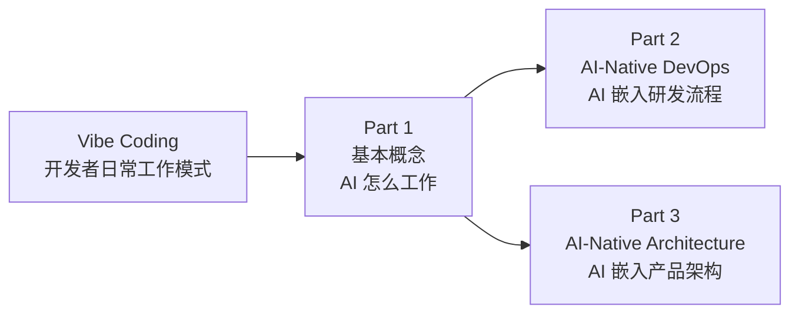
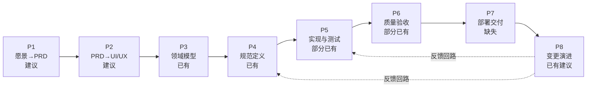
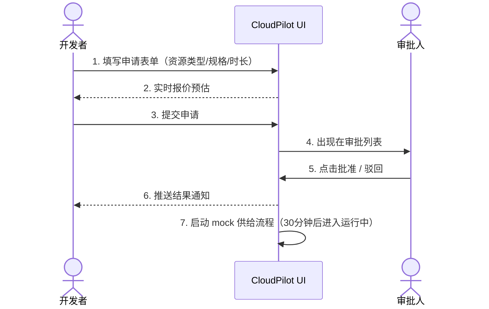
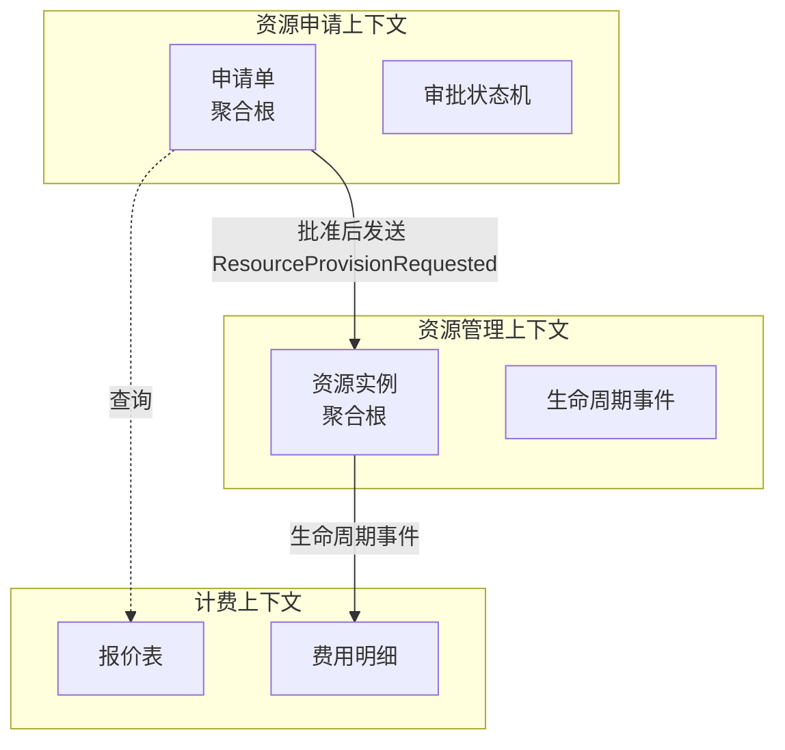
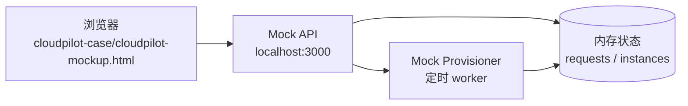

# Vibe Coding 入门：面向传统研发团队的概念速览

> **阅读对象**：刚接触 Vibe Coding / AI 辅助研发的传统研发团队
> **目的**：建立统一的术语基础，再进入 AI-Native DevOps 与 AI-Native Architecture 两篇核心文档

---

## 目录

- [Vibe Coding 入门：面向传统研发团队的概念速览](#vibe-coding-入门面向传统研发团队的概念速览)
  - [目录](#目录)
  - [Part 0：什么是 Vibe Coding](#part-0什么是-vibe-coding)
  - [Part 1：基本概念](#part-1基本概念)
    - [1.1 AI Agent](#11-ai-agent)
    - [1.2 MCP（Model Context Protocol）](#12-mcpmodel-context-protocol)
    - [1.3 A2A（Agent-to-Agent）](#13-a2aagent-to-agent)
    - [1.4 Skill](#14-skill)
      - [1.4.1 Skill 到底是什么](#141-skill-到底是什么)
      - [1.4.2 Skill 的位置](#142-skill-的位置)
      - [1.4.3 Skill 的典型形态](#143-skill-的典型形态)
      - [1.4.4 Skill 与 Tool 的边界（最易混淆）](#144-skill-与-tool-的边界最易混淆)
      - [1.4.5 Skill 的三种使用方式](#145-skill-的三种使用方式)
      - [1.4.6 Skill 的反模式](#146-skill-的反模式)
    - [1.5 工具生态映射](#15-工具生态映射)
    - [Part 1 小结](#part-1-小结)
  - [Part 2：AI-Native DevOps](#part-2ai-native-devops)
    - [2.1 核心理念](#21-核心理念)
    - [2.2 8 阶段全流程](#22-8-阶段全流程)
    - [2.3 关键治理机制](#23-关键治理机制)
      - [2.3.1 分级发布策略](#231-分级发布策略)
      - [2.3.2 RACI 责任矩阵（部分关键角色）](#232-raci-责任矩阵部分关键角色)
      - [2.3.3 AI 贡献度指标（选读）](#233-ai-贡献度指标选读)
    - [2.4 完整案例：CloudPilot 云管平台](#24-完整案例cloudpilot-云管平台)
      - [2.4.1 产品背景](#241-产品背景)
      - [2.4.2 P1 阶段：愿景 → PRD](#242-p1-阶段愿景--prd)
      - [2.4.3 P2 阶段：PRD → UI/UX](#243-p2-阶段prd--uiux)
      - [2.4.4 P3 阶段：领域建模](#244-p3-阶段领域建模)
      - [2.4.5 P4 阶段：OpenSpec 规范定义](#245-p4-阶段openspec-规范定义)
      - [2.4.6 P5 阶段：实现与测试（Mock 策略）](#246-p5-阶段实现与测试mock-策略)
      - [2.4.7 P6 阶段：质量验收](#247-p6-阶段质量验收)
      - [2.4.8 P7 阶段：部署交付（含 UI 交付物）](#248-p7-阶段部署交付含-ui-交付物)
      - [2.4.9 P8 阶段：变更演进](#249-p8-阶段变更演进)
      - [2.4.10 全链路工件追溯表](#2410-全链路工件追溯表)
    - [Part 2 小结](#part-2-小结)
  - [Part 3：AI-Native Architecture](#part-3ai-native-architecture)
    - [3.1 核心理念](#31-核心理念)
    - [3.2 三层分层架构](#32-三层分层架构)
    - [3.3 三问决策启发法](#33-三问决策启发法)
    - [3.4 五个常见反模式](#34-五个常见反模式)
    - [Part 3 小结](#part-3-小结)
  - [延伸阅读](#延伸阅读)

---

## Part 0：什么是 Vibe Coding

> 概念由 Andrej Karpathy 于 2025 年 2 月在社交媒体上提出。原意是"凭着感觉描述需求，让 AI 写代码"——但工程团队落地时**必须收紧边界**，否则就是不可维护的玩具代码。

**朴素定义**：用自然语言表达意图，由 AI 生成代码草稿，开发者在编辑器中以"对话"为主、以"逐字敲键盘"为辅完成开发的工作模式。

**面向传统研发团队的工程化定义（本文采用）**：

> Vibe Coding 是把 AI 作为研发**第一类协作者**的工程范式：开发者以**意图、约束、契约**为输入，AI 以**草稿、候选方案、自动验证**为输出，最终代码、测试与规范**全部经过人工审核与可验证门禁**才进入主线。

**它不是什么：**

| 误解                         | 实际                                                                      |
| :--------------------------- | :------------------------------------------------------------------------ |
| ❌ "AI 写完就能上线"         | ✅ AI 出草稿，人工审核 + 自动化测试 + 契约校验通过后才合入                |
| ❌ "不再需要懂代码"          | ✅ 反而更需要懂——因为审核 AI 的输出比写代码本身更难                       |
| ❌ "等同于 Copilot 自动补全" | ✅ Copilot 是补全单行；Vibe Coding 涵盖需求、设计、实现、测试、部署全流程 |
| ❌ "项目越大越合适"          | ✅ 反而：边界越清晰、契约越明确、测试越完备的项目，AI 越能发挥价值        |

**与本文三个 Part 的关系：**



---

## Part 1：基本概念

> 以下四个概念是理解 AI-Native 研发体系的地基。建议按顺序阅读：**Agent → MCP → A2A → Skill**。

---

### 1.1 AI Agent

AI Agent（智能体）是一个能**自主推理、调用工具、记住上下文、采取行动**的 AI 程序。它不是简单的"一问一答"的聊天机器人，而是能完成多步任务的主动系统。

```text
用户意图 → Agent 规划(Plan) → 调用工具(Tools) → 观察结果 → 记忆(Memory) → 下一步行动(Action) → 完成
```

**四个核心要素：**

| 要素                 | 含义                                                           | 类比                                     |
| :------------------- | :------------------------------------------------------------- | :--------------------------------------- |
| **Planning（规划）** | 把一个大目标拆成多步子任务，决定先后顺序                       | 拿到需求后，先拆任务、排依赖、定优先级 |
| **Tools（工具）**    | 调用外部能力来获取数据或执行动作（查数据库、发 API、写文件等） | 类似调用 Maven / Git / curl 等 CLI 工具    |
| **Memory（记忆）**   | 记住当前任务上下文和长期积累的经验                             | 回顾上次踩过的坑、团队约定、架构决策   |
| **Action（行动）**   | 执行具体操作并观察结果，决定下一步                             | 执行命令后看日志，决定是否继续或回退   |

**传统软件 vs AI Agent 的差异：**

| 维度       | 传统软件                      | AI Agent                        |
| :--------- | :---------------------------- | :------------------------------ |
| 行为确定性 | 给定输入 → 确定输出           | 同目标可能有不同路径，带概率性  |
| 异常处理   | 预编码的 try-catch / 回退逻辑 | 自主判断 → 重试 / 换方案 / 求助 |
| 能力边界   | 功能由代码硬编码定义          | 可通过 Tool 和 Skill 动态扩展   |
| 责任归属   | 代码就是规范                  | 需要人工审核 + 治理兜底         |

> **关键理解**：不是"所有问题都要变成 Agent"。很多能力（如预测、计算、设备控制）用普通函数 + MCP 暴露就够了，只有"在新颖情况下决定下一步做什么"才需要 Agent。

---

### 1.2 MCP（Model Context Protocol）

MCP 是 **Agent 调用外部工具的标准化协议**。可以类比为"AI 世界的 USB-C 接口"——让不同 AI 应用能以统一方式接入各种数据源和工具服务。

**为什么需要 MCP？**

```text
Agent 想查电价 → 需要调电价预测服务
Agent 想发指令 → 需要 IoT 设备接口
Agent 想对账 → 需要数仓查询

如果没有 MCP → 每个工具都要写不同的适配代码，Agent 每换一个服务就要重新对接
有了 MCP → Agent 统一用 MCP 协议调用，服务方只需实现一个 MCP Server
```

**MCP 的关键设计要点：**

| 要点       | 说明                                   | 反例（常见问题）                     |
| :--------- | :------------------------------------- | :----------------------------------- |
| **强类型** | 工具输入/输出有明确 Schema，非自然语言 | 让 LLM 直接生成自由文本指令去控设备  |
| **鉴权**   | 每次调用需验证身份与权限               | MCP Server 做成裸 RPC 转发，无认证   |
| **幂等**   | 重复调用不产生副作用                   | 同一个调度指令发了两次，设备重复执行 |
| **限流**   | 控制调用频率，防止资源被耗尽           | Agent 疯狂请求导致下游服务雪崩       |
| **可观测** | 每次调用都记录日志，可审计可追溯       | 查不到"什么时间谁调了什么工具"       |

**MCP 的定位关系：**

```text
┌─────────────────────────────────────┐
│            Agent 层                  │  ← 推理、规划、决策
├─────────────────────────────────────┤
│         MCP 协议（统一调用）          │  ← 标准化桥梁
├─────────────────────────────────────┤
│   Tool(MCP Server)  │  Tool(MCP...) │  ← 确定性能力：预测/数据/IoT/结算
└─────────────────────────────────────┘
```

> **一句话**：MCP 不是把函数包一层改个名，它是 Agent 安全、可控、可审计调用确定性能力的协议层。

---

### 1.3 A2A（Agent-to-Agent）

A2A 是 **Agent 之间通信协作的协议**。当一个任务需要多个 Agent 分工完成时，A2A 定义它们如何交换信息、传递任务、协调结果。

**与 MCP 的区别：**

| 协议    | 谁和谁通信                      | 类比                      |
| :------ | :------------------------------ | :------------------------ |
| **MCP** | Agent → Tool（调用方 → 服务方） | HTTP 请求调 API           |
| **A2A** | Agent ↔ Agent（对等协作）       | 微服务间的 RPC / 消息队列 |

**什么场景真的需要多 Agent？**

| 场景                                     | 需要 A2A 吗 | 原因                                          |
| :--------------------------------------- | :---------- | :-------------------------------------------- |
| 预测 → 策略 → 执行依次调用               | ❌          | 这是函数调用链，一个 Agent + 多个 Tool 就够了 |
| 多个市场主体（火电/新能源/储能）博弈仿真 | ✅          | 各方有独立目标、私有信息、不同策略            |
| 按客户数据隔离的租户级 Agent             | ✅          | 每个租户独立学习、不共享上下文                |

> **关键判断**：不要因为"能力解耦"而引入多 Agent。只有**独立意志 x 独立信息 x 独立目标**三者同时成立，才需要多 Agent。

---

### 1.4 Skill

Skill 是 AI-Native 体系中**最容易被误解、也最关键**的概念。它既不是 Agent，也不是 Tool，而是介于两者之间的 **"程序性知识"封装单元**。

#### 1.4.1 Skill 到底是什么

- **定义**：Skill 是一组固定的 SOP（标准操作流程），用提示词 + 状态机 + 工作流编排确定性步骤。
- **不需要 LLM 推理**：Skill 执行的是已知流程，不需要 LLM 临场创造新步骤。
- **可以选择性调用 LLM**：Skill 中的某些步骤可以调用 LLM（如生成报告文本），但流程本身是固定的。
- **不是 Tool**：Skill 不直接执行原子能力，它编排多个 Tool / MCP 调用的顺序。
- **不是 Agent**：Skill 不在"新颖情况下决定下一步做什么"，它走预定流程。

**对照 Qoder / Claude Code 等编辑器中的 Skill 实现**：常见的 `commit` / `review-pr` / `pdf` 等 slash command，本质就是一个 Skill——一段提示词 + 一组步骤，触发后按预定流程跑完。

#### 1.4.2 Skill 的位置

```text
Agent 层     ← "不确定下决定下一步做什么"
Skill 层     ← "固定流程编排"
Tool 层      ← "确定性原子能力（通过 MCP 暴露）"
```

#### 1.4.3 Skill 的典型形态

Skill 包含三个要素：**提示词**（交代角色与约束）+ **状态机**（定义步骤与转换条件）+ **工作流**（编排工具调用顺序）。

```text
Skill: 调度流程
├── Step 1: 接收策略输出（来自 Agent）
├── Step 2: 检查设备状态（调 IoT MCP）
├── Step 3: 校验物理可行性（调安全约束模型）
├── Step 4: 下发设备指令（调 IoT MCP, 带幂等标识）
├── Step 5: 确认执行结果
└── Step 6: 异常则回滚并通知 Agent
```

#### 1.4.4 Skill 与 Tool 的边界（最易混淆）

| 维度             | Skill                                          | Tool（MCP Server）                  |
| :--------------- | :--------------------------------------------- | :---------------------------------- |
| 粒度             | 多步流程编排                                   | 单步原子能力                        |
| 是否调用 LLM     | 内部步骤可调用 LLM                             | 通常不调用 LLM                      |
| 是否编排其他能力 | 是，编排多个 Tool                              | 否，自己完成一个能力                |
| 状态             | 有流程状态（当前在哪一步）                     | 无状态，输入→输出                   |
| 典型例子         | "结算流程 Skill"编排数仓查询→偏差计算→报告生成 | "负荷预测 MCP"输入参数→输出预测曲线 |

**判断口诀**：看到"一个流程"想到 Skill，看到"一个函数"想到 Tool。

#### 1.4.5 Skill 的三种使用方式

| 方式                     | 说明                                         | 适用场景                                    |
| :----------------------- | :------------------------------------------- | :------------------------------------------ |
| **Agent 调用 Skill**     | Agent 判断需要执行某个流程时，触发一个 Skill | Agent 完成策略后，调调度 Skill 下发指令     |
| **Skill 直接执行**       | 无需 Agent 参与的固定流程，定时或事件触发    | 结算 Skill 等 T+1 自动执行                  |
| **Skill 内调用子 Skill** | 大 Skill 拆为多个子 Skill，组合使用          | 复杂合规检查：先做 SOX 检查，再做 GDPR 检查 |

#### 1.4.6 Skill 的反模式

| 反模式                     | 症状                                          | 正确做法                                         |
| :------------------------- | :-------------------------------------------- | :----------------------------------------------- |
| **Skill 承载物理计算**     | 在提示词里写"请计算潮流分布"                  | 把计算交给 Tool（MCP Server），Skill 只编排      |
| **Skill 替代 Agent**       | 让 Skill 决策"要不要调整报价"                 | 新颖决策应交给 Agent，Skill 只执行确定的后续流程 |
| **Skill 变成大杂烩**       | 一个 Skill 里塞了几十步，包含推理、计算、调度 | 拆分为多个 Skill + Tool                          |
| **Skill 直接调用敏感 API** | Skill 内嵌生产数据库写入或资金类操作          | 经 Tool 层做鉴权、幂等、审计                     |
| **Skill 缺少回滚步骤**     | 异常时直接抛出错误，不回滚已执行步骤          | 状态机显式定义补偿动作或回滚路径                 |

---

### 1.5 工具生态映射

以下是把抽象概念落到传统研发团队日常可接触的具体工具：

| 概念                    | 传统团队可接触的工具                                                                 | 说明                                                                                     |
| :---------------------- | :----------------------------------------------------------------------------------- | :--------------------------------------------------------------------------------------- |
| **AI Agent**            | Cursor Agent、Claude Code、Qoder、Devin、GitHub Copilot Workspace                    | 能自主规划任务、调用工具、迭代修复的 IDE/CLI 形态 Agent                                  |
| **MCP**                 | Anthropic 官方 MCP SDK、Cline / Continue 的 MCP 集成                                 | Agent 调外部工具的标准化协议；GitHub MCP / Filesystem MCP / Postgres MCP 等是常见 Server |
| **A2A**                 | Google A2A 协议、Microsoft AutoGen、CrewAI、LangGraph                                | 多 Agent 协作框架；当前规模化生产案例较少                                                |
| **Skill**               | Qoder / Claude Code 的 slash command（如 `/commit`、`/review-pr`）、Anthropic Skills | 可复用的固定流程，由提示词 + 步骤定义构成                                                |
| **Tool（被 MCP 暴露）** | 任何普通 API、CLI、SDK 函数                                                          | 不需要是新东西——把现有服务包一层 MCP Server 即可接入 Agent                               |

> **给传统团队的提示**：团队的现有微服务、CLI 工具、SDK 几乎都可以直接成为 Tool，**不需要重写**。MCP 只是在它们外面加一层标准化适配，让 Agent 能安全调用。

---

### Part 1 小结

```text
Agent   = "在新颖情况下决定下一步做什么"          → LLM 驱动
Skill   = "固定流程编排"                         → 提示词 + 状态机 + 工作流
Tool    = "确定性原子能力（通过 MCP 暴露给 Agent）" → 函数 / 服务
MCP     = Agent 调用 Tool 的标准化协议             → 类比 API 网关
A2A     = Agent 之间通信的协议                     → 类比服务间 RPC
```

**成本金字塔（从低到高）：**

```text
Tool（最便宜） → 可验证、无幻觉、低成本
Skill（中等）  → 固定流程、少量 LLM 参与
Agent（最贵）  → LLM 推理循环、token 成本高、有幻觉风险
```

**设计原则**：能用 Tool 不用 Skill，能用 Skill 不用 Agent。

---

## Part 2：AI-Native DevOps

> 以下内容浓缩自 [`ai-native-devops.md`](./ai-native-devops/ai-native-devops.md)，聚焦"AI 如何增强 DevOps 全流程"。

---

### 2.1 核心理念

AI-Native DevOps 的立场**不是"让 AI 全自动替代团队"**，而是**"让 AI 成为各阶段的增强器"**。

**五个设计原则：**

| 原则             | 含义                                                                         |
| :--------------- | :--------------------------------------------------------------------------- |
| **增强而非替代** | AI 生成草稿、提供候选、执行校验，不替代关键业务与工程决策                    |
| **阶段化参与**   | 每个阶段标注 AI 参与度（生成草稿 / 提供候选 / 自动校验 / 人工确认）          |
| **人工交接明确** | PRD、领域模型、OpenSpec、上线结论等关键资产，人工确认后方可进入下一阶段      |
| **唯一事实源**   | AI 与人围绕同一份 `docs/`、`openspec/`、代码工作，避免对话上下文与仓库不一致 |
| **可验证优先**   | AI 生成内容尽量转化为可验证工件（测试、契约、差分、审计记录）                |

---

### 2.2 8 阶段全流程

从业务意图到变更归档，完整链路拆为 8 个阶段。AI 在每个阶段的参与深度不同：



**各阶段概览：**

| 阶段              | AI 干什么                                             | 人工干什么                 | 当前成熟度   |
| :---------------- | :---------------------------------------------------- | :------------------------- | :----------- |
| **P1 愿景→PRD**   | 整理访谈纪要、生成 PRD 草稿、补全验收标准             | 确认范围、优先级、数据分类 | 建议阶段     |
| **P2 PRD→UI/UX**  | 生成用户旅程草稿、低保真原型、组件骨架                | 确认关键旅程、交互约束     | 建议阶段     |
| **P3 领域模型**   | 提取事件、划分子域、识别限界上下文                    | 确认核心域、边界、术语     | ✅ 已有      |
| **P4 规范定义**   | 生成 `proposal.md`、`design.md`、`tasks.md`、`specs/` | 确认关键契约、异常场景     | ✅ 已有      |
| **P5 实现与测试** | 基于 Spec 生成代码和测试草稿                          | 审核关键实现、批准合入     | ⚠️ 部分已有  |
| **P6 质量验收**   | 聚合测试结果、契约差分、安全审查、AI 审查摘要         | 双签确认上线门禁           | ⚠️ 部分已有  |
| **P7 部署交付**   | 生成部署脚本、环境模板、冒烟脚本                      | 批准发布窗口、执行事故处理 | 缺失         |
| **P8 变更演进**   | 漂移检测、影响分析、风险预测、变更提案草稿            | 决定修规范还是修实现       | ✅ 已有/建议 |

**建议阅读路径（按角色）：**

| 角色             | 重点关注                            |
| :--------------- | :---------------------------------- |
| 产品经理         | P1, P6, P8, 治理机制                |
| 架构师           | P3, P4, P7, 三层架构, 多 Agent 协作 |
| 开发 / Tech Lead | P5, P6, P7, 仓库布局                |
| 平台/SRE/QA      | P6, P7, P8, 安全合规, 指标度量      |

---

### 2.3 关键治理机制

#### 2.3.1 分级发布策略

| 风险级别   | 示例                                   | 放行规则                                    |
| :--------- | :------------------------------------- | :------------------------------------------ |
| **低风险** | 文档、注释、非行为性测试               | 自动化门禁通过后，Tech Lead 或 QA Lead 单签 |
| **中风险** | 新增非核心 API、内部重构、一般配置     | 双签 + 标准自动回归                         |
| **高风险** | 核心领域逻辑、DB schema 变更、安全逻辑 | 双签 + 架构师评审 + 预发布验证              |

#### 2.3.2 RACI 责任矩阵（部分关键角色）

| 活动           | Product | Architect | Tech Lead | Dev   | QA    | Platform/SRE |
| :------------- | :------ | :-------- | :-------- | :---- | :---- | :----------- |
| PRD 结构化     | **A**   | C         | I         | I     | C     | I            |
| DDD 战略建模   | C       | **A**     | C         | I     | I     | I            |
| OpenSpec 规范  | C       | **A**     | **R**     | C     | C     | I            |
| 实现与任务拆解 | I       | C         | **A**     | **R** | C     | I            |
| 测试与验收门禁 | I       | C         | C         | **R** | **A** | C            |
| CI/CD 部署     | I       | C         | C         | C     | C     | **A**        |

#### 2.3.3 AI 贡献度指标（选读）

| 指标            | 含义                                                           |
| :-------------- | :------------------------------------------------------------- |
| 草稿直接采纳率  | AI 生成 PRD/Spec/代码草稿后未经大幅重写即被采纳的比例          |
| AI 发现问题占比 | 各阶段由 AI 首次发现的问题比例                                 |
| 人工回退率      | AI 生成结果被否决/回退的比例——越高说明 Prompt 或验证机制需改进 |

> 与本节设计原则衔接的现有示例：[`./ai-native-devops-sample-change-walkthrough.md`](./ai-native-devops/ai-native-devops-sample-change-walkthrough.md)（订单取消能力变更全链路演练）。

---

### 2.4 完整案例：CloudPilot 云管平台

为避免抽象论述，本节以一个**全新产品**为例，完整走一遍 8 阶段。产品叫 **CloudPilot**，是一个面向内部开发者的云资源申请与管理平台。

> **为什么选这个例子**：资源申请-审批-交付 是几乎所有企业内部都能理解的场景，业务逻辑不复杂但能足够骨架化规范、测试与治理机制。为了可演示，**所有云能力（云主机、数据库、对象存储、计费）均采用 mock 实现**，不接真实云 API。
>
> **完整工件包**：[`./cloudpilot-case/`](./cloudpilot-case/) 子目录已收录本案例从需求到 OpenSpec 的全部产出——
> [01 访谈记录](./cloudpilot-case/01-interview-notes.md) · [02 PRD](./cloudpilot-case/02-prd.md) · [03 Mock UI](./cloudpilot-case/cloudpilot-mockup.html) · [04 DDD 建模](./cloudpilot-case/03-ddd-modeling.md) · [05 OpenSpec](./cloudpilot-case/04-openspec/) ·
> [📋 案例总览与可重放 Prompt](./cloudpilot-case/README.md)。
> 本节正文为讲解视角，详细工件参见对应文件。

#### 2.4.1 产品背景

| 项                   | 内容                                                |
| :------------------- | :-------------------------------------------------- |
| **产品名**           | CloudPilot                                          |
| **目标用户**         | 企业内部开发者、测试人员、项目经理                  |
| **核心能力**         | 资源申请 / 审批流程 / 资源生命周期管理 / 成本可视化 |
| **资源范围（mock）** | ECS、RDS、OSS、Redis、SLB五类虚拟资源               |
| **不做什么**         | 不集成真实公云、不做多租户、不做跨云调度            |

#### 2.4.2 P1 阶段：愿景 → PRD

**人类输入 — 三方半结构化访谈**（AI 在场记录并提取主题，详见 [`01-interview-notes.md`](./cloudpilot-case/01-interview-notes.md)）：

| 角色                     | 核心诉求                                                               |
| :----------------------- | :--------------------------------------------------------------------- |
| **R-Lead** 研发负责人    | 资源申请 2~3 天太慢，需要自助下单 + 透明报价 + 团队内快速审批           |
| **OPS** SRE/基础设施     | 每天 30~50 工单，手填规格来回确认 5 次以上，需要结构化表单代替自由文本   |
| **FIN** 财务/FinOps      | 月度账单只看到资源 ID 和金额，看不到项目归属，需要项目维度成本看板       |

**AI 提取痛点清单**（6 项，人工确认后定稿）：

| #   | 痛点               | 来源       |
| :-- | :----------------- | :--------- |
| P1  | 资源申请周期 2~3 天 | R-Lead     |
| P2  | 规格手填易错        | OPS        |
| P3  | 申请前看不到价格     | R-Lead     |
| P4  | 资源释放靠自觉       | OPS, FIN   |
| P5  | 缺乏项目维度成本视图 | FIN        |
| P6  | 审批链跨部门走得慢   | R-Lead     |

**AI 反向映射出功能种子**（按优先级，人工标注 MVP 必选/后续迭代）：

| 功能                  | 解决痛点 | 优先级       |
| :-------------------- | :------- | :----------- |
| F1 自助下单（结构化表单） | P1, P2   | **MVP 必选** |
| F2 提交前实时报价       | P3       | **MVP 必选** |
| F3 审批工作流           | P6       | **MVP 必选** |
| F4 自动配置（Mock）     | P1       | **MVP 必选** |
| F5 项目维度成本看板     | P5       | **MVP 必选** |
| F6 到期告警/自动回收    | P4       | 后续迭代     |

**AI 输出 PRD 草稿**（10 节结构化模板，详见 [`02-prd.md`](./cloudpilot-case/02-prd.md)）：

| 章节             | 要点                                                                     |
| :--------------- | :----------------------------------------------------------------------- |
| §1 背景与愿景     | 30 分钟完成"提交→批准→配置可用"闭环，财务有项目级成本视图                |
| §2 目标/非目标   | 4 目标 (G1~G4) + 4 非目标 (N1~N4)，明确 MVP 不接真实云 SDK              |
| §3 用户画像       | 申请人（研发）、审批人（团队负责人）、财务（FinOps）三种角色              |
| §4 核心流程       | Mermaid 时序图：填表 → 报价 → 提交 → 审批 → 自动配置（Mock）→ 释放       |
| §5 功能需求       | FR-01~FR-11，P0 核心 7 项 + P1 增强 2 项 + P2 后续迭代 2 项              |
| §6 非功能需求     | NFR-01~NFR-06：性能、可靠、安全、审计、可演进                             |
| §7 数据模型骨架   | ResourceRequest / PricingTable / AuditEvent + 5 状态机                    |
| §8 验收标准       | AC-01~AC-06，覆盖功能、性能、安全、审计，全部可测                         |
| §9 上线策略       | 灰度 1 个团队 2 周，保留 OA 工单兜底，异常降级                            |
| §10 待澄清        | 跨项目成本分摊、审批超时升级、已释放费用计算（Q1~Q3，P3 建模阶段二次确认）|

**人工确认点**：R-Lead / OPS / FIN 三方评审 PRD 后签字定稿 → 输出 `02-prd.md`。

#### 2.4.3 P2 阶段：PRD → UI/UX

**AI 生成用户旅程草稿**：



**页面清单**（AI 提出，设计评审后确定）：

| 页面       | 路由           | 核心组件                     |
| :--------- | :------------- | :--------------------------- |
| 资源仪表盘 | `/dashboard`   | KPI 卡片、资源列表、费用趋势 |
| 新建申请   | `/apply`       | 表单、报价面板、提交按钮     |
| 我的申请   | `/my-requests` | 状态表、详情抽屉             |
| 审批中心   | `/approvals`   | 待处理队列、一键动作         |
| 成本中心   | `/cost`        | 项目维度费用、导出 CSV       |

#### 2.4.4 P3 阶段：领域建模

> **建模工具链**：本阶段可直接套用 `domain-driven-design-skills` 提供的 5 阶段 / 9 个 `@ddd-*` Skill 主干。每个 Skill 在一次对话轮次内产出**结构化工件**，工件可作为下一阶段 Skill 的输入直接传递；阶段 IV 校验未达标时支持显式**回溯触发**前置阶段，体现 DDD 建模的非线性闭环。

**5 阶段流水线 → CloudPilot 工件映射**：

| 阶段     | Skill                     | 产出工件                            | CloudPilot 案例对应                                                                  |
| :------- | :------------------------ | :---------------------------------- | :----------------------------------------------------------------------------------- |
| I 发现   | `@ddd-scope`              | 范围收敛、目标/非目标、术语种子     | "为研发团队提供自助云资源" 问题陈述；非目标：跨云调度、计费结算清算                  |
| I 发现   | `@ddd-discover`           | 事件流、命令/事件候选、热点清单     | `ResourceRequested` / `RequestApproved` / `ResourceProvisioned` / `ResourceReleased` |
| II 战略  | `@ddd-subdomains`         | Core / Supporting / Generic 分类    | Core: 资源申请审批；Supporting: 计费、配额；Generic: 通知、登录                      |
| II 战略  | `@ddd-contexts`           | 限界上下文 + 通用语言词汇表         | 见下方 Mermaid 图（资源申请 / 资源管理 / 计费 三个上下文）                           |
| II 战略  | `@ddd-context-map`        | 集成模式（ACL/OHS/PL）、契约所有权  | `资源申请 → 资源管理`：发布订阅；`资源申请 → 计费`：ACL（防止报价表污染聚合根）      |
| III 战术 | `@ddd-aggregates`         | 聚合根、不变量、事务边界            | 申请单聚合（5 状态机 + 幂等约束）、资源实例聚合（生命周期事件）                      |
| III 战术 | `@ddd-domain-interactions`| 领域事件目录、领域服务、仓库接口    | `ResourceProvisionRequested` 事件、`ResourceRequestRepository` 接口                  |
| IV 验证  | `@ddd-model-review`       | 一致性 / 完整性 / 耦合评分          | 不变量表达率、跨聚合一致性策略校验；不达标即回溯到 `@ddd-aggregates`                 |
| V 规范   | `@ddd-openspec-bridge`    | OpenSpec 变更集（proposal/spec/...）| 直接桥接到 §2.4.5 的 `openspec/changes/cloudpilot-mvp/`                              |

**AI 提取并人工复核后的上下文拆分**（`@ddd-contexts` + `@ddd-context-map` 产出）：



**关键不变量**（`@ddd-aggregates` 产出，`@ddd-model-review` 校验，不变量表达率 8/8 = 100%）：

**聚合 1：ResourceRequest**（核心聚合）

| ID   | 不变量                                                                                         | 实施                         |
| :--- | :--------------------------------------------------------------------------------------------- | :--------------------------- |
| IV-1 | 状态只能在 5 个枚举值之一                                                                       | 枚举类型                     |
| IV-2 | 状态转换遵循：PENDING → {APPROVED, REJECTED}；APPROVED → PROVISIONED；PROVISIONED → RELEASED    | 状态机方法私有，命令驱动     |
| IV-3 | `APPROVED` 后 30 分钟内未变 `PROVISIONED` 触发告警                                              | 域服务 + 定时器              |
| IV-4 | 同 `requestId` 重复提交仅一条记录                                                               | 仓库 `findById` + UPSERT     |
| IV-5 | `cost` 在创建时确定，后续不可变                                                                 | 构造时校验，无 setter        |
| IV-6 | 释放只能由原申请人触发                                                                         | 命令前置校验                 |

**聚合 2：ResourceInstance**（轻量聚合）

| ID   | 不变量                                                       |
| :--- | :----------------------------------------------------------- |
| IV-7 | 一个 `requestId` 至多对应一个 `ResourceInstance`              |
| IV-8 | `ResourceInstance` 释放后不可重新激活                         |

> IV-1 ~ IV-8 全部通过 `@ddd-model-review` 校验（完整性 95% 因 FR-11 到期告警为后续迭代），直接桥接到 §2.4.5 的 `specs/<context>/spec.md`——每个 IV-N 至少对应一个 `#### Scenario:` 块。

> **为什么用 Skill 流水线而不是手工建模**：传统 DDD 实施常见痛点是"事件风暴一次性产出、之后再无回溯触发"。`ddd-*` Skill 主干显式定义了双向反馈条件（如"不变量表达率 < 60% 回到 `@ddd-aggregates`"），让建模从**线性交付**转为**可观测的闭环迭代**——这正是 AI-Native DevOps 在建模阶段的具象体现。

#### 2.4.5 P4 阶段：OpenSpec 规范定义

**变更目录结构**（位于 [`cloudpilot-case/04-openspec/`](./cloudpilot-case/04-openspec/)）：

```text
04-openspec/
├── README.md            # 案例说明与 DDD→OpenSpec 映射表
├── proposal.md          # 为什么 / 做什么 / 影响 / 非目标
├── design.md            # 技术设计：架构概览、集成契约、决策记录、状态机
├── tasks.md             # 任务拆解（5 阶段 + 跨切面 + 上线）
└── specs/
    ├── resource-request/spec.md
    ├── resource-management/spec.md
    └── billing/spec.md
```

**`spec.md` 节选**（以 `resource-request/spec.md` 为例）：

```markdown
## ADDED Requirements

### Requirement: Submit resource request

The system SHALL allow a user to submit a resource request with type, spec, and duration.

#### Scenario: Quote returned synchronously

- Given a user fills the apply form
- When the user clicks "预估报价"
- Then the system returns a quote within 500ms

#### Scenario: Idempotent submission

- Given a request with id `req-123` was submitted
- When the same request is submitted again
- Then the system returns the existing record without creating a new one
```

**`tasks.md` 节选**（7 阶段拆解，详见 [`04-openspec/tasks.md`](./cloudpilot-case/04-openspec/tasks.md)）：

```markdown
## 阶段 1：基础骨架（W1）
- [ ] 初始化仓库结构：packages/{resource-request,resource-management,billing,shared}
- [ ] 共享类型定义与事件总线抽象

## 阶段 2：ResourceRequest 上下文（W1~W2，核心）
- [ ] 聚合根 ResourceRequest + 5 状态枚举（IV-1, IV-2）
- [ ] 状态机方法 submit / approve / reject / markProvisioned / release
- [ ] 单元测试：每个不变量（IV-1 ~ IV-6）至少 1 个正例 + 1 个反例

## 阶段 3：ResourceManagement 上下文（W2，Mock）
- [ ] Provisioner 接口 + MockProvisioner（setInterval 5s 触发）
- [ ] 契约文件 contracts/provisioner.contract.ts

## 阶段 4：Billing 上下文（W2）
- [ ] PricingTable 配置加载 + QuoteCalculator 域服务 + CostRecord 聚合

## 阶段 5~7：UI / 横切关注点 / 上线准备
- [ ] UI 接入真实事件总线、审计日志中间件、ApprovalTimeoutMonitor（IV-3 告警）
- [ ] 集成测试、契约测试、灰度方案、回滚 Runbook

## 验收门禁
- CI 全绿 + PRD §8 AC-01~AC-06 全通过 + @ddd-model-review 评分 ≥ 上一版
```

#### 2.4.6 P5 阶段：实现与测试（Mock 策略）

**Mock 设计原则**：外部看起来与真实云一致，内部用内存状态机 + 随机延迟模拟。

| 能力         | 真实实现       | Mock 实现                                            |
| :----------- | :------------- | :--------------------------------------------------- |
| 创建云主机   | 调阿里/AWS API | 插入内存表 + 5–30 分钟随机延迟后状态转 `PROVISIONED` |
| 查询资源状态 | 调云控制台     | 读内存表                                             |
| 报价         | 调计费服务     | 查静态 YAML 价格表                                   |
| 释放资源     | 调云 API       | 状态置为 `RELEASED`                                  |
| 月度费用     | 聚合账单       | 按 mock provisioned 时长 × 单价                      |

**AI 参与点**：AI 根据 `tasks.md` 生成 mock provisioner 骨架、单测草稿、OpenAPI handler 骨架。开发者主要审核状态转移逻辑与幂等实现。

**示例代码骨架（伪代码）**：

```typescript
// services/provisioner/mock.ts (AI 生成草稿)
class MockProvisioner {
  async provision(req: ApprovedRequest): Promise<ResourceInstance> {
    const delayMs = randomInt(5 * 60_000, 30 * 60_000);
    await sleep(delayMs);
    return {
      instanceId: uuid(),
      type: req.resourceType,
      status: "PROVISIONED",
      provisionedAt: new Date(),
    };
  }
}
```

#### 2.4.7 P6 阶段：质量验收

**门禁项清单**：

| 门禁           | 检查项                              | AI 辅助                  |
| :------------- | :---------------------------------- | :----------------------- |
| L1 规范合法    | `openspec validate cloudpilot-mvp`  | 生成代码与 Spec 差异报告 |
| L2 单测/集成   | 提交、幂等、状态转移、Mock 延迟表现 | 补齐边界场景用例         |
| L3 契约测试    | OpenAPI 返回码 / 字段一致           | 生成 schemathesis 场景   |
| L4 安全扫描    | SAST + 依赖漏洞                     | 生成修复建议             |
| L5 AI 审查摘要 | 聊天总结本次变更风险                | 高/中/低风险分档         |
| L6 人工双签    | Tech Lead + QA Lead                 | ——                       |

#### 2.4.8 P7 阶段：部署交付（含 UI 交付物）

**部署拓扑**（本演示本地运行）：



**AI 生成的交付物**：

- `Dockerfile`（单容器运行前端 + Mock API）
- `deploy/local-up.sh`（一键启动本地环境）
- `tests/smoke/cloudpilot-smoke.sh`（冒烟测试：提交 → 批准 → 查 PROVISIONED）
- `cloudpilot-case/cloudpilot-mockup.html`（单文件 UI 原型，详见下节）

**界面交付物**：

> 已生成可直接在浏览器打开的原型：[`./cloudpilot-case/cloudpilot-mockup.html`](./cloudpilot-case/cloudpilot-mockup.html)
>
> 该原型使用纯前端 + localStorage，无需后端，包含 5 个页面：仪表盘、新建申请、我的申请、审批中心、成本中心。

**界面信息架构预览**：

```text
┌────────────────────────────────────────────────────────┐
│ CloudPilot                         [☕ zhangsan@team]   │
├────────────────────────────────────────────────────────┤
│  仪表盘  |  新建申请  |  我的申请  |  审批中心  |  成本中心   │
├────────────────────────────────────────────────────────┤
│ 【KPI】运行中资源: 12   本月费用: ¥1,234   待审批: 3        │
│                                                        │
│ 【最近申请】                                             │
│ req-001  ECS  4c8g     PROVISIONED  2 小时前            │
│ req-002  RDS  MySQL    PENDING      30 分钟前           │
│ req-003  OSS  100GB    APPROVED     5 分钟前            │
│ …                                                      │
│                                                        │
│ 【成本趋势】 [柱状图]                                     │
└────────────────────────────────────────────────────────┘
```

#### 2.4.9 P8 阶段：变更演进

**上线后发现的事实**：某些项目月度费用远超预算。

**AI 辅助生成变更提案草稿**：

```markdown
# proposal: cloudpilot-budget-alert

## Why

项目费用超预算但无提前预警。

## What Changes

- 新增项目预算设置能力
- 费用达到 80% 预算时邮件预警
- 达到 100% 时冻结新申请

## Impacted Capabilities

- billing（修改）
- resource-request（修改：提交时检查预算）
```

**漂移检测例**：AI 比对发现 `billing/spec.md` 中未定义"预算超限"场景，但代码中已出现 `BudgetExceededException` → 提示补齐规范。

#### 2.4.10 全链路工件追溯表

| 阶段 | 产出              | 仓库位置                                                                                  | AI 参与度    | 状态   |
| :--- | :---------------- | :---------------------------------------------------------------------------------------- | :----------- | :----- |
| P1 前置 | 访谈记录         | [`cloudpilot-case/01-interview-notes.md`](./cloudpilot-case/01-interview-notes.md)        | 高（草稿）   | ✅ 已有 |
| P1   | PRD               | [`cloudpilot-case/02-prd.md`](./cloudpilot-case/02-prd.md)                                | 高（草稿）   | ✅ 已有 |
| P2   | UI 原型           | [`cloudpilot-case/cloudpilot-mockup.html`](./cloudpilot-case/cloudpilot-mockup.html)      | 高（草稿）   | ✅ 已有 |
| P3   | DDD 模型          | [`cloudpilot-case/03-ddd-modeling.md`](./cloudpilot-case/03-ddd-modeling.md)              | 中（候选）   | ✅ 已有 |
| P4   | OpenSpec 变更     | [`cloudpilot-case/04-openspec/`](./cloudpilot-case/04-openspec/)                          | 高（草稿）   | ✅ 已有 |
| P5   | 代码 + 单测       | `services/`、`tests/unit/`                                                                | 中（骨架）   | 📋 计划 |
| P6   | 契约/安全报告     | `tests/contract/`、`reports/`                                                             | 高（自动化） | 📋 计划 |
| P7   | 部署脚本          | `deploy/`                                                                                 | 中（草稿）   | 📋 计划 |
| P8   | 漂移报告 + 新提案 | `openspec/changes/cloudpilot-budget-alert/`                                               | 高（检测）   | 📋 计划 |

**本案例要点**：

1. **全链路仅需 5 个工件文件**就能覆盖从需求到规范——访谈记录 → PRD → Mock UI → DDD 模型 → OpenSpec。
2. **全部可重放**：每件工件的生成 Prompt 已在 [`cloudpilot-case/README.md`](./cloudpilot-case/README.md) 完整记录，可由 `ddd-modeler` 和 `openspec-author` 两个 subagent 端到端重放。
3. **AI 出草稿、人工定边界**贯穿始终，关键门禁不能省略。
4. **Mock 实现不是偏离本意**——在骨架验证阶段该是主动选择。重要的是接口契约与未来换真实云 SDK 时保持不变。
5. **UI 作为交付物出现在 P7**，不在 P2 终点——原型是设计输出，运行型 UI 是工程交付。

---

### Part 2 小结

AI-Native DevOps 将软件交付全链路拆为 8 个可度量阶段，每个阶段明确 AI 的参与深度和人工确认点。核心不是自动化的程度高低，而是**可观测、可回溯、可验证**——从 PRD 的结构化模板，到 DDD 建模的双向回溯触发，到 OpenSpec 的 IV-N → Scenario 桥接，再到质量门禁的 6 层验收。CloudPilot 案例完整演示了这一链路：5 个工件文件覆盖从访谈记录到 OpenSpec 变更集，且全部可重放。下一章将视角从流程切换到架构——当 AI 嵌入系统内部时，如何用三层分层和三问启发法来裁定每个能力的归属。

---

## Part 3：AI-Native Architecture

> 以下内容浓缩自 [`ai-native-architecture.md`](./ai-native-architecture/ai-native-architecture.md)，聚焦"如何用三层架构把 AI 安全、可控、可度量地嵌入系统"。

---

### 3.1 核心理念

**AI-Native ≠ 处处用 LLM。**

AI-Native Architecture 的核心判断是：**业务上是一个"智能体"，不代表技术上必须是 Agent**。

一篇电网交易案例拆出了 12 个动作（感知、预测、决策、执行、复盘），对应的五类业务角色最终收敛为：

| 角色          | 本质                 | 技术实现                  | 为什么这么落                       |
| :------------ | :------------------- | :------------------------ | :--------------------------------- |
| 电价/负荷预测 | 数值计算             | Tool（MCP Server）        | 输入输出确定，可回测，不需要 LLM   |
| **交易策略**  | **不确定下多步推理** | **Agent（唯一真 Agent）** | 目标明确但路径不可枚举，需经验沉淀 |
| 调节调度      | 确定性流程编排       | Skill + Tool（MCP）       | SOP 已明确，安全压倒一切           |
| 交易结算      | 模板化工作流         | Skill + Tool（MCP）       | 流程程序化，LLM 只在报告生成时介入 |
| 市场主体仿真  | 独立意志相互建模     | 多 Agent（MARL）          | 各方目标独立、信息私有             |

> **收敛公式**：12 动作 → 5 能力原子 → 5 业务角色 → **1 真 Agent + 4 Skill + 6 Tool（MCP 暴露）**

---

### 3.2 三层分层架构

> **可视化版本**：完整的交互式金字塔架构图、组件详情面板、治理平面与五角色映射表，请打开 [`ai-native-architecture-diagram.html`](./ai-native-architecture/ai-native-architecture-diagram.html)（点击任意 Agent / Skill / Tool 卡片可查看本质、KPI、安全约束等详细信息）。
>
> 文字概览：
>
> - **Agent 层（顶层 · 代价最高）**：交易策略 Agent —— LLM 循环 + 工具调用 + 记忆模块，目标 VaR 约束下最大化 P&L。
> - **Skill 层（中层）**：调度 SOP / 结算流程 / 合规检查 / 风险预案 —— 提示词 + 状态机 + 工作流编排。
> - **Tool 层（底层 · 代价最低，通过 MCP 暴露）**：电价预测 / 负荷预测 / 气象 / 市场行情 / IoT 控制 / 数仓结算 —— 强类型、鉴权、幂等、限流、可观测。

**每层退守什么：**

| 技术层             | 解决什么                       | 退守哪条硬约束                 | 反例                       |
| :----------------- | :----------------------------- | :----------------------------- | :------------------------- |
| **Agent 层**       | 不确定下的目标驱动决策         | 独立意志显式建模（多主体博弈） | 把每个函数都包成 Agent     |
| **Skill 层**       | 程序性知识、SOP 编排           | 调度/交易/运营同上下文协同     | Skill 提示词里写潮汐计算   |
| **Tool 层（MCP）** | 确定性能力：预测/数据/IoT 控制 | 高频闭环 + 幂等 + 不丢数据     | MCP Server 做成裸 RPC 转发 |

**层间协作关系（以电网交易为例）：**

```text
Agent（交易策略）
  │
  ├─→ Skill（调度 SOP）──→ Tool（IoT 控制 MCP）
  ├─→ Skill（结算流程）──→ Tool（数仓结算 MCP）
  ├─→ Skill（合规检查）──→ Tool（市场行情 MCP）
  ├─→ Skill（风险预案）
  │
  ├─→ Tool（电价预测 MCP）
  ├─→ Tool（负荷预测 MCP）
  └─→ Tool（市场行情 MCP）
```

---

### 3.3 三问决策启发法

面对架构中任何一个"智能体"，按**代价由低到高**依次问三个问题，落到对应层：

> 这里的"代价"指工程代价与复杂度——Token 数、延迟、运维难度，而非能力强弱。所以"代价递增"的三问与"能力递增"的三层恰好是互逆对齐的。

| 问题                                           | 是 → 落哪层                   | 否 → 继续问       | 例子                                 |
| :--------------------------------------------- | :---------------------------- | :---------------- | :----------------------------------- |
| **Q1**：能否用非 LLM 系统以可验证正确性完成？  | **Tool 层**（普通函数/MCP）   | 问 Q2             | 电价预测（Informer / N-BEATS）→ Tool |
| **Q2**：是否是固定流程，只需要被编排？         | **Skill 层**（状态机+工作流） | 问 Q3             | 结算对账流程 → Skill                 |
| **Q3**：是否需要在新颖情况下决定下一步做什么？ | **Agent 层**（LLM 推理循环）  | 不需要 → 重新审视 | 交易策略 → Agent                     |

---

### 3.4 五个常见反模式

| 反模式                 | 症状                           | 代价                           | 正确做法                                                      |
| :--------------------- | :----------------------------- | :----------------------------- | :------------------------------------------------------------ |
| **Agent 化一切**       | 每个函数都封装成 LLM Agent     | 延迟放大 10–100 倍，Token 失控 | 确定性能力走 Tool，固定流程走 Skill，只有"新颖决策"才走 Agent |
| **LLM 直接控物理设备** | 充放电指令走提示词             | 安全事故、监管违规             | 物理可行性由 Tool 层守住，Skill 只编排业务                    |
| **治理平面缺失**       | 人在回路机制、成本预算、调用审计未纳入架构设计 | 出问题无追溯链、成本失控 | 三层共享统一治理平面：鉴权/限流/审计/成本追踪/回滚            |
| **MCP Server 裸转发**  | 无认证、无幂等、无限流         | 金融和电网不可接受             | 必须叠加鉴权/幂等/限流/审计                                   |
| **Agent 缺终止条件**   | 无限重规划循环                 | 成本爆炸、错过交易窗口         | 设 max-steps、token 预算、时间硬上限                          |

---

### Part 3 小结

AI-Native Architecture 的本质是用**成本意识**做技术决策：

```text
Tool（最便宜） ← 能用 Tool 解决的问题不要用 Agent
   ↑
Skill（中等）
   ↑
Agent（最贵）  ← 只有非用不可的时候才用

判断线：第 1.4 节定义的 Agent/Skill/Tool 边界
工具线：第 1.2 节 MCP 作为标准化桥梁
部署线：第 2.2 节 8 阶段全流程
```

> **从云管平台看三层架构**：回到 §2.4 的 CloudPilot——“报价查询”是 Tool（查静态价表），“审批流程”是 Skill（状态机），但“资源预测与智能推荐”（如根据历史使用表现推荐规格）则是 Agent——这是同一架构原则在传统软件领域的应用示例。

---

## 延伸阅读

| 文档                                     | 路径                                                                                                 | 说明                                                       |
| :--------------------------------------- | :--------------------------------------------------------------------------------------------------- | :--------------------------------------------------------- |
| AI-Native DevOps 全文                    | [`./ai-native-devops.md`](./ai-native-devops/ai-native-devops.md)                                                     | 完整方法论、治理机制、指标、仓库布局                       |
| AI-Native Architecture 全文              | [`./ai-native-architecture.md`](./ai-native-architecture/ai-native-architecture.md)                                         | 电网交易案例驱动的三层架构推导                             |
| 订单取消变更示例演练                     | [`./ai-native-devops-sample-change-walkthrough.md`](./ai-native-devops/ai-native-devops-sample-change-walkthrough.md) | 以订单取消为例的全链路变更萃取                             |
| **CloudPilot 案例工件包**（本文案例交付物） | [`./cloudpilot-case/`](./cloudpilot-case/)                                                           | 从访谈记录 → PRD → Mock UI → DDD 建模 → OpenSpec 的端到端工件 |
| **CloudPilot UI 原型**                   | [`./cloudpilot-case/cloudpilot-mockup.html`](./cloudpilot-case/cloudpilot-mockup.html)               | 可直接在浏览器打开的 mock UI，含交互、状态机与自动状态推进 |
